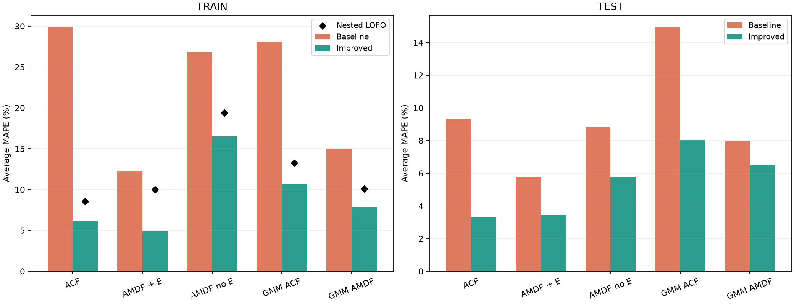
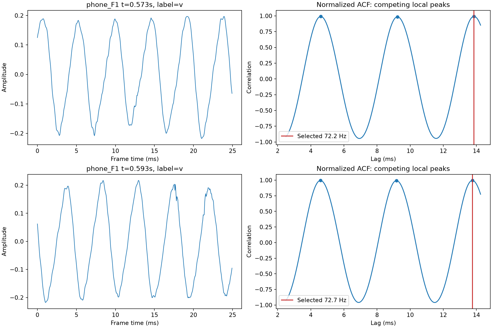
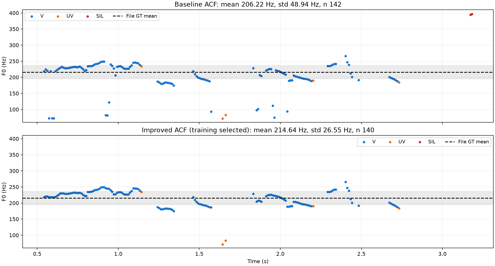

# Phân tích và cải tiến BT2: vì sao train gần 30% còn test khoảng 9%?

Ngày 05/10/2026. Số liệu được chạy lại local; giờ trong nhật ký là giờ Việt Nam (UTC+7).

## 1. Kết luận đọc trước

**Có nguyên nhân cụ thể trong thuật toán và dữ liệu; chưa thấy lỗi công thức MAPE hay ghép nhầm file.**
ACF bản cũ có train **29,83%**, test **9,33%**. Khác biệt không trái quy luật học máy:
bản cũ học ngưỡng phân biệt V/UV, không tối ưu trực tiếp ba thống kê F0. Chất lượng train không buộc
phải tốt hơn test trên mọi tập bốn file. Một vài file train kích hoạt lỗi mà test gặp ít hơn.

Hai nguyên nhân đã đo được:

1. **Chọn nhầm bội chu kỳ trong vùng hữu thanh của phone_F1.** Một khung có chu kỳ khoảng 4,6 ms,
   nhưng bản cũ chọn 13,9 ms. F0 xuống khoảng 72 Hz thay vì ứng viên khoảng 217 Hz.
   Một số giá trị thấp kéo mean xuống nhưng làm std tăng mạnh.
2. **Nhận nhầm UV/SIL là V.** Những F0 giả được tính đúng vào F0num và F0std theo quy tắc chấm.
   Ở studio_M1, chỉ giữ dự đoán nằm trong V thật để chẩn đoán cho std 25,94 Hz, rất gần GT 26,4 Hz;
   khi tính cả các dự đoán SIL sai, std tăng đáng kể.

Đã chạy các hướng riêng, đăng ký **234 cấu hình kết hợp**, kiểm tra giữ riêng file và nested LOFO,
sau đó khóa cấu hình trước khi đánh giá test. Tất cả năm pipeline giảm MAPE train và test:

| Phương pháp | Train cũ % | Train mới % | Nested LOFO % | Test cũ % | Test mới % | FINAL SCORE % | Điểm /10 |
| --- | --- | --- | --- | --- | --- | --- | --- |
| ACF | 29.83 | 6.18 | 8.55 | 9.33 | 3.29 | 96.71 | 9.70 |
| AMDF có năng lượng | 12.27 | 4.88 | 10.01 | 5.78 | 3.43 | 96.57 | 9.70 |
| AMDF không năng lượng | 26.78 | 16.51 | 19.41 | 8.81 | 5.78 | 94.22 | 9.40 |
| ACF + GMM | 28.07 | 10.69 | 13.26 | 14.92 | 8.04 | 91.96 | 9.20 |
| AMDF + GMM | 15.00 | 7.81 | 10.10 | 7.96 | 6.50 | 93.50 | 9.40 |

ACF có nested LOFO thấp nhất trong nhóm cải tiến (**8,55%**), nên là bản nên chạy trước nếu chọn theo
kiểm tra trên train. AMDF có năng lượng có train thấp nhất (**4,88%**); nested LOFO của nó là **10,01%**.
Sự chênh lệch đó cho thấy vẫn có rủi ro chọn cấu hình quá hợp với ít file train.



## 2. Chính xác đã so sánh file nào?

Sáu file gốc trong `turn-in-assignment/` và `turn-in-assignment - Copy/` được giữ nguyên, đã đối chiếu SHA256 với snapshot.
Hai bản ACF giống nhau về toàn bộ file; hai bản GMM cũng giống nhau. AMDF khác ở cổng năng lượng.
Vì vậy sáu notebook gốc tạo ra năm pipeline khác nhau, và bốn notebook mới bao phủ đủ năm pipeline.

| Notebook mới trong `improved-training-only/` | Pipeline | Cổng năng lượng mới |
|---|---|---|
| BT2_ACF_improved_train_only.ipynb | ACF | Có |
| BT2_AMDF_improved_with_energy_train_only.ipynb | AMDF | Có |
| BT2_AMDF_improved_without_energy_train_only.ipynb | AMDF | Không |
| BT2_ACF_AMDF_GMM_improved_train_only.ipynb | ACF+GMM và AMDF+GMM | ACF không; AMDF có |

Tên `energy_set` của bản gốc chỉ là tên nhóm notebook; bản ACF/GMM gốc chưa có cổng năng lượng.
Không so sánh ngưỡng ACF với AMDF chỉ qua trị số: ACF score càng cao càng tuần hoàn, AMDF score càng thấp càng tuần hoàn.

## 3. Công thức chấm đã kiểm tra

Với một file: MAPE(X) = 100 × |X dự đoán − X chuẩn| / |X chuẩn|, X là F0mean, F0std, F0num.
Average MAPE file = (MAPE mean + MAPE std + MAPE num) / 3.
TỔNG CỘNG tập = trung bình Average MAPE của đúng bốn file.
**FINAL SCORE = 100 − TỔNG CỘNG MAPE TEST**; điểm thang 10 = FINAL SCORE / 10, làm tròn một chữ số.

Trong trao đổi đầu tiên, “Final Score” từng được dùng để chỉ sai số trung bình test; báo cáo này dùng
công thức cuối cùng trong mẫu của thầy: **100 trừ sai số**. Số 9,33% là MAPE, không phải điểm cuối cùng.
Không làm tròn các thành phần trước khi tính tổng. F0std dùng `ddof=0` như bản gốc; F0num đếm mọi F0 hữu hạn.
Không lọc dự đoán bằng nhãn thật, không bỏ MAPE num, không dùng mean/std chuẩn để sửa đầu ra.

Baseline ACF train được tái lập tới 29.834710577388%;
ngưỡng ACF là 0.684081776240398.
Baseline test cũng khớp số liệu cũ tới sai số 1e-10. Kiểm tra này loại trừ nguyên nhân “bảng train/test tính hai công thức khác nhau”.

## 4. Vì sao chênh lệch 20,51 điểm phần trăm?

Gap = train MAPE − test MAPE = **20.51 điểm phần trăm**.
Do Average MAPE là trung bình ba đại lượng, có thể phân rã gap thành:

| Thành phần | Đóng góp vào gap (điểm phần trăm) |
| --- | --- |
| F0mean | -0.29 |
| F0std | 16.97 |
| F0num | 3.84 |

F0std giải thích khoảng **82.7%** gap; F0mean của test còn tệ hơn train một chút.
Vì thế “train kém mọi mặt” là cách đọc sai: train chủ yếu kém ở std và count.

### 4.1. phone_F1: một điểm lệch có thể làm std lớn ra sao?

GT std là 20,6 Hz; ACF cũ dự đoán std khoảng 48,94 Hz → MAPE std **137,56%**.
Ở khung tâm 0,5725 s, hai ứng viên là **72,1836 Hz** và **217,4165 Hz**.
Ứng viên 217 Hz chỉ kém đỉnh mạnh nhất khoảng **0,000493** điểm ACF.
Waveform lặp khoảng sáu chu kỳ trong 25 ms và có đỉnh ACF tại một, hai, ba chu kỳ.
Đây là bằng chứng trực tiếp về chọn **3T0**, không chỉ lỗi octave **2T0**.
Praat cũng mô tả việc ACF có đỉnh ở bội chu kỳ và phải giải quyết chọn ứng viên.
[Nguồn chính thức Praat](https://www.fon.hum.uva.nl/praat/manual/how_to_choose_a_pitch_analysis_method.html).



Chẩn đoán train thấy 14 dự đoán thấp hơn 60% GT mean ở phone_F1; 12 nằm trong V, không khung nào
ở vùng sát ranh giới nhãn theo tiêu chí nửa độ dài khung. Trong 9/14 khung có ứng viên gần 2/3/4 lần F0
với chênh strength <0,02. Con số này xác định các trường hợp nghi ngờ, không phải số lỗi F0 đã có GT từng khung.

Phân rã phương sai của phone_F1 theo nhóm nhãn: V góp **68,67%**, UV góp **10,26%**, SIL góp **21,07%**.
Đây là phần phương sai của mỗi nhóm quanh mean chung, gồm độ phân tán trong nhóm và độ lệch mean nhóm;
không phải tỷ lệ “lỗi có thể loại bỏ” tương ứng. Chỉ hai F0 SIL quanh 395 Hz đã góp hơn một phần năm phương sai.
Giữ V thật để chẩn đoán vẫn cho std **41,58 Hz**, nên cổng năng lượng một mình chưa giải quyết phone_F1.



Bản ACF mới trả std 26,55 Hz; MAPE std còn **28,89%**. Đây là cải thiện rõ nhưng chưa khớp hoàn toàn GT.
Dải mean ± std trên đồ thị là thống kê của file, không phải F0 chuẩn từng khung; điểm nằm ngoài dải không tự động là lỗi.

### 4.2. studio_M1: lỗi khác với phone_F1

Bản cũ nhận nhầm **22 khung SIL** là hữu thanh ở studio_M1. Chẩn đoán chỉ tính dự đoán thuộc V thật:
std **25,94 Hz** gần GT **26,4 Hz**. Cổng năng lượng có thể xử lý nguồn F0 giả này.
Không dùng phép lọc theo nhãn thật trong notebook cải tiến: khi chạy WAV mới chỉ có RMS và score.

### 4.3. Mẫu số MAPE và đặc trưng tập dữ liệu

| Tập | File | fs (Hz) | Dài (s) | GT mean (Hz) | GT std (Hz) | GT num | Khung V theo LAB | Năng lượng >1 kHz (%) | V/SIL RMS (dB, proxy) |
| --- | --- | --- | --- | --- | --- | --- | --- | --- | --- |
| train | phone_F1.wav | 16000 | 3.24 | 215.60 | 20.60 | 148 | 153 | 3.77 | 24.60 |
| train | phone_M1.wav | 16000 | 4.16 | 123.70 | 16.80 | 232 | 244 | 21.52 | 21.97 |
| train | studio_F1.wav | 44100 | 2.86 | 229.60 | 36.80 | 127 | 123 | 20.52 | 42.24 |
| train | studio_M1.wav | 44100 | 2.73 | 116.90 | 26.40 | 82 | 94 | 15.07 | 39.77 |
| test | phone_F2.wav | 16000 | 4.80 | 150.20 | 30.70 | 219 | 235 | 16.63 | 30.09 |
| test | phone_M2.wav | 16000 | 2.80 | 130.20 | 15.40 | 123 | 134 | 6.59 | 27.36 |
| test | studio_F2.wav | 44100 | 3.15 | 198.60 | 47.80 | 139 | 137 | 13.01 | không xác định |
| test | studio_M2.wav | 44100 | 2.38 | 154.70 | 30.30 | 116 | 128 | 8.75 | 42.63 |

Phone_F1 có phần năng lượng trên 1 kHz chỉ **3,77%**; phone_F2 là **16,63%**.
Waveform phone_F1 ở khung đã kiểm tra gần hình sin, khiến các đỉnh bội chu kỳ gần ngang nhau.
Đây là dấu hiệu khác biệt phổ phù hợp với giả thuyết sai bội chu kỳ, chưa đủ xác định lỗi do microphone,
lọc của thiết bị hay nội dung người nói. Không có metadata thiết bị/chuỗi xử lý để kết luận nguồn gốc.

Phone_F2 có tỷ lệ RMS V/SIL cao hơn phone_F1 khoảng 5,49 dB trong phép đo này.
Đó là **proxy mức tách biệt năng lượng**, không phải SNR đo từ tín hiệu sạch và nhiễu tách riêng.
SIL median của studio_F2 bằng 0 nên tỷ lệ dB không xác định, được báo rõ thay vì chia cho 0.
Không file nào bị clipping theo tiêu chí |sample| >0,999.

GT std của phone_F1 20,6 thấp hơn phone_F2 30,7, nên cùng sai số Hz sẽ thành MAPE lớn hơn.
Nhưng nếu lấy lỗi std phone_F1 khoảng 28,34 Hz chia cho 30,7 thì vẫn khoảng **92,30%**, cao hơn nhiều
MAPE std phone_F2 **17,66%**. Mẫu số chỉ là một phần; sai chọn ứng viên là phần quan trọng.

F0num chuẩn không luôn bằng số khung có tâm rơi vào vùng V của LAB cũ. Ví dụ phone_F1: 148 so với 153;
studio_F1: 127 so với 123. Thầy chưa cung cấp chuỗi F0 chuẩn và quy trình tạo 3GT đủ để giải thích chính xác chênh lệch này.
Do đó không ép F0num bằng số nhãn V; sử dụng ba thống kê 3GT để chấm và nhãn LAB cũ cho V/UV riêng.

### 4.4. Những nguyên nhân đã loại trừ hoặc chưa có bằng chứng

- Đổi `ddof=0` sang `ddof=1` chỉ thay std khoảng 0,62% ở n=82; không thể giải thích sai số 137,56%.
- Không thấy ghép nhầm GT, lỗi công thức hoặc lỗi source/output cũ trong phép tái lập hiện tại.
- Phone dùng fs16 kHz, studio fs44,1 kHz; giữ đúng fs từng WAV và khung theo ms. Không đổi sample rate để làm đẹp kết quả.
- Lọc bỏ khung ranh giới theo nhãn thật không giải thích các F0 thấp đã tìm: chúng không nằm sát ranh giới.
- Chưa thể khẳng định toàn bộ sai khác đều do dataset hoặc toàn bộ test tốt đều do may mắn: chỉ có bốn file mỗi tập.

## 5. Loop thí nghiệm: đã thử gì, giữ gì?

| Hướng thử riêng | Kết quả tiêu biểu trên LOFO train | Kết luận |
|---|---|---|
| Cổng năng lượng | ACF 29,11→16,75%; AMDF 27,03→13,70%; GMM ACF lại 28,80→30,02% | Hữu ích cho SIL nhưng không dùng cho mọi pipeline |
| Ưu tiên chu kỳ ngắn khi strength gần bằng | ACF 22,76%; AMDF năng lượng 9,51%; GMM ACF 13,11% | Giảm sai bội chu kỳ; cần chọn margin bằng train |
| Chọn đường ứng viên theo thời gian | AMDF năng lượng tốt nhất 6,77%; GMM ACF 11,14% | Giữ làm thành phần chính, không làm phẳng F0 bằng GT |
| Trung vị 3/5 khung trong đoạn V dự đoán | ACF 24,89%; AMDF năng lượng 9,17% | Có ích vừa phải khi dùng riêng; kết hợp cho một số mô hình |
| Gaussian low-pass 800 Hz | ACF 30,34%; GMM ACF 33,64%; GMM AMDF 21,21% | Loại khỏi tập kết hợp; không mặc định lọc là tốt |
| Đổi cách chọn ngưỡng | AMDF histogram hai mode LOFO14,98% nhưng macro F1 tụt xuống0,820 so với0,869 | Không giữ chỉ vì giảm MAPE; kiểm tra đánh đổi V/UV |

Mỗi hướng có dữ liệu đầy đủ, cả cấu hình kém hơn, trong `results/experiment_*` và một commit riêng.
Tập kết hợp gồm ACF55, AMDF năng lượng55, GMM ACF46, GMM AMDF46, AMDF không năng lượng32 cấu hình.
Kết hợp được thực hiện sau khi đã đo từng thành phần; các kết quả riêng không được coi là cấu hình cuối.

### Quy tắc chọn và kiểm tra

1. Giữ bốn file train riêng; không chia khung gần nhau của cùng WAV vào train và validation.
2. Với mỗi cấu hình, LOFO học ngưỡng từ ba file và chấm file thứ tư; xếp theo MAPE trung bình file.
3. Chỉ chọn trong các cấu hình có macro F1 V/UV không thấp hơn baseline LOFO quá 0,03.
4. Nested LOFO giữ một file vòng ngoài; trên ba file còn lại chọn cấu hình bằng ba lần giữ riêng vòng trong;
   fit ngưỡng bằng ba file rồi chấm file vòng ngoài. Lặp đủ bốn vòng.
5. Điều kiện giữ: giảm MAPE train ít nhất20% tương đối; phone_F1 std cải thiện;
   fixed LOFO/nested MAPE không cao hơn baseline LOFO quá1 điểm; macro F1 không giảm quá0,03.

| Phương pháp | Baseline LOFO % | Cấu hình cuối LOFO % | Nested LOFO % | Baseline LOFO F1 | Nested F1 |
| --- | --- | --- | --- | --- | --- |
| ACF | 29.11 | 7.28 | 8.55 | 0.8363 | 0.8569 |
| AMDF có năng lượng | 13.70 | 6.77 | 10.01 | 0.8646 | 0.8646 |
| AMDF không năng lượng | 27.03 | 16.66 | 19.41 | 0.8695 | 0.8669 |
| ACF + GMM | 28.80 | 11.11 | 13.26 | 0.7346 | 0.7346 |
| AMDF + GMM | 16.96 | 10.00 | 10.10 | 0.8051 | 0.8119 |

Nested LOFO ở đây giảm thiên lệch của bước chọn tham số trong registry, **chưa đánh giá độc lập toàn bộ quá trình nghiên cứu**:
các giả thuyết và tập cấu hình được xây dựng sau khi xem cả bốn file train. Các khung chồng lấn không phải quan sát độc lập;
không suy ra kích thước mẫu thống kê bằng số khung. Bốn file không đủ cho kết luận chắc chắn về người nói/thiết bị mới.
Baseline LOFO dùng cấu hình baseline cố định; nested mới kiểm tra cả bước chọn trong registry nên hai con số có quy trình khác nhau.

## 6. Cải tiến nằm ở đâu trong thuật toán?

Giữ nguyên chuẩn hóa ACF/AMDF, nội suy parabol, khung/bước trượt và dải70–400 Hz của từng baseline.
Đổi cách chọn F0 giữa các cực trị cạnh tranh; thêm cổng năng lượng vào pipeline nào được train/validation chấp nhận.
Không dùng deep learning, không thêm F0mean/F0std/F0num chuẩn vào suy luận.

| Pipeline | Khung (ms) | Chọn ứng viên | Jump cost | Octave cost / margin | Median | Năng lượng | Ngưỡng chu kỳ |
|---|---|---|---|---|---|---|---|
| ACF | 25 | Đường liên tục | 0,35 | octave0,03 | 3 | Có | Giao histogram V/UV được quy tắc gốc chọn |
| AMDF năng lượng | 25 | Đường liên tục | 0,35 | octave0 | 1 | Có | Gaussian được quy tắc gốc chọn |
| AMDF không năng lượng | 25 | Đường liên tục | 0,35 | octave0 | 1 | Không | Giao histogram V/UV |
| GMM ACF | 20 | Đường liên tục | 0,35 | octave0,01 | 3 | Không | GMM hai thành phần |
| GMM AMDF | 25 | F0 cao nhất trong ứng viên gần tốt nhất | — | margin0,05 | 3 | Có | GMM hai thành phần |

Strength của ACF là ACF score; strength của AMDF là 1−AMDF score.
Với cách chọn đường, chi phí khung là `(strength_max − strength_candidate) + octave_cost × log2(400/F0)`.
Chi phí chuyển khung là `jump_cost × abs(log2(F0_t/F0_previous))`; tìm tổng chi phí nhỏ nhất bằng quy hoạch động.
Chỉ nối trong một đoạn V **dự đoán** liên tục. Trung vị cũng chỉ áp dụng bên trong đoạn đó.
Log2 được dùng cho tỷ lệ giữa hai ứng viên để phạt bước nhảy, còn các thống kê và MAPE cuối vẫn dùng Hz.
Các bộ pitch cổ điển có cơ chế ứng viên, phạt octave và thay đổi pitch; đây là một biến thể đơn giản của ý tưởng này,
không phải bản sao đầy đủ Praat. [Tài liệu Praat về chi phí chọn đường](https://www.fon.hum.uva.nl/praat/manual/pitch_analysis_by_filtered_autocorrelation.html).

Cổng RMS học ngưỡng từ V/SIL train với balanced accuracy trung bình theo file. RMS tương đối được chuẩn hóa bằng
percentile95 của RMS trong chính WAV đang xử lý. Việc chuẩn hóa WAV test chỉ dùng dữ liệu WAV, không dùng GT và không học lại ngưỡng.
GMM fit trên score của vùng V/UV train, loại SIL theo LAB cũ; dù fit Gaussian không cần nhãn thành phần,
toàn bộ quy trình hiện tại vẫn dùng nhãn train để chọn vùng và kiểm tra mô hình.

Các thay đổi có đánh đổi: path/median có thể làm mất biến thiên pitch thật; near có thể chọn F0 quá cao;
cổng năng lượng có thể bỏ khung hữu thanh yếu. Vì vậy phải kiểm tra cả recall/F1 và F0num, không chỉ std.

## 7. Test độc lập được bảo vệ thế nào?

- Freeze cấu hình: **2026-10-05T22:38:17+07:00**; hash registry, train manifest và mã inference đã lưu.
- Thư mục 3GT test trong nghiên cứu được tạo lần đầu lúc **2026-10-05T22:53:03+07:00**,
  mốc này lấy từ thời gian tạo thư mục trên Windows; sau freeze. Lượt đánh giá hoàn tất lúc22:56:56.
- Dự đoán tất cả WAV test được cố định trước khi gắn nhãn/thống kê test để chấm.
- Sau khi thấy test, không đổi thuật toán/siêu tham số. Lỗi chia0 ở phần profile RMS chỉ sửa phần báo cáo;
  không đổi prediction. Các notebook chạy lại test để kiểm chứng đúng cấu hình đã khóa, không tạo vòng chọn theo test.
- Test baseline đã được xem trong phiên trước. Vì vậy nói chính xác là **độc lập với việc chọn cải tiến lần này**,
  không phải test hoàn toàn chưa từng biết. Tên file và các thống kê tổng thể test trước đây đã có trong lịch sử.

Không có cơ sở cho câu “train30% thì test không thể9%”: đó không phải một định luật.
Train có trường hợp khó hơn đối với thuật toán cụ thể và hàm học ngưỡng cũ khác metric chấm cuối.
Sau cải tiến, ACF vẫn có train6,18% và test3,29% — test tiếp tục thấp hơn, nhưng cơ chế lỗi train đã giảm.
Có thể phần thuận lợi ngẫu nhiên của bốn file test góp vào kết quả; dữ liệu hiện tại không đủ định lượng phần đó
một cách đáng tin cậy. Cần bộ test mới chưa xem để xác nhận khả năng tổng quát.

## 8. Đánh đổi ngoài MAPE

Macro F1, recall V/UV và balanced accuracy ở dưới chỉ đánh giá khung có nhãn V/UV.
SIL→V báo riêng; F0num đếm toàn bộ F0 hữu hạn. MAE dưới đây là trung bình lỗi tuyệt đối theo file, đơn vị Hz.
Các cặp số có dạng **cũ → mới**; V/UV được macro trung bình theo file như MAPE.


### TRAIN

| Pipeline | Macro F1 | Recall V | Recall UV | BA | MAE mean Hz | MAE std Hz | Tổng F0num | SIL→V |
| --- | --- | --- | --- | --- | --- | --- | --- | --- |
| ACF | 0.849 → 0.850 | 0.882 → 0.869 | 0.890 → 0.931 | 0.886 → 0.900 | 3.66 → 0.85 | 18.05 → 2.33 | 597 → 544 | 45 → 1 |
| AMDF có năng lượng | 0.870 → 0.870 | 0.881 → 0.881 | 0.965 → 0.965 | 0.923 → 0.923 | 2.40 → 0.94 | 5.82 → 1.71 | 548 → 548 | 0 → 0 |
| AMDF không năng lượng | 0.872 → 0.858 | 0.894 → 0.878 | 0.935 → 0.935 | 0.914 → 0.906 | 2.95 → 0.71 | 15.93 → 10.01 | 606 → 593 | 50 → 46 |
| ACF + GMM | 0.755 → 0.755 | 0.741 → 0.741 | 0.962 → 0.962 | 0.852 → 0.852 | 11.93 → 2.62 | 14.09 → 2.92 | 468 → 468 | 12 → 12 |
| AMDF + GMM | 0.808 → 0.815 | 0.810 → 0.808 | 0.962 → 0.992 | 0.886 → 0.900 | 3.15 → 1.53 | 8.07 → 1.62 | 520 → 495 | 21 → 0 |

### TEST

| Pipeline | Macro F1 | Recall V | Recall UV | BA | MAE mean Hz | MAE std Hz | Tổng F0num | SIL→V |
| --- | --- | --- | --- | --- | --- | --- | --- | --- |
| ACF | 0.811 → 0.831 | 0.876 → 0.873 | 0.815 → 0.890 | 0.846 → 0.881 | 4.60 → 1.48 | 5.99 → 1.32 | 593 → 571 | 11 → 1 |
| AMDF có năng lượng | 0.826 → 0.826 | 0.860 → 0.860 | 0.908 → 0.908 | 0.884 → 0.884 | 2.31 → 0.84 | 2.59 → 1.12 | 560 → 560 | 2 → 2 |
| AMDF không năng lượng | 0.812 → 0.805 | 0.862 → 0.853 | 0.855 → 0.859 | 0.859 → 0.856 | 3.34 → 1.71 | 5.60 → 3.42 | 588 → 578 | 21 → 17 |
| ACF + GMM | 0.752 → 0.752 | 0.756 → 0.756 | 0.958 → 0.958 | 0.857 → 0.857 | 8.71 → 2.18 | 5.58 → 1.34 | 482 → 482 | 1 → 1 |
| AMDF + GMM | 0.786 → 0.789 | 0.799 → 0.799 | 0.952 → 0.963 | 0.875 → 0.881 | 3.51 → 0.83 | 1.81 → 1.87 | 517 → 514 | 3 → 1 |

GMM ACF vẫn bỏ nhiều khung V: nested recall V khoảng0,716, dù MAPE std tốt hơn. GMM AMDF thêm cổng năng lượng
làm F0num train giảm, MAPE num tăng từ9,48% lên15,24%; tổng MAPE vẫn giảm nhờ mean/std tốt hơn.
AMDF không năng lượng còn46 khung SIL→V train, nên std vẫn cao hơn các bản có năng lượng.
Đây là các hạn chế thực tế, không che bằng bảng tổng MAPE.

## 9. Bảng điền theo mẫu của thầy — các bản cải tiến


### ACF


**KẾT QUẢ TẬP TRAIN**

| File | MAPE F0mean (%) | MAPE F0std (%) | MAPE F0num (%) | Average MAPE (%) |
| --- | --- | --- | --- | --- |
| phone_F1.wav | 0.44 | 28.89 | 5.41 | 11.58 |
| phone_M1.wav | 0.28 | 11.95 | 11.21 | 7.81 |
| studio_F1.wav | 0.21 | 2.00 | 6.30 | 2.84 |
| studio_M1.wav | 1.41 | 2.39 | 3.66 | 2.48 |
| TỔNG CỘNG | 0.58 | 11.31 | 6.64 | 6.18 |

**KẾT QUẢ TẬP TEST**

| File | MAPE F0mean (%) | MAPE F0std (%) | MAPE F0num (%) | Average MAPE (%) |
| --- | --- | --- | --- | --- |
| phone_F2.wav | 1.79 | 12.68 | 3.65 | 6.04 |
| phone_M2.wav | 0.38 | 1.15 | 7.32 | 2.95 |
| studio_F2.wav | 0.98 | 1.72 | 7.19 | 3.30 |
| studio_M2.wav | 0.50 | 1.26 | 0.86 | 0.87 |
| TỔNG CỘNG | 0.91 | 4.20 | 4.76 | 3.29 |

FINAL SCORE = 100 − 3.29 = **96.71%**; điểm thang10 **9.7**.


### AMDF có năng lượng


**KẾT QUẢ TẬP TRAIN**

| File | MAPE F0mean (%) | MAPE F0std (%) | MAPE F0num (%) | Average MAPE (%) |
| --- | --- | --- | --- | --- |
| phone_F1.wav | 0.34 | 15.90 | 4.05 | 6.76 |
| phone_M1.wav | 0.24 | 4.37 | 8.62 | 4.41 |
| studio_F1.wav | 0.59 | 2.49 | 8.66 | 3.91 |
| studio_M1.wav | 1.18 | 7.20 | 4.88 | 4.42 |
| TỔNG CỘNG | 0.59 | 7.49 | 6.55 | 4.88 |

**KẾT QUẢ TẬP TEST**

| File | MAPE F0mean (%) | MAPE F0std (%) | MAPE F0num (%) | Average MAPE (%) |
| --- | --- | --- | --- | --- |
| phone_F2.wav | 0.73 | 8.14 | 6.85 | 5.24 |
| phone_M2.wav | 0.17 | 3.62 | 7.32 | 3.70 |
| studio_F2.wav | 1.02 | 2.00 | 7.19 | 3.41 |
| studio_M2.wav | 0.01 | 1.57 | 2.59 | 1.39 |
| TỔNG CỘNG | 0.48 | 3.83 | 5.99 | 3.43 |

FINAL SCORE = 100 − 3.43 = **96.57%**; điểm thang10 **9.7**.


### AMDF không năng lượng


**KẾT QUẢ TẬP TRAIN**

| File | MAPE F0mean (%) | MAPE F0std (%) | MAPE F0num (%) | Average MAPE (%) |
| --- | --- | --- | --- | --- |
| phone_F1.wav | 0.21 | 36.70 | 4.05 | 13.65 |
| phone_M1.wav | 0.98 | 24.98 | 9.91 | 11.96 |
| studio_F1.wav | 0.35 | 55.74 | 8.66 | 21.58 |
| studio_M1.wav | 0.31 | 29.45 | 26.83 | 18.86 |
| TỔNG CỘNG | 0.46 | 36.72 | 12.36 | 16.51 |

**KẾT QUẢ TẬP TEST**

| File | MAPE F0mean (%) | MAPE F0std (%) | MAPE F0num (%) | Average MAPE (%) |
| --- | --- | --- | --- | --- |
| phone_F2.wav | 1.09 | 10.01 | 5.48 | 5.52 |
| phone_M2.wav | 1.53 | 16.65 | 2.44 | 6.87 |
| studio_F2.wav | 0.20 | 1.60 | 3.60 | 1.80 |
| studio_M2.wav | 1.83 | 24.06 | 0.86 | 8.92 |
| TỔNG CỘNG | 1.16 | 13.08 | 3.09 | 5.78 |

FINAL SCORE = 100 − 5.78 = **94.22%**; điểm thang10 **9.4**.


### ACF + GMM


**KẾT QUẢ TẬP TRAIN**

| File | MAPE F0mean (%) | MAPE F0std (%) | MAPE F0num (%) | Average MAPE (%) |
| --- | --- | --- | --- | --- |
| phone_F1.wav | 0.40 | 20.29 | 20.27 | 13.65 |
| phone_M1.wav | 0.55 | 9.63 | 27.16 | 12.44 |
| studio_F1.wav | 1.31 | 10.53 | 15.75 | 9.20 |
| studio_M1.wav | 5.06 | 7.62 | 9.76 | 7.48 |
| TỔNG CỘNG | 1.83 | 12.02 | 18.23 | 10.69 |

**KẾT QUẢ TẬP TEST**

| File | MAPE F0mean (%) | MAPE F0std (%) | MAPE F0num (%) | Average MAPE (%) |
| --- | --- | --- | --- | --- |
| phone_F2.wav | 0.83 | 8.60 | 22.83 | 10.75 |
| phone_M2.wav | 0.34 | 0.21 | 19.51 | 6.69 |
| studio_F2.wav | 0.98 | 1.26 | 17.99 | 6.74 |
| studio_M2.wav | 3.31 | 6.83 | 13.79 | 7.98 |
| TỔNG CỘNG | 1.36 | 4.23 | 18.53 | 8.04 |

FINAL SCORE = 100 − 8.04 = **91.96%**; điểm thang10 **9.2**.


### AMDF + GMM


**KẾT QUẢ TẬP TRAIN**

| File | MAPE F0mean (%) | MAPE F0std (%) | MAPE F0num (%) | Average MAPE (%) |
| --- | --- | --- | --- | --- |
| phone_F1.wav | 0.31 | 0.60 | 12.84 | 4.58 |
| phone_M1.wav | 0.80 | 13.13 | 18.97 | 10.97 |
| studio_F1.wav | 0.52 | 2.69 | 15.75 | 6.32 |
| studio_M1.wav | 2.81 | 11.92 | 13.41 | 9.38 |
| TỔNG CỘNG | 1.11 | 7.08 | 15.24 | 7.81 |

**KẾT QUẢ TẬP TEST**

| File | MAPE F0mean (%) | MAPE F0std (%) | MAPE F0num (%) | Average MAPE (%) |
| --- | --- | --- | --- | --- |
| phone_F2.wav | 0.29 | 9.03 | 13.70 | 7.67 |
| phone_M2.wav | 0.07 | 1.08 | 17.89 | 6.34 |
| studio_F2.wav | 0.60 | 8.47 | 12.95 | 7.34 |
| studio_M2.wav | 1.04 | 1.64 | 11.21 | 4.63 |
| TỔNG CỘNG | 0.50 | 5.06 | 13.94 | 6.50 |

FINAL SCORE = 100 − 6.50 = **93.50%**; điểm thang10 **9.4**.


## 10. Cách dùng và tái lập

**Trên Colab:** upload bốn file `.ipynb` nằm trực tiếp trong `improved-training-only/`, mở từng file rồi Run all.
Không cần tải file Python nghiên cứu. Giữ các thư mục dữ liệu cũ và 3GT trong thư mục BT2 như trước.
Đường dẫn trong notebook vẫn bắt đầu `/content/drive/...`; không có ổG.
Nếu Colab mount tên `MyDrive` thay vì `My Drive`, notebook tự dùng tên tương đương khi đường dẫn gốc không tồn tại.
`SHOW_DETAILED_TEST_PLOTS=True` ở mọi notebook mới. Bản có output chạy local nằm ở `improved-training-only/executed_local/`.

**Trên local:** Python **3.12.10**; thư viện thực tế:
numpy 2.3.5, pandas 3.0.1, scipy 1.18.1, scikit-learn 1.9.1, matplotlib 3.11.2.
File `results/delivery_validation.json` lưu đường dẫn interpreter, hash và kết quả kiểm chứng.
Để tái lập từ working folder này trong PowerShell (không cần Drive):

```powershell
$bt2Python = 'C:\Users\LAPTOP T&T\VIOLETTA\Documents\ChatGPT\XLTN\.uv-cache-bt2-final\archive-v0\oddOTo5D9yxfnQNnNk2kA\Scripts\python.exe'
& $bt2Python 'XLTN-BT2/research_3gt_2026_10_05/baseline_audit.py'
& $bt2Python 'XLTN-BT2/research_3gt_2026_10_05/diagnose.py'
& $bt2Python 'XLTN-BT2/research_3gt_2026_10_05/experiments.py' energy
& $bt2Python 'XLTN-BT2/research_3gt_2026_10_05/experiments.py' near
& $bt2Python 'XLTN-BT2/research_3gt_2026_10_05/experiments.py' path
& $bt2Python 'XLTN-BT2/research_3gt_2026_10_05/experiments.py' median
& $bt2Python 'XLTN-BT2/research_3gt_2026_10_05/experiments.py' filter
& $bt2Python 'XLTN-BT2/research_3gt_2026_10_05/experiments.py' selection
& $bt2Python 'XLTN-BT2/research_3gt_2026_10_05/combined_selection.py'
& $bt2Python 'XLTN-BT2/research_3gt_2026_10_05/package_notebooks.py'
& $bt2Python 'XLTN-BT2/research_3gt_2026_10_05/final_evaluation.py'
& $bt2Python 'XLTN-BT2/research_3gt_2026_10_05/execute_notebook.py' 'BT2_ACF_improved_train_only.ipynb'
```

Nếu muốn bảo toàn nhật ký gốc, tái lập trong một bản copy thư mục nghiên cứu; các script ghi thêm sự kiện và ghi lại kết quả.
Không xem việc chạy lại selection sau khi đã biết test là một thí nghiệm mới có test chưa xem.

Kiểm chứng thực hiện: bốn notebook ×8 code cell, tổng30 hình; train/test khớp phép đánh giá độc lập tới1e-10;
bỏ labels/stats/segments vẫn cho prediction giống hệt; SHA256 sáu notebook gốc không đổi.
Đã xem hình waveform/ACF cạnh tranh, contour trước/sau, phân bố train và một hình test từ output notebook.
Các bảng còn lại được đối chiếu số liệu tự động; không khẳng định đã xem thủ công mọi hình.

## 11. Nhật ký, Git và cập nhật âm thanh

Nhật ký ngắn: **BAO_CAO_SU_KIEN_BT2_2026-10-05.md**, gồm thời gian, việc làm, bằng chứng và quyết định từng bước.
Dữ liệu chi tiết: `XLTN-BT2/research_3gt_2026_10_05/results/`.
Tất cả commit trên nhánh **codex/train-mape-investigation** là commit local; chưa push GitHub.
Mỗi hướng thí nghiệm được lưu riêng, baseline và kết quả thất bại vẫn có trong Git.

Đã dùng Google Dịch, nhập thông báo tiếng Việt và bấm loa nguồn nhiều lần. UI chuyển sang “Dừng nghe”,
nhưng người dùng báo chưa nghe ở lần đầu; chưa có xác nhận nghe được cho các lần sau.
Không xem việc bấm nút là bằng chứng âm thanh đã đến tai người dùng. Báo cáo file là bản ghi đáng tin cậy.
Không dùng Gemini để sinh kết quả thí nghiệm; toàn bộ con số trên được tính bằng mã local.

## 12. Việc còn hạn chế và bước tiếp theo hợp lý

1. Chạy bản Colab để xác nhận môi trường Colab của bạn cũng tái lập tương tự; local đã chạy xong.
2. Muốn kiểm tra F0 chính xác theo khung, cần chuỗi F0 chuẩn kèm quy tắc chia khung; 3GT chỉ chấm tổng thể.
3. Muốn biết có “ăn may” trên test hay không, cần thêm nhiều file/người nói và một bộ test mới giữ kín tới cuối.
4. Giữ các bản không năng lượng để đối chiếu, nhưng khi báo cáo phải nêu lỗi SIL và đánh đổi recall/count còn tồn tại.

Kết luận thực hành: cải tiến đã giảm sai số trên chính train như yêu cầu, và test hiện tại cũng tốt hơn sau khi khóa cấu hình.
Bằng chứng mạnh nhất là waveform và các ablation cùng dữ liệu, kèm validation theo file;
điểm test cao của tám WAV ngắn không đủ để tuyên bố hệ thống đã xử lý mọi tình huống pitch.
