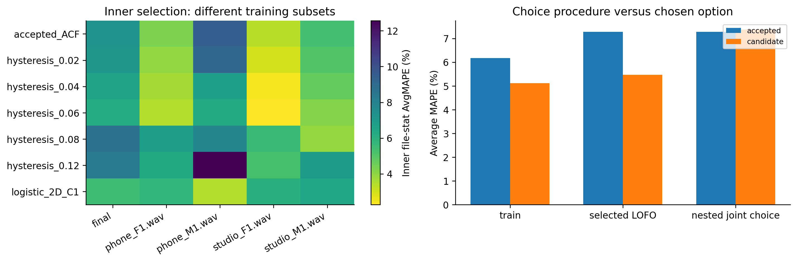

# H17 — lựa chọn family và margin trong nested train split

| split | model | average_mape | F0mean_mape | F0std_mape | F0num_mape | F0mean_abs_error | F0std_abs_error | macro_f1 | balanced_accuracy | recall_v | recall_uv | TP | TN | FP | FN | false_voiced_sil | F0num |
| --- | --- | --- | --- | --- | --- | --- | --- | --- | --- | --- | --- | --- | --- | --- | --- | --- | --- |
| train | accepted | 6.17797 | 0.583562 | 11.3078 | 6.64251 | 0.854436 | 2.33158 | 0.850371 | 0.900215 | 0.869123 | 0.931306 | 530 | 167 | 13 | 84 | 1 | 544 |
| train | candidate | 5.11916 | 0.437153 | 8.2443 | 6.67601 | 0.675148 | 1.69674 | 0.867043 | 0.907538 | 0.891228 | 0.923848 | 542 | 170 | 10 | 72 | 1 | 553 |
| lofo | accepted | 7.27924 | 1.05571 | 14.6661 | 6.1159 | 1.84025 | 3.0133 | 0.841398 | 0.893149 | 0.865862 | 0.920437 | 527 | 164 | 16 | 87 | 3 | 546 |
| lofo | candidate | 5.47073 | 0.463663 | 8.34004 | 7.6085 | 0.677558 | 1.72224 | 0.863433 | 0.909169 | 0.884072 | 0.934265 | 536 | 171 | 9 | 78 | 1 | 546 |
| nested | accepted | 7.27924 | 1.05571 | 14.6661 | 6.1159 | 1.84025 | 3.0133 | 0.841398 | 0.893149 | 0.865862 | 0.920437 | 527 | 164 | 16 | 87 | 3 | 546 |
| nested | candidate | 7.37476 | 1.06914 | 14.5403 | 6.51489 | 1.84861 | 2.98741 | 0.851499 | 0.903597 | 0.874252 | 0.932942 | 534 | 167 | 13 | 80 | 3 | 550 |

## Chosen option từngfold

| split | held_file | option_id | selection_files | fit_files |
| --- | --- | --- | --- | --- |
| train | phone_F1.wav | logistic_2D_C1 | phone_F1.wav\|phone_M1.wav\|studio_F1.wav\|studio_M1.wav | phone_F1.wav\|phone_M1.wav\|studio_F1.wav\|studio_M1.wav |
| train | phone_M1.wav | logistic_2D_C1 | phone_F1.wav\|phone_M1.wav\|studio_F1.wav\|studio_M1.wav | phone_F1.wav\|phone_M1.wav\|studio_F1.wav\|studio_M1.wav |
| train | studio_F1.wav | logistic_2D_C1 | phone_F1.wav\|phone_M1.wav\|studio_F1.wav\|studio_M1.wav | phone_F1.wav\|phone_M1.wav\|studio_F1.wav\|studio_M1.wav |
| train | studio_M1.wav | logistic_2D_C1 | phone_F1.wav\|phone_M1.wav\|studio_F1.wav\|studio_M1.wav | phone_F1.wav\|phone_M1.wav\|studio_F1.wav\|studio_M1.wav |
| lofo | phone_F1.wav | logistic_2D_C1 | phone_F1.wav\|phone_M1.wav\|studio_F1.wav\|studio_M1.wav | phone_M1.wav\|studio_F1.wav\|studio_M1.wav |
| lofo | phone_M1.wav | logistic_2D_C1 | phone_F1.wav\|phone_M1.wav\|studio_F1.wav\|studio_M1.wav | phone_F1.wav\|studio_F1.wav\|studio_M1.wav |
| lofo | studio_F1.wav | logistic_2D_C1 | phone_F1.wav\|phone_M1.wav\|studio_F1.wav\|studio_M1.wav | phone_F1.wav\|phone_M1.wav\|studio_M1.wav |
| lofo | studio_M1.wav | logistic_2D_C1 | phone_F1.wav\|phone_M1.wav\|studio_F1.wav\|studio_M1.wav | phone_F1.wav\|phone_M1.wav\|studio_F1.wav |
| nested | phone_F1.wav | hysteresis_0.06 | phone_M1.wav\|studio_F1.wav\|studio_M1.wav | phone_M1.wav\|studio_F1.wav\|studio_M1.wav |
| nested | phone_M1.wav | logistic_2D_C1 | phone_F1.wav\|studio_F1.wav\|studio_M1.wav | phone_F1.wav\|studio_F1.wav\|studio_M1.wav |
| nested | studio_F1.wav | hysteresis_0.04 | phone_F1.wav\|phone_M1.wav\|studio_M1.wav | phone_F1.wav\|phone_M1.wav\|studio_M1.wav |
| nested | studio_M1.wav | hysteresis_0.02 | phone_F1.wav\|phone_M1.wav\|studio_F1.wav | phone_F1.wav\|phone_M1.wav\|studio_F1.wav |

## Gates và final option

~~~json
{
  "final_option": {
    "id": "logistic_2D_C1",
    "kind": "logistic",
    "margin": 0.0
  },
  "decisions": {
    "lofo": {
      "checks": {
        "train_mape_relative_10_percent": true,
        "lofo_mape_relative_5_percent": true,
        "lofo_f1_drop_at_most_01": true,
        "lofo_recall_v_drop_at_most_01": true,
        "lofo_sil_increase_at_most_1": true,
        "lofo_no_file_mape_worse_by_over_2pp": true,
        "lofo_phone_f1_std_not_worse": true
      },
      "eligible": true,
      "nested_status": "Final option selected using these LOFO cases; optimistic selection score",
      "champion_promoted": false
    },
    "nested": {
      "checks": {
        "train_mape_relative_10_percent": true,
        "lofo_mape_relative_5_percent": false,
        "lofo_f1_drop_at_most_01": true,
        "lofo_recall_v_drop_at_most_01": true,
        "lofo_sil_increase_at_most_1": true,
        "lofo_no_file_mape_worse_by_over_2pp": true,
        "lofo_phone_f1_std_not_worse": true
      },
      "eligible": false,
      "nested_status": "Joint shortlist innerLOFO choice with outerheld excluded",
      "champion_promoted": false
    }
  },
  "eligible": false
}
~~~

FinalselectedLOFO đã dùngchooptionchoice, không làheldscoređộc lập với bướcchọn. Nestedloạiouterheld khỏiinnerselection/fit; không xóa lịch sửđềxuấtregistry trêncùng4file. Testcũđãxemtrướcđây,chưađọclạitrongvòngnày. Khôngpromotemodel chỉbằngselectedscoređẹp.

~~~powershell
python research_workbench_2026_10_06/family_selection.py
~~~
