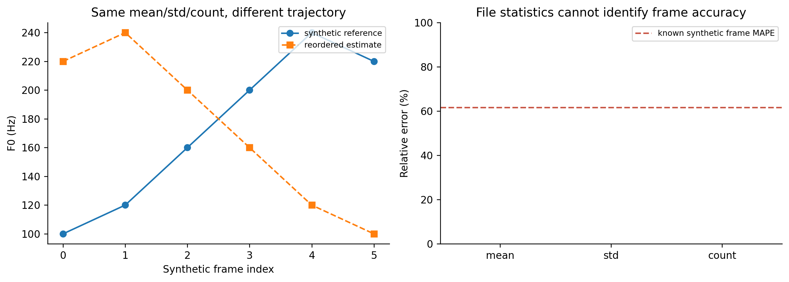
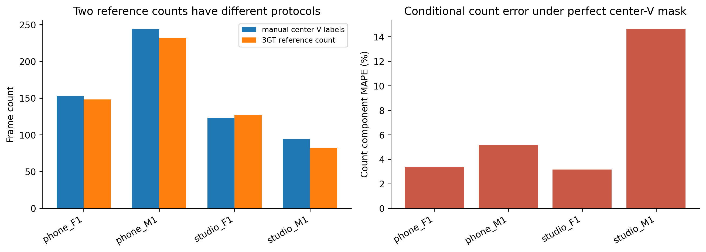

# H00b — đọc đúng metric và hai nguồn count

## Kết quả có thể kiểm tra

| file | v_frames | gt_count | center_v_minus_3gt | count_mape_if_perfect_center_v_and_finite_f0 |
| --- | --- | --- | --- | --- |
| phone_F1.wav | 153 | 148 | 5 | 3.37838 |
| phone_M1.wav | 244 | 232 | 12 | 5.17241 |
| studio_F1.wav | 123 | 127 | -4 | 3.14961 |
| studio_M1.wav | 94 | 82 | 12 | 14.6341 |

Nếu phân loại đúng mọi center-V và giữ F0 hữu hạn ở từng khung đó, count MAPE vẫn khác 0 vì count3GT dùng protocol chưa rõ. Đây không phải lower bound cho model nói chung: model có thể đổi count bằng FP/FN hoặc F0 không hữu hạn.

Không sửa LAB, không thay metric chính. Cần biết cách tạo3GT: frame/hop/offset, điều kiện voiced/F0 hợp lệ, loại bỏ khung biên, nguồn annotation và quy tắc đếm. Hiện chưa có metadata để kết luận nguyên nhân.

## Phản ví dụ tổng hợp

~~~json
{
  "scope": "Synthetic conceptual counterexample; not an error measurement on recorded speech",
  "reference_mean_hz": 173.33333333333334,
  "reference_std_hz_ddof0": 51.20763831912405,
  "permuted_mean_hz": 173.33333333333334,
  "permuted_std_hz_ddof0": 51.20763831912405,
  "reference_count": 6,
  "permuted_count": 6,
  "file_stats_average_mape_percent": 0.0,
  "synthetic_frame_mape_percent": 61.59090909090909,
  "synthetic_frame_mae_hz": 93.33333333333333,
  "synthetic_mean_absolute_cents": 983.772647454919
}
~~~

Hoán vị giữ nguyên tập giá trị, nên mean/std/count không đổi. F0 đúng từng thời điểm vẫn là câu hỏi khác. Giảm MAPE thống kê hữu ích cho yêu cầu bài này nhưng không thay thế đánh giá pitch từng khung.

Frame error trong ví dụ này tính được vì chúng ta tự sinh reference; chưa có reference tương đương để tính trên WAV train thật.

## Figures

## Tái lập

~~~powershell
python research_workbench_2026_10_06/metric_audit.py
~~~
