# H00 — audit sâu và tái lập baseline

Chạy local, train-only, không đổi thuật toán hoặc notebook đã giao.

## Kiểm tra thực tế

- Tái lập ACF original và accepted khớp saved CSV, tolerance 1e-8; số nguyên khớp.
- Cache times/labels khớp chia khung và nhãn đọc độc lập.
- Poison GT trong input inference không làm thay đổi pred/F0; fit vẫn cần nhãn training.
- Đẳng thức phân rã phương sai within/between theo nhãn được kiểm tra bằng code.
- 15 notebook giữ nguyên hash; xuất 20 figure PNG/SVG.

## Các số đo chính

| version | kind | average_mape | F0mean_mape | F0std_mape | F0num_mape | F0mean_abs_error | F0std_abs_error | macro_f1 | balanced_accuracy | recall_v | recall_uv | TP | TN | FP | FN | false_voiced_sil | F0num |
| --- | --- | --- | --- | --- | --- | --- | --- | --- | --- | --- | --- | --- | --- | --- | --- | --- | --- |
| baseline | train | 29.8347 | 2.00765 | 73.1065 | 14.3899 | 3.65781 | 18.0499 | 0.848791 | 0.886133 | 0.881794 | 0.890473 | 535 | 163 | 17 | 79 | 45 | 597 |
| baseline | lofo | 29.1108 | 2.02071 | 71.8234 | 13.4884 | 3.62775 | 18.011 | 0.836343 | 0.870939 | 0.879938 | 0.86194 | 533 | 157 | 23 | 81 | 44 | 600 |
| improved | train | 6.17797 | 0.583562 | 11.3078 | 6.64251 | 0.854436 | 2.33158 | 0.850371 | 0.900215 | 0.869123 | 0.931306 | 530 | 167 | 13 | 84 | 1 | 544 |
| improved | lofo | 7.27924 | 1.05571 | 14.6661 | 6.1159 | 1.84025 | 3.0133 | 0.841398 | 0.893149 | 0.865862 | 0.920437 | 527 | 164 | 16 | 87 | 3 | 546 |

## Dữ liệu

| file | fs | duration_s | frame_count | v_frames | uv_frames | sil_frames | gt_count | native_clip_samples | lab_end_minus_audio_s |
| --- | --- | --- | --- | --- | --- | --- | --- | --- | --- |
| phone_F1.wav | 16000 | 3.24 | 322 | 153 | 69 | 100 | 148 | 0 | -0.01 |
| phone_M1.wav | 16000 | 4.16 | 414 | 244 | 62 | 108 | 232 | 0 | -0.01 |
| studio_F1.wav | 44100 | 2.8632 | 284 | 123 | 24 | 137 | 127 | 0 | -0.00319728 |
| studio_M1.wav | 44100 | 2.73016 | 271 | 94 | 25 | 152 | 82 | 0 | -0.00015873 |

## Độ ổn định theo file

{
  "n_independent_units": 4,
  "unit": "file",
  "paired_mean_delta_pp": -21.831591670406777,
  "descriptive_file_bootstrap_95_interval_pp": [
    -31.652091156361553,
    -9.83974733124244
  ],
  "exploratory_exact_two_sided_sign_flip_p": 0.125,
  "warning": "Only 4 files; earlier selected accepted configuration and exploratory repeated analyses. Not a confirmatory hypothesis test or population confidence guarantee."
}

## Giới hạn cần giữ

GT mean/std/count không xác minh pitch từng thời điểm. Count hữu hạn không đồng nhất số nhãn V.
Frame windows chồng nhau; n độc lập không bằng số hàng của CSV. F/M và phone/studio chỉ là phân nhóm tên file.
ROC/PR và threshold curves là train diagnostic, không phải test độc lập hoặc calibrated probability.
Ứng viên gần tỉ lệ 2/3 là dấu hiệu ambiguity, không phải octave-error rate đã biết truth.
Bootstrap/sign-flip với 4 file là thăm dò mô tả; không chứng minh thuật toán tổng quát tốt hơn.

## Tái lập

~~~powershell
python research_workbench_2026_10_06/audit.py
~~~

## Figures

### 01_label_support

Số khung theo nhãn thật của bốn file train.

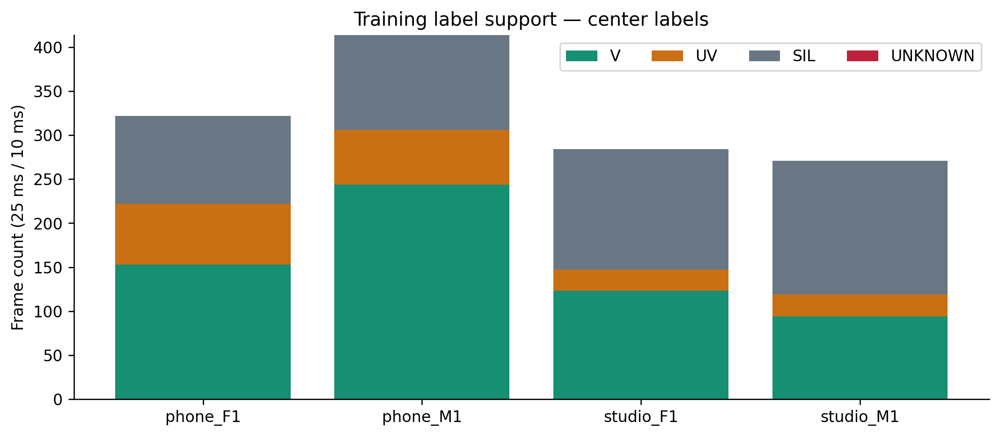

Khung chồng nhau; không phải mẫu độc lập.

### 02_contour_phone_F1

Waveform, nhãn đoạn và F0 trước/sau của phone_F1.

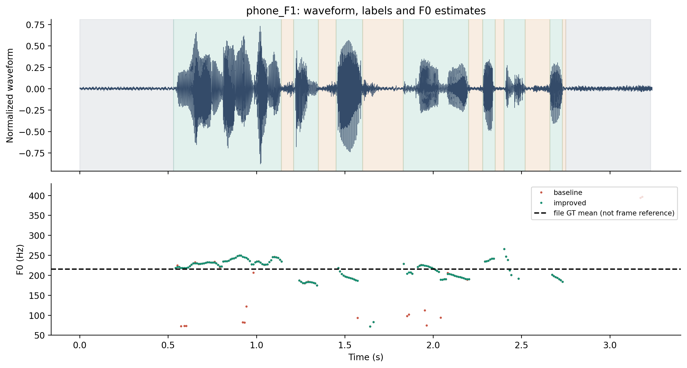

Đường GT mean chỉ là chuẩn cả file, không phải contour chuẩn từng khung.

### 03_spectrogram_phone_F1

Phổ thời gian và F0 ước lượng của phone_F1.

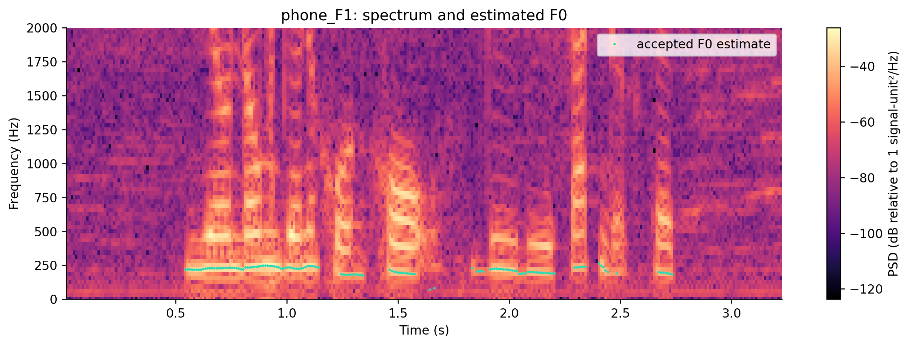

Không phải xác nhận mọi khung F0 bằng ground truth; đồ thị phổ là chẩn đoán.

### 02_contour_phone_M1

Waveform, nhãn đoạn và F0 trước/sau của phone_M1.

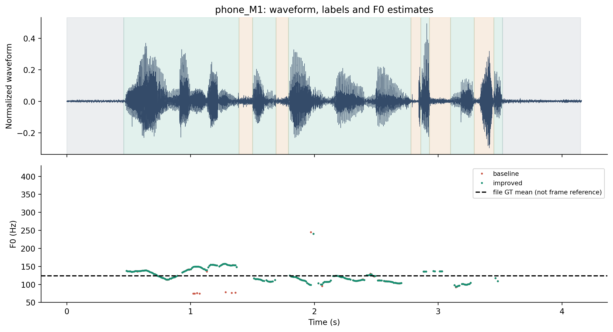

Đường GT mean chỉ là chuẩn cả file, không phải contour chuẩn từng khung.

### 03_spectrogram_phone_M1

Phổ thời gian và F0 ước lượng của phone_M1.

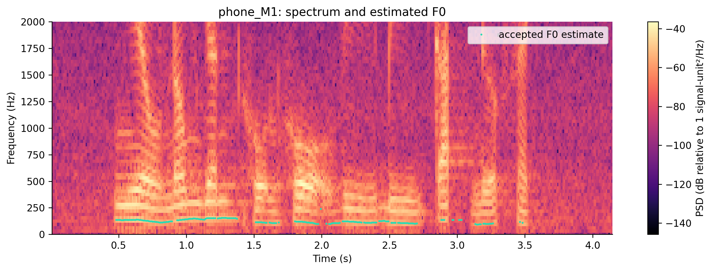

Không phải xác nhận mọi khung F0 bằng ground truth; đồ thị phổ là chẩn đoán.

### 02_contour_studio_F1

Waveform, nhãn đoạn và F0 trước/sau của studio_F1.

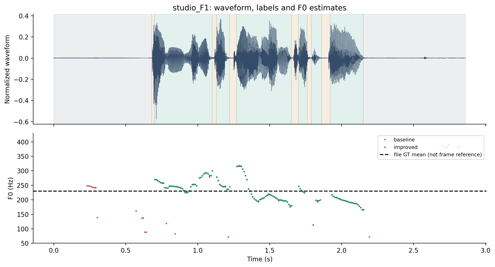

Đường GT mean chỉ là chuẩn cả file, không phải contour chuẩn từng khung.

### 03_spectrogram_studio_F1

Phổ thời gian và F0 ước lượng của studio_F1.

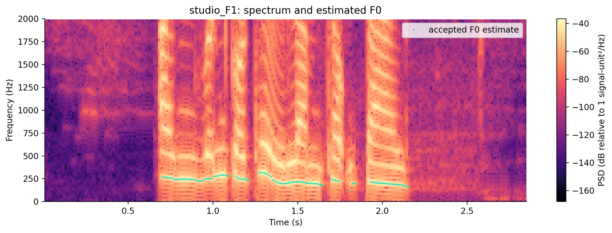

Không phải xác nhận mọi khung F0 bằng ground truth; đồ thị phổ là chẩn đoán.

### 02_contour_studio_M1

Waveform, nhãn đoạn và F0 trước/sau của studio_M1.

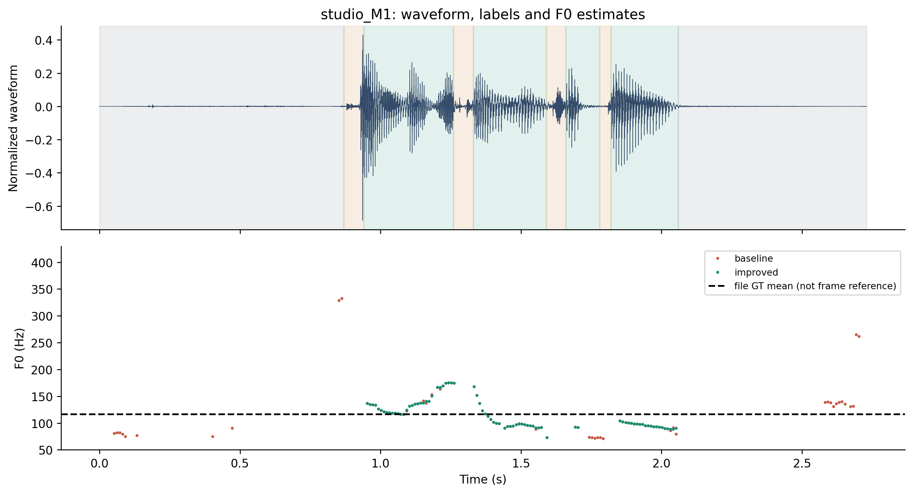

Đường GT mean chỉ là chuẩn cả file, không phải contour chuẩn từng khung.

### 03_spectrogram_studio_M1

Phổ thời gian và F0 ước lượng của studio_M1.

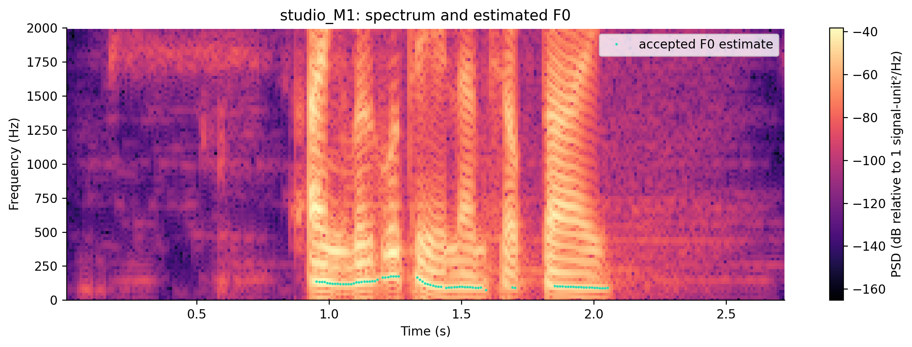

Không phải xác nhận mọi khung F0 bằng ground truth; đồ thị phổ là chẩn đoán.

### 04_feature_distributions

Phân bố đặc trưng theo V/UV/SIL.

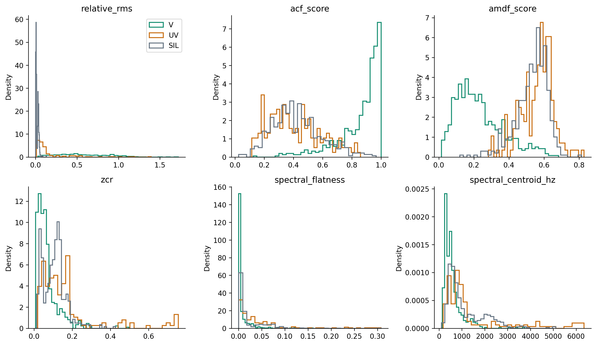

Dữ liệu train gộp; histogram không chứng minh khả năng tổng quát hay feature importance nhân quả.

### 05_roc_pr

ROC và precision–recall của ACF score theo từng file.

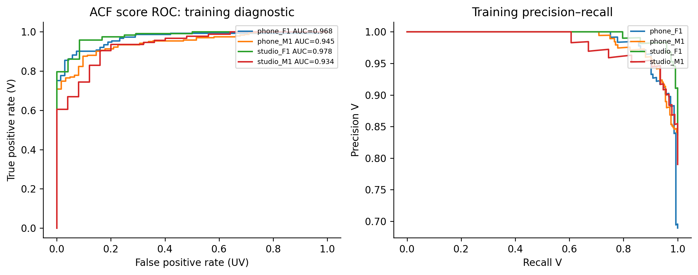

SIL không thuộc ROC này. Chưa hiệu chỉnh score thành xác suất. Các khung tương quan.

### 06_component_mape

Ba thành phần MAPE của ACF trước/sau trên train.

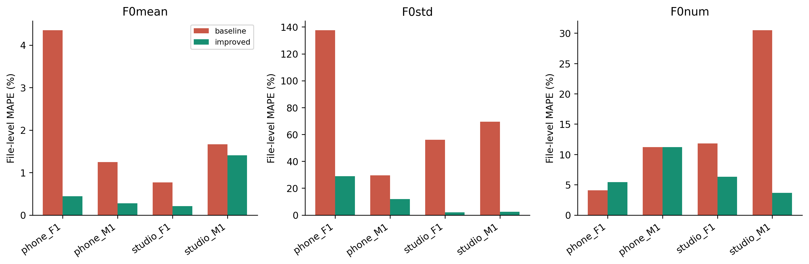

Mean/std/count là thống kê cả file; không phải MAPE F0 từng khung.

### 07_classification_tradeoff

Ma trận V/UV và số khung SIL bị gán hữu thanh.

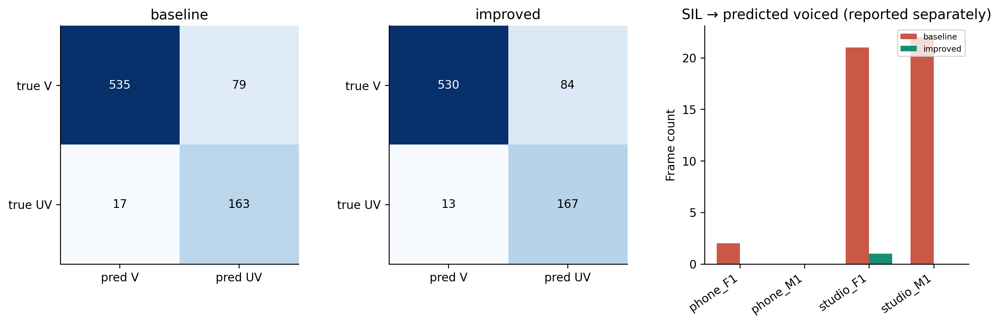

SIL được báo riêng; giảm SIL vẫn có thể làm tăng FN V.

### 08_error_timeline

Vị trí lỗi V/UV/SIL trước/sau theo thời gian.

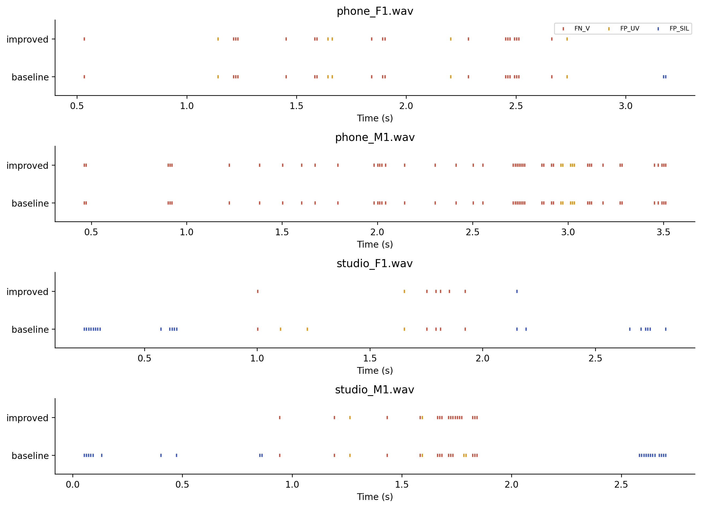

Đây là lỗi lớp theo nhãn đoạn; không chấm độ đúng cao độ của từng khung.

### 09_variance_by_label

Phân rã phương sai F0 theo nhãn: within và between cộng đúng tổng phương sai.

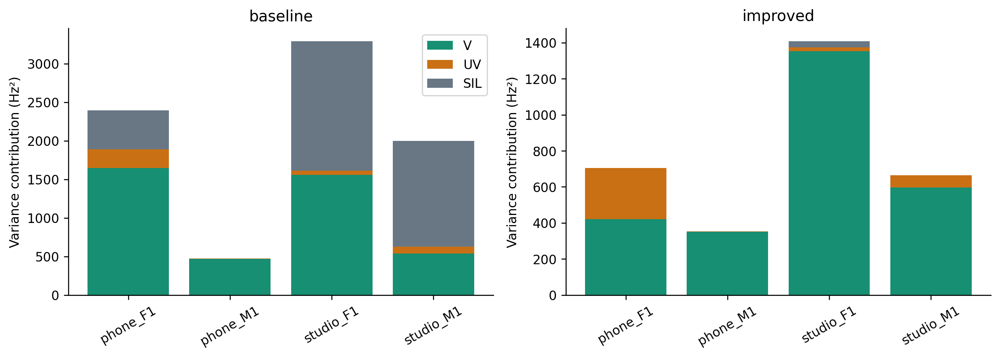

Tỷ lệ đóng góp phương sai không phải tỷ lệ gây MAPE; oracle nhãn chỉ chẩn đoán.

### 10_boundary_error_rates

Lỗi lớp ở khung sát ranh giới và khung bên trong.

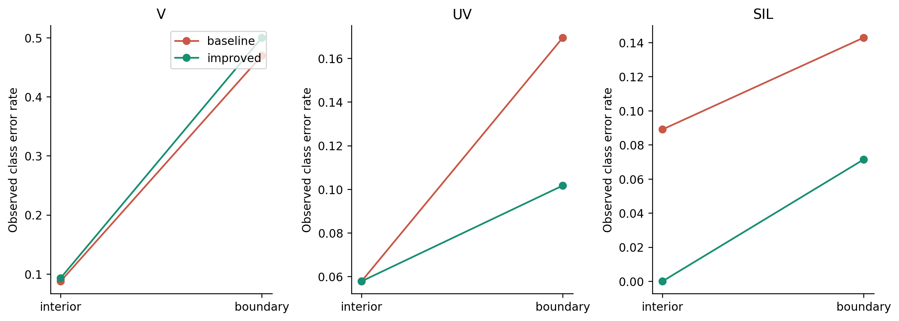

So sánh mô tả, không coi các khung chồng nhau là quan sát độc lập.

### 11_threshold_sensitivity

Độ nhạy ngưỡng ACF: balanced accuracy, recall V và lỗi SIL.

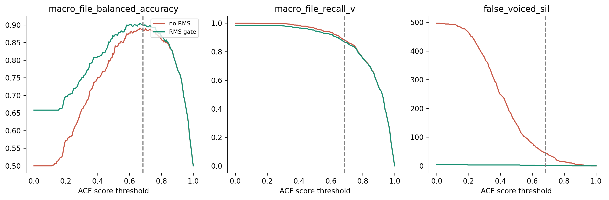

Dùng train đã biết để chẩn đoán; không chọn threshold mới từ đồ thị này hay từ test.

### 12_file_stability

Chênh lệch LOFO theo file và bootstrap lấy file làm đơn vị.

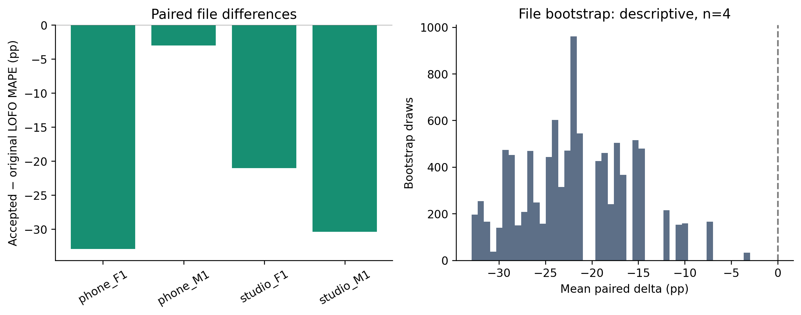

Chỉ n=4 và cấu hình từng được chọn trên train; không phải kiểm định xác nhận.

### 13_frame_support

Số chu kỳ nằm trong cửa sổ 20/25/30 ms theo F0.

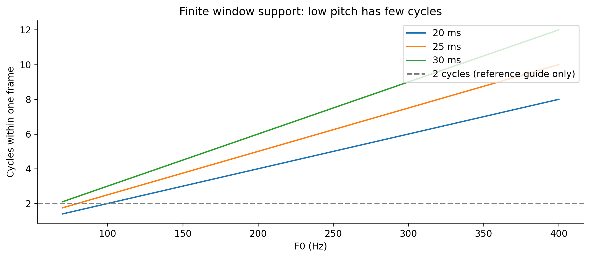

Công thức hình học F0×duration, không phải phép đo pitch accuracy.

### 14_feature_correlation

Tương quan đặc trưng để nhận ra thông tin trùng lặp.

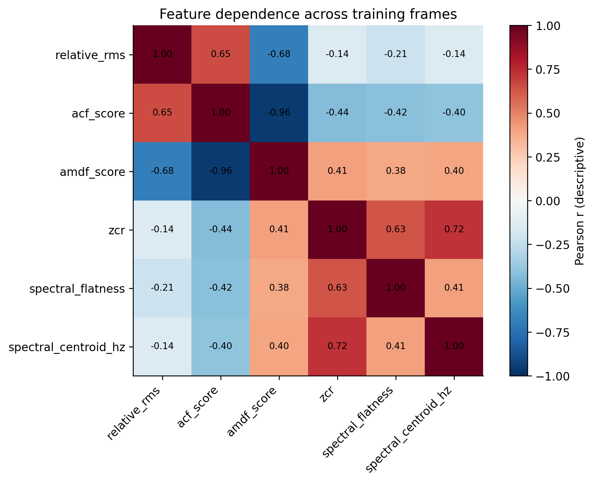

Pooled frames tương quan thời gian; không suy diễn nhân quả hay p-value độc lập.
