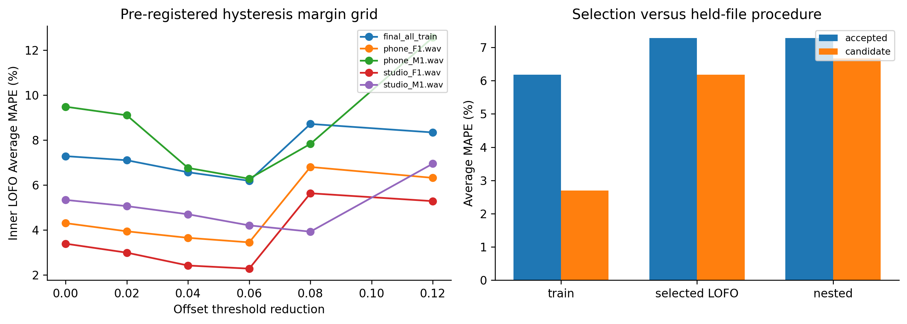
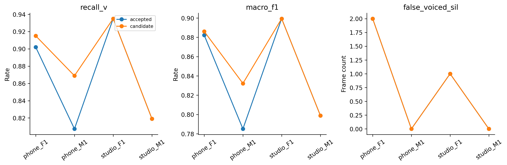

# H12 — hysteresis một yếu tố và nested lựa chọn margin

| split | model | average_mape | F0mean_mape | F0std_mape | F0num_mape | F0mean_abs_error | F0std_abs_error | macro_f1 | balanced_accuracy | recall_v | recall_uv | TP | TN | FP | FN | false_voiced_sil | F0num |
| --- | --- | --- | --- | --- | --- | --- | --- | --- | --- | --- | --- | --- | --- | --- | --- | --- | --- |
| train | accepted | 6.17797 | 0.583562 | 11.3078 | 6.64251 | 0.854436 | 2.33158 | 0.850371 | 0.900215 | 0.869123 | 0.931306 | 530 | 167 | 13 | 84 | 1 | 544 |
| train | candidate | 2.69709 | 0.496904 | 3.74589 | 3.84846 | 0.802209 | 0.766817 | 0.867188 | 0.908157 | 0.892664 | 0.923651 | 548 | 165 | 15 | 66 | 1 | 564 |
| lofo | accepted | 7.27924 | 1.05571 | 14.6661 | 6.1159 | 1.84025 | 3.0133 | 0.841398 | 0.893149 | 0.865862 | 0.920437 | 527 | 164 | 16 | 87 | 3 | 546 |
| lofo | candidate | 6.18275 | 0.87381 | 13.5825 | 4.09191 | 1.60125 | 2.7565 | 0.861022 | 0.902316 | 0.89185 | 0.912781 | 547 | 162 | 18 | 67 | 3 | 568 |
| nested | accepted | 7.27924 | 1.05571 | 14.6661 | 6.1159 | 1.84025 | 3.0133 | 0.841398 | 0.893149 | 0.865862 | 0.920437 | 527 | 164 | 16 | 87 | 3 | 546 |
| nested | candidate | 6.67068 | 0.990097 | 14.1234 | 4.89852 | 1.75084 | 2.91738 | 0.854151 | 0.89864 | 0.884498 | 0.912781 | 544 | 162 | 18 | 70 | 3 | 565 |

## Quyết định

~~~json
{
  "final_margin": 0.06,
  "registry": [
    0.0,
    0.02,
    0.04,
    0.06,
    0.08,
    0.12
  ],
  "final_gate": {
    "checks": {
      "train_mape_relative_10_percent": true,
      "lofo_mape_relative_5_percent": true,
      "lofo_f1_drop_at_most_01": true,
      "lofo_recall_v_drop_at_most_01": true,
      "lofo_sil_increase_at_most_1": true,
      "lofo_no_file_mape_worse_by_over_2pp": true,
      "lofo_phone_f1_std_not_worse": true
    },
    "eligible": true,
    "nested_status": "Final selected LOFO reused for selection; nested score reported separately.",
    "champion_promoted": false
  },
  "nested_gate": {
    "checks": {
      "train_mape_relative_10_percent": true,
      "lofo_mape_relative_5_percent": true,
      "lofo_f1_drop_at_most_01": true,
      "lofo_recall_v_drop_at_most_01": true,
      "lofo_sil_increase_at_most_1": true,
      "lofo_no_file_mape_worse_by_over_2pp": true,
      "lofo_phone_f1_std_not_worse": true
    },
    "eligible": true,
    "nested_status": "Outer held file excluded from margin selection; inner held-file fits only other two.",
    "champion_promoted": false
  },
  "eligible": true,
  "promoted": false,
  "test_read": false,
  "toy_transition_pass": true,
  "zero_margin_matches_champion": true,
  "poisoned_gt_inference_invariant": true,
  "nested_leakage_assertions_pass": true,
  "code_sha256": "82694c1a9f166d99398b76b71d1c729b6ee8d5258a686cd8d8aea3b4998fc4d4"
}
~~~

## Margin mỗi outerfold

| split | held_file | margin | selection_files |
| --- | --- | --- | --- |
| train | phone_F1.wav | 0.06 | phone_F1.wav\|phone_M1.wav\|studio_F1.wav\|studio_M1.wav |
| train | phone_M1.wav | 0.06 | phone_F1.wav\|phone_M1.wav\|studio_F1.wav\|studio_M1.wav |
| train | studio_F1.wav | 0.06 | phone_F1.wav\|phone_M1.wav\|studio_F1.wav\|studio_M1.wav |
| train | studio_M1.wav | 0.06 | phone_F1.wav\|phone_M1.wav\|studio_F1.wav\|studio_M1.wav |
| lofo | phone_F1.wav | 0.06 | phone_F1.wav\|phone_M1.wav\|studio_F1.wav\|studio_M1.wav |
| lofo | phone_M1.wav | 0.06 | phone_F1.wav\|phone_M1.wav\|studio_F1.wav\|studio_M1.wav |
| lofo | studio_F1.wav | 0.06 | phone_F1.wav\|phone_M1.wav\|studio_F1.wav\|studio_M1.wav |
| lofo | studio_M1.wav | 0.06 | phone_F1.wav\|phone_M1.wav\|studio_F1.wav\|studio_M1.wav |
| nested | phone_F1.wav | 0.06 | phone_M1.wav\|studio_F1.wav\|studio_M1.wav |
| nested | phone_M1.wav | 0.06 | phone_F1.wav\|studio_F1.wav\|studio_M1.wav |
| nested | studio_F1.wav | 0.04 | phone_F1.wav\|phone_M1.wav\|studio_M1.wav |
| nested | studio_M1.wav | 0.02 | phone_F1.wav\|phone_M1.wav\|studio_F1.wav |

## Figures

Giữ accepted champion. Hysteresis thay voiced mask nên có thể thay run/context của path và median; không khẳng định F0 mới từng khung đúng khi chưa có frameGT. Test chưa đọc trong vòng này.

~~~powershell
python research_workbench_2026_10_06/hysteresis_experiment.py
~~~
