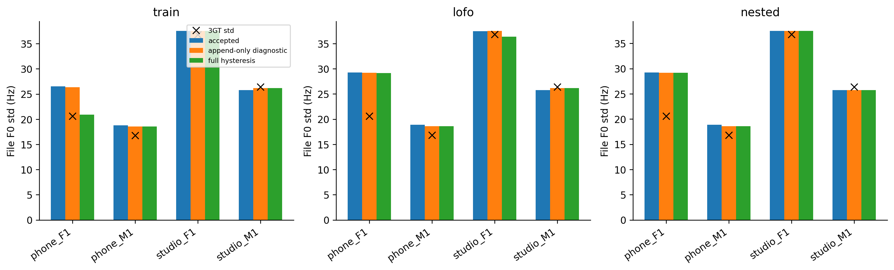
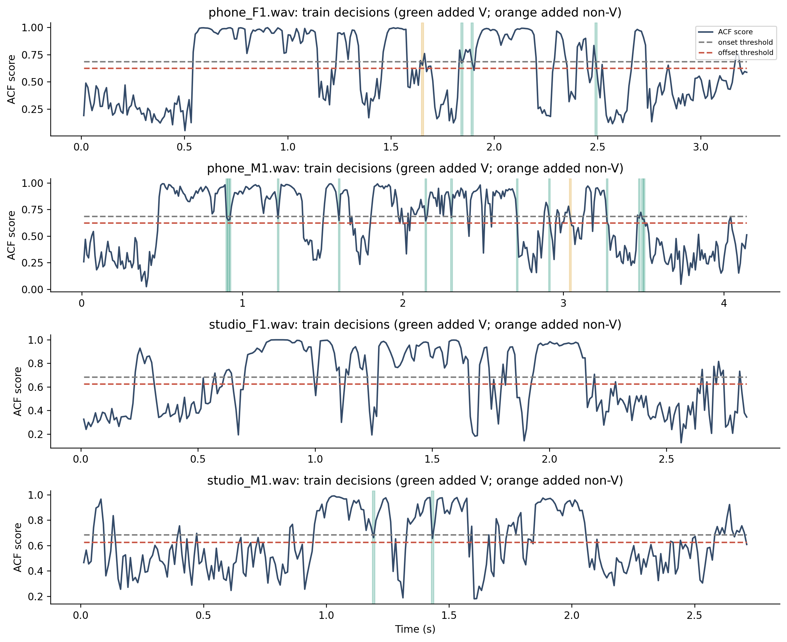
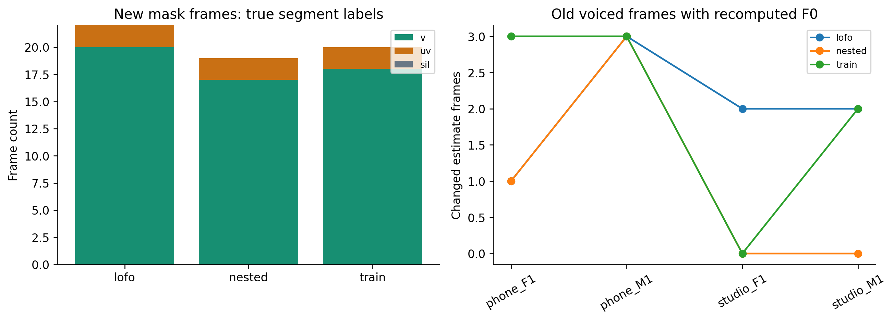

# H12 — vì sao thay mask còn làm F0std đổi?

Đọc lại đúng margin đã chọn và fold fit H12, không chọn tham số mới. Reproduce MAPE train/selectedLOFO/nested khớp1e-8. Không đọctest.

## Hai tác động cần tách

1. Thêm frame: append-only diagnostic giữ F0 accepted ở frame cũ, thêm F0 từ candidate ở frame vừa có mask. Count/distribution đổi chỉ vì tập estimate thay đổi.
2. Đổi context: full hysteresis tái chạy path và median trên voiced runs dài/nối lại. F0 ở cả những frame cũ có thể đổi. Chênh so với append-only cho thấy phần này.

Append-only không phải algorithm cạnh tranh; không sử dụng để chọn/push model, không chứng minh ground-truth pitch. Hai hiệu ứng không phải các đại lượng additive đơn giản vì std/MAPE là nonlinear.

| split | file | margin | added_mask_frames | removed_mask_frames | shared_finite_frames | shared_f0_changed_frames | shared_estimate_change_mae_hz | accepted_std_hz | append_only_std_hz | full_hysteresis_std_hz | gt_std_hz |
| --- | --- | --- | --- | --- | --- | --- | --- | --- | --- | --- | --- |
| train | phone_F1.wav | 0.06 | 4 | 0 | 140 | 3 | 2.41364 | 26.5516 | 26.3657 | 20.9325 | 20.6 |
| train | phone_M1.wav | 0.06 | 14 | 0 | 206 | 3 | 0.0151813 | 18.8075 | 18.5481 | 18.5551 | 16.8 |
| train | studio_F1.wav | 0.06 | 0 | 0 | 119 | 0 | 0 | 37.5365 | 37.5365 | 37.5365 | 36.8 |
| train | studio_M1.wav | 0.06 | 2 | 0 | 79 | 2 | 0.0760433 | 25.7693 | 26.1533 | 26.1568 | 26.4 |
| lofo | phone_F1.wav | 0.06 | 3 | 0 | 148 | 1 | 0.0277129 | 29.2614 | 29.1749 | 29.1584 | 20.6 |
| lofo | phone_M1.wav | 0.06 | 16 | 0 | 202 | 3 | 0.0154819 | 18.8794 | 18.5917 | 18.5987 | 16.8 |
| lofo | studio_F1.wav | 0.06 | 1 | 0 | 117 | 2 | 0.566605 | 37.4817 | 37.5136 | 36.3743 | 36.8 |
| lofo | studio_M1.wav | 0.06 | 2 | 0 | 79 | 2 | 0.0760433 | 25.7693 | 26.1533 | 26.1568 | 26.4 |
| nested | phone_F1.wav | 0.06 | 3 | 0 | 148 | 1 | 0.0277129 | 29.2614 | 29.1749 | 29.1584 | 20.6 |
| nested | phone_M1.wav | 0.06 | 16 | 0 | 202 | 3 | 0.0154819 | 18.8794 | 18.5917 | 18.5987 | 16.8 |
| nested | studio_F1.wav | 0.04 | 0 | 0 | 117 | 0 | 0 | 37.4817 | 37.4817 | 37.4817 | 36.8 |
| nested | studio_M1.wav | 0.02 | 0 | 0 | 79 | 0 | 0 | 25.7693 | 25.7693 | 25.7693 | 26.4 |

## Nhãn của frame được thêm

| split | file | label | added_mask_frames | shared_f0_changed_frames |
| --- | --- | --- | --- | --- |
| train | phone_F1.wav | v | 3 | 1 |
| train | phone_F1.wav | uv | 1 | 2 |
| train | phone_F1.wav | sil | 0 | 0 |
| train | phone_M1.wav | v | 13 | 3 |
| train | phone_M1.wav | uv | 1 | 0 |
| train | phone_M1.wav | sil | 0 | 0 |
| train | studio_F1.wav | v | 0 | 0 |
| train | studio_F1.wav | uv | 0 | 0 |
| train | studio_F1.wav | sil | 0 | 0 |
| train | studio_M1.wav | v | 2 | 2 |
| train | studio_M1.wav | uv | 0 | 0 |
| train | studio_M1.wav | sil | 0 | 0 |
| lofo | phone_F1.wav | v | 2 | 1 |
| lofo | phone_F1.wav | uv | 1 | 0 |
| lofo | phone_F1.wav | sil | 0 | 0 |
| lofo | phone_M1.wav | v | 15 | 3 |
| lofo | phone_M1.wav | uv | 1 | 0 |
| lofo | phone_M1.wav | sil | 0 | 0 |
| lofo | studio_F1.wav | v | 1 | 2 |
| lofo | studio_F1.wav | uv | 0 | 0 |
| lofo | studio_F1.wav | sil | 0 | 0 |
| lofo | studio_M1.wav | v | 2 | 2 |
| lofo | studio_M1.wav | uv | 0 | 0 |
| lofo | studio_M1.wav | sil | 0 | 0 |
| nested | phone_F1.wav | v | 2 | 1 |
| nested | phone_F1.wav | uv | 1 | 0 |
| nested | phone_F1.wav | sil | 0 | 0 |
| nested | phone_M1.wav | v | 15 | 3 |
| nested | phone_M1.wav | uv | 1 | 0 |
| nested | phone_M1.wav | sil | 0 | 0 |
| nested | studio_F1.wav | v | 0 | 0 |
| nested | studio_F1.wav | uv | 0 | 0 |
| nested | studio_F1.wav | sil | 0 | 0 |
| nested | studio_M1.wav | v | 0 | 0 |
| nested | studio_M1.wav | uv | 0 | 0 |
| nested | studio_M1.wav | sil | 0 | 0 |

Giảm std error có thể do sửa candidate path hoặc do distribution vô tình khớp3GT; thiếu frameF0truth nên chưa phân biệt chắc chắn. LAB xác minh được lớpV/UV/SIL của các frame thêm, không xác minh pitchHz.

## Figures

~~~powershell
python research_workbench_2026_10_06/hysteresis_influence.py
~~~
