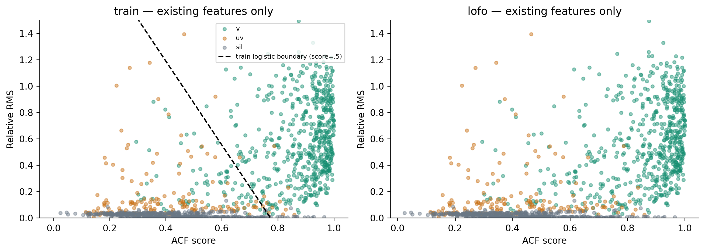
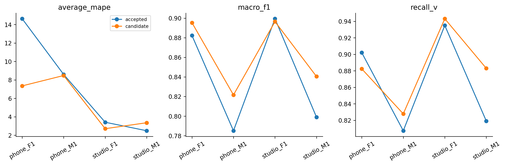

# H16 — logistic voicing trên ACFscore/RMS

| model | split | average_mape | F0mean_mape | F0std_mape | F0num_mape | F0mean_abs_error | F0std_abs_error | macro_f1 | balanced_accuracy | recall_v | recall_uv | TP | TN | FP | FN | false_voiced_sil | F0num |
| --- | --- | --- | --- | --- | --- | --- | --- | --- | --- | --- | --- | --- | --- | --- | --- | --- | --- |
| accepted | train | 6.17797 | 0.583562 | 11.3078 | 6.64251 | 0.854436 | 2.33158 | 0.850371 | 0.900215 | 0.869123 | 0.931306 | 530 | 167 | 13 | 84 | 1 | 544 |
| accepted | lofo | 7.27924 | 1.05571 | 14.6661 | 6.1159 | 1.84025 | 3.0133 | 0.841398 | 0.893149 | 0.865862 | 0.920437 | 527 | 164 | 16 | 87 | 3 | 546 |
| candidate | train | 5.11916 | 0.437153 | 8.2443 | 6.67601 | 0.675148 | 1.69674 | 0.867043 | 0.907538 | 0.891228 | 0.923848 | 542 | 170 | 10 | 72 | 1 | 553 |
| candidate | lofo | 5.47073 | 0.463663 | 8.34004 | 7.6085 | 0.677558 | 1.72224 | 0.863433 | 0.909169 | 0.884072 | 0.934265 | 536 | 171 | 9 | 78 | 1 | 546 |

~~~json
{
  "checks": {
    "train_mape_relative_10_percent": true,
    "lofo_mape_relative_5_percent": true,
    "lofo_f1_drop_at_most_01": true,
    "lofo_recall_v_drop_at_most_01": true,
    "lofo_sil_increase_at_most_1": true,
    "lofo_no_file_mape_worse_by_over_2pp": true,
    "lofo_phone_f1_std_not_worse": true
  },
  "eligible": true,
  "nested_status": "No newly tuned parameter: fixed candidate evaluated by LOFO; no distinct inner selection estimate.",
  "champion_promoted": false
}
~~~

Standardization và class weights fit trainonly từngfold; heldfilekhông trongfit. C1/.5fixed. GiữRMS/path/median3 vàchampion; khôngtune từtest. Đây làclassifierthay vìchỉđổiF0distribution. Chưa cóframepitchtruth vàn=4.

~~~powershell
python research_workbench_2026_10_06/logistic_voicing_experiment.py
~~~
