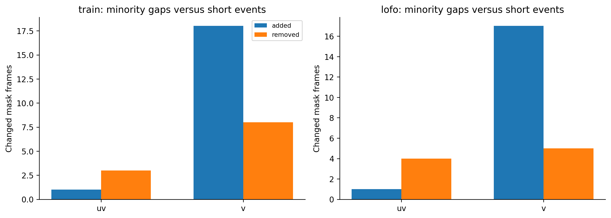

# H14 — majority3 voiced mask

| split | model | average_mape | F0mean_mape | F0std_mape | F0num_mape | F0mean_abs_error | F0std_abs_error | macro_f1 | balanced_accuracy | recall_v | recall_uv | TP | TN | FP | FN | false_voiced_sil | F0num |
| --- | --- | --- | --- | --- | --- | --- | --- | --- | --- | --- | --- | --- | --- | --- | --- | --- | --- |
| train | accepted | 6.17797 | 0.583562 | 11.3078 | 6.64251 | 0.854436 | 2.33158 | 0.850371 | 0.900215 | 0.869123 | 0.931306 | 530 | 167 | 13 | 84 | 1 | 544 |
| lofo | accepted | 7.27924 | 1.05571 | 14.6661 | 6.1159 | 1.84025 | 3.0133 | 0.841398 | 0.893149 | 0.865862 | 0.920437 | 527 | 164 | 16 | 87 | 3 | 546 |
| train | candidate | 4.22541 | 0.559102 | 6.69769 | 5.41943 | 0.857168 | 1.27679 | 0.869052 | 0.914801 | 0.884672 | 0.944929 | 540 | 169 | 11 | 74 | 1 | 552 |
| lofo | candidate | 5.81768 | 0.717286 | 12.073 | 4.66274 | 1.30355 | 2.61467 | 0.866968 | 0.915082 | 0.885687 | 0.944476 | 539 | 167 | 13 | 75 | 3 | 555 |

## Thay đổi frame

| split | label | boundary | change | frames |
| --- | --- | --- | --- | --- |
| lofo | uv | False | added | 1 |
| lofo | uv | False | removed | 1 |
| lofo | uv | True | removed | 3 |
| lofo | v | False | added | 15 |
| lofo | v | False | removed | 3 |
| lofo | v | True | added | 2 |
| lofo | v | True | removed | 2 |
| train | uv | False | added | 1 |
| train | uv | False | removed | 2 |
| train | uv | True | removed | 1 |
| train | v | False | added | 16 |
| train | v | False | removed | 4 |
| train | v | True | added | 2 |
| train | v | True | removed | 4 |

## Gate

~~~json
{
  "checks": {
    "train_mape_relative_10_percent": true,
    "lofo_mape_relative_5_percent": true,
    "lofo_f1_drop_at_most_01": true,
    "lofo_recall_v_drop_at_most_01": true,
    "lofo_sil_increase_at_most_1": true,
    "lofo_no_file_mape_worse_by_over_2pp": true,
    "lofo_phone_f1_std_not_worse": false
  },
  "eligible": false,
  "nested_status": "No newly tuned parameter: fixed candidate evaluated by LOFO; no distinct inner selection estimate.",
  "champion_promoted": false
}
~~~

Median mask thay quyết định V/UV, khác median pitch giữ mask. Thêm frame có thể làm path nối và đổi F0 trong run; không sửa theo GTstats. Giữ champion nếu fail.

~~~powershell
python research_workbench_2026_10_06/mask_vote_experiment.py
~~~
