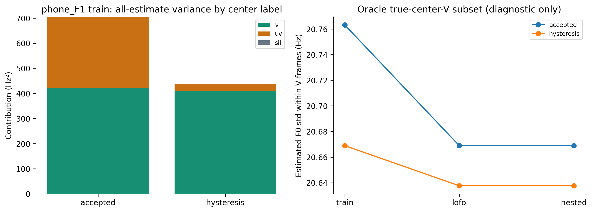

# Metric gain có thể chứa tác động từ khung không phải V

## Phát hiện quan trọng

Trên phone_F1 train, hai center-UV vẫn bị dự đoán V nhưng estimate đổi từ khoảng71.608/82.785Hz lên247.050/240.541Hz. Chúng không trở thành true-positive V; error class vẫn làUV→V. Đổi context làm distribution gần file3GT, giảm stdMAPE, nhưng không chứng minh các F0 ấy đúng.

Center-UV không đồng nghĩa toàn bộ25ms chứa0%V. Bảng dưới báo overlap đúng theo LAB; không suy diễn mỗi trường hợp là một âm vô thanh thuần hoặc có F0 chuẩn đã biết.

| split | file | time_s | center_label | old_estimated_hz | new_estimated_hz | v_overlap_fraction_in_window | old_mask | new_mask | pitch_truth_known |
| --- | --- | --- | --- | --- | --- | --- | --- | --- | --- |
| train | phone_F1.wav | 1.6425 | uv | 71.6076 | 247.05 | 0 | True | True | False |
| train | phone_F1.wav | 1.6625 | uv | 82.7854 | 240.541 | 0 | True | True | False |

## Variance theo nhãn

| split | file | model | center_label | finite_estimate_count | group_mean_hz | group_std_hz | within_variance_contribution_hz2 | between_variance_contribution_hz2 | total_variance_contribution_hz2 | all_estimates_std_hz | contribution_fraction | oracle_label_filter |
| --- | --- | --- | --- | --- | --- | --- | --- | --- | --- | --- | --- | --- |
| train | phone_F1.wav | accepted | v | 135 | 216.946 | 20.7632 | 415.714 | 5.10918 | 420.823 | 26.5516 | 0.596921 | True |
| train | phone_F1.wav | accepted | uv | 5 | 152.495 | 63.9853 | 146.219 | 137.948 | 284.167 | 26.5516 | 0.403079 | True |
| train | phone_F1.wav | accepted | sil | 0 | nan | nan | 0 | 0 | 0 | 26.5516 | 0 | True |
| train | phone_F1.wav | hysteresis | v | 138 | 216.757 | 20.669 | 409.406 | 0.0588062 | 409.465 | 20.9325 | 0.934487 | True |
| train | phone_F1.wav | hysteresis | uv | 6 | 222.702 | 25.6219 | 27.3533 | 1.35254 | 28.7059 | 20.9325 | 0.065513 | True |
| train | phone_F1.wav | hysteresis | sil | 0 | nan | nan | 0 | 0 | 0 | 20.9325 | 0 | True |

## Cách diễn giải H12

- Gates đăng ký trước vẫn PASS trên metric và V/UV; không đổi kết quả hoặc criterion sau khi xem dữ liệu.
- Hysteresis train thêm18V+2UV, nested thêm17V+2UV, SIL không tăng. Đây là gain classification có nhãn xác minh và tradeoff còn lại.
- Không gọi phần giảm std chủ yếu ở train phone_F1 là sửa F0 ở khung V: phần đó chịu ảnh hưởng mạnh từ estimates trênUV false positives.
- H12 vẫn provisional; không thay champion chỉ vì metric cực thấp. Cần báo phân loại, distribution và giới hạn reference cùng nhau.
- Oracle true-V subset là diagnostic dùng nhãn, không là pipeline deploy hay label adjustment. Count/stat3GT protocol chưa rõ, không thay metric chính.

~~~powershell
python research_workbench_2026_10_06/metric_label_coupling.py
~~~
