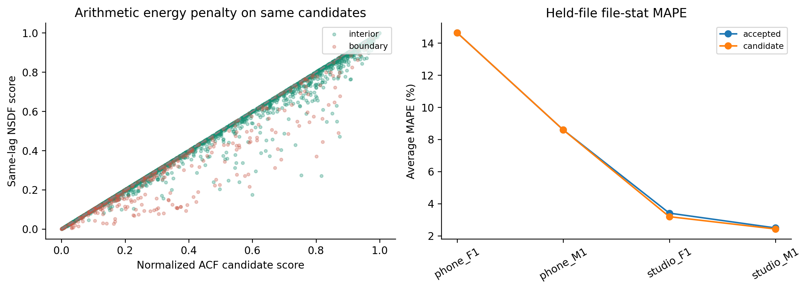
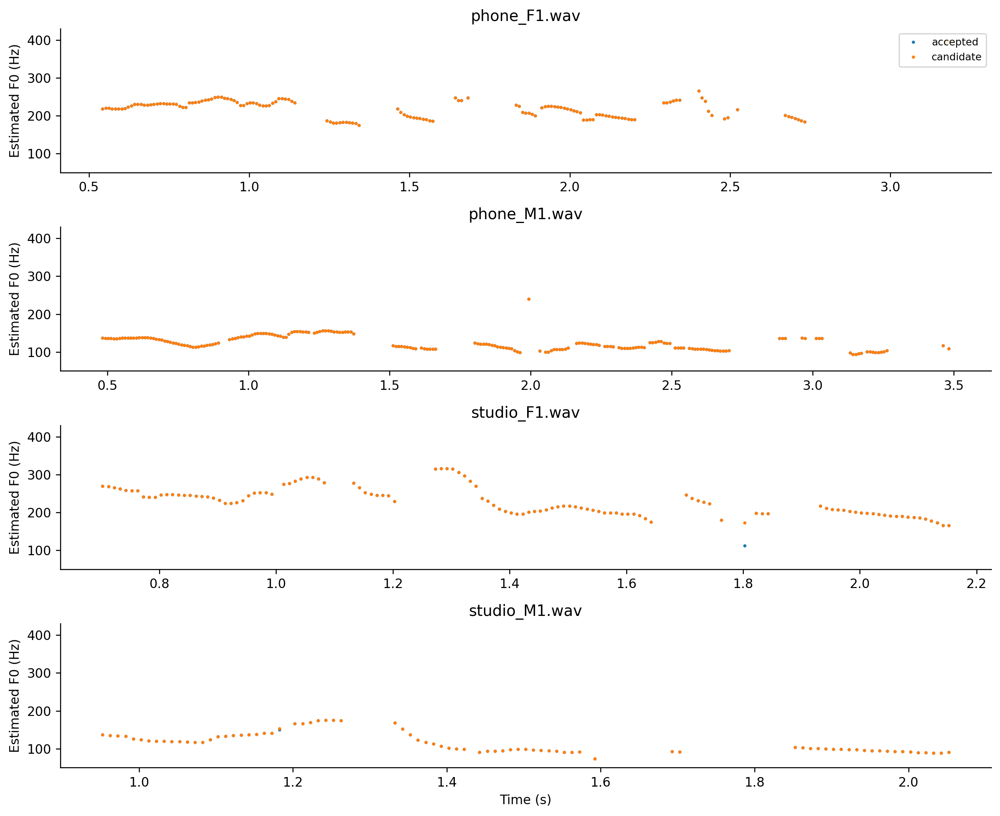

# H13 — strength NSDF trên cùng ACF candidates/path

| split | model | average_mape | F0mean_mape | F0std_mape | F0num_mape | F0mean_abs_error | F0std_abs_error | macro_f1 | balanced_accuracy | recall_v | recall_uv | TP | TN | FP | FN | false_voiced_sil | F0num |
| --- | --- | --- | --- | --- | --- | --- | --- | --- | --- | --- | --- | --- | --- | --- | --- | --- | --- |
| train | accepted | 6.17797 | 0.583562 | 11.3078 | 6.64251 | 0.854436 | 2.33158 | 0.850371 | 0.900215 | 0.869123 | 0.931306 | 530 | 167 | 13 | 84 | 1 | 544 |
| lofo | accepted | 7.27924 | 1.05571 | 14.6661 | 6.1159 | 1.84025 | 3.0133 | 0.841398 | 0.893149 | 0.865862 | 0.920437 | 527 | 164 | 16 | 87 | 3 | 546 |
| train | candidate | 5.08863 | 0.437854 | 8.18552 | 6.64251 | 0.540251 | 1.65471 | 0.850371 | 0.900215 | 0.869123 | 0.931306 | 530 | 167 | 13 | 84 | 1 | 544 |
| lofo | candidate | 7.20766 | 0.992797 | 14.5143 | 6.1159 | 1.70342 | 2.96185 | 0.841398 | 0.893149 | 0.865862 | 0.920437 | 527 | 164 | 16 | 87 | 3 | 546 |

~~~json
{
  "checks": {
    "train_mape_relative_10_percent": true,
    "lofo_mape_relative_5_percent": false,
    "lofo_f1_drop_at_most_01": true,
    "lofo_recall_v_drop_at_most_01": true,
    "lofo_sil_increase_at_most_1": true,
    "lofo_no_file_mape_worse_by_over_2pp": true,
    "lofo_phone_f1_std_not_worse": true
  },
  "eligible": false,
  "nested_status": "No newly tuned parameter: fixed candidate evaluated by LOFO; no distinct inner selection estimate.",
  "champion_promoted": false
}
~~~

Giữ nguyên candidates/mask/threshold/path costs/median3; chỉ energy normalization strength thay đổi. Không gộp H12 hysteresis vào thí nghiệm này. Giữ champion và log failure nếu gates chưa đạt.

~~~powershell
python research_workbench_2026_10_06/nsdf_strength_experiment.py
~~~
