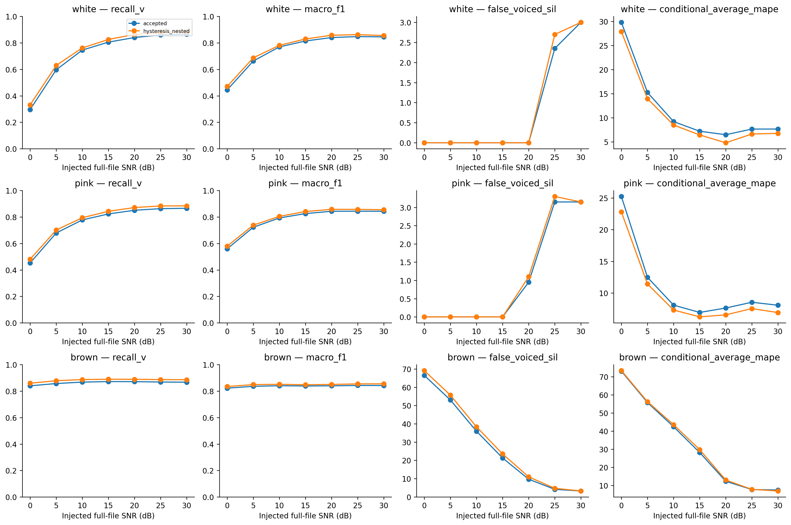
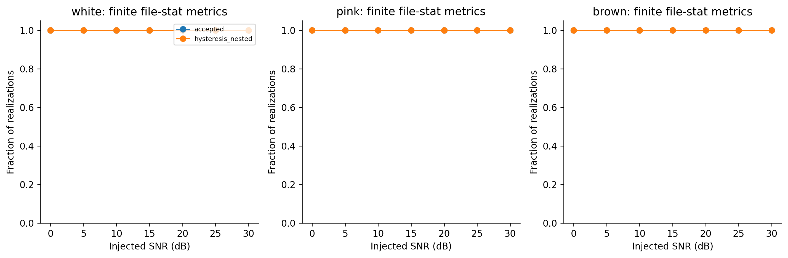
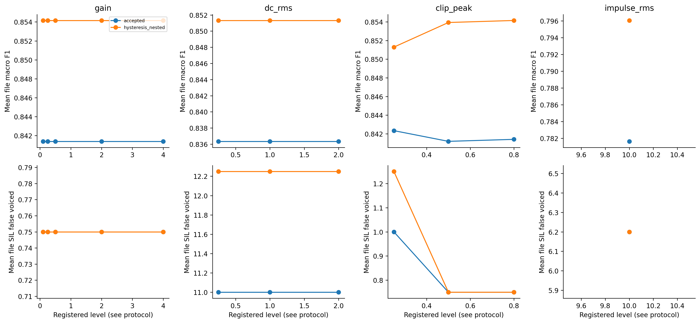

# H15 — robustness có kiểm soát, fixed clean-trained models

Hoàn thành 1744/1744 registered cases; mỗi case có2model. Raw train-only, không đọc/test/tune từ stress curves.

Hysteresis dùng margin của nestedfold chỉ other3 đã chọn. Thresholds fit cleanother3; noise tidak được dùng để fit lại. SNR toàn file gồmSIL; injectednoise synthetic PSD0/-1/-2, không noise corpus thật.

## Noise summary

| kind | level | model | recall_v | macro_f1 | false_voiced_sil | conditional_average_mape | files | cases | finite_stat_cases | stat_coverage |
| --- | --- | --- | --- | --- | --- | --- | --- | --- | --- | --- |
| brown | 0 | accepted | 0.839767 | 0.822072 | 66.55 | 73.0943 | 4 | 80 | 80 | 1 |
| brown | 0 | hysteresis_nested | 0.859406 | 0.834049 | 69.15 | 73.4055 | 4 | 80 | 80 | 1 |
| brown | 5 | accepted | 0.856881 | 0.835923 | 53.05 | 55.7884 | 4 | 80 | 80 | 1 |
| brown | 5 | hysteresis_nested | 0.878247 | 0.849009 | 55.7 | 56.2522 | 4 | 80 | 80 | 1 |
| brown | 10 | accepted | 0.867753 | 0.840388 | 35.95 | 42.4322 | 4 | 80 | 80 | 1 |
| brown | 10 | hysteresis_nested | 0.886708 | 0.851031 | 38.35 | 43.5773 | 4 | 80 | 80 | 1 |
| brown | 15 | accepted | 0.871652 | 0.838414 | 21.3 | 28.2055 | 4 | 80 | 80 | 1 |
| brown | 15 | hysteresis_nested | 0.889352 | 0.847774 | 23.5 | 29.7701 | 4 | 80 | 80 | 1 |
| brown | 20 | accepted | 0.871277 | 0.839792 | 9.65 | 12.3181 | 4 | 80 | 80 | 1 |
| brown | 20 | hysteresis_nested | 0.888992 | 0.85021 | 10.95 | 13.009 | 4 | 80 | 80 | 1 |
| brown | 25 | accepted | 0.86833 | 0.842427 | 4.1 | 7.74048 | 4 | 80 | 80 | 1 |
| brown | 25 | hysteresis_nested | 0.88666 | 0.854031 | 4.65 | 7.84108 | 4 | 80 | 80 | 1 |
| brown | 30 | accepted | 0.866979 | 0.842029 | 3.2 | 7.49532 | 4 | 80 | 80 | 1 |
| brown | 30 | hysteresis_nested | 0.885616 | 0.854707 | 3.25 | 6.94753 | 4 | 80 | 80 | 1 |
| pink | 0 | accepted | 0.45274 | 0.559535 | 0 | 25.2196 | 4 | 80 | 80 | 1 |
| pink | 0 | hysteresis_nested | 0.480553 | 0.579654 | 0 | 22.7973 | 4 | 80 | 80 | 1 |
| pink | 5 | accepted | 0.678574 | 0.722303 | 0 | 12.4726 | 4 | 80 | 80 | 1 |
| pink | 5 | hysteresis_nested | 0.701129 | 0.738217 | 0 | 11.4154 | 4 | 80 | 80 | 1 |
| pink | 10 | accepted | 0.777674 | 0.792537 | 0 | 8.08939 | 4 | 80 | 80 | 1 |
| pink | 10 | hysteresis_nested | 0.794256 | 0.804516 | 0 | 7.31853 | 4 | 80 | 80 | 1 |
| pink | 15 | accepted | 0.82271 | 0.825537 | 0 | 6.93377 | 4 | 80 | 80 | 1 |
| pink | 15 | hysteresis_nested | 0.84261 | 0.841096 | 0 | 6.23385 | 4 | 80 | 80 | 1 |
| pink | 20 | accepted | 0.850576 | 0.84308 | 0.95 | 7.63104 | 4 | 80 | 80 | 1 |
| pink | 20 | hysteresis_nested | 0.871038 | 0.857426 | 1.1 | 6.55627 | 4 | 80 | 80 | 1 |
| pink | 25 | accepted | 0.862578 | 0.843417 | 3.15 | 8.54096 | 4 | 80 | 80 | 1 |
| pink | 25 | hysteresis_nested | 0.883113 | 0.857334 | 3.3 | 7.54275 | 4 | 80 | 80 | 1 |
| pink | 30 | accepted | 0.865517 | 0.842897 | 3.15 | 8.069 | 4 | 80 | 80 | 1 |
| pink | 30 | hysteresis_nested | 0.883956 | 0.854408 | 3.15 | 6.91329 | 4 | 80 | 80 | 1 |
| white | 0 | accepted | 0.296178 | 0.444794 | 0 | 29.8135 | 4 | 80 | 80 | 1 |
| white | 0 | hysteresis_nested | 0.331068 | 0.470935 | 0 | 27.9053 | 4 | 80 | 80 | 1 |
| white | 5 | accepted | 0.596295 | 0.662973 | 0 | 15.2719 | 4 | 80 | 80 | 1 |
| white | 5 | hysteresis_nested | 0.629417 | 0.686798 | 0 | 13.9804 | 4 | 80 | 80 | 1 |
| white | 10 | accepted | 0.745306 | 0.769425 | 0 | 9.22809 | 4 | 80 | 80 | 1 |
| white | 10 | hysteresis_nested | 0.761653 | 0.781348 | 0 | 8.51541 | 4 | 80 | 80 | 1 |
| white | 15 | accepted | 0.805432 | 0.814023 | 0 | 7.21986 | 4 | 80 | 80 | 1 |
| white | 15 | hysteresis_nested | 0.825575 | 0.829126 | 0 | 6.45754 | 4 | 80 | 80 | 1 |
| white | 20 | accepted | 0.840109 | 0.839974 | 0 | 6.49986 | 4 | 80 | 80 | 1 |
| white | 20 | hysteresis_nested | 0.863271 | 0.857425 | 0 | 4.82893 | 4 | 80 | 80 | 1 |
| white | 25 | accepted | 0.859526 | 0.847343 | 2.35 | 7.66978 | 4 | 80 | 80 | 1 |
| white | 25 | hysteresis_nested | 0.88007 | 0.86181 | 2.7 | 6.64328 | 4 | 80 | 80 | 1 |
| white | 30 | accepted | 0.865091 | 0.845003 | 3 | 7.67651 | 4 | 80 | 80 | 1 |
| white | 30 | hysteresis_nested | 0.882396 | 0.855024 | 3 | 6.77632 | 4 | 80 | 80 | 1 |

AvgMAPE conditional khi có estimate; statcoverage báo riêng, undefined không fill0. Các seed không là thêm speakers: chỉ4file gốc. Group trước theofile, average seed trongfile, rồi average4file; SILsum là tổng expectation theo4file.

## Gain/DC/clip/impulse

| kind | level | model | macro_f1 | recall_v | false_voiced_sil |
| --- | --- | --- | --- | --- | --- |
| clip_peak | 0.25 | accepted | 0.842333 | 0.868487 | 1 |
| clip_peak | 0.25 | hysteresis_nested | 0.851293 | 0.883025 | 1.25 |
| clip_peak | 0.5 | accepted | 0.841185 | 0.867496 | 0.75 |
| clip_peak | 0.5 | hysteresis_nested | 0.853935 | 0.886132 | 0.75 |
| clip_peak | 0.8 | accepted | 0.841398 | 0.865862 | 0.75 |
| clip_peak | 0.8 | hysteresis_nested | 0.854151 | 0.884498 | 0.75 |
| dc_rms | 0.25 | accepted | 0.836343 | 0.879938 | 11 |
| dc_rms | 0.25 | hysteresis_nested | 0.851315 | 0.901234 | 12.25 |
| dc_rms | 1 | accepted | 0.836343 | 0.879938 | 11 |
| dc_rms | 1 | hysteresis_nested | 0.851315 | 0.901234 | 12.25 |
| dc_rms | 2 | accepted | 0.836343 | 0.879938 | 11 |
| dc_rms | 2 | hysteresis_nested | 0.851315 | 0.901234 | 12.25 |
| gain | 0.1 | accepted | 0.841398 | 0.865862 | 0.75 |
| gain | 0.1 | hysteresis_nested | 0.854151 | 0.884498 | 0.75 |
| gain | 0.25 | accepted | 0.841398 | 0.865862 | 0.75 |
| gain | 0.25 | hysteresis_nested | 0.854151 | 0.884498 | 0.75 |
| gain | 0.5 | accepted | 0.841398 | 0.865862 | 0.75 |
| gain | 0.5 | hysteresis_nested | 0.854151 | 0.884498 | 0.75 |
| gain | 2 | accepted | 0.841398 | 0.865862 | 0.75 |
| gain | 2 | hysteresis_nested | 0.854151 | 0.884498 | 0.75 |
| gain | 4 | accepted | 0.841398 | 0.865862 | 0.75 |
| gain | 4 | hysteresis_nested | 0.854151 | 0.884498 | 0.75 |
| impulse_rms | 10 | accepted | 0.781635 | 0.786252 | 6.2 |
| impulse_rms | 10 | hysteresis_nested | 0.796038 | 0.807369 | 6.2 |

## Reproduction metadata

~~~json
{
  "registry_sha256": "2e46459d3bc863911b4db2aa008d10365c4d2ba89dbc450376b9840d6d55483f",
  "code_sha256": {
    "audio_features.py": "4973bd22354a5581d3cb8bb8fed4e015434f92a98912e43ec4773bfc7b30b30c",
    "robustness_analysis.py": "54352ae3722614767d17479d75504b2199e5e25c19f47a81b4f7e76f2b272d6c",
    "hysteresis_experiment.py": "82694c1a9f166d99398b76b71d1c729b6ee8d5258a686cd8d8aea3b4998fc4d4"
  },
  "raw_wav_sha256": {
    "phone_F1.wav": "4209a6ffe642f93b89554000fa7766135faf7c6cd97ce99b912b44af5e39db12",
    "phone_M1.wav": "f6ec4c441948ea9e749ddfdf2ec88b5400261c2f7249c54baf42e00b485eab22",
    "studio_F1.wav": "60deec10a9a1db91546503977892d17f34111d7090482b893dc46ebe09ec6fc5",
    "studio_M1.wav": "7ad0e8baff2c69e65f680842a7cda33744358111f7662d9b6d17702b2077be78"
  },
  "test_read": false,
  "deadline_utc": "2026-10-06T21:00:00+00:00",
  "selection_tuned_from_noise": false,
  "raw_extractor_reproduced": true,
  "wall_time_s": 570.3163440999997
}
~~~

## Figures

~~~powershell
python research_workbench_2026_10_06/robustness_analysis.py
~~~
