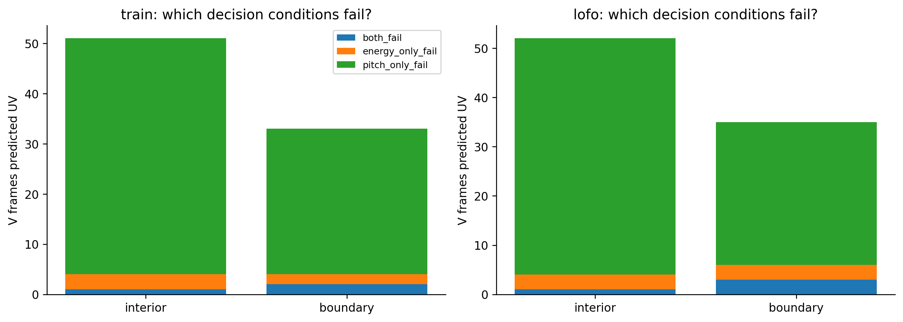
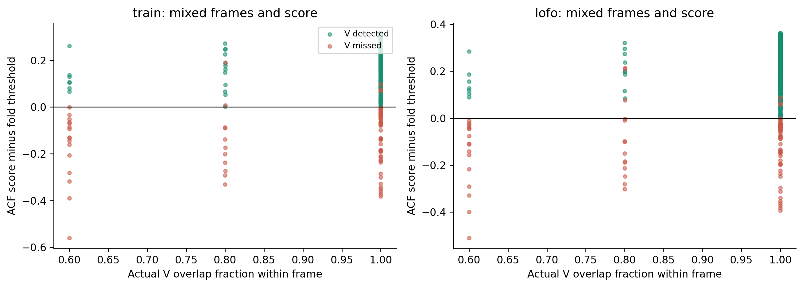

# Chẩn đoán V bị bỏ sót trước H12

Cùng accepted ACF và fold fit. Chỉ đọc train. Không đổi nhãn hoặc metric. Boundary là tâm cách endpoint nhỏ hơn half-window.

## Điều kiện thất bại

| split | boundary | reason | false_negative_frames |
| --- | --- | --- | --- |
| lofo | False | both_fail | 1 |
| lofo | False | energy_only_fail | 3 |
| lofo | False | pitch_only_fail | 48 |
| lofo | True | both_fail | 3 |
| lofo | True | energy_only_fail | 3 |
| lofo | True | pitch_only_fail | 29 |
| train | False | both_fail | 1 |
| train | False | energy_only_fail | 3 |
| train | False | pitch_only_fail | 47 |
| train | True | both_fail | 2 |
| train | True | energy_only_fail | 2 |
| train | True | pitch_only_fail | 29 |

## Hàng xóm thời gian

| split | boundary | fn | isolated_mask_gaps | previous_voiced | following_voiced |
| --- | --- | --- | --- | --- | --- |
| lofo | False | 52 | 15 | 28 | 25 |
| lofo | True | 35 | 2 | 6 | 14 |
| train | False | 51 | 16 | 27 | 25 |
| train | True | 33 | 2 | 5 | 13 |

## Cửa sổ trộn nhãn

| split | label | boundary | frames | mean_v_fraction | mean_uv_fraction | mean_sil_fraction |
| --- | --- | --- | --- | --- | --- | --- |
| lofo | sil | False | 483 | 0 | 0 | 1 |
| lofo | sil | True | 14 | 0.114351 | 0.0571105 | 0.799935 |
| lofo | uv | False | 121 | 0 | 1 | 0 |
| lofo | uv | True | 59 | 0.206803 | 0.776233 | 0.0169645 |
| lofo | v | False | 548 | 1 | 0 | 0 |
| lofo | v | True | 66 | 0.790875 | 0.18792 | 0.0212052 |
| train | sil | False | 483 | 0 | 0 | 1 |
| train | sil | True | 14 | 0.114351 | 0.0571105 | 0.799935 |
| train | uv | False | 121 | 0 | 1 | 0 |
| train | uv | True | 59 | 0.206803 | 0.776233 | 0.0169645 |
| train | v | False | 548 | 1 | 0 | 0 |
| train | v | True | 66 | 0.790875 | 0.18792 | 0.0212052 |

Đây là logical failure attribution: score thấp, RMS thấp hoặc cả hai. Nó không xác định phoneme, không chứng minh label sai, không có frame pitch GT. Hysteresis chỉ cứu được một số score thấp gần voiced run nếu vẫn pass RMS; không cứu mọi FN.

~~~powershell
python research_workbench_2026_10_06/voicing_diagnostic.py
~~~
