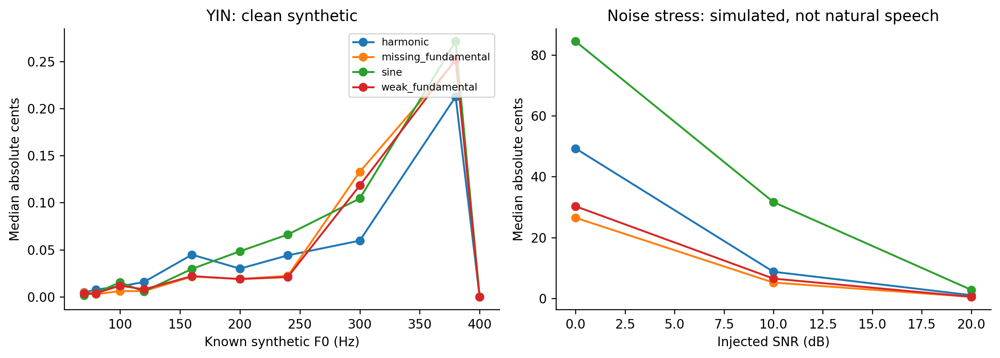
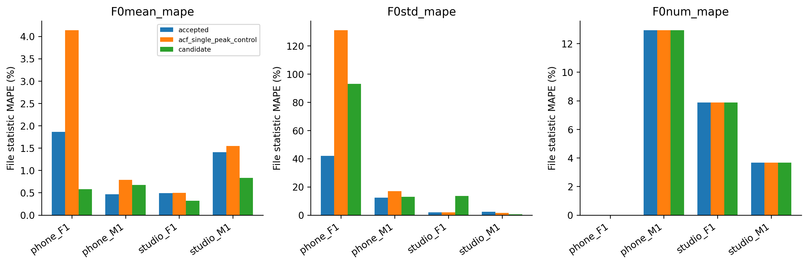
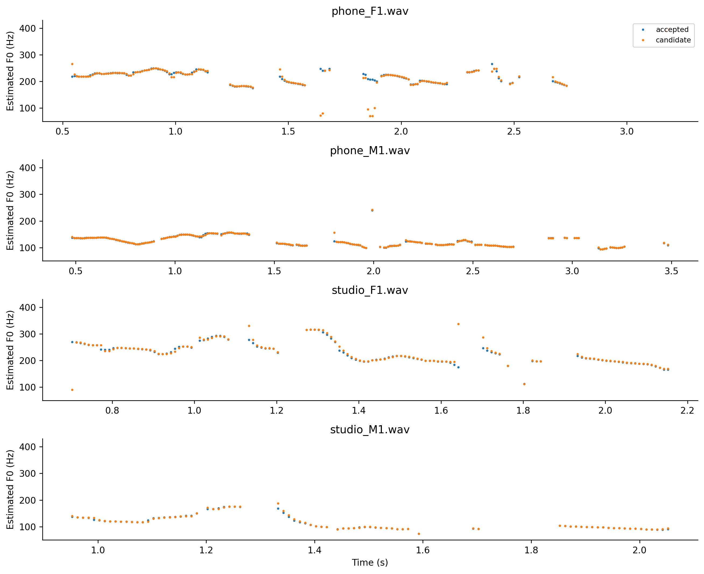

# YIN — thí nghiệm pitch estimator

Train-only; same frame25/hop10, ACF mask/RMS fold fit, median3. Fixed parameter, không tune/test. Accepted champion giữ nguyên.

## Số đo

| model | split | average_mape | F0mean_mape | F0std_mape | F0num_mape | F0mean_abs_error | F0std_abs_error | macro_f1 | balanced_accuracy | recall_v | recall_uv | TP | TN | FP | FN | false_voiced_sil | F0num |
| --- | --- | --- | --- | --- | --- | --- | --- | --- | --- | --- | --- | --- | --- | --- | --- | --- | --- |
| accepted | train | 6.17797 | 0.583562 | 11.3078 | 6.64251 | 0.854436 | 2.33158 | 0.850371 | 0.900215 | 0.869123 | 0.931306 | 530 | 167 | 13 | 84 | 1 | 544 |
| accepted | lofo | 7.27924 | 1.05571 | 14.6661 | 6.1159 | 1.84025 | 3.0133 | 0.841398 | 0.893149 | 0.865862 | 0.920437 | 527 | 164 | 16 | 87 | 3 | 546 |
| acf_single_peak_control | train | 14.6133 | 1.97526 | 35.222 | 6.64251 | 3.82444 | 7.40018 | 0.850371 | 0.900215 | 0.869123 | 0.931306 | 530 | 167 | 13 | 84 | 1 | 544 |
| acf_single_peak_control | lofo | 15.234 | 1.7409 | 37.8452 | 6.1159 | 3.20947 | 7.73108 | 0.841398 | 0.893149 | 0.865862 | 0.920437 | 527 | 164 | 16 | 87 | 3 | 546 |
| candidate | train | 9.36736 | 0.712207 | 20.7473 | 6.64251 | 1.16743 | 4.5885 | 0.850371 | 0.900215 | 0.869123 | 0.931306 | 530 | 167 | 13 | 84 | 1 | 544 |
| candidate | lofo | 12.2374 | 0.599519 | 29.9966 | 6.1159 | 0.944427 | 6.60807 | 0.841398 | 0.893149 | 0.865862 | 0.920437 | 527 | 164 | 16 | 87 | 3 | 546 |

## Validation synthetic

~~~json
{
  "silence_returns_nan": true,
  "constant_returns_nan": true,
  "gain_invariance": true,
  "dc_invariance": true,
  "fft_direct_difference_max_error": 4.263256414560601e-13,
  "clean_interior_median_cents": 0.029224275423532203,
  "clean_interior_p95_cents": 0.4748415859068376
}
~~~

## Gate đăng ký trước

~~~json
{
  "checks": {
    "train_mape_relative_10_percent": false,
    "lofo_mape_relative_5_percent": false,
    "lofo_f1_drop_at_most_01": true,
    "lofo_recall_v_drop_at_most_01": true,
    "lofo_sil_increase_at_most_1": true,
    "lofo_no_file_mape_worse_by_over_2pp": false,
    "lofo_phone_f1_std_not_worse": false
  },
  "eligible": false,
  "nested_status": "No newly tuned parameter: fixed candidate evaluated by LOFO; no distinct inner selection estimate.",
  "champion_promoted": false
}
~~~

Không có bước chọn tham số bên trong cho model fixed này, nên LOFO là đánh giá held-file; không tạo thêm nested score bằng việc chạy lại giống nhau. Với model tune tiếp theo, phải nested selection thật. Dữ liệu train đã dùng chọn champion trước đây, n=4 nên kết quả thăm dò.

## Tái lập

~~~powershell
python research_workbench_2026_10_06/estimator_experiment.py yin
~~~

## Figures

Không thay thế kết quả trên WAV thật; đây là kiểm tra thuật toán trong25ms.

Cùng voiced mask/RMS/median3. Chỉ bốn file; không có pitch GT từng khung.

Không phải đường truth, không kết luận contour mượt là đúng.
