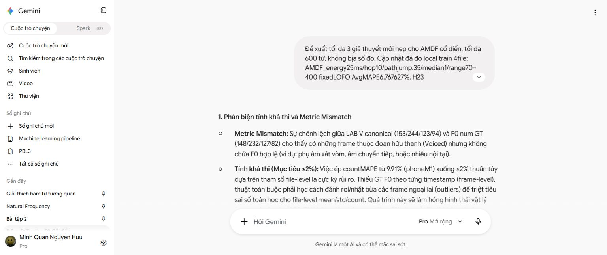

# Phản biện sau H24/H25

Gemini được hỏi trước khi đo H25, trong cuộc hội thoại https://gemini.google.com/app/7d333d9203907dd2. UI mode Pro Mở rộng; không suy ra model backend. Prompt thực: GEMINI_H24_SENT_PROMPT.txt; phản hồi DOM giữ công thức: GEMINI_H24_RESPONSE_DOM.txt; bằng chứng UI: figures/gemini_h24_review_proof.jpg. Không uploadWAV. Model chỉ nhận số đo và giới hạn trong prompt.

Ba hướng Gemini đề xuất: pre-emphasis y[n]=x[n]−αx[n−1], α.93/.95/.97; dip/maxAMDF ratio với threshold.3/.4/.5; median đặc trưng trước Logistic3/5frame. Đó là ý tưởng chưa được đo, không phải kết quả, số H26–H28 trong phản hồi không tự trở thành registry của repository.

Đối chiếu của agent:

- AMDF(0)=0, không phải max ở0. NAMDF hiện tại đã chuẩn hóa biên độ; dipratio không thể được mô tả đơn giản là bổ sung chuẩn hóa chưa có. Chưa chấp nhận hướng này.
- Chênh V-label count và F0num không chứng minh phoneme/nhiễu nào gây ra. Protocol thống kê của giáo viên còn chưa rõ; không gán nguyên nhân do phụ âm hoặc loại frame theoF0numGT của held.
- Average MAPE≤2% không yêu cầu riêng countMAPE≤2%; cần tổng ba error≤6% mỗifile. Không gọi thống kê thật trong LAB là pseudoGT; output của thuật toán mới là chưa được xác minh bằng F0timestamptruth.
- Không có bằng chứng mục tiêu2% bắt buộc làm hỏng contour; cũng chưa có bằng chứng bảo đảm đạt. Giữ mục tiêu, báo cảV/UV/SIL và giới hạn n4/history.
- α cố định có response vật lý khác giữa16k/44.1k; nếu thử pre-emphasis sẽ đăng ký quy tắc fs-aware và chỉ đổi ứng viênpitch, không gộp thêmgateclassifier.
- Chưa đo flicker của H25, vì vậy median chỉ là giả thuyết. Không sửa runner hoặc ngưỡng H25 sau đo.

Jev đã tham gia một lần sau H25 để cân nhắc shortlist còn chưa chọn: pitchpreemphasis, thêm ACFperiodicity vào LR_AMDF, median đặc trưng, none. Input/rawoutput đầy đủ: JEV_AFTER_H25.json. Request d782c6ab-5a86-41b5-9e0b-ed06a074bd4e,1call,2564input/130outputtokens,358ms, khôngretry. Code xác minh choice/fitsIDs có tronginput.

Jev chọn explicit IDnone(relative.35), trong khi fitpreemphasis.67, fitjoint.63, fitmedian.59, fitnone.65 và tool-level abstentionnone.05. Những tín hiệu này chưa có thứ tự ưu tiên rõ, không calibrated. Không suy thành cấm thử hoặc xác nhận một thuật toán tốt; agent sẽ dùng phép chẩn đoán khung độc lập để quyết định.

Code chẩn đoán actualH24gate: phone_M1 có40V bị loại chỉ do pitchgate và1do cảpitch/energy; phone_F1 có13pitchonly/1both; studioF1 có5pitchonly/2energyonly/1both; studioM1 có11pitchonly/4energyonly/1both. Đây là attribution theo code, không chứng minh ground-truth F0 từngkhung. Hướng kế tiếp ưu tiên bằng chứng tuần hoàn bổ sung cho decision; pre-emphasis còn nằm trong backlog.

