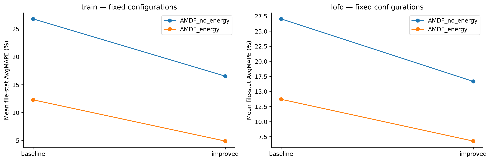

# Vì sao báo cáo gần đây tạo cảm giác không có cải thiện và bỏ qua AMDF?

Các vòng H18–H22 tập trung vào ACF và logistic, không cập nhật notebook AMDF. Đó là thiếu sót về phạm vi công việc và cách báo cáo. “Chưa đạt toàn bộ điều kiện để thay cấu hình hiện tại” đã được nhấn mạnh quá mức, làm mờ các chỉ số có cải thiện và những cải tiến AMDF đã có từ trước.

## 1. Có cải thiện so với bản cũ

AMDF đo sai khác tuyệt đối khi dịch tín hiệu; đáy thấp gợi ý chu kỳ lặp. Cổng năng lượng dùng RMS để loại khung quá nhỏ trước nhận hữu thanh. Path chọn một chuỗi ứng viên F0, có phạt bước nhảy để hạn chế nhảy giữa chu kỳ và bội chu kỳ.

Notebook mới tính lại các số sau trực tiếp bằng WAV train hiện tại và kiểm tra khớp dữ liệu đã lưu trong1e-8:

| Nhánh | Train AvgMAPE trước → sau | Fixed LOFO trước → sau |
|---|---:|---:|
| AMDF không energy | 26.784050 → 16.514426% | 27.030428 → 16.659552% |
| AMDF có energy | 12.270267 → 4.876259% | 13.695884 → 6.767627% |

Train học/chấm cùng bốn file; fixed LOFO giữ một file và học ngưỡng từ ba file khác, nhưng giữ cấu hình từng được chọn trên những file này. Đây là cải thiện trên protocol đã nêu, không phải chứng nhận mọi F0 đều đúng hoặc corpus chưa từng xem.

Ở nhánh có energy, baseline và improved đều có cổng năng lượng. Sự khác nhau chính trong so sánh đó là chọn đường ứng viên thay cho đáy riêng khung; không gọi12.27→4.88 là tác động riêng của việc thêm energy gate. Classification và count của nhánh này giữ nguyên giữa trước/sau, còn stdMAPE train giảm28.962627→7.489567%.

Nhánh không energy còn đổi phương pháp ngưỡng và có đánh đổi: macroF1 train0.872079→0.858014; SIL dự đoán hữu thanh còn46khung. Cấu hình giảm MAPE không tự giải quyết mọi lỗi phân lớp.

## 2. Có cải thiện mới, nhưng chưa thay cấu hình

H23 mới thử AMDF20/25/40ms, không ghép thay filter/classifier. Kết quả fixed LOFO trên grid chấm chung25/10:

| Frame | AvgMAPE file-stat | StdMAPE bình quân file | MacroF1 | RecallV |
|---|---:|---:|---:|---:|
| 20ms | 11.302094% | 19.792025% | 0.817773 | 0.820122 |
| 25ms, control | 6.767627% | 12.855443% | 0.864626 | 0.876303 |
| 40ms | 5.632639% | 5.814854% | 0.840410 | 0.847026 |

40ms giảm AvgMAPE16.77% tương đối và giảm stdMAPE bình quân rõ rệt. Phone_F1stdMAPE36.290329→1.112054%; phone_M1AvgMAPE lại5.003046→10.686380%. RecallV bình quân giảm khoảng2.93điểm phần trăm. Native coverage40ms bình quân99.6817%, không sửa output hoặc GT để che phần biên thiếu hỗ trợ.

Điều kiện nghiệm thu đã đăng ký yêu cầu vừa giảm MAPE vừa giữ F1/recall và không làm một file xấu thêm quá2điểm phần trăm. Đó là lựa chọn đánh giá của quy trình nghiên cứu này, không phải định luật rằng một cấu hình vi phạm gate là vô ích. Với những điều kiện đó, inner selections H23 chọn25ms ởfinal vàmọiouter; nested giữ6.767627%. Lưu40ms như ứng viên có đánh đổi, chưa promote.

Các điểm selected LOFO của ACF cũng từng giảm, ví dụ H18 xuống3.41%, nhưng quy trình chọn khi giữ file ngoài đánh giá8.30%. Hai con số trả lời khác câu hỏi. Có ít file và nhiều lựa chọn làm việc chọn cấu hình biến động; chưa đủ bằng chứng quy toàn bộ chênh lệch cho một nguyên nhân duy nhất.

## 3. Notebook nào thực sự được sửa/chạy?

- `BT2_AMDF_implement_executed_original - Copy.ipynb` và notebook baseline được giữ nguyên trong lượt này. Không nhận các script ACF là sửa notebook AMDF.
- Các bản cải tiến AMDF đã tồn tại trong `research_3gt_2026_10_05/deliverables/`, cùng bản output trong `executed_local/`. Source còn mã Colab/Drive và cell test; executor cũ thay đường dẫn trong bộ nhớ, metadata ghi rõ điều đó. Không chạy lại các bản này trong lượt mới.
- [AMDF_LOCAL_TRAIN.ipynb](AMDF_LOCAL_TRAIN.ipynb) là bản mới có source local, bảng cả hai nhánh trước/sau, curve AMDF thực và H23. Cả6codecells đã chạy nguyên source bằng Python với adapter hiển thị; không thay đường dẫn ngầm, không có cell đọc test. Đây là chạy các codecells trực tiếp, chưa phải chạy bằng Jupyter kernel.

Verifier kiểm tra source hash khớp output, đủ execution counts, không error,32dòng per-file và mọi summary, phát lại lựa chọn H23 từ48innertraces, tính lại nested counts/std/MAPE/labels và kiểm tra source/figure hashes. Có notebook output thực và PNG/SVG ngoài notebook.

## 4. Điều chỉnh hướng tiếp theo

Ưu tiên AMDF thay vì mở tiếp một grid ACF. Trước vòng mới, xem các khung mất V và ứng viên lag của phone_M1/studio_M1 ở40ms. Một giả thuyết có thể đăng ký tiếp là tách cửa sổ phân lớp V/UV và cửa sổ tìm F0; chưa chạy hoặc khẳng định hiệu quả. Báo ứng viên giảm std/MAPE cùng đánh đổi, không chỉ một nhãn PASS/FAIL. Không hạ gate sau thấy kết quả để biến cùng thí nghiệm thành thành công.

Nguồn thực nghiệm: [notebook summary](results/AMDF_notebook_summary.csv), [bảng từngfile](results/AMDF_notebook_per_file.csv), [H23 đầy đủ](H23_REPORT.md), [fixedframe CSV](results/H23_fixed_frame_lofo.csv), [receipt](results/AMDF_notebook_verification.json). Các LAB là thống kê file/nhãn đoạn, không F0 chuẩn từng timestamp.
