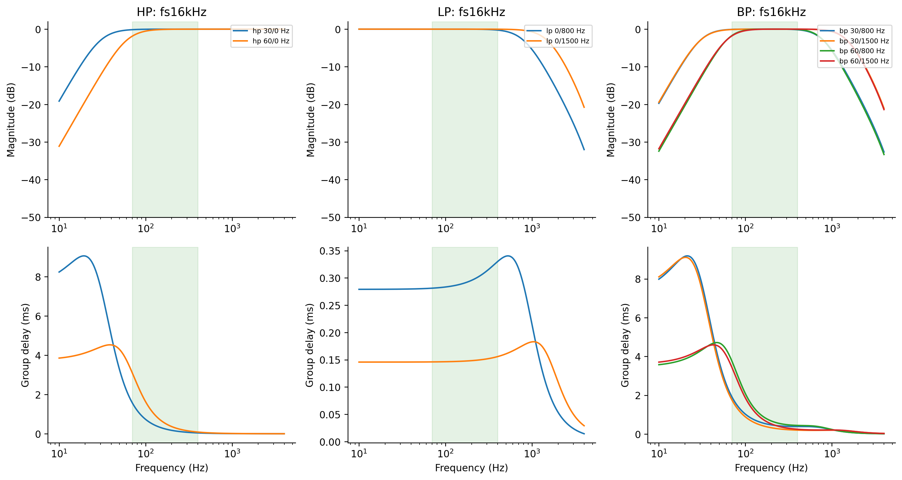
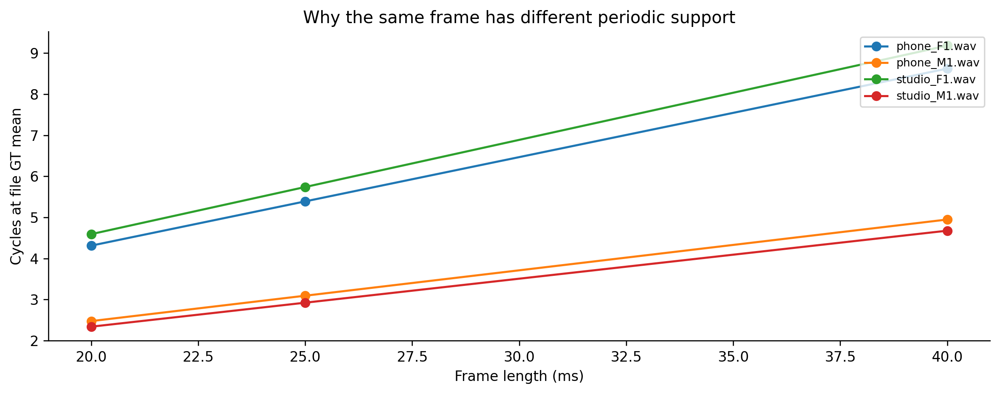

# Hiểu bộ lọc, frame/hop và nhóm F/M

High-pass giảm thành phần dưới cutoff; low-pass giảm phần trên cutoff; band-pass giữ một dải. Cutoff Butterworth là điểm gain−3dB, không phải bức tường cắt tuyệt đối. N2 dùng SOS để ổn định số; band-pass từ prototypeN2 có order thực4.

Lọc causal dùng quá khứ và trạng thái filter, có group delay phụ thuộc tần số. Lọc tiến–lùi zero-phase dùng cả tương lai trong file, magnitude bị bình phương; không thể nói giữ nguyên mọi dạng sóng. Phase/transient/boundary cần đối chiếu trong thí nghiệm riêng.

Frame là cửa sổ tín hiệu dùng tìm chu kỳ. Hop là khoảng cách giữa hai lần tìm. Frame dài chứa nhiều chu kỳ hơn nhưng trộn chuyển tiếp nhiều hơn; hop nhỏ cho đường đi dày hơn nhưng không tự tạo thêm người nói hoặc dữ liệu độc lập.

| file | file_group | frame_ms | file_gt_mean_hz | cycles_at_file_gt_mean | cycles_at_range_min_70hz |
| --- | --- | --- | --- | --- | --- |
| phone_F1.wav | F | 20 | 215.6 | 4.312 | 1.4 |
| phone_F1.wav | F | 25 | 215.6 | 5.39 | 1.75 |
| phone_F1.wav | F | 40 | 215.6 | 8.624 | 2.8 |
| phone_M1.wav | M | 20 | 123.7 | 2.474 | 1.4 |
| phone_M1.wav | M | 25 | 123.7 | 3.0925 | 1.75 |
| phone_M1.wav | M | 40 | 123.7 | 4.948 | 2.8 |
| studio_F1.wav | F | 20 | 229.6 | 4.592 | 1.4 |
| studio_F1.wav | F | 25 | 229.6 | 5.74 | 1.75 |
| studio_F1.wav | F | 40 | 229.6 | 9.184 | 2.8 |
| studio_M1.wav | M | 20 | 116.9 | 2.338 | 1.4 |
| studio_M1.wav | M | 25 | 116.9 | 2.9225 | 1.75 |
| studio_M1.wav | M | 40 | 116.9 | 4.676 | 2.8 |

Các file M có meanGT116.9/123.7Hz, F215.6/229.6Hz. Đây là dữ liệu bốn file theo tên, không là quy tắc sinh học tổng quát. 20ms ở70Hz chỉ có1.4chu kỳ, 40ms có2.8; vẫn chưa chứng minh estimator đúng từngkhung.

Logistic regression là classifier cổ điển học cách kết hợp ACFscore và năng lượng để quyết định V/UV. C điều chỉnh regularization; C lớn giảm mức phạt hệ số. Nó không tự tạo reference F0. Threshold.5 đang giữ để giới hạn grid trước đo.

Hard clipping cắt đỉnh vượt giới hạn biên độ. Center clipping bỏ phần gầnzero nhằm làm rõ tính tuần hoàn trướcACF; hai thao tác có tác dụng khác nhau và không được gọi chung như đã cùng thử.

Chọn grid bằng innerLOFO, đánh giá quy trình bằng outerLOFO; không chọn bằngtest. Count native phụ thuộc hop, vì vậy H18/H19 có grid chấm chung và lưu nativecount riêng.

Nguồn API: [SciPy butter](https://docs.scipy.org/doc/scipy/reference/generated/scipy.signal.butter.html), [sosfilt](https://docs.scipy.org/doc/scipy/reference/generated/scipy.signal.sosfilt.html). Các curve và chu kỳ ở đây là phép tính từ filter/GTfile, không là số đo pitch accuracy.
