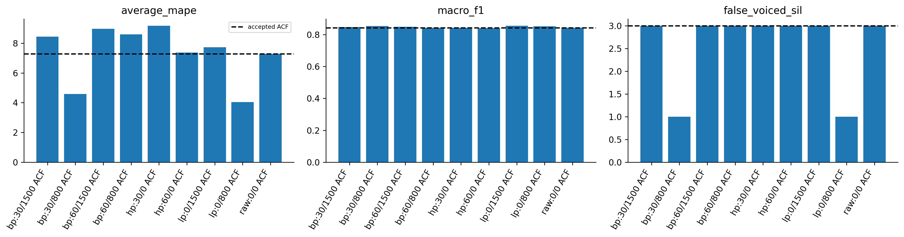
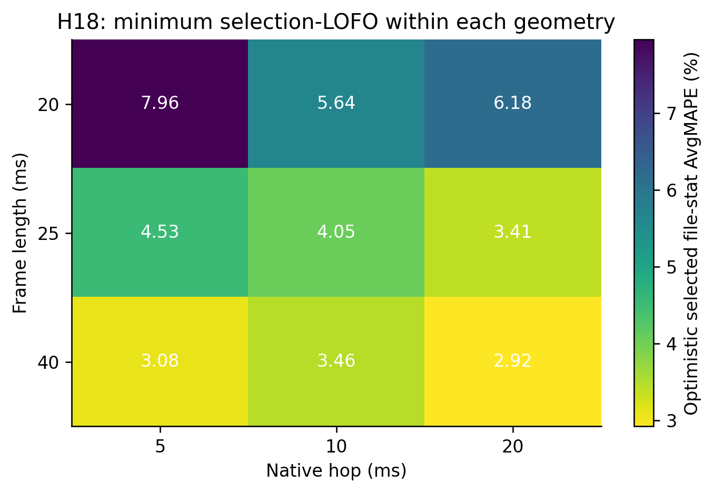

# H18 — đọc từng bộ lọc và geometry trong grid

Slice25/10 là phép đối chiếu để đọc một biến, không khóa thuật toán ở25/10. Toàn grid đã có20/25/40ms vàhop5/10/20ms. Các slice dùng threshold/scaler fit other3, cùng canonical grid chấm.

| option_id | average_mape | F0std_mape | macro_f1 | recall_v | recall_uv | false_voiced_sil |
| --- | --- | --- | --- | --- | --- | --- |
| bp_30_1500_f25_h10 | 8.42908 | 17.5453 | 0.846713 | 0.863424 | 0.939378 | 3 |
| bp_30_800_f25_h10 | 4.58715 | 4.91561 | 0.852963 | 0.863441 | 0.961066 | 1 |
| bp_60_1500_f25_h10 | 8.96796 | 20.0125 | 0.848218 | 0.867911 | 0.936164 | 3 |
| bp_60_800_f25_h10 | 8.59066 | 18.1175 | 0.842102 | 0.862212 | 0.936573 | 3 |
| hp_30_0_f25_h10 | 9.16637 | 19.97 | 0.841676 | 0.862788 | 0.927683 | 3 |
| hp_60_0_f25_h10 | 7.37217 | 15.096 | 0.84033 | 0.865644 | 0.916404 | 3 |
| lp_0_1500_f25_h10 | 7.71561 | 17.3961 | 0.854889 | 0.878167 | 0.920897 | 3 |
| lp_0_800_f25_h10 | 4.0464 | 4.41789 | 0.851669 | 0.867733 | 0.947443 | 1 |
| raw_0_0_f25_h10 | 7.27924 | 14.6661 | 0.841398 | 0.865862 | 0.920437 | 3 |

Bảng toàn grid và guards trong results. Không lấy configuration đẹp nhất từ bảng để gọi là generalization đã xác minh; so báo cáo nested của family. Không tune bằngtest. Tên F/M không dùng chọnrange.
