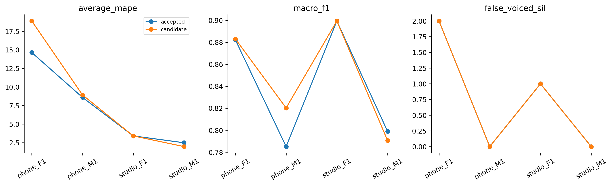

# H18 — tuning có vòng chọn bên trong

| model | split | average_mape | F0mean_mape | F0std_mape | F0num_mape | F0mean_abs_error | F0std_abs_error | macro_f1 | balanced_accuracy | recall_v | recall_uv | TP | TN | FP | FN | false_voiced_sil | F0num |
| --- | --- | --- | --- | --- | --- | --- | --- | --- | --- | --- | --- | --- | --- | --- | --- | --- | --- |
| accepted | train | 6.17797 | 0.583562 | 11.3078 | 6.64251 | 0.854436 | 2.33158 | 0.850371 | 0.900215 | 0.869123 | 0.931306 | 530 | 167 | 13 | 84 | 1 | 544 |
| accepted | lofo | 7.27924 | 1.05571 | 14.6661 | 6.1159 | 1.84025 | 3.0133 | 0.841398 | 0.893149 | 0.865862 | 0.920437 | 527 | 164 | 16 | 87 | 3 | 546 |
| accepted | nested | 7.27924 | 1.05571 | 14.6661 | 6.1159 | 1.84025 | 3.0133 | 0.841398 | 0.893149 | 0.865862 | 0.920437 | 527 | 164 | 16 | 87 | 3 | 546 |
| candidate | train | 5.28299 | 1.16964 | 7.31351 | 7.36584 | 1.82455 | 1.33998 | 0.8468 | 0.900455 | 0.864702 | 0.936208 | 533 | 170 | 10 | 81 | 1 | 544 |
| candidate | lofo | 3.40987 | 0.739897 | 2.97193 | 6.5178 | 1.26066 | 0.638002 | 0.840526 | 0.888384 | 0.868208 | 0.90856 | 537 | 166 | 14 | 77 | 2 | 553 |
| candidate | nested | 8.29586 | 0.845097 | 18.5218 | 5.5207 | 1.42887 | 3.80401 | 0.848301 | 0.895925 | 0.875694 | 0.916156 | 534 | 166 | 14 | 80 | 3 | 551 |

## Tiêu chí đã đăng ký

~~~json
{
  "checks": {
    "train_mape_relative_10_percent": true,
    "lofo_mape_relative_5_percent": false,
    "lofo_f1_drop_at_most_01": true,
    "lofo_recall_v_drop_at_most_01": true,
    "lofo_sil_increase_at_most_1": true,
    "lofo_no_file_mape_worse_by_over_2pp": false,
    "lofo_phone_f1_std_not_worse": false,
    "selected_lofo_mape_relative_5_percent": true
  },
  "eligible": false,
  "nested_status": "Outer file excluded from every inner fit and selection; selected LOFO is separate.",
  "champion_promoted": false
}
~~~

## Lựa chọn theo fold

| outer_held | id | kind | low_hz | high_hz | frame_ms | hop_ms | C |
| --- | --- | --- | --- | --- | --- | --- | --- |
| final | bp_30_800_f25_h20 | bp | 30 | 800 | 25 | 20 | None |
| phone_F1.wav | bp_60_800_f25_h10 | bp | 60 | 800 | 25 | 10 | None |
| phone_M1.wav | bp_30_800_f25_h10 | bp | 30 | 800 | 25 | 10 | None |
| studio_F1.wav | raw_0_0_f25_h10 | raw | 0 | 0 | 25 | 10 | None |
| studio_M1.wav | bp_30_1500_f25_h20 | bp | 30 | 1500 | 25 | 20 | None |

Giữ champion; các kết quả không đạt cũng được lưu. Selected LOFO có ảnh hưởng lựa chọn, đọc nested để đánh giá quy trình. Registry được đề xuất sau lịch sử đã xem bốn file nên nested vẫn là thăm dò.

Chấm trên cùng grid baseline25/10, native hop được thay đổi thật. Nearest center trong half-hop, ngoài hỗ trợ là abstention; không nội suy F0 qua khoảng vô thanh. Count trên grid này là output đại diện để đối chiếu 3GT cũ, không phải contour GT mới. Xem nativecount/projection coverage trong CSV.

RMS lấy từ raw frame; bộ lọc chỉ tác động pitch features. SOS causal initial-rest, không bù phase delay theo nhãn; transient/boundary có thể ảnh hưởng. Median3 và jump giữ cố định nên thay hop cũng thay thời gian smoothing; không kết luận nhân quả riêng từ cấu hình joint.

Lệnh: `python research_workbench_2026_10_07/tuning.py H18`

Nguồn thiết kế: [SciPy butter](https://docs.scipy.org/doc/scipy/reference/generated/scipy.signal.butter.html), [sosfilt](https://docs.scipy.org/doc/scipy/reference/generated/scipy.signal.sosfilt.html). Phiên bản thực được lưu trong JSON.
