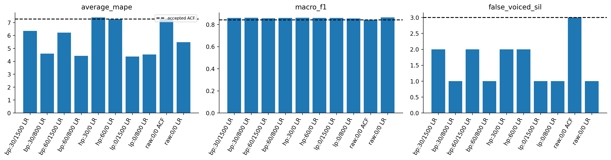
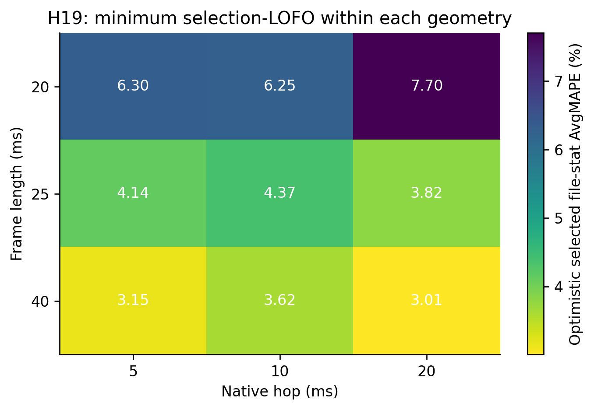

# H19 — đọc từng bộ lọc và geometry trong grid

Slice25/10 là phép đối chiếu để đọc một biến, không khóa thuật toán ở25/10. Toàn grid đã có20/25/40ms vàhop5/10/20ms. Các slice dùng threshold/scaler fit other3, cùng canonical grid chấm.

| option_id | average_mape | F0std_mape | macro_f1 | recall_v | recall_uv | false_voiced_sil |
| --- | --- | --- | --- | --- | --- | --- |
| bp_30_1500_f25_h10_lr1 | 6.35449 | 10.4665 | 0.858624 | 0.881829 | 0.924265 | 2 |
| bp_30_800_f25_h10_lr1 | 4.58628 | 4.74433 | 0.860412 | 0.879586 | 0.934682 | 1 |
| bp_60_1500_f25_h10_lr1 | 6.21767 | 9.73942 | 0.856649 | 0.879974 | 0.924265 | 2 |
| bp_60_800_f25_h10_lr1 | 4.41636 | 4.24078 | 0.858339 | 0.879365 | 0.930649 | 1 |
| hp_30_0_f25_h10_lr1 | 7.39184 | 13.6208 | 0.86025 | 0.87978 | 0.934265 | 2 |
| hp_60_0_f25_h10_lr1 | 7.26802 | 13.4892 | 0.859217 | 0.880389 | 0.930642 | 2 |
| lp_0_1500_f25_h10_lr1 | 4.36717 | 4.62065 | 0.859499 | 0.882854 | 0.924265 | 1 |
| lp_0_800_f25_h10_lr1 | 4.53075 | 4.92033 | 0.853722 | 0.875292 | 0.924265 | 1 |
| raw_0_0_f25_h10 | 7.27924 | 14.6661 | 0.841398 | 0.865862 | 0.920437 | 3 |
| raw_0_0_f25_h10_lr1 | 5.47073 | 8.34004 | 0.863433 | 0.884072 | 0.934265 | 1 |

Bảng toàn grid và guards trong results. Không lấy configuration đẹp nhất từ bảng để gọi là generalization đã xác minh; so báo cáo nested của family. Không tune bằngtest. Tên F/M không dùng chọnrange.
