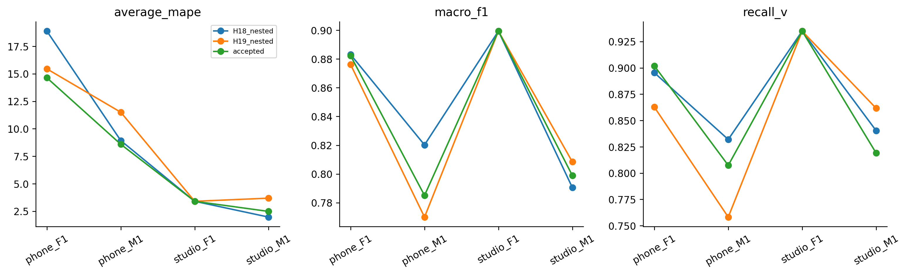
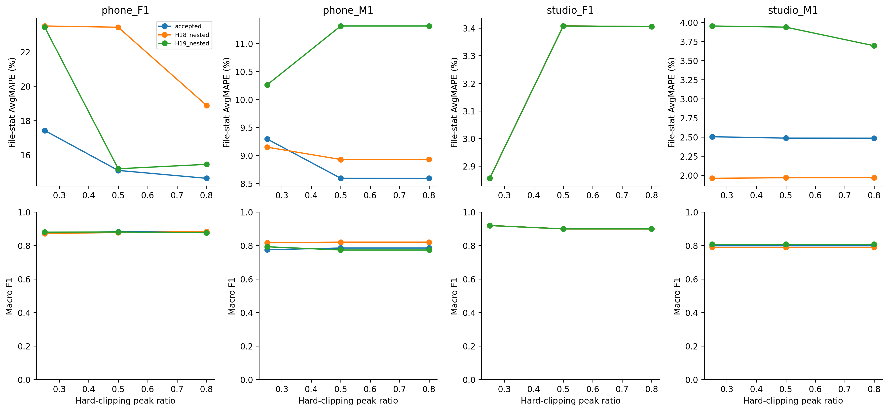

# H20 — nhóm F/M, phone/studio và clipping/noise sau freeze

F/M chỉ là tên file, mỗi nhóm2file, mỗi ô F/M × thiết bị1file. Không đủ phân biệt ảnh hưởng người nói, giới, thiết bị và sample rate. Không fit threshold theo nhãn giới.

## Clean outer results

| file | model | gt_mean_hz | F0mean | gt_std_hz | F0std | average_mape | macro_f1 | recall_v | recall_uv | false_voiced_sil |
| --- | --- | --- | --- | --- | --- | --- | --- | --- | --- | --- |
| phone_F1.wav | accepted | 215.6 | 219.617 | 20.6 | 29.2614 | 14.6363 | 0.882228 | 0.901961 | 0.884058 | 2 |
| phone_F1.wav | H18_nested | 215.6 | 218.155 | 20.6 | 31.7468 | 18.8824 | 0.883048 | 0.895425 | 0.898551 | 2 |
| phone_M1.wav | accepted | 123.7 | 124.271 | 16.8 | 18.8794 | 8.5901 | 0.785078 | 0.807377 | 0.919355 | 0 |
| phone_M1.wav | H18_nested | 123.7 | 124.427 | 16.8 | 19.2451 | 8.9267 | 0.820214 | 0.831967 | 0.967742 | 0 |
| studio_F1.wav | accepted | 229.6 | 228.471 | 36.8 | 37.4817 | 3.406 | 0.899353 | 0.934959 | 0.958333 | 1 |
| studio_F1.wav | H18_nested | 229.6 | 228.471 | 36.8 | 37.4817 | 3.406 | 0.899353 | 0.934959 | 0.958333 | 1 |
| studio_M1.wav | accepted | 116.9 | 115.256 | 26.4 | 25.7693 | 2.48454 | 0.798933 | 0.819149 | 0.92 | 0 |
| studio_M1.wav | H18_nested | 116.9 | 115.596 | 26.4 | 27.3425 | 1.96836 | 0.79059 | 0.840426 | 0.84 | 0 |
| phone_F1.wav | H19_nested | 215.6 | 213.115 | 20.6 | 28.2406 | 15.4503 | 0.876102 | 0.862745 | 0.942029 | 0 |
| phone_M1.wav | H19_nested | 123.7 | 125.769 | 16.8 | 18.9143 | 11.5055 | 0.770033 | 0.758197 | 1 | 0 |
| studio_F1.wav | H19_nested | 229.6 | 228.471 | 36.8 | 37.4817 | 3.406 | 0.899353 | 0.934959 | 0.958333 | 1 |
| studio_M1.wav | H19_nested | 116.9 | 114.484 | 26.4 | 24.9882 | 3.69104 | 0.808446 | 0.861702 | 0.84 | 0 |

## Tỷ lệ clipping thật được tạo trong mô phỏng

| file | ratio | threshold | sample_clipped_fraction | canonical_frames_with_clipping | original_peak | original_rms | clipped_rms |
| --- | --- | --- | --- | --- | --- | --- | --- |
| phone_F1.wav | 0.8 | 0.705469 | 0.000347222 | 0.0248447 | 0.881836 | 0.122305 | 0.122216 |
| phone_F1.wav | 0.5 | 0.440918 | 0.0118441 | 0.173913 | 0.881836 | 0.122305 | 0.117765 |
| phone_F1.wav | 0.25 | 0.220459 | 0.0937693 | 0.381988 | 0.881836 | 0.122305 | 0.091984 |
| phone_M1.wav | 0.8 | 0.394189 | 1.5024e-05 | 0.00483092 | 0.492737 | 0.0438819 | 0.043867 |
| phone_M1.wav | 0.5 | 0.246368 | 0.00166767 | 0.111111 | 0.492737 | 0.0438819 | 0.0434311 |
| phone_M1.wav | 0.25 | 0.123184 | 0.0279297 | 0.335749 | 0.492737 | 0.0438819 | 0.0391563 |
| studio_F1.wav | 0.8 | 0.461157 | 2.37592e-05 | 0.0105634 | 0.576447 | 0.0543385 | 0.0543226 |
| studio_F1.wav | 0.5 | 0.288223 | 0.00106916 | 0.105634 | 0.576447 | 0.0543385 | 0.0539982 |
| studio_F1.wav | 0.25 | 0.144112 | 0.0366762 | 0.338028 | 0.576447 | 0.0543385 | 0.0484009 |
| studio_M1.wav | 0.8 | 0.548389 | 4.98339e-05 | 0.00738007 | 0.685486 | 0.0392781 | 0.0392188 |
| studio_M1.wav | 0.5 | 0.342743 | 0.000614618 | 0.0442804 | 0.685486 | 0.0392781 | 0.0388926 |
| studio_M1.wav | 0.25 | 0.171371 | 0.00940199 | 0.184502 | 0.685486 | 0.0392781 | 0.0360536 |

Hard clipping là cắt phần đỉnh vượt ±threshold, tạo waveform plateau và có thể thêm harmonics; center clipping là bỏ biên độ nhỏ gần zero trước ACF, sẽ cần thí nghiệm riêng. Dataset audit không thấy sample ở native int16 rails, nhưng không loại trừ analog clipping trước ghi hoặc compression.

## Stress tổng hợp

| kind | level | model | conditional_average_mape | macro_f1 | recall_v | false_voiced_sil | cases | finite | coverage |
| --- | --- | --- | --- | --- | --- | --- | --- | --- | --- |
| brown | 0 | H18_nested | 23.3184 | 0.833537 | 0.851902 | 31.6667 | 12 | 12 | 1 |
| brown | 0 | H19_nested | 22.4809 | 0.845632 | 0.865633 | 35 | 12 | 12 | 1 |
| brown | 0 | accepted | 74.7329 | 0.817894 | 0.839817 | 72.3333 | 12 | 12 | 1 |
| brown | 10 | H18_nested | 15.9647 | 0.848445 | 0.879545 | 17.3333 | 12 | 12 | 1 |
| brown | 10 | H19_nested | 14.5575 | 0.842131 | 0.867465 | 14.6667 | 12 | 12 | 1 |
| brown | 10 | accepted | 42.4079 | 0.840419 | 0.86855 | 34.3333 | 12 | 12 | 1 |
| brown | 20 | H18_nested | 10.7466 | 0.844085 | 0.882077 | 5.66667 | 12 | 12 | 1 |
| brown | 20 | H19_nested | 10.1397 | 0.836566 | 0.860922 | 4 | 12 | 12 | 1 |
| brown | 20 | accepted | 11.9968 | 0.838468 | 0.871903 | 7.33333 | 12 | 12 | 1 |
| clip_peak | 0.25 | H18_nested | 9.367 | 0.849691 | 0.878735 | 4 | 4 | 4 | 1 |
| clip_peak | 0.25 | H19_nested | 10.1286 | 0.850121 | 0.868906 | 2 | 4 | 4 | 1 |
| clip_peak | 0.25 | accepted | 8.01884 | 0.842333 | 0.868487 | 4 | 4 | 4 | 1 |
| clip_peak | 0.5 | H18_nested | 9.43375 | 0.846924 | 0.875694 | 4 | 4 | 4 | 1 |
| clip_peak | 0.5 | H19_nested | 8.46328 | 0.840429 | 0.857059 | 1 | 4 | 4 | 1 |
| clip_peak | 0.5 | accepted | 7.39517 | 0.841185 | 0.867496 | 3 | 4 | 4 | 1 |
| clip_peak | 0.8 | H18_nested | 8.29584 | 0.848301 | 0.875694 | 3 | 4 | 4 | 1 |
| clip_peak | 0.8 | H19_nested | 8.46578 | 0.83928 | 0.855425 | 1 | 4 | 4 | 1 |
| clip_peak | 0.8 | accepted | 7.27969 | 0.841398 | 0.865862 | 3 | 4 | 4 | 1 |
| pink | 0 | H18_nested | 30.3819 | 0.615403 | 0.535236 | 0.333333 | 12 | 12 | 1 |
| pink | 0 | H19_nested | 26.7907 | 0.625179 | 0.550083 | 0 | 12 | 12 | 1 |
| pink | 0 | accepted | 25.7979 | 0.547048 | 0.43547 | 0 | 12 | 12 | 1 |
| pink | 10 | H18_nested | 8.14714 | 0.811347 | 0.804241 | 0.333333 | 12 | 12 | 1 |
| pink | 10 | H19_nested | 9.03433 | 0.792138 | 0.779072 | 0 | 12 | 12 | 1 |
| pink | 10 | accepted | 7.89427 | 0.7911 | 0.77531 | 0 | 12 | 12 | 1 |
| pink | 20 | H18_nested | 6.29543 | 0.846246 | 0.866278 | 1 | 12 | 12 | 1 |
| pink | 20 | H19_nested | 7.66527 | 0.835621 | 0.841789 | 0.333333 | 12 | 12 | 1 |
| pink | 20 | accepted | 7.86557 | 0.844364 | 0.850103 | 1.33333 | 12 | 12 | 1 |
| white | 0 | H18_nested | 13.021 | 0.677854 | 0.622655 | 0 | 12 | 12 | 1 |
| white | 0 | H19_nested | 21.6915 | 0.565758 | 0.468006 | 0 | 12 | 12 | 1 |
| white | 0 | accepted | 28.8589 | 0.446592 | 0.29902 | 0 | 12 | 12 | 1 |
| white | 10 | H18_nested | 6.72336 | 0.820955 | 0.829991 | 0 | 12 | 12 | 1 |
| white | 10 | H19_nested | 9.92743 | 0.774771 | 0.75893 | 0 | 12 | 12 | 1 |
| white | 10 | accepted | 9.64582 | 0.769556 | 0.745049 | 0 | 12 | 12 | 1 |
| white | 20 | H18_nested | 7.42072 | 0.854804 | 0.876246 | 1.33333 | 12 | 12 | 1 |
| white | 20 | H19_nested | 8.32456 | 0.834286 | 0.840355 | 0 | 12 | 12 | 1 |
| white | 20 | accepted | 6.25934 | 0.840163 | 0.838385 | 0 | 12 | 12 | 1 |

Mean seeds trong từng file trước khi gộp; AvgMAPE có điều kiện và coverage cùng được báo. Không chấm undefined như0. H18/H19 dùng outer selection từ clean other3; không tune trên noise/clipping. Accepted khớp120case H15 cũ trong tolerance1e-8.

Lệnh: `python research_workbench_2026_10_07/stress.py`. CSV/manifest/selection hashes trong results. Test không mở trong vòng này.
