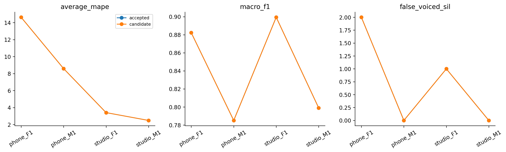
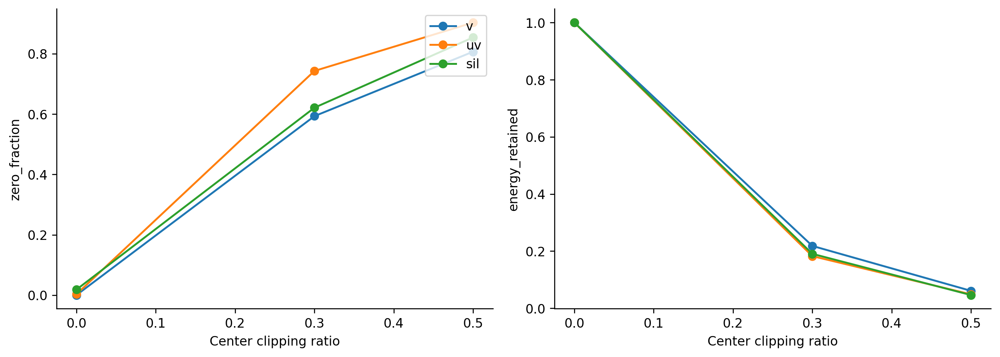

# H21 — center clipping có vòng chọn bên trong

| model | split | average_mape | F0mean_mape | F0std_mape | F0num_mape | F0mean_abs_error | F0std_abs_error | macro_f1 | balanced_accuracy | recall_v | recall_uv | TP | TN | FP | FN | false_voiced_sil | F0num |
| --- | --- | --- | --- | --- | --- | --- | --- | --- | --- | --- | --- | --- | --- | --- | --- | --- | --- |
| accepted | train | 6.17797 | 0.583562 | 11.3078 | 6.64251 | 0.854436 | 2.33158 | 0.850371 | 0.900215 | 0.869123 | 0.931306 | 530 | 167 | 13 | 84 | 1 | 544 |
| accepted | lofo | 7.27924 | 1.05571 | 14.6661 | 6.1159 | 1.84025 | 3.0133 | 0.841398 | 0.893149 | 0.865862 | 0.920437 | 527 | 164 | 16 | 87 | 3 | 546 |
| accepted | nested | 7.27924 | 1.05571 | 14.6661 | 6.1159 | 1.84025 | 3.0133 | 0.841398 | 0.893149 | 0.865862 | 0.920437 | 527 | 164 | 16 | 87 | 3 | 546 |
| candidate | train | 6.17797 | 0.583562 | 11.3078 | 6.64251 | 0.854436 | 2.33158 | 0.850371 | 0.900215 | 0.869123 | 0.931306 | 530 | 167 | 13 | 84 | 1 | 544 |
| candidate | lofo | 7.27924 | 1.05571 | 14.6661 | 6.1159 | 1.84025 | 3.0133 | 0.841398 | 0.893149 | 0.865862 | 0.920437 | 527 | 164 | 16 | 87 | 3 | 546 |
| candidate | nested | 7.27924 | 1.05571 | 14.6661 | 6.1159 | 1.84025 | 3.0133 | 0.841398 | 0.893149 | 0.865862 | 0.920437 | 527 | 164 | 16 | 87 | 3 | 546 |

## Tiêu chí đã đăng ký

~~~json
{
  "checks": {
    "train_mape_relative_10_percent": false,
    "lofo_mape_relative_5_percent": false,
    "lofo_f1_drop_at_most_01": true,
    "lofo_recall_v_drop_at_most_01": true,
    "lofo_sil_increase_at_most_1": true,
    "lofo_no_file_mape_worse_by_over_2pp": true,
    "lofo_phone_f1_std_not_worse": true,
    "selected_lofo_mape_relative_5_percent": false
  },
  "eligible": false,
  "nested_status": "Outer file excluded from every inner fit and selection; selected LOFO is separate.",
  "champion_promoted": false
}
~~~

## Lựa chọn theo fold

| outer_held | id | kind | low_hz | high_hz | frame_ms | hop_ms | C | center_ratio |
| --- | --- | --- | --- | --- | --- | --- | --- | --- |
| final | raw_0_0_f25_h10 | raw | 0 | 0 | 25 | 10 | None | 0 |
| phone_F1.wav | raw_0_0_f25_h10 | raw | 0 | 0 | 25 | 10 | None | 0 |
| phone_M1.wav | raw_0_0_f25_h10 | raw | 0 | 0 | 25 | 10 | None | 0 |
| studio_F1.wav | raw_0_0_f25_h10 | raw | 0 | 0 | 25 | 10 | None | 0 |
| studio_M1.wav | raw_0_0_f25_h10 | raw | 0 | 0 | 25 | 10 | None | 0 |

Giữ champion; các kết quả không đạt cũng được lưu. Selected LOFO có ảnh hưởng lựa chọn, đọc nested để đánh giá quy trình. Registry được đề xuất sau lịch sử đã xem bốn file nên nested vẫn là thăm dò.

Vòng này giữ frame25/hop10 để cô lập center clipping; H18/H19 trước đã cho phép thay geometry. Grid native trùng grid chấm, không thêm/cắt F0 để khớp GT. GT chỉ thống kê cả file và nhãn đoạn; không có pitch reference từng khung.

Center clipping đối xứng y=sign(x) max(abs(x)-r max(abs(frame)),0), trước mean-removal/Hamming của ACF hiện có. r thuộc0/.3/.5, threshold học lại trong fold. RMS luôn từ raw. Đây không phải hard clipping cắt đỉnh của H20; không giả định tự loại được brown noise. Giữ path/median/range/energy rule.

Lệnh: `python research_workbench_2026_10_07/center_clipping.py H21`

Tham khảo cơ chế: [Columbia autocorrelation demonstration](https://www.ee.columbia.edu/~dpwe/classes/e6820-2001-01/matlab/MAD/auto/auto.htm). Hàm đối xứng và thứ tự xử lý cụ thể đã đăng ký tại H21_REGISTRATION.md; không tuyên bố sao chép trọn pipeline Sondhi.

## Toàn grid, gồm mức không được chọn

| selection_pool | option_id | average_mape | macro_f1 | recall_v | false_voiced_sil | inner_eligible |
| --- | --- | --- | --- | --- | --- | --- |
| final | center_0.3_f25_h10 | 8.53422 | 0.825778 | 0.856473 | 2 | False |
| final | center_0.5_f25_h10 | 11.54 | 0.795568 | 0.80988 | 1 | False |
| final | raw_0_0_f25_h10 | 7.27924 | 0.841398 | 0.865862 | 3 | True |
| phone_F1.wav | center_0.3_f25_h10 | 3.70937 | 0.832423 | 0.881942 | 1 | False |
| phone_F1.wav | center_0.5_f25_h10 | 7.799 | 0.791022 | 0.817897 | 2 | False |
| phone_F1.wav | raw_0_0_f25_h10 | 4.29802 | 0.846163 | 0.875657 | 1 | True |
| phone_M1.wav | center_0.3_f25_h10 | 13.3697 | 0.835899 | 0.886419 | 7 | False |
| phone_M1.wav | center_0.5_f25_h10 | 15.053 | 0.805741 | 0.829023 | 5 | False |
| phone_M1.wav | raw_0_0_f25_h10 | 9.47942 | 0.867655 | 0.88424 | 3 | True |
| studio_F1.wav | center_0.3_f25_h10 | 8.44418 | 0.820132 | 0.838213 | 0 | False |
| studio_F1.wav | center_0.5_f25_h10 | 11.8936 | 0.795474 | 0.797554 | 0 | False |
| studio_F1.wav | raw_0_0_f25_h10 | 3.38333 | 0.834257 | 0.855386 | 0 | True |
| studio_M1.wav | center_0.3_f25_h10 | 8.02439 | 0.837396 | 0.864816 | 1 | False |
| studio_M1.wav | center_0.5_f25_h10 | 10.7273 | 0.792431 | 0.807335 | 1 | False |
| studio_M1.wav | raw_0_0_f25_h10 | 5.33187 | 0.847539 | 0.865887 | 1 | True |

Quy trình chọn raw ở cả final và bốn outer folds. Không có bằng chứng cải thiện theo tiêu chí đã đăng ký; không gọi việc quay về raw là center clipping đã cải thiện. Chưa đo noise nên không kết luận cơ chế này vô ích trong mọi điều kiện.

