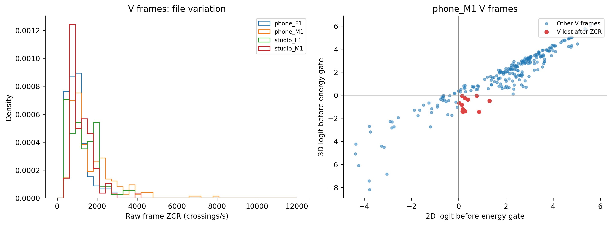

# H22 — vì sao thêm ZCR có đánh đổi?

ZCR là tần suất đổi dấu sau trừ mean khung; không là tần số cơ bản F0. Báo cáo này tái dựng fixed LOFO2D/3D, không thay lựa chọn hoặc chạy thêm grid.

## Các khung đổi quyết định

| file | label | frames | voiced_2d | voiced_3d | lost_voiced | gained_voiced |
| --- | --- | --- | --- | --- | --- | --- |
| phone_F1.wav | v | 153 | 135 | 136 | 0 | 1 |
| phone_F1.wav | uv | 69 | 3 | 3 | 0 | 0 |
| phone_F1.wav | sil | 100 | 0 | 0 | 0 | 0 |
| phone_M1.wav | v | 244 | 202 | 193 | 12 | 3 |
| phone_M1.wav | uv | 62 | 1 | 0 | 1 | 0 |
| phone_M1.wav | sil | 108 | 0 | 0 | 0 | 0 |
| studio_F1.wav | v | 123 | 116 | 119 | 0 | 3 |
| studio_F1.wav | uv | 24 | 2 | 4 | 0 | 2 |
| studio_F1.wav | sil | 137 | 1 | 1 | 0 | 0 |
| studio_M1.wav | v | 94 | 83 | 85 | 0 | 2 |
| studio_M1.wav | uv | 25 | 3 | 3 | 0 | 0 |
| studio_M1.wav | sil | 152 | 0 | 0 | 0 | 0 |

lost_voiced ở nhãn V là tăng bỏ sót; ở UV/SIL là bớt dự đoán hữu thanh sai. gained_voiced có ý nghĩa ngược lại. Đây là khung chồng lấn, không phải các sự kiện độc lập.

## Hệ số sau chuẩn hóa

| held_file | option_id | fit_files | intercept | coef_ACF_score | coef_relative_rms | coef_zcr_crossings_per_s |
| --- | --- | --- | --- | --- | --- | --- |
| phone_F1.wav | raw_lr1_2d | phone_M1.wav\|studio_F1.wav\|studio_M1.wav | -0.0905535 | 2.75229 | 1.07488 | nan |
| phone_F1.wav | raw_lr1_3d_zcr | phone_M1.wav\|studio_F1.wav\|studio_M1.wav | -0.174936 | 2.35545 | 1.19229 | -0.764002 |
| phone_M1.wav | raw_lr1_2d | phone_F1.wav\|studio_F1.wav\|studio_M1.wav | -0.194794 | 2.82655 | 1.1447 | nan |
| phone_M1.wav | raw_lr1_3d_zcr | phone_F1.wav\|studio_F1.wav\|studio_M1.wav | -0.533304 | 2.35884 | 1.33365 | -1.53974 |
| studio_F1.wav | raw_lr1_2d | phone_F1.wav\|phone_M1.wav\|studio_M1.wav | -0.0044757 | 2.64786 | 1.10159 | nan |
| studio_F1.wav | raw_lr1_3d_zcr | phone_F1.wav\|phone_M1.wav\|studio_M1.wav | -0.022094 | 2.0601 | 1.4472 | -1.09907 |
| studio_M1.wav | raw_lr1_2d | phone_F1.wav\|phone_M1.wav\|studio_F1.wav | -0.0220961 | 2.93448 | 1.15871 | nan |
| studio_M1.wav | raw_lr1_3d_zcr | phone_F1.wav\|phone_M1.wav\|studio_F1.wav | -0.0441761 | 2.41282 | 1.5975 | -1.0694 |

Hệ số gắn với đơn vị sau StandardScaler, không dùng hệ số lớn nhỏ như causal feature importance. Thêm ZCR làm refit cả hệ số ACF/RMS và intercept; tác động không chỉ là cộng một ZCR term vào mô hình2D đã cố định.

## Phân bố theo file và nhãn

| file | label | count | mean | std | median |
| --- | --- | --- | --- | --- | --- |
| phone_F1.wav | sil | 100 | 2051.53 | 412.098 | 2005.01 |
| phone_F1.wav | uv | 69 | 2298.5 | 1896.97 | 1724.31 |
| phone_F1.wav | v | 153 | 999.361 | 512.617 | 922.306 |
| phone_M1.wav | sil | 108 | 2651.44 | 1015.87 | 2325.81 |
| phone_M1.wav | uv | 62 | 4199.53 | 3346.35 | 2746.87 |
| phone_M1.wav | v | 244 | 1653.48 | 1139.7 | 1223.06 |
| studio_F1.wav | sil | 137 | 3639.11 | 2085.54 | 3204.36 |
| studio_F1.wav | uv | 24 | 2882.25 | 2614.18 | 1882.56 |
| studio_F1.wav | v | 123 | 1299.33 | 749.582 | 1161.58 |
| studio_M1.wav | sil | 152 | 3124.25 | 1843.87 | 3004.09 |
| studio_M1.wav | uv | 25 | 4013.46 | 2674.72 | 3124.25 |
| studio_M1.wav | v | 94 | 1214.42 | 593.355 | 1021.39 |

Sự khác nhau về phân bố là quan sát. Chưa cô lập speaker, thiết bị, utterance hoặc sampling rate; không khẳng định domain shift là nguyên nhân đã chứng minh. Mỗi ô device×F/M chỉ1file, không suy rộng thành giọng nam/nữ.

Đã tái lập fixed scores trong1e-8 và kiểm tra pred từ logit+energy gate. Các file CSV giữ đầy đủ khung để đối chiếu. Không có F0 reference từng khung nên các contour chỉ là dự đoán, không phép xác minh pitch đúng.
