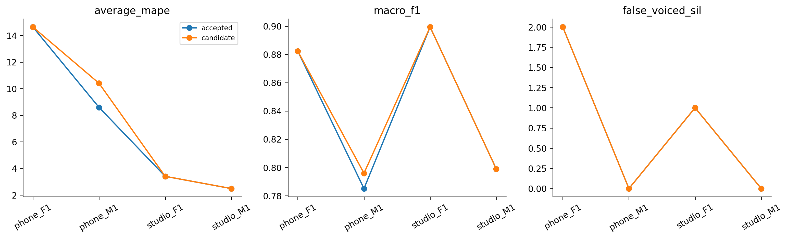

# H22 — thêm ZCR vào logistic

| model | split | average_mape | F0mean_mape | F0std_mape | F0num_mape | F0mean_abs_error | F0std_abs_error | macro_f1 | balanced_accuracy | recall_v | recall_uv | TP | TN | FP | FN | false_voiced_sil | F0num |
| --- | --- | --- | --- | --- | --- | --- | --- | --- | --- | --- | --- | --- | --- | --- | --- | --- | --- |
| accepted | train | 6.17797 | 0.583562 | 11.3078 | 6.64251 | 0.854436 | 2.33158 | 0.850371 | 0.900215 | 0.869123 | 0.931306 | 530 | 167 | 13 | 84 | 1 | 544 |
| accepted | lofo | 7.27924 | 1.05571 | 14.6661 | 6.1159 | 1.84025 | 3.0133 | 0.841398 | 0.893149 | 0.865862 | 0.920437 | 527 | 164 | 16 | 87 | 3 | 546 |
| accepted | nested | 7.27924 | 1.05571 | 14.6661 | 6.1159 | 1.84025 | 3.0133 | 0.841398 | 0.893149 | 0.865862 | 0.920437 | 527 | 164 | 16 | 87 | 3 | 546 |
| candidate | train | 5.11916 | 0.437153 | 8.2443 | 6.67601 | 0.675148 | 1.69674 | 0.867043 | 0.907538 | 0.891228 | 0.923848 | 542 | 170 | 10 | 72 | 1 | 553 |
| candidate | lofo | 5.47073 | 0.463663 | 8.34004 | 7.6085 | 0.677558 | 1.72224 | 0.863433 | 0.909169 | 0.884072 | 0.934265 | 536 | 171 | 9 | 78 | 1 | 546 |
| candidate | nested | 7.73276 | 1.11113 | 15.0014 | 7.08572 | 1.9088 | 3.06963 | 0.844112 | 0.90118 | 0.861763 | 0.940598 | 523 | 169 | 11 | 91 | 3 | 537 |

## Tiêu chí đã đăng ký

~~~json
{
  "checks": {
    "train_mape_relative_10_percent": true,
    "lofo_mape_relative_5_percent": false,
    "lofo_f1_drop_at_most_01": true,
    "lofo_recall_v_drop_at_most_01": true,
    "lofo_sil_increase_at_most_1": true,
    "lofo_no_file_mape_worse_by_over_2pp": true,
    "lofo_phone_f1_std_not_worse": true,
    "selected_lofo_mape_relative_5_percent": true
  },
  "eligible": false,
  "nested_status": "Outer file excluded from every inner fit and selection; selected LOFO is separate.",
  "champion_promoted": false
}
~~~

## Lựa chọn theo fold

| outer_held | id | kind | low_hz | high_hz | frame_ms | hop_ms | C | use_zcr |
| --- | --- | --- | --- | --- | --- | --- | --- | --- |
| final | raw_lr1_2d | raw | 0 | 0 | 25 | 10 | 1 | False |
| phone_F1.wav | raw_0_0_f25_h10 | raw | 0 | 0 | 25 | 10 | nan | False |
| phone_M1.wav | raw_lr1_3d_zcr | raw | 0 | 0 | 25 | 10 | 1 | True |
| studio_F1.wav | raw_0_0_f25_h10 | raw | 0 | 0 | 25 | 10 | nan | False |
| studio_M1.wav | raw_0_0_f25_h10 | raw | 0 | 0 | 25 | 10 | nan | False |

Giữ champion; các kết quả không đạt cũng được lưu. Selected LOFO có ảnh hưởng lựa chọn, đọc nested để đánh giá quy trình. Registry được đề xuất sau lịch sử đã xem bốn file nên nested vẫn là thăm dò.

Giữ frame25/hop10 và raw ACF. ZCR là số lần đổi dấu sau trừ mean khung chia thời lượng giữa các mẫu (crossings/s), không là F0. Registry gồm accepted, logistic2D C1 và logistic3D C1+ZCR; không tune C hoặc thêm filter trong vòng này.

StandardScaler/coefficients/class weights chỉ fit subset train. Tỉ lệ class/file, C1, threshold0.5, energy gate, path và median giống control2D. Mọi khung nhãn V/UV dùng để fit; SIL không là negative training class ở thiết kế này. ZCR normalization theo fs tránh dùng fraction phụ thuộc sampling rate làm cùng đơn vị giữa phone/studio.

Lệnh: `python research_workbench_2026_10_07/zcr_logistic.py H22`

Nguồn API: [LogisticRegression](https://scikit-learn.org/stable/modules/generated/sklearn.linear_model.LogisticRegression.html). H22_REGISTRATION.md xác định câu hỏi, controls và giới hạn trước đo.
