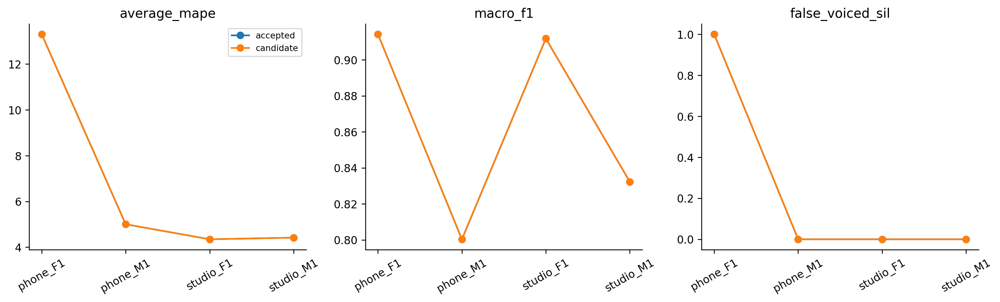

# H23 — độ dài khung AMDF

| model | split | average_mape | F0mean_mape | F0std_mape | F0num_mape | F0mean_abs_error | F0std_abs_error | macro_f1 | balanced_accuracy | recall_v | recall_uv | TP | TN | FP | FN | false_voiced_sil | F0num |
| --- | --- | --- | --- | --- | --- | --- | --- | --- | --- | --- | --- | --- | --- | --- | --- | --- | --- |
| accepted | train | 4.87626 | 0.585658 | 7.48957 | 6.55355 | 0.937784 | 1.70662 | 0.869716 | 0.923173 | 0.881409 | 0.964937 | 539 | 171 | 9 | 75 | 0 | 548 |
| accepted | lofo | 6.76763 | 0.542677 | 12.8554 | 6.90476 | 0.803037 | 2.83858 | 0.864626 | 0.92062 | 0.876303 | 0.964937 | 535 | 171 | 9 | 79 | 1 | 545 |
| accepted | nested | 6.76763 | 0.542677 | 12.8554 | 6.90476 | 0.803037 | 2.83858 | 0.864626 | 0.92062 | 0.876303 | 0.964937 | 535 | 171 | 9 | 79 | 1 | 545 |
| candidate | train | 4.87626 | 0.585658 | 7.48957 | 6.55355 | 0.937784 | 1.70662 | 0.869716 | 0.923173 | 0.881409 | 0.964937 | 539 | 171 | 9 | 75 | 0 | 548 |
| candidate | lofo | 6.76763 | 0.542677 | 12.8554 | 6.90476 | 0.803037 | 2.83858 | 0.864626 | 0.92062 | 0.876303 | 0.964937 | 535 | 171 | 9 | 79 | 1 | 545 |
| candidate | nested | 6.76763 | 0.542677 | 12.8554 | 6.90476 | 0.803037 | 2.83858 | 0.864626 | 0.92062 | 0.876303 | 0.964937 | 535 | 171 | 9 | 79 | 1 | 545 |

## Tiêu chí đã đăng ký

~~~json
{
  "checks": {
    "train_mape_relative_10_percent": false,
    "lofo_mape_relative_5_percent": false,
    "lofo_f1_drop_at_most_01": true,
    "lofo_recall_v_drop_at_most_01": true,
    "lofo_sil_increase_at_most_1": true,
    "lofo_no_file_mape_worse_by_over_2pp": true,
    "lofo_phone_f1_std_not_worse": true,
    "selected_lofo_mape_relative_5_percent": false
  },
  "eligible": false,
  "nested_status": "Outer file excluded from every inner fit and selection; selected LOFO is separate.",
  "champion_promoted": false
}
~~~

## Lựa chọn theo fold

| outer_held | id | frame_ms | hop_ms | C |
| --- | --- | --- | --- | --- |
| final | amdf_f25_h10 | 25 | 10 | None |
| phone_F1.wav | amdf_f25_h10 | 25 | 10 | None |
| phone_M1.wav | amdf_f25_h10 | 25 | 10 | None |
| studio_F1.wav | amdf_f25_h10 | 25 | 10 | None |
| studio_M1.wav | amdf_f25_h10 | 25 | 10 | None |

Giữ champion; các kết quả không đạt cũng được lưu. Selected LOFO có ảnh hưởng lựa chọn, đọc nested để đánh giá quy trình. Registry được đề xuất sau lịch sử đã xem bốn file nên nested vẫn là thăm dò.

AMDF có energy gate/path đã sửa là control; frame20/25/40ms, hop10ms. Chấm trên timestamp grid25/10 chung bằng nearest trong half-hop support. Các đoạn biên thiếu hỗ trợ là abstention, báo coverage/countnative riêng. GT không là F0 reference từngkhung.

Chỉ thay frame length; không filter, center clipping hoặc logistic. Giữ NAMDF, pathjump.35/octave0/median1/range70–400; pitch và energy threshold refit mỗi trainfold. Không so trực tiếp với ACF6.18% train như cùngbaseline. Tất cả gate H23 so AMDF đã sửa.

Lệnh: `python research_workbench_2026_10_07/amdf_frames.py H23`

H23_REGISTRATION.md đăng ký trước đo. AMDF đang dùng là normalized difference theo overlap, không tự đổi thành alignedAMDF hoặc YIN. Notebook AMDF_LOCAL_TRAIN.ipynb chạy cùng source local để minh họa và đối chiếu.

## Fixed frame comparisons: có cải thiện và có đánh đổi

| option_id | average_mape | std_mape | macro_f1 | recall_v | SIL |
| --- | --- | --- | --- | --- | --- |
| amdf_f20_h10 | 11.3021 | 19.792 | 0.817773 | 0.820122 | 1 |
| amdf_f25_h10 | 6.76763 | 12.8554 | 0.864626 | 0.876303 | 1 |
| amdf_f40_h10 | 5.63264 | 5.81485 | 0.84041 | 0.847026 | 1 |

| option_id | file | average_mape | F0std_mape | macro_f1 | recall_v | projection_coverage |
| --- | --- | --- | --- | --- | --- | --- |
| amdf_f20_h10 | phone_F1.wav | 21.6289 | 57.1742 | 0.880699 | 0.869281 | 1 |
| amdf_f20_h10 | phone_M1.wav | 8.00509 | 8.04192 | 0.776823 | 0.790984 | 1 |
| amdf_f20_h10 | studio_F1.wav | 5.99736 | 3.13657 | 0.856924 | 0.886179 | 1 |
| amdf_f20_h10 | studio_M1.wav | 9.57707 | 10.8154 | 0.756646 | 0.734043 | 1 |
| amdf_f25_h10 | phone_F1.wav | 13.3033 | 36.2903 | 0.914139 | 0.908497 | 1 |
| amdf_f25_h10 | phone_M1.wav | 5.00305 | 4.70624 | 0.800325 | 0.831967 | 1 |
| amdf_f25_h10 | studio_F1.wav | 4.34648 | 3.22687 | 0.911765 | 0.934959 | 1 |
| amdf_f25_h10 | studio_M1.wav | 4.41764 | 7.19834 | 0.832276 | 0.829787 | 1 |
| amdf_f40_h10 | phone_F1.wav | 1.56688 | 1.11205 | 0.908784 | 0.908497 | 0.996894 |
| amdf_f40_h10 | phone_M1.wav | 10.6864 | 14.0693 | 0.771925 | 0.778689 | 0.997585 |
| amdf_f40_h10 | studio_F1.wav | 3.51803 | 1.29211 | 0.911765 | 0.934959 | 0.996479 |
| amdf_f40_h10 | studio_M1.wav | 6.75926 | 6.78597 | 0.769166 | 0.765957 | 0.99631 |

40ms giảm AvgMAPE bình quân6.767627→5.632639% (16.77% tương đối), phone_F1stdMAPE36.290329→1.112054%. Đồng thời macroF1 giảm0.864626→0.840410, recallV giảm0.876303→0.847026; phone_M1AvgMAPE5.003046→10.686380%. Do các gate đã đăng ký, final vàmọiouter đều chọn25ms. Nested giữ6.767627%; không gọi đó là không có cải thiện ở các cấu hình khác. 40ms là ứng viên có đánh đổi, chưa thay accepted.

GT làfile-stat, nên stdMAPE thấp không đủ chứng minh từng F0 đã đúng. Khung40ms chấm qua adapter cócoverage trung bình0.996817; nativecount/coverage được lưu, không sửaGT. Không suy riêng phone_F1/M1 thành quy luật nam/nữ.

Notebook source/output local: [AMDF_LOCAL_TRAIN.ipynb](AMDF_LOCAL_TRAIN.ipynb).
