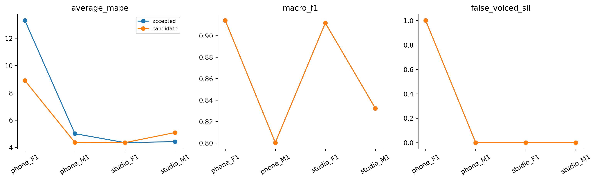

# H24 — tách cửa sổ quyết định V/UV và F0 AMDF

| model | split | average_mape | F0mean_mape | F0std_mape | F0num_mape | F0mean_abs_error | F0std_abs_error | macro_f1 | balanced_accuracy | recall_v | recall_uv | TP | TN | FP | FN | false_voiced_sil | F0num |
| --- | --- | --- | --- | --- | --- | --- | --- | --- | --- | --- | --- | --- | --- | --- | --- | --- | --- |
| accepted | train | 4.87626 | 0.585658 | 7.48957 | 6.55355 | 0.937784 | 1.70662 | 0.869716 | 0.923173 | 0.881409 | 0.964937 | 539 | 171 | 9 | 75 | 0 | 548 |
| accepted | lofo | 6.76763 | 0.542677 | 12.8554 | 6.90476 | 0.803037 | 2.83858 | 0.864626 | 0.92062 | 0.876303 | 0.964937 | 535 | 171 | 9 | 79 | 1 | 545 |
| accepted | nested | 6.76763 | 0.542677 | 12.8554 | 6.90476 | 0.803037 | 2.83858 | 0.864626 | 0.92062 | 0.876303 | 0.964937 | 535 | 171 | 9 | 79 | 1 | 545 |
| candidate | train | 3.68347 | 0.748182 | 3.74868 | 6.55355 | 1.22338 | 0.993858 | 0.869716 | 0.923173 | 0.881409 | 0.964937 | 539 | 171 | 9 | 75 | 0 | 548 |
| candidate | lofo | 5.72165 | 0.800826 | 9.45935 | 6.90476 | 1.36134 | 2.19703 | 0.864626 | 0.92062 | 0.876303 | 0.964937 | 535 | 171 | 9 | 79 | 1 | 545 |
| candidate | nested | 5.67186 | 0.738992 | 9.37184 | 6.90476 | 1.21937 | 2.16482 | 0.864626 | 0.92062 | 0.876303 | 0.964937 | 535 | 171 | 9 | 79 | 1 | 545 |

## Tiêu chí đã đăng ký

~~~json
{
  "checks": {
    "train_mape_relative_10_percent": true,
    "lofo_mape_relative_5_percent": true,
    "lofo_f1_drop_at_most_01": true,
    "lofo_recall_v_drop_at_most_01": true,
    "lofo_sil_increase_at_most_1": true,
    "lofo_no_file_mape_worse_by_over_2pp": true,
    "lofo_phone_f1_std_not_worse": true,
    "selected_lofo_mape_relative_5_percent": true
  },
  "eligible": true,
  "nested_status": "Outer file excluded from every inner fit and selection; selected LOFO is separate.",
  "champion_promoted": false
}
~~~

## Lựa chọn theo fold

| outer_held | id | frame_ms | hop_ms | pitch_frame_ms | C |
| --- | --- | --- | --- | --- | --- |
| final | amdf_gate25_pitch40 | 25 | 10 | 40 | None |
| phone_F1.wav | amdf_gate25_pitch40 | 25 | 10 | 40 | None |
| phone_M1.wav | amdf_gate25_pitch40 | 25 | 10 | 40 | None |
| studio_F1.wav | amdf_f25_h10 | 25 | 10 | 25 | None |
| studio_M1.wav | amdf_gate25_pitch40 | 25 | 10 | 40 | None |

Giữ champion; các kết quả không đạt cũng được lưu. Selected LOFO có ảnh hưởng lựa chọn, đọc nested để đánh giá quy trình. Registry được đề xuất sau lịch sử đã xem bốn file nên nested vẫn là thăm dò.

Gate AMDF_score/RMS dùng25ms; ứng viên F0 dùng40ms đúng cùngtâmkhung25ms. Nếu40ms không đủ mẫu ở biên thì fallback ứng viên25ms. Không pad hoặc đổi GT. Code đã xác minh quyết định V/UV và số F0 hợp lệ không đổi; coverage100%. Đây khác full40ms của H23.

Chỉ thay cửa sổ lấy ứng viênpitch, giữ decision25, NAMDF/pathjump.35/octave0/median1/range70–400, thresholds fit đúngpooltrain. Control làacceptedAMDF25. Count-error floor hiện tại2.301587 điểmAvgMAPE nên H24 riêng không dự kiến giải quyết hết mục tiêu2%.

Lệnh: `python research_workbench_2026_10_07/amdf_dual_window.py H24`

H24_REGISTRATION.md đăng ký trước đo. AMDF dualwindow là thay ứng viênpitch, không giả nhãn hoặc countGT. Fixed candidate comparisons là điểmLOFO không thamgia lựa chọn, còn nested đánh giá chọn baseline/dualwindow.

Người dùng đã làm rõ mục tiêu sau khi chạy H24: **Average MAPE ≤2% cho từng file**, không chỉ trung bình bốn file. Các gate trước đo vẫn được giữ; đạt gate cải thiện chưa có nghĩa đạt mục tiêu người dùng. H24 nested5.671863% và selectedLOFO5.721646%; chưa đạt. Không thay baseline frozen_config cũ. Bản40ms được dùng làm control cố định cho vòng classifier kế tiếp sau khi H24 được kiểm tra/push, và sẽ ghi rõ control này khác lựa chọn nested H24.

Kiểm tra độc lập: `verify_amdf_loop.py H24 amdf_f25_h10` tái tính metric từ contour/LAB, replay tất cả lựa chọn từ32innertraces, kiểm tra40fitrecords và toàn bộ8gate. Mọi gatePASS, không auto-promote. Giữ kết quả fixed từngfile trong `results/H24_fixed_lofo.csv`.
