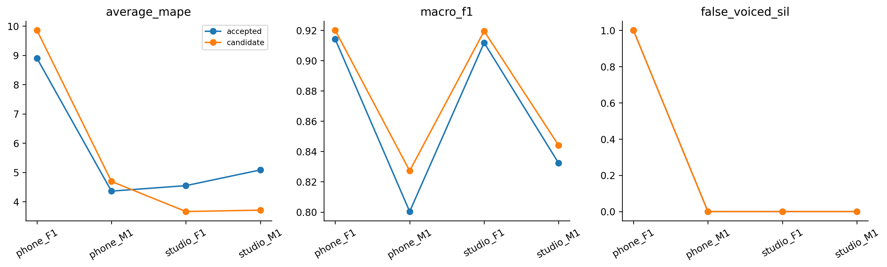

# H26 — Thêm ACF periodicity vào quyết định V/UV AMDF

| model | split | average_mape | F0mean_mape | F0std_mape | F0num_mape | F0mean_abs_error | F0std_abs_error | macro_f1 | balanced_accuracy | recall_v | recall_uv | TP | TN | FP | FN | false_voiced_sil | F0num |
| --- | --- | --- | --- | --- | --- | --- | --- | --- | --- | --- | --- | --- | --- | --- | --- | --- | --- |
| accepted | train | 3.68347 | 0.748182 | 3.74868 | 6.55355 | 1.22338 | 0.993858 | 0.869716 | 0.923173 | 0.881409 | 0.964937 | 539 | 171 | 9 | 75 | 0 | 548 |
| accepted | lofo | 5.72165 | 0.800826 | 9.45935 | 6.90476 | 1.36134 | 2.19703 | 0.864626 | 0.92062 | 0.876303 | 0.964937 | 535 | 171 | 9 | 79 | 1 | 545 |
| accepted | nested | 5.72165 | 0.800826 | 9.45935 | 6.90476 | 1.36134 | 2.19703 | 0.864626 | 0.92062 | 0.876303 | 0.964937 | 535 | 171 | 9 | 79 | 1 | 545 |
| candidate | train | 3.68347 | 0.748182 | 3.74868 | 6.55355 | 1.22338 | 0.993858 | 0.869716 | 0.923173 | 0.881409 | 0.964937 | 539 | 171 | 9 | 75 | 0 | 548 |
| candidate | lofo | 5.72165 | 0.800826 | 9.45935 | 6.90476 | 1.36134 | 2.19703 | 0.864626 | 0.92062 | 0.876303 | 0.964937 | 535 | 171 | 9 | 79 | 1 | 545 |
| candidate | nested | 5.47835 | 0.697914 | 9.3104 | 6.42673 | 1.17319 | 2.13661 | 0.877659 | 0.924658 | 0.891421 | 0.957896 | 542 | 174 | 6 | 72 | 1 | 549 |

Mục tiêu người dùng: từng file Average MAPE <=2%. Inner rank worst-file, sau đó mean và ID. Nested vẫn thăm dò vì registry được định hướng sau lịch sử bốn file.

Control cố định H24 gate25/pitch40; không phải selection nested H24. Chỉ thêm đặc trưngACF_score vào LR2D C1, córawcontrol; giữ energy gate, pathjump.35, median1, range70–400, cùng candidates40ms và fallback25. Không ZCR/filter/range/median tuning.

Fit scaler/LR chỉ V/UV các file fit, trọng số cân bằng file và class; SIL xử lý bằng energy gate fit từ pool đó. Threshold probability0.5 chốt trước chạy. Không dùng countGT của held để chỉnh output.

## Gate đăng ký

~~~json
{
  "checks": {
    "train_mape_relative_10_percent": false,
    "lofo_mape_relative_5_percent": false,
    "lofo_f1_drop_at_most_01": true,
    "lofo_recall_v_drop_at_most_01": true,
    "lofo_sil_increase_at_most_1": true,
    "lofo_no_file_mape_worse_by_over_2pp": true,
    "lofo_phone_f1_std_not_worse": false,
    "selected_lofo_mape_relative_5_percent": false
  },
  "eligible": false,
  "nested_status": "Outer file excluded from every inner fit and selection; selected LOFO is separate.",
  "champion_promoted": false
}
~~~

## Lựa chọn

| outer_held | id | frame_ms | hop_ms | pitch_frame_ms | C | use_acf |
| --- | --- | --- | --- | --- | --- | --- |
| final | amdf_control | 25 | 10 | 40 | nan | False |
| phone_F1.wav | amdf_lr1_2d | 25 | 10 | 40 | 1 | False |
| phone_M1.wav | amdf_lr1_3d_acf | 25 | 10 | 40 | 1 | True |
| studio_F1.wav | amdf_lr1_3d_acf | 25 | 10 | 40 | 1 | True |
| studio_M1.wav | amdf_lr1_3d_acf | 25 | 10 | 40 | 1 | True |

## Metric từng file

| split | model | file | average_mape | F0mean_mape | F0std_mape | F0num_mape | recall_v | false_voiced_sil |
| --- | --- | --- | --- | --- | --- | --- | --- | --- |
| train | accepted | phone_F1.wav | 1.68805 | 0.432476 | 0.577622 | 4.05405 | 0.908497 | 0 |
| train | candidate | phone_F1.wav | 1.68805 | 0.432476 | 0.577622 | 4.05405 | 0.908497 | 0 |
| train | accepted | phone_M1.wav | 3.85391 | 0.398151 | 2.5429 | 8.62069 | 0.844262 | 0 |
| train | candidate | phone_M1.wav | 3.85391 | 0.398151 | 2.5429 | 8.62069 | 0.844262 | 0 |
| train | accepted | studio_F1.wav | 4.10921 | 0.835026 | 2.8312 | 8.66142 | 0.943089 | 0 |
| train | candidate | studio_F1.wav | 4.10921 | 0.835026 | 2.8312 | 8.66142 | 0.943089 | 0 |
| train | accepted | studio_M1.wav | 5.08271 | 1.32708 | 9.043 | 4.87805 | 0.829787 | 0 |
| train | candidate | studio_M1.wav | 5.08271 | 1.32708 | 9.043 | 4.87805 | 0.829787 | 0 |
| lofo | accepted | phone_F1.wav | 8.8999 | 1.00761 | 22.3137 | 3.37838 | 0.908497 | 1 |
| lofo | candidate | phone_F1.wav | 8.8999 | 1.00761 | 22.3137 | 3.37838 | 0.908497 | 1 |
| lofo | accepted | phone_M1.wav | 4.35837 | 0.257548 | 2.90378 | 9.91379 | 0.831967 | 0 |
| lofo | candidate | phone_M1.wav | 4.35837 | 0.257548 | 2.90378 | 9.91379 | 0.831967 | 0 |
| lofo | accepted | studio_F1.wav | 4.54561 | 0.611076 | 3.57692 | 9.44882 | 0.934959 | 0 |
| lofo | candidate | studio_F1.wav | 4.54561 | 0.611076 | 3.57692 | 9.44882 | 0.934959 | 0 |
| lofo | accepted | studio_M1.wav | 5.08271 | 1.32708 | 9.043 | 4.87805 | 0.829787 | 0 |
| lofo | candidate | studio_M1.wav | 5.08271 | 1.32708 | 9.043 | 4.87805 | 0.829787 | 0 |
| nested | accepted | phone_F1.wav | 8.8999 | 1.00761 | 22.3137 | 3.37838 | 0.908497 | 1 |
| nested | candidate | phone_F1.wav | 9.85604 | 0.70827 | 23.4545 | 5.40541 | 0.901961 | 1 |
| nested | accepted | phone_M1.wav | 4.35837 | 0.257548 | 2.90378 | 9.91379 | 0.831967 | 0 |
| nested | candidate | phone_M1.wav | 4.68921 | 0.523797 | 2.76798 | 10.7759 | 0.840164 | 0 |
| nested | accepted | studio_F1.wav | 4.54561 | 0.611076 | 3.57692 | 9.44882 | 0.934959 | 0 |
| nested | candidate | studio_F1.wav | 3.65979 | 0.616357 | 3.27641 | 7.08661 | 0.95122 | 0 |
| nested | accepted | studio_M1.wav | 5.08271 | 1.32708 | 9.043 | 4.87805 | 0.829787 | 0 |
| nested | candidate | studio_M1.wav | 3.70834 | 0.943232 | 7.74276 | 2.43902 | 0.87234 | 0 |

Chưa auto-promote; không sửa frozen_config gốc. GT chỉ thống kê file và loại đoạn, không F0 từng khung.

Lệnh: python research_workbench_2026_10_07/amdf_joint_periodicity.py H26
