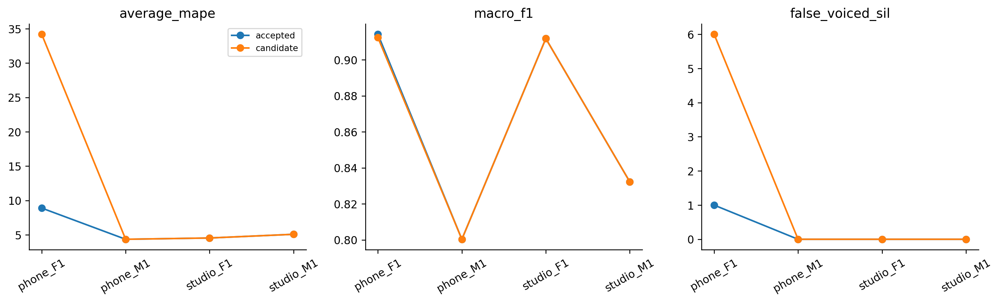

# H27 — reference pipeline Praat raw autocorrelation

| model | split | average_mape | F0mean_mape | F0std_mape | F0num_mape | F0mean_abs_error | F0std_abs_error | macro_f1 | balanced_accuracy | recall_v | recall_uv | TP | TN | FP | FN | false_voiced_sil | F0num |
| --- | --- | --- | --- | --- | --- | --- | --- | --- | --- | --- | --- | --- | --- | --- | --- | --- | --- |
| accepted | train | 3.68347 | 0.748182 | 3.74868 | 6.55355 | 1.22338 | 0.993858 | 0.869716 | 0.923173 | 0.881409 | 0.964937 | 539 | 171 | 9 | 75 | 0 | 548 |
| accepted | lofo | 5.72165 | 0.800826 | 9.45935 | 6.90476 | 1.36134 | 2.19703 | 0.864626 | 0.92062 | 0.876303 | 0.964937 | 535 | 171 | 9 | 79 | 1 | 545 |
| accepted | nested | 5.72165 | 0.800826 | 9.45935 | 6.90476 | 1.36134 | 2.19703 | 0.864626 | 0.92062 | 0.876303 | 0.964937 | 535 | 171 | 9 | 79 | 1 | 545 |
| candidate | train | 3.68347 | 0.748182 | 3.74868 | 6.55355 | 1.22338 | 0.993858 | 0.869716 | 0.923173 | 0.881409 | 0.964937 | 539 | 171 | 9 | 75 | 0 | 548 |
| candidate | lofo | 5.72165 | 0.800826 | 9.45935 | 6.90476 | 1.36134 | 2.19703 | 0.864626 | 0.92062 | 0.876303 | 0.964937 | 535 | 171 | 9 | 79 | 1 | 545 |
| candidate | nested | 12.0444 | 1.46468 | 27.5948 | 7.07368 | 2.79261 | 5.93294 | 0.864172 | 0.917636 | 0.881205 | 0.954067 | 538 | 168 | 12 | 76 | 6 | 556 |

So sánh toàn bộ pipeline với AMDF H24 (cổng V/UV 25 ms, ứng viên F0 40 ms). Praat dùng cửa sổ 3/70 s, bước 10 ms, khoảng F0 70–400 Hz và ngưỡng hữu thanh 0.35/0.45/0.55. Giữ 15 ứng viên, silence threshold 0.03, octave cost 0.01, jump cost 0.35 và V/UV cost 0.14. Praat tự chọn đường F0 và V/UV; không thêm cổng năng lượng AMDF hay median. Phiên bản: Parselmouth 0.4.7/Praat 6.1.38, raw autocorrelation; đây không phải filtered autocorrelation năm 2023.

Ghép tâm khung Praat gần nhất vào lưới chấm 25/10 ms trong nửa bước khung cộng một mẫu. Khung ngoài vùng hỗ trợ nhận pred=false và F0=NaN; không padding hoặc điều chỉnh số khung theo GT. Bảng báo coverage và số khung native. Praat không fit trên các file: fit_files trong trace chỉ ghi tập dùng cho chọn cấu hình; actual_fit_files=[] và requires_fit=false. AMDF vẫn fit ngưỡng bằng tập đã định. Inner folds chọn lỗi file lớn nhất, sau đó mean và ID để xử lý hòa. Giữ các tiêu chí đã đăng ký. Nested vẫn là kết quả thăm dò vì lịch sử nghiên cứu đã sử dụng bốn file.

## Gate

~~~json
{
  "checks": {
    "train_mape_relative_10_percent": false,
    "lofo_mape_relative_5_percent": false,
    "lofo_f1_drop_at_most_01": true,
    "lofo_recall_v_drop_at_most_01": true,
    "lofo_sil_increase_at_most_1": false,
    "lofo_no_file_mape_worse_by_over_2pp": false,
    "lofo_phone_f1_std_not_worse": false,
    "selected_lofo_mape_relative_5_percent": false
  },
  "eligible": false,
  "nested_status": "Outer file excluded from every inner fit and selection; selected LOFO is separate.",
  "champion_promoted": false
}
~~~

## Selections

| outer_held | id | frame_ms | hop_ms | pitch_frame_ms | C | method | voicing_threshold |
| --- | --- | --- | --- | --- | --- | --- | --- |
| final | amdf_control | 25 | 10 | 40 | None | control | nan |
| phone_F1.wav | praat_raw_v0.55 | 42.8571 | 10 | 42.8571 | None | praat_raw | 0.55 |
| phone_M1.wav | amdf_control | 25 | 10 | 40 | None | control | nan |
| studio_F1.wav | amdf_control | 25 | 10 | 40 | None | control | nan |
| studio_M1.wav | amdf_control | 25 | 10 | 40 | None | control | nan |

## Per file

| split | model | file | average_mape | F0mean_mape | F0std_mape | F0num_mape | recall_v | false_voiced_sil | projection_coverage |
| --- | --- | --- | --- | --- | --- | --- | --- | --- | --- |
| train | accepted | phone_F1.wav | 1.68805 | 0.432476 | 0.577622 | 4.05405 | 0.908497 | 0 | 1 |
| train | candidate | phone_F1.wav | 1.68805 | 0.432476 | 0.577622 | 4.05405 | 0.908497 | 0 | 1 |
| train | accepted | phone_M1.wav | 3.85391 | 0.398151 | 2.5429 | 8.62069 | 0.844262 | 0 | 1 |
| train | candidate | phone_M1.wav | 3.85391 | 0.398151 | 2.5429 | 8.62069 | 0.844262 | 0 | 1 |
| train | accepted | studio_F1.wav | 4.10921 | 0.835026 | 2.8312 | 8.66142 | 0.943089 | 0 | 1 |
| train | candidate | studio_F1.wav | 4.10921 | 0.835026 | 2.8312 | 8.66142 | 0.943089 | 0 | 1 |
| train | accepted | studio_M1.wav | 5.08271 | 1.32708 | 9.043 | 4.87805 | 0.829787 | 0 | 1 |
| train | candidate | studio_M1.wav | 5.08271 | 1.32708 | 9.043 | 4.87805 | 0.829787 | 0 | 1 |
| lofo | accepted | phone_F1.wav | 8.8999 | 1.00761 | 22.3137 | 3.37838 | 0.908497 | 1 | 1 |
| lofo | candidate | phone_F1.wav | 8.8999 | 1.00761 | 22.3137 | 3.37838 | 0.908497 | 1 | 1 |
| lofo | accepted | phone_M1.wav | 4.35837 | 0.257548 | 2.90378 | 9.91379 | 0.831967 | 0 | 1 |
| lofo | candidate | phone_M1.wav | 4.35837 | 0.257548 | 2.90378 | 9.91379 | 0.831967 | 0 | 1 |
| lofo | accepted | studio_F1.wav | 4.54561 | 0.611076 | 3.57692 | 9.44882 | 0.934959 | 0 | 1 |
| lofo | candidate | studio_F1.wav | 4.54561 | 0.611076 | 3.57692 | 9.44882 | 0.934959 | 0 | 1 |
| lofo | accepted | studio_M1.wav | 5.08271 | 1.32708 | 9.043 | 4.87805 | 0.829787 | 0 | 1 |
| lofo | candidate | studio_M1.wav | 5.08271 | 1.32708 | 9.043 | 4.87805 | 0.829787 | 0 | 1 |
| nested | accepted | phone_F1.wav | 8.8999 | 1.00761 | 22.3137 | 3.37838 | 0.908497 | 1 | 1 |
| nested | candidate | phone_F1.wav | 34.1909 | 3.66302 | 94.8556 | 4.05405 | 0.928105 | 6 | 0.993789 |
| nested | accepted | phone_M1.wav | 4.35837 | 0.257548 | 2.90378 | 9.91379 | 0.831967 | 0 | 1 |
| nested | candidate | phone_M1.wav | 4.35837 | 0.257548 | 2.90378 | 9.91379 | 0.831967 | 0 | 1 |
| nested | accepted | studio_F1.wav | 4.54561 | 0.611076 | 3.57692 | 9.44882 | 0.934959 | 0 | 1 |
| nested | candidate | studio_F1.wav | 4.54561 | 0.611076 | 3.57692 | 9.44882 | 0.934959 | 0 | 1 |
| nested | accepted | studio_M1.wav | 5.08271 | 1.32708 | 9.043 | 4.87805 | 0.829787 | 0 | 1 |
| nested | candidate | studio_M1.wav | 5.08271 | 1.32708 | 9.043 | 4.87805 | 0.829787 | 0 | 1 |

Mục tiêu mỗi file Average MAPE ≤2% được báo riêng. Giữ baseline gốc và kết quả thất bại; không tự thay cấu hình được chấp nhận. LAB cung cấp thống kê file và nhãn đoạn, chưa có F0 chuẩn từng khung. Chỉ đọc train local; không đọc test, truy cập Drive, chạy deep learning hay extract PDF.

SourceHTML: https://www.fon.hum.uva.nl/praat/manual/pitch_analysis_by_raw_autocorrelation.html

Lệnh: python research_workbench_2026_10_07/praat_reference.py H27
