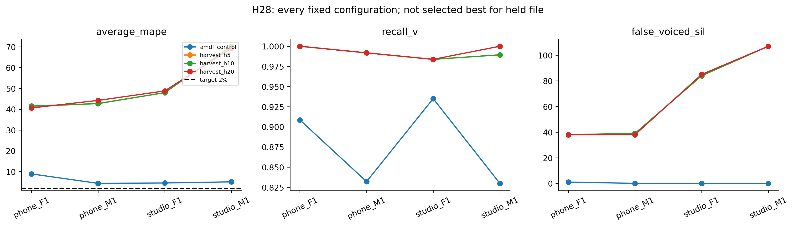

# H28 — vì sao Harvest chưa đạt trên BT2?

Bảng dưới giữ mọi cấu hình cố định đã đăng ký; không phải chọn phương án tốt nhất cho từng held file.

| option_id | file | average_mape | F0mean_mape | F0std_mape | F0num_mape | F0num | macro_f1 | recall_v | FP | false_voiced_sil |
| --- | --- | --- | --- | --- | --- | --- | --- | --- | --- | --- |
| amdf_control | phone_F1.wav | 8.8999 | 1.00761 | 22.3137 | 3.37838 | 143 | 0.914139 | 0.908497 | 3 | 1 |
| amdf_control | phone_M1.wav | 4.35837 | 0.257548 | 2.90378 | 9.91379 | 209 | 0.800325 | 0.831967 | 6 | 0 |
| amdf_control | studio_F1.wav | 4.54561 | 0.611076 | 3.57692 | 9.44882 | 115 | 0.911765 | 0.934959 | 0 | 0 |
| amdf_control | studio_M1.wav | 5.08271 | 1.32708 | 9.043 | 4.87805 | 78 | 0.832276 | 0.829787 | 0 | 0 |
| harvest_h5 | phone_F1.wav | 41.2269 | 2.04862 | 53.3889 | 68.2432 | 249 | 0.55783 | 1 | 58 | 38 |
| harvest_h5 | phone_M1.wav | 42.7657 | 2.03467 | 82.2969 | 43.9655 | 334 | 0.572267 | 0.991803 | 53 | 39 |
| harvest_h5 | studio_F1.wav | 47.9581 | 12.1977 | 51.3616 | 80.315 | 229 | 0.451493 | 0.98374 | 24 | 84 |
| harvest_h5 | studio_M1.wav | 70.2577 | 13.3731 | 32.7657 | 164.634 | 217 | 0.691176 | 0.989362 | 17 | 107 |
| harvest_h10 | phone_F1.wav | 41.5178 | 2.07205 | 53.5624 | 68.9189 | 250 | 0.54576 | 1 | 59 | 38 |
| harvest_h10 | phone_M1.wav | 42.6899 | 2.00849 | 82.0958 | 43.9655 | 334 | 0.572267 | 0.991803 | 53 | 39 |
| harvest_h10 | studio_F1.wav | 47.9581 | 12.1977 | 51.3616 | 80.315 | 229 | 0.451493 | 0.98374 | 24 | 84 |
| harvest_h10 | studio_M1.wav | 70.2577 | 13.3731 | 32.7657 | 164.634 | 217 | 0.691176 | 0.989362 | 17 | 107 |
| harvest_h20 | phone_F1.wav | 40.6095 | 1.84259 | 51.0669 | 68.9189 | 250 | 0.54576 | 1 | 59 | 38 |
| harvest_h20 | phone_M1.wav | 44.2263 | 2.11893 | 86.5945 | 43.9655 | 334 | 0.559259 | 0.991803 | 54 | 38 |
| harvest_h20 | studio_F1.wav | 48.7908 | 12.4113 | 52.8586 | 81.1024 | 230 | 0.451493 | 0.98374 | 24 | 85 |
| harvest_h20 | studio_M1.wav | 69.3147 | 12.8824 | 29.208 | 165.854 | 218 | 0.700961 | 1 | 17 | 107 |

Nhánh Harvest 10 ms: mean Average MAPE 50.605862%, macro F1 0.565174, recall V 0.991226; tổng 268 khung SIL bị gọi hữu thanh. Control H24 có một khung SIL trên fixed LOFO.

Recall V cao chỉ cho biết ít bỏ V. F1 thấp và nhiều UV/SIL bị gọi V cho thấy đánh đổi lớn; không suy ra F0 đúng chỉ từ recall. F0num chấm trên lưới chung còn khác tổng nhãn V; không đồng nhất hai ground truth.

MAPE std cũng xấu. Chưa có F0 chuẩn từng khung để tách chính xác lỗi cao độ trong V khỏi ảnh hưởng của các khung false voiced. Tên file không chứng minh nhiễu, clipping hoặc nguyên nhân vật lý; không kết luận từ nhóm nam/nữ chỉ có hai file mỗi nhóm.

Tất cả inner và final chọn AMDF control vì các nhánh Harvest không vượt eligibility. Nested giữ 5.721646%, không phải Harvest cải thiện rồi được promote. Giữ thất bại của whole pipeline.

Hướng kế tiếp có thể kiểm tra riêng một cổng V/UV trước dùng contour Harvest, với ngưỡng fit ở các file còn lại. Đây mới là đề xuất, chưa đăng ký hay đo; không cắt count theo GT held file và không thêm noise vào WAV để che lỗi synthetic.

Nguồn số liệu: results/H28_fixed_lofo.csv; runner/source/data/contour verification: results/H28_verification.json.
