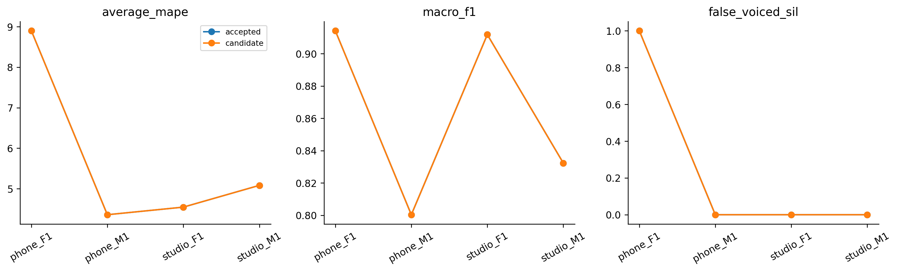

# H28 — pipeline tham chiếu WORLD Harvest

| model | split | average_mape | F0mean_mape | F0std_mape | F0num_mape | F0mean_abs_error | F0std_abs_error | macro_f1 | balanced_accuracy | recall_v | recall_uv | TP | TN | FP | FN | false_voiced_sil | F0num |
| --- | --- | --- | --- | --- | --- | --- | --- | --- | --- | --- | --- | --- | --- | --- | --- | --- | --- |
| accepted | train | 3.68347 | 0.748182 | 3.74868 | 6.55355 | 1.22338 | 0.993858 | 0.869716 | 0.923173 | 0.881409 | 0.964937 | 539 | 171 | 9 | 75 | 0 | 548 |
| accepted | lofo | 5.72165 | 0.800826 | 9.45935 | 6.90476 | 1.36134 | 2.19703 | 0.864626 | 0.92062 | 0.876303 | 0.964937 | 535 | 171 | 9 | 79 | 1 | 545 |
| accepted | nested | 5.72165 | 0.800826 | 9.45935 | 6.90476 | 1.36134 | 2.19703 | 0.864626 | 0.92062 | 0.876303 | 0.964937 | 535 | 171 | 9 | 79 | 1 | 545 |
| candidate | train | 3.68347 | 0.748182 | 3.74868 | 6.55355 | 1.22338 | 0.993858 | 0.869716 | 0.923173 | 0.881409 | 0.964937 | 539 | 171 | 9 | 75 | 0 | 548 |
| candidate | lofo | 5.72165 | 0.800826 | 9.45935 | 6.90476 | 1.36134 | 2.19703 | 0.864626 | 0.92062 | 0.876303 | 0.964937 | 535 | 171 | 9 | 79 | 1 | 545 |
| candidate | nested | 5.72165 | 0.800826 | 9.45935 | 6.90476 | 1.36134 | 2.19703 | 0.864626 | 0.92062 | 0.876303 | 0.964937 | 535 | 171 | 9 | 79 | 1 | 545 |

So sánh toàn bộ pipeline với AMDF H24. Harvest lấy nhiều ứng viên từ filterbank, refine/score, loại ứng viên không tin cậy, nối/sửa contour và làm mượt. Dùng PyWORLD 0.3.5, F0 70–400 Hz, frame_period 5/10/20 ms; không thêm noise, cổng năng lượng AMDF hoặc StoneMask. Cửa sổ phân tích do thuật toán quản lý; frame_period là bước đầu ra, không phải độ dài cửa sổ.

Ghép tâm native gần nhất vào lưới chấm 25/10 ms trong nửa hop cộng một mẫu; khi hòa chọn tâm sớm hơn. Không padding hoặc điều chỉnh count theo GT. Harvest không fit; traces fit_files ghi tập danh nghĩa để chọn cấu hình. Inner chọn worst-file MAPE rồi mean và ID. Giữ mọi gate đã đăng ký; nested vẫn exploratory do lịch sử nghiên cứu bốn file.

Synthetic trước đo giữ cả failure: tín hiệu chỉ hai harmonic không noise bị gọi UV gần toàn bộ; 12 harmonic hoặc noise yếu nhận 81/81 khung trung tâm với lỗi tối đa dưới 0.03 Hz. Không thêm noise vào WAV thật. Nguồn sdist PyWORLD 0.3.5 harvest.cpp có hash giống source tác giả pin d625e7; wheel metadata không tự chứng minh native binary đã được build chính xác từ từng dòng source. Lưu cả native module hash và source provenance.

## Gate

~~~json
{
  "checks": {
    "train_mape_relative_10_percent": false,
    "lofo_mape_relative_5_percent": false,
    "lofo_f1_drop_at_most_01": true,
    "lofo_recall_v_drop_at_most_01": true,
    "lofo_sil_increase_at_most_1": true,
    "lofo_no_file_mape_worse_by_over_2pp": true,
    "lofo_phone_f1_std_not_worse": true,
    "selected_lofo_mape_relative_5_percent": false
  },
  "eligible": false,
  "nested_status": "Outer file excluded from every inner fit and selection; selected LOFO is separate.",
  "champion_promoted": false
}
~~~

## Selections

| outer_held | id | frame_ms | hop_ms | pitch_frame_ms | method |
| --- | --- | --- | --- | --- | --- |
| final | amdf_control | 25 | 10 | 40 | control |
| phone_F1.wav | amdf_control | 25 | 10 | 40 | control |
| phone_M1.wav | amdf_control | 25 | 10 | 40 | control |
| studio_F1.wav | amdf_control | 25 | 10 | 40 | control |
| studio_M1.wav | amdf_control | 25 | 10 | 40 | control |

## Per file

| split | model | file | average_mape | F0mean_mape | F0std_mape | F0num_mape | recall_v | false_voiced_sil | projection_coverage |
| --- | --- | --- | --- | --- | --- | --- | --- | --- | --- |
| train | accepted | phone_F1.wav | 1.68805 | 0.432476 | 0.577622 | 4.05405 | 0.908497 | 0 | 1 |
| train | candidate | phone_F1.wav | 1.68805 | 0.432476 | 0.577622 | 4.05405 | 0.908497 | 0 | 1 |
| train | accepted | phone_M1.wav | 3.85391 | 0.398151 | 2.5429 | 8.62069 | 0.844262 | 0 | 1 |
| train | candidate | phone_M1.wav | 3.85391 | 0.398151 | 2.5429 | 8.62069 | 0.844262 | 0 | 1 |
| train | accepted | studio_F1.wav | 4.10921 | 0.835026 | 2.8312 | 8.66142 | 0.943089 | 0 | 1 |
| train | candidate | studio_F1.wav | 4.10921 | 0.835026 | 2.8312 | 8.66142 | 0.943089 | 0 | 1 |
| train | accepted | studio_M1.wav | 5.08271 | 1.32708 | 9.043 | 4.87805 | 0.829787 | 0 | 1 |
| train | candidate | studio_M1.wav | 5.08271 | 1.32708 | 9.043 | 4.87805 | 0.829787 | 0 | 1 |
| lofo | accepted | phone_F1.wav | 8.8999 | 1.00761 | 22.3137 | 3.37838 | 0.908497 | 1 | 1 |
| lofo | candidate | phone_F1.wav | 8.8999 | 1.00761 | 22.3137 | 3.37838 | 0.908497 | 1 | 1 |
| lofo | accepted | phone_M1.wav | 4.35837 | 0.257548 | 2.90378 | 9.91379 | 0.831967 | 0 | 1 |
| lofo | candidate | phone_M1.wav | 4.35837 | 0.257548 | 2.90378 | 9.91379 | 0.831967 | 0 | 1 |
| lofo | accepted | studio_F1.wav | 4.54561 | 0.611076 | 3.57692 | 9.44882 | 0.934959 | 0 | 1 |
| lofo | candidate | studio_F1.wav | 4.54561 | 0.611076 | 3.57692 | 9.44882 | 0.934959 | 0 | 1 |
| lofo | accepted | studio_M1.wav | 5.08271 | 1.32708 | 9.043 | 4.87805 | 0.829787 | 0 | 1 |
| lofo | candidate | studio_M1.wav | 5.08271 | 1.32708 | 9.043 | 4.87805 | 0.829787 | 0 | 1 |
| nested | accepted | phone_F1.wav | 8.8999 | 1.00761 | 22.3137 | 3.37838 | 0.908497 | 1 | 1 |
| nested | candidate | phone_F1.wav | 8.8999 | 1.00761 | 22.3137 | 3.37838 | 0.908497 | 1 | 1 |
| nested | accepted | phone_M1.wav | 4.35837 | 0.257548 | 2.90378 | 9.91379 | 0.831967 | 0 | 1 |
| nested | candidate | phone_M1.wav | 4.35837 | 0.257548 | 2.90378 | 9.91379 | 0.831967 | 0 | 1 |
| nested | accepted | studio_F1.wav | 4.54561 | 0.611076 | 3.57692 | 9.44882 | 0.934959 | 0 | 1 |
| nested | candidate | studio_F1.wav | 4.54561 | 0.611076 | 3.57692 | 9.44882 | 0.934959 | 0 | 1 |
| nested | accepted | studio_M1.wav | 5.08271 | 1.32708 | 9.043 | 4.87805 | 0.829787 | 0 | 1 |
| nested | candidate | studio_M1.wav | 5.08271 | 1.32708 | 9.043 | 4.87805 | 0.829787 | 0 | 1 |

Mục tiêu mỗi file Average MAPE ≤2% báo riêng. Giữ baseline gốc và failure; không tự promote. LAB có thống kê file và nhãn đoạn, không F0 chuẩn từng khung. Chỉ train local; không test/Drive/deep learning/PDF extraction.

Primary abstract: https://www.isca-archive.org/interspeech_2017/morise17b_interspeech.html

Source implementation: https://github.com/mmorise/World/blob/d625e7608ca23a870018f01e7c562ac683d9847f/src/harvest.cpp

Lệnh: ../.venv-bt2-world/Scripts/python.exe research_workbench_2026_10_07/harvest_reference.py H28
