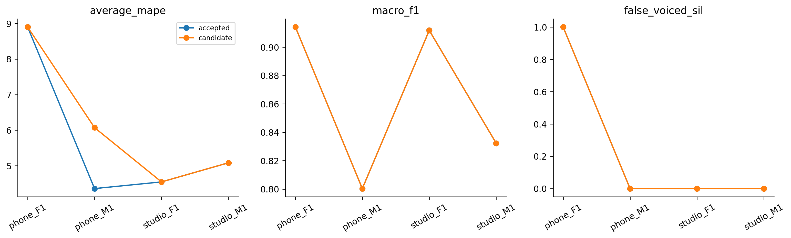

# H29 — cổng V/UV cho cao độ Harvest

| model | split | average_mape | F0mean_mape | F0std_mape | F0num_mape | F0mean_abs_error | F0std_abs_error | macro_f1 | balanced_accuracy | recall_v | recall_uv | TP | TN | FP | FN | false_voiced_sil | F0num |
| --- | --- | --- | --- | --- | --- | --- | --- | --- | --- | --- | --- | --- | --- | --- | --- | --- | --- |
| accepted | train | 3.68347 | 0.748182 | 3.74868 | 6.55355 | 1.22338 | 0.993858 | 0.869716 | 0.923173 | 0.881409 | 0.964937 | 539 | 171 | 9 | 75 | 0 | 548 |
| accepted | lofo | 5.72165 | 0.800826 | 9.45935 | 6.90476 | 1.36134 | 2.19703 | 0.864626 | 0.92062 | 0.876303 | 0.964937 | 535 | 171 | 9 | 79 | 1 | 545 |
| accepted | nested | 5.72165 | 0.800826 | 9.45935 | 6.90476 | 1.36134 | 2.19703 | 0.864626 | 0.92062 | 0.876303 | 0.964937 | 535 | 171 | 9 | 79 | 1 | 545 |
| candidate | train | 3.92546 | 0.569716 | 4.6531 | 6.55355 | 0.89624 | 1.06664 | 0.869716 | 0.923173 | 0.881409 | 0.964937 | 539 | 171 | 9 | 75 | 0 | 548 |
| candidate | lofo | 4.06068 | 0.475826 | 4.80146 | 6.90476 | 0.724011 | 1.1209 | 0.864626 | 0.92062 | 0.876303 | 0.964937 | 535 | 171 | 9 | 79 | 1 | 545 |
| candidate | nested | 6.14982 | 0.765117 | 10.7796 | 6.90476 | 1.31717 | 2.41883 | 0.864626 | 0.92062 | 0.876303 | 0.964937 | 535 | 171 | 9 | 79 | 1 | 545 |

Một thay đổi: gate của pipeline Harvest, giữ pitch Harvest raw 70–400 Hz/bước10ms. Bốn lựa chọn: AMDF H24 control; Harvest không gate; Harvest + energy; Harvest + cổng energy và AMDF_score25ms đang dùng ở control. Energy fit V/SIL bằng balanced accuracy; AMDF pitch threshold fit V/UV như baseline. Không thêm noise/filter/StoneMask/median hoặc thay candidate Harvest.

Harvest raw được ghép vào lưới chấm canonical25/10 trước gate; tâm gần nhất trong nửa hop + một mẫu, hòa chọn sớm hơn. Không dùng nhãn/GT của held file để gate, không điều chỉnh count theo GT và không fallback khi Harvest UV. native_frames/native_f0_count là output Harvest trước gate; F0num là số khung còn lại trên lưới chấm. Inner chọn worst-file MAPE rồi mean/ID; outer held bị loại khỏi fit và selection. Kết quả vẫn exploratory do lịch sử nghiên cứu bốn file.

## Gate

~~~json
{
  "checks": {
    "train_mape_relative_10_percent": false,
    "lofo_mape_relative_5_percent": false,
    "lofo_f1_drop_at_most_01": true,
    "lofo_recall_v_drop_at_most_01": true,
    "lofo_sil_increase_at_most_1": true,
    "lofo_no_file_mape_worse_by_over_2pp": true,
    "lofo_phone_f1_std_not_worse": true,
    "selected_lofo_mape_relative_5_percent": true
  },
  "eligible": false,
  "nested_status": "Outer file excluded from every inner fit and selection; selected LOFO is separate.",
  "champion_promoted": false
}
~~~

## Selections

| outer_held | id | frame_ms | hop_ms | pitch_frame_ms | gate |
| --- | --- | --- | --- | --- | --- |
| final | harvest_amdf | 25 | 10 | nan | amdf |
| phone_F1.wav | amdf_control | 25 | 10 | 40 | control |
| phone_M1.wav | harvest_amdf | 25 | 10 | nan | amdf |
| studio_F1.wav | amdf_control | 25 | 10 | 40 | control |
| studio_M1.wav | amdf_control | 25 | 10 | 40 | control |

## Mọi cấu hình fixed LOFO

| option_id | file | average_mape | F0mean_mape | F0std_mape | F0num_mape | macro_f1 | recall_v | false_voiced_sil |
| --- | --- | --- | --- | --- | --- | --- | --- | --- |
| amdf_control | phone_F1.wav | 8.8999 | 1.00761 | 22.3137 | 3.37838 | 0.914139 | 0.908497 | 1 |
| amdf_control | phone_M1.wav | 4.35837 | 0.257548 | 2.90378 | 9.91379 | 0.800325 | 0.831967 | 0 |
| amdf_control | studio_F1.wav | 4.54561 | 0.611076 | 3.57692 | 9.44882 | 0.911765 | 0.934959 | 0 |
| amdf_control | studio_M1.wav | 5.08271 | 1.32708 | 9.043 | 4.87805 | 0.832276 | 0.829787 | 0 |
| harvest_raw | phone_F1.wav | 41.5178 | 2.07205 | 53.5624 | 68.9189 | 0.54576 | 1 | 38 |
| harvest_raw | phone_M1.wav | 42.6899 | 2.00849 | 82.0958 | 43.9655 | 0.572267 | 0.991803 | 39 |
| harvest_raw | studio_F1.wav | 47.9581 | 12.1977 | 51.3616 | 80.315 | 0.451493 | 0.98374 | 84 |
| harvest_raw | studio_M1.wav | 70.2577 | 13.3731 | 32.7657 | 164.634 | 0.691176 | 0.989362 | 107 |
| harvest_energy | phone_F1.wav | 16.5034 | 0.1554 | 25.7063 | 23.6486 | 0.818726 | 0.993464 | 2 |
| harvest_energy | phone_M1.wav | 38.8981 | 2.09442 | 88.7377 | 25.8621 | 0.629373 | 0.987705 | 3 |
| harvest_energy | studio_F1.wav | 2.67813 | 1.00273 | 0.732446 | 6.29921 | 0.69778 | 0.95935 | 2 |
| harvest_energy | studio_M1.wav | 11.5571 | 2.78494 | 7.49625 | 24.3902 | 0.739796 | 0.946809 | 0 |
| harvest_amdf | phone_F1.wav | 1.56569 | 0.11012 | 1.20858 | 3.37838 | 0.914139 | 0.908497 | 1 |
| harvest_amdf | phone_M1.wav | 6.07108 | 0.114712 | 8.18472 | 9.91379 | 0.800325 | 0.831967 | 0 |
| harvest_amdf | studio_F1.wav | 4.17611 | 0.492097 | 2.58741 | 9.44882 | 0.911765 | 0.934959 | 0 |
| harvest_amdf | studio_M1.wav | 4.42985 | 1.18637 | 7.22511 | 4.87805 | 0.832276 | 0.829787 | 0 |

## Nested per file

| model | file | average_mape | F0std_mape | F0num_mape | recall_v | false_voiced_sil | projection_coverage |
| --- | --- | --- | --- | --- | --- | --- | --- |
| accepted | phone_F1.wav | 8.8999 | 22.3137 | 3.37838 | 0.908497 | 1 | 1 |
| candidate | phone_F1.wav | 8.8999 | 22.3137 | 3.37838 | 0.908497 | 1 | 1 |
| accepted | phone_M1.wav | 4.35837 | 2.90378 | 9.91379 | 0.831967 | 0 | 1 |
| candidate | phone_M1.wav | 6.07108 | 8.18472 | 9.91379 | 0.831967 | 0 | 1 |
| accepted | studio_F1.wav | 4.54561 | 3.57692 | 9.44882 | 0.934959 | 0 | 1 |
| candidate | studio_F1.wav | 4.54561 | 3.57692 | 9.44882 | 0.934959 | 0 | 1 |
| accepted | studio_M1.wav | 5.08271 | 9.043 | 4.87805 | 0.829787 | 0 | 1 |
| candidate | studio_M1.wav | 5.08271 | 9.043 | 4.87805 | 0.829787 | 0 | 1 |

Mục tiêu mỗi file Average MAPE≤2% báo riêng. Không thay baseline gốc/frozen_config hoặc tự promote. Chỉ train local; không test/Drive/deep learning/PDF extraction. Ground truth là file-stat và loại đoạn, chưa có F0 chuẩn từng khung.

Lệnh: ../.venv-bt2-world/Scripts/python.exe research_workbench_2026_10_07/harvest_voicing.py H29
