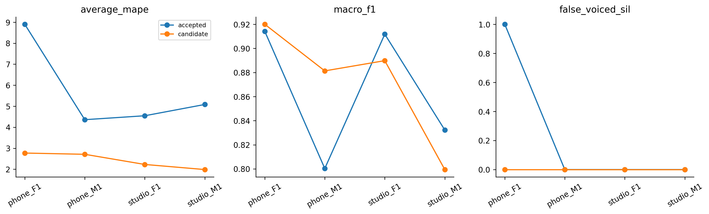

# H30 — Praat 7 native filtered autocorrelation

| model | split | average_mape | F0mean_mape | F0std_mape | F0num_mape | F0mean_abs_error | F0std_abs_error | macro_f1 | balanced_accuracy | recall_v | recall_uv | TP | TN | FP | FN | false_voiced_sil | F0num |
| --- | --- | --- | --- | --- | --- | --- | --- | --- | --- | --- | --- | --- | --- | --- | --- | --- | --- |
| accepted | train | 3.68347 | 0.748182 | 3.74868 | 6.55355 | 1.22338 | 0.993858 | 0.869716 | 0.923173 | 0.881409 | 0.964937 | 539 | 171 | 9 | 75 | 0 | 548 |
| accepted | lofo | 5.72165 | 0.800826 | 9.45935 | 6.90476 | 1.36134 | 2.19703 | 0.864626 | 0.92062 | 0.876303 | 0.964937 | 535 | 171 | 9 | 79 | 1 | 545 |
| accepted | nested | 5.72165 | 0.800826 | 9.45935 | 6.90476 | 1.36134 | 2.19703 | 0.864626 | 0.92062 | 0.876303 | 0.964937 | 535 | 171 | 9 | 79 | 1 | 545 |
| candidate | train | 2.15699 | 0.454685 | 2.25546 | 3.76083 | 0.809525 | 0.575542 | 0.879377 | 0.909652 | 0.908626 | 0.910678 | 561 | 170 | 10 | 53 | 0 | 571 |
| candidate | lofo | 2.15699 | 0.454685 | 2.25546 | 3.76083 | 0.809525 | 0.575542 | 0.879377 | 0.909652 | 0.908626 | 0.910678 | 561 | 170 | 10 | 53 | 0 | 571 |
| candidate | nested | 2.42285 | 0.34985 | 2.18805 | 4.73066 | 0.679843 | 0.564217 | 0.872629 | 0.90757 | 0.90043 | 0.91471 | 553 | 171 | 9 | 61 | 0 | 562 |

So sánh các pipeline tham chiếu với H24 AMDF control. Praat7 raw dùng ceiling400/silence.03/octave.01/voicing.45. Native filtered dùng top800/attenuation.03/silence.09/octave.055 và voicing.45/.50/.55. Cùng floor70/step10ms/15candidates/veryaccuratefalse/jump.35/VUVcost.14. Đây là so sánh pipeline, không cô lập chỉ một filter vì defaults và candidate top khác nhau.

Filtered pitch top800 vừa định nghĩa Gaussian attenuation vừa giới hạn candidate; range output chấm70–400 giữ chung: native selectedF0 ngoài range bị gọiUV/F0NaN, không đổi thành candidate khác. Ghi số bị loại và lưu tất cả native selectedF0 trước range policy. Ghép nearest native center về canonical25/10 trong nửa hop cộng một mẫu; không padding/fallback/GT-count trim. Praat không fit; inner chọn worst-file MAPE rồi mean/ID. Outer held không tham gia chọn cấu hình. Nested vẫn exploratory vì lịch sử nghiên cứu bốn file.

Native executable7.0.02 portable có ZIP digest khớp release asset; binary hash/version/command/script/adapter được lưu. Script chỉ xuất stdout, Python parse UTF-16LE, không FULL-TRUST. Probe tone173Hz/silence ở16k/44.1k qua trước benchmark; không chứng minh speech accuracy.

## Gate

~~~json
{
  "checks": {
    "train_mape_relative_10_percent": true,
    "lofo_mape_relative_5_percent": true,
    "lofo_f1_drop_at_most_01": true,
    "lofo_recall_v_drop_at_most_01": true,
    "lofo_sil_increase_at_most_1": true,
    "lofo_no_file_mape_worse_by_over_2pp": true,
    "lofo_phone_f1_std_not_worse": true,
    "selected_lofo_mape_relative_5_percent": true
  },
  "eligible": true,
  "nested_status": "Outer file excluded from every inner fit and selection; selected LOFO is separate.",
  "champion_promoted": false
}
~~~

## Selections

| outer_held | id | frame_ms | hop_ms | pitch_frame_ms | method | voicing_threshold |
| --- | --- | --- | --- | --- | --- | --- |
| final | praat7_filtered_v0.45 | 42.8571 | 10 | 42.8571 | filtered | 0.45 |
| phone_F1.wav | praat7_filtered_v0.45 | 42.8571 | 10 | 42.8571 | filtered | 0.45 |
| phone_M1.wav | praat7_filtered_v0.55 | 42.8571 | 10 | 42.8571 | filtered | 0.55 |
| studio_F1.wav | praat7_filtered_v0.45 | 42.8571 | 10 | 42.8571 | filtered | 0.45 |
| studio_M1.wav | praat7_filtered_v0.45 | 42.8571 | 10 | 42.8571 | filtered | 0.45 |

## Mọi cấu hình fixed LOFO

| option_id | file | average_mape | F0mean_mape | F0std_mape | F0num_mape | macro_f1 | recall_v | false_voiced_sil |
| --- | --- | --- | --- | --- | --- | --- | --- | --- |
| amdf_control | phone_F1.wav | 8.8999 | 1.00761 | 22.3137 | 3.37838 | 0.914139 | 0.908497 | 1 |
| amdf_control | phone_M1.wav | 4.35837 | 0.257548 | 2.90378 | 9.91379 | 0.800325 | 0.831967 | 0 |
| amdf_control | studio_F1.wav | 4.54561 | 0.611076 | 3.57692 | 9.44882 | 0.911765 | 0.934959 | 0 |
| amdf_control | studio_M1.wav | 5.08271 | 1.32708 | 9.043 | 4.87805 | 0.832276 | 0.829787 | 0 |
| praat7_raw_v0.45 | phone_F1.wav | 20.9256 | 1.98135 | 55.39 | 5.40541 | 0.915885 | 0.947712 | 3 |
| praat7_raw_v0.45 | phone_M1.wav | 6.57317 | 0.0587826 | 19.2297 | 0.431034 | 0.881202 | 0.92623 | 0 |
| praat7_raw_v0.45 | studio_F1.wav | 3.36749 | 0.465202 | 2.55064 | 7.08661 | 0.919439 | 0.95122 | 0 |
| praat7_raw_v0.45 | studio_M1.wav | 0.753407 | 0.169407 | 0.871301 | 1.21951 | 0.834676 | 0.861702 | 0 |
| praat7_filtered_v0.45 | phone_F1.wav | 2.76986 | 0.0766879 | 2.1518 | 6.08108 | 0.919971 | 0.901961 | 0 |
| praat7_filtered_v0.45 | phone_M1.wav | 1.64701 | 0.797475 | 1.55734 | 2.58621 | 0.908301 | 0.922131 | 0 |
| praat7_filtered_v0.45 | studio_F1.wav | 2.22688 | 0.871402 | 1.87223 | 3.93701 | 0.889796 | 0.95935 | 0 |
| praat7_filtered_v0.45 | studio_M1.wav | 1.98422 | 0.0731761 | 3.44047 | 2.43902 | 0.799438 | 0.851064 | 0 |
| praat7_filtered_v0.5 | phone_F1.wav | 3.09868 | 0.112313 | 2.42696 | 6.75676 | 0.915235 | 0.895425 | 0 |
| praat7_filtered_v0.5 | phone_M1.wav | 2.21607 | 0.711604 | 2.05731 | 3.87931 | 0.896064 | 0.909836 | 0 |
| praat7_filtered_v0.5 | studio_F1.wav | 3.39761 | 0.720095 | 3.17352 | 6.29921 | 0.906548 | 0.95122 | 0 |
| praat7_filtered_v0.5 | studio_M1.wav | 1.7707 | 0.181967 | 3.91063 | 1.21951 | 0.794921 | 0.829787 | 0 |
| praat7_filtered_v0.55 | phone_F1.wav | 3.09868 | 0.112313 | 2.42696 | 6.75676 | 0.915235 | 0.895425 | 0 |
| praat7_filtered_v0.55 | phone_M1.wav | 2.71045 | 0.378135 | 1.28769 | 6.46552 | 0.881312 | 0.889344 | 0 |
| praat7_filtered_v0.55 | studio_F1.wav | 3.39761 | 0.720095 | 3.17352 | 6.29921 | 0.906548 | 0.95122 | 0 |
| praat7_filtered_v0.55 | studio_M1.wav | 4.57086 | 0.952577 | 7.88194 | 4.87805 | 0.811311 | 0.819149 | 0 |

## Nested per file

| model | file | average_mape | F0std_mape | F0num_mape | recall_v | false_voiced_sil | projection_coverage |
| --- | --- | --- | --- | --- | --- | --- | --- |
| accepted | phone_F1.wav | 8.8999 | 22.3137 | 3.37838 | 0.908497 | 1 | 1 |
| candidate | phone_F1.wav | 2.76986 | 2.1518 | 6.08108 | 0.901961 | 0 | 0.993789 |
| accepted | phone_M1.wav | 4.35837 | 2.90378 | 9.91379 | 0.831967 | 0 | 1 |
| candidate | phone_M1.wav | 2.71045 | 1.28769 | 6.46552 | 0.889344 | 0 | 0.995169 |
| accepted | studio_F1.wav | 4.54561 | 3.57692 | 9.44882 | 0.934959 | 0 | 1 |
| candidate | studio_F1.wav | 2.22688 | 1.87223 | 3.93701 | 0.95935 | 0 | 0.996479 |
| accepted | studio_M1.wav | 5.08271 | 9.043 | 4.87805 | 0.829787 | 0 | 1 |
| candidate | studio_M1.wav | 1.98422 | 3.44047 | 2.43902 | 0.851064 | 0 | 0.99262 |

Mục tiêu mỗi file Average MAPE≤2% báo riêng. Không thay baseline gốc/frozen_config hoặc tự promote. Chỉ train local; không test/Drive/deep learning/PDF extraction. Ground truth là file-stat và loại đoạn, không F0 chuẩn từng khung.

Primary manual: https://www.fon.hum.uva.nl/praat/manual/pitch_analysis_by_filtered_autocorrelation.html

Lệnh: C:/Users/violet/miniconda3/python.exe research_workbench_2026_10_07/praat_filtered_reference.py H30
