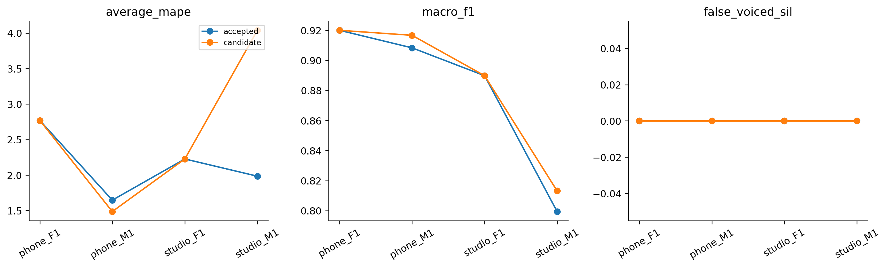

# H31 — ngưỡng hữu thanh của Praat filtered

| model | split | average_mape | F0mean_mape | F0std_mape | F0num_mape | F0mean_abs_error | F0std_abs_error | macro_f1 | balanced_accuracy | recall_v | recall_uv | TP | TN | FP | FN | false_voiced_sil | F0num |
| --- | --- | --- | --- | --- | --- | --- | --- | --- | --- | --- | --- | --- | --- | --- | --- | --- | --- |
| accepted | train | 2.15699 | 0.454685 | 2.25546 | 3.76083 | 0.809525 | 0.575542 | 0.879377 | 0.909652 | 0.908626 | 0.910678 | 561 | 170 | 10 | 53 | 0 | 571 |
| accepted | lofo | 2.15699 | 0.454685 | 2.25546 | 3.76083 | 0.809525 | 0.575542 | 0.879377 | 0.909652 | 0.908626 | 0.910678 | 561 | 170 | 10 | 53 | 0 | 571 |
| accepted | nested | 2.15699 | 0.454685 | 2.25546 | 3.76083 | 0.809525 | 0.575542 | 0.879377 | 0.909652 | 0.908626 | 0.910678 | 561 | 170 | 10 | 53 | 0 | 571 |
| candidate | train | 2.09258 | 0.488112 | 2.27726 | 3.51235 | 0.860956 | 0.585083 | 0.886103 | 0.91364 | 0.916603 | 0.910678 | 566 | 170 | 10 | 48 | 0 | 576 |
| candidate | lofo | 2.09258 | 0.488112 | 2.27726 | 3.51235 | 0.860956 | 0.585083 | 0.886103 | 0.91364 | 0.916603 | 0.910678 | 566 | 170 | 10 | 48 | 0 | 576 |
| candidate | nested | 2.63049 | 0.481854 | 2.6448 | 4.76483 | 0.84383 | 0.672795 | 0.8849 | 0.909666 | 0.918654 | 0.900678 | 566 | 169 | 11 | 48 | 0 | 577 |

Một tham số được thay: voicing threshold .25/.30/.35/.40/.45. Control H30 native filtered.45. Giữ Praat7.0.02, floor70/top800/attenuation.03, silence.09, octave.055, jump.35,VUV.14, max15, veryaccuratefalse, step10ms và range output70–400. Không thêm gate/filter/median/noise hoặc đổi window/range/metric.

Top800 là giới hạn candidate và điểm Gaussian attenuation; native selectedF0 ngoài output range70–400 nhậnUV/NaN. Lưu raw native frames và số range rejected. Ghép nearest native center vào canonical25/10 trong halfhop+một mẫu, hòa sớm hơn, không padding/fallback/GT-count trim. Praat không fit; inner chọn worst-file MAPE rồi mean/ID. Outer held không chọn cấu hình. Nested exploratory vì lịch sử nghiên cứu bốn file.

Baseline thí nghiệm này là H30 fixed0.45 đã qua8gate, không ghi đè originalAMDF/frozen_config. Native calls/binary/script/adapter/source/WAV hashes được giữ; probe đã qua trước đo.

## Gate

~~~json
{
  "checks": {
    "train_mape_relative_10_percent": false,
    "lofo_mape_relative_5_percent": false,
    "lofo_f1_drop_at_most_01": true,
    "lofo_recall_v_drop_at_most_01": true,
    "lofo_sil_increase_at_most_1": true,
    "lofo_no_file_mape_worse_by_over_2pp": false,
    "lofo_phone_f1_std_not_worse": true,
    "selected_lofo_mape_relative_5_percent": false
  },
  "eligible": false,
  "nested_status": "Outer file excluded from every inner fit and selection; selected LOFO is separate.",
  "champion_promoted": false
}
~~~

## Selections

| outer_held | id | frame_ms | hop_ms | pitch_frame_ms | method | voicing_threshold |
| --- | --- | --- | --- | --- | --- | --- |
| final | praat7_filtered_v0.4 | 42.8571 | 10 | 42.8571 | filtered | 0.4 |
| phone_F1.wav | praat7_filtered_v0.45 | 42.8571 | 10 | 42.8571 | filtered | 0.45 |
| phone_M1.wav | praat7_filtered_v0.4 | 42.8571 | 10 | 42.8571 | filtered | 0.4 |
| studio_F1.wav | praat7_filtered_v0.4 | 42.8571 | 10 | 42.8571 | filtered | 0.4 |
| studio_M1.wav | praat7_filtered_v0.25 | 42.8571 | 10 | 42.8571 | filtered | 0.25 |

## Mọi cấu hình fixed LOFO

| option_id | file | average_mape | F0mean_mape | F0std_mape | F0num_mape | macro_f1 | recall_v | false_voiced_sil |
| --- | --- | --- | --- | --- | --- | --- | --- | --- |
| praat7_filtered_v0.25 | phone_F1.wav | 0.740586 | 0.0864743 | 0.108256 | 2.02703 | 0.93877 | 0.934641 | 0 |
| praat7_filtered_v0.25 | phone_M1.wav | 1.20109 | 0.926364 | 1.81482 | 0.862069 | 0.923562 | 0.946721 | 0 |
| praat7_filtered_v0.25 | studio_F1.wav | 1.33818 | 0.518612 | 1.13373 | 2.3622 | 0.886037 | 0.96748 | 0 |
| praat7_filtered_v0.25 | studio_M1.wav | 4.03885 | 0.0321355 | 4.76733 | 7.31707 | 0.813187 | 0.882979 | 0 |
| praat7_filtered_v0.3 | phone_F1.wav | 0.595007 | 0.257478 | 0.851866 | 0.675676 | 0.938333 | 0.941176 | 0 |
| praat7_filtered_v0.3 | phone_M1.wav | 1.01526 | 1.00921 | 1.60553 | 0.431034 | 0.928721 | 0.946721 | 0 |
| praat7_filtered_v0.3 | studio_F1.wav | 1.70384 | 0.67006 | 1.29187 | 3.14961 | 0.900407 | 0.96748 | 0 |
| praat7_filtered_v0.3 | studio_M1.wav | 3.17572 | 0.412037 | 5.45659 | 3.65854 | 0.808446 | 0.861702 | 0 |
| praat7_filtered_v0.35 | phone_F1.wav | 2.11846 | 0.116447 | 1.5092 | 4.72973 | 0.929524 | 0.915033 | 0 |
| praat7_filtered_v0.35 | phone_M1.wav | 0.794745 | 0.931848 | 1.45239 | 0 | 0.92437 | 0.942623 | 0 |
| praat7_filtered_v0.35 | studio_F1.wav | 1.70384 | 0.67006 | 1.29187 | 3.14961 | 0.900407 | 0.96748 | 0 |
| praat7_filtered_v0.35 | studio_M1.wav | 3.17572 | 0.412037 | 5.45659 | 3.65854 | 0.808446 | 0.861702 | 0 |
| praat7_filtered_v0.4 | phone_F1.wav | 2.11846 | 0.116447 | 1.5092 | 4.72973 | 0.929524 | 0.915033 | 0 |
| praat7_filtered_v0.4 | phone_M1.wav | 1.48639 | 0.947189 | 1.78784 | 1.72414 | 0.916646 | 0.930328 | 0 |
| praat7_filtered_v0.4 | studio_F1.wav | 2.22688 | 0.871402 | 1.87223 | 3.93701 | 0.889796 | 0.95935 | 0 |
| praat7_filtered_v0.4 | studio_M1.wav | 2.53857 | 0.0174086 | 3.93978 | 3.65854 | 0.808446 | 0.861702 | 0 |
| praat7_filtered_v0.45 | phone_F1.wav | 2.76986 | 0.0766879 | 2.1518 | 6.08108 | 0.919971 | 0.901961 | 0 |
| praat7_filtered_v0.45 | phone_M1.wav | 1.64701 | 0.797475 | 1.55734 | 2.58621 | 0.908301 | 0.922131 | 0 |
| praat7_filtered_v0.45 | studio_F1.wav | 2.22688 | 0.871402 | 1.87223 | 3.93701 | 0.889796 | 0.95935 | 0 |
| praat7_filtered_v0.45 | studio_M1.wav | 1.98422 | 0.0731761 | 3.44047 | 2.43902 | 0.799438 | 0.851064 | 0 |

## Nested per file

| model | file | average_mape | F0std_mape | F0num_mape | recall_v | false_voiced_sil | projection_coverage |
| --- | --- | --- | --- | --- | --- | --- | --- |
| accepted | phone_F1.wav | 2.76986 | 2.1518 | 6.08108 | 0.901961 | 0 | 0.993789 |
| candidate | phone_F1.wav | 2.76986 | 2.1518 | 6.08108 | 0.901961 | 0 | 0.993789 |
| accepted | phone_M1.wav | 1.64701 | 1.55734 | 2.58621 | 0.922131 | 0 | 0.995169 |
| candidate | phone_M1.wav | 1.48639 | 1.78784 | 1.72414 | 0.930328 | 0 | 0.995169 |
| accepted | studio_F1.wav | 2.22688 | 1.87223 | 3.93701 | 0.95935 | 0 | 0.996479 |
| candidate | studio_F1.wav | 2.22688 | 1.87223 | 3.93701 | 0.95935 | 0 | 0.996479 |
| accepted | studio_M1.wav | 1.98422 | 3.44047 | 2.43902 | 0.851064 | 0 | 0.99262 |
| candidate | studio_M1.wav | 4.03885 | 4.76733 | 7.31707 | 0.882979 | 0 | 0.99262 |

Mục tiêu mỗi file Average MAPE≤2% báo riêng. Không auto-promote; chỉ local train, không test/Drive/deep learning/PDF extraction. LAB chưa có F0 chuẩn từng khung.

Lệnh: C:/Users/violet/miniconda3/python.exe research_workbench_2026_10_07/praat_voicing_threshold.py H31
