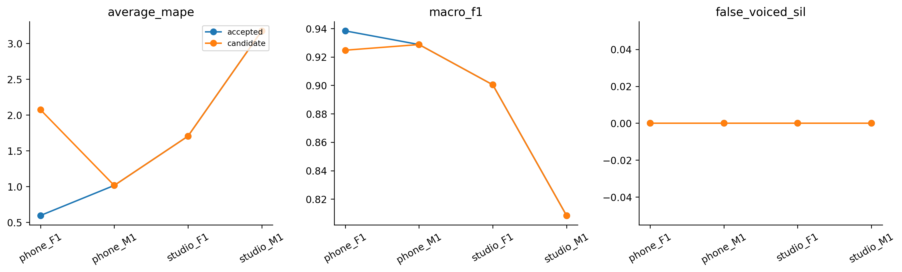

# H32 — ngưỡng silence của Praat filtered

| model | split | average_mape | F0mean_mape | F0std_mape | F0num_mape | F0mean_abs_error | F0std_abs_error | macro_f1 | balanced_accuracy | recall_v | recall_uv | TP | TN | FP | FN | false_voiced_sil | F0num |
| --- | --- | --- | --- | --- | --- | --- | --- | --- | --- | --- | --- | --- | --- | --- | --- | --- | --- |
| accepted | train | 1.62246 | 0.587195 | 2.30146 | 1.97871 | 0.95591 | 0.59029 | 0.893977 | 0.914335 | 0.92927 | 0.899399 | 575 | 167 | 13 | 39 | 0 | 588 |
| accepted | lofo | 1.62246 | 0.587195 | 2.30146 | 1.97871 | 0.95591 | 0.59029 | 0.893977 | 0.914335 | 0.92927 | 0.899399 | 575 | 167 | 13 | 39 | 0 | 588 |
| accepted | nested | 1.62246 | 0.587195 | 2.30146 | 1.97871 | 0.95591 | 0.59029 | 0.893977 | 0.914335 | 0.92927 | 0.899399 | 575 | 167 | 13 | 39 | 0 | 588 |
| candidate | train | 1.62246 | 0.587195 | 2.30146 | 1.97871 | 0.95591 | 0.59029 | 0.893977 | 0.914335 | 0.92927 | 0.899399 | 575 | 167 | 13 | 39 | 0 | 588 |
| candidate | lofo | 1.62246 | 0.587195 | 2.30146 | 1.97871 | 0.95591 | 0.59029 | 0.893977 | 0.914335 | 0.92927 | 0.899399 | 575 | 167 | 13 | 39 | 0 | 588 |
| candidate | nested | 1.99215 | 0.536072 | 2.27924 | 3.16115 | 0.845687 | 0.585713 | 0.890577 | 0.913873 | 0.9211 | 0.906646 | 570 | 169 | 11 | 44 | 0 | 581 |

Một tham số được thay: silence threshold .09/.11/.13/.15. Control H31 fixedvoicing.30/silence.09. Giữ Praat7.0.02, voicing.30, floor70/top800/attenuation.03, octave.055, jump.35,VUV.14, max15, veryaccuratefalse, step10ms và output70–400. Không thêm filter/gate/median/noise hoặc đổi frame/hop/range/metric.

Silence cao hơn có thể bỏ các đoạn yếu nhưng cũng bỏ V thật; không giả định các khung dư studio_M1 là false voiced. LAB chỉ có nhãn đoạn và file-stat, chưa có F0 chuẩn từng khung. Lưu mọi native F0 trước range/projection, command/binary/script/adapter hashes. Inner chọn worst-file MAPE rồi mean/ID; outer held không tham gia chọn cấu hình. Các kết quả vẫn exploratory do lịch sử nghiên cứu bốn file.

## Gate

~~~json
{
  "checks": {
    "train_mape_relative_10_percent": false,
    "lofo_mape_relative_5_percent": false,
    "lofo_f1_drop_at_most_01": true,
    "lofo_recall_v_drop_at_most_01": true,
    "lofo_sil_increase_at_most_1": true,
    "lofo_no_file_mape_worse_by_over_2pp": true,
    "lofo_phone_f1_std_not_worse": true,
    "selected_lofo_mape_relative_5_percent": false
  },
  "eligible": false,
  "nested_status": "Outer file excluded from every inner fit and selection; selected LOFO is separate.",
  "champion_promoted": false
}
~~~

## Selections

| outer_held | id | frame_ms | hop_ms | pitch_frame_ms | method | voicing_threshold | silence_threshold |
| --- | --- | --- | --- | --- | --- | --- | --- |
| final | praat7_filtered_s0.09 | 42.8571 | 10 | 42.8571 | filtered | 0.3 | 0.09 |
| phone_F1.wav | praat7_filtered_s0.11 | 42.8571 | 10 | 42.8571 | filtered | 0.3 | 0.11 |
| phone_M1.wav | praat7_filtered_s0.09 | 42.8571 | 10 | 42.8571 | filtered | 0.3 | 0.09 |
| studio_F1.wav | praat7_filtered_s0.09 | 42.8571 | 10 | 42.8571 | filtered | 0.3 | 0.09 |
| studio_M1.wav | praat7_filtered_s0.09 | 42.8571 | 10 | 42.8571 | filtered | 0.3 | 0.09 |

## Mọi cấu hình fixed LOFO

| option_id | file | average_mape | F0mean_mape | F0std_mape | F0num_mape | macro_f1 | recall_v | false_voiced_sil |
| --- | --- | --- | --- | --- | --- | --- | --- | --- |
| praat7_filtered_s0.09 | phone_F1.wav | 0.595007 | 0.257478 | 0.851866 | 0.675676 | 0.938333 | 0.941176 | 0 |
| praat7_filtered_s0.09 | phone_M1.wav | 1.01526 | 1.00921 | 1.60553 | 0.431034 | 0.928721 | 0.946721 | 0 |
| praat7_filtered_s0.09 | studio_F1.wav | 1.70384 | 0.67006 | 1.29187 | 3.14961 | 0.900407 | 0.96748 | 0 |
| praat7_filtered_s0.09 | studio_M1.wav | 3.17572 | 0.412037 | 5.45659 | 3.65854 | 0.808446 | 0.861702 | 0 |
| praat7_filtered_s0.11 | phone_F1.wav | 2.07379 | 0.0529838 | 0.762994 | 5.40541 | 0.924734 | 0.908497 | 0 |
| praat7_filtered_s0.11 | phone_M1.wav | 0.93504 | 1.0299 | 1.34418 | 0.431034 | 0.920061 | 0.938525 | 0 |
| praat7_filtered_s0.11 | studio_F1.wav | 2.8152 | 0.583719 | 3.13746 | 4.72441 | 0.903607 | 0.95935 | 0 |
| praat7_filtered_s0.11 | studio_M1.wav | 2.70257 | 0.144646 | 5.52405 | 2.43902 | 0.799438 | 0.851064 | 0 |
| praat7_filtered_s0.13 | phone_F1.wav | 4.76993 | 0.701044 | 1.44657 | 12.1622 | 0.887935 | 0.849673 | 0 |
| praat7_filtered_s0.13 | phone_M1.wav | 1.71004 | 0.963847 | 1.58007 | 2.58621 | 0.908301 | 0.922131 | 0 |
| praat7_filtered_s0.13 | studio_F1.wav | 3.78386 | 0.944981 | 4.10739 | 6.29921 | 0.883185 | 0.943089 | 0 |
| praat7_filtered_s0.13 | studio_M1.wav | 2.37243 | 0.155797 | 5.74198 | 1.21951 | 0.79059 | 0.840426 | 0 |
| praat7_filtered_s0.15 | phone_F1.wav | 4.89305 | 0.727101 | 1.1142 | 12.8378 | 0.883373 | 0.843137 | 0 |
| praat7_filtered_s0.15 | phone_M1.wav | 2.3574 | 0.67446 | 0.794291 | 5.60345 | 0.880238 | 0.893443 | 0 |
| praat7_filtered_s0.15 | studio_F1.wav | 3.91568 | 0.955731 | 3.7047 | 7.08661 | 0.873405 | 0.934959 | 0 |
| praat7_filtered_s0.15 | studio_M1.wav | 4.09032 | 1.07368 | 8.75826 | 2.43902 | 0.807651 | 0.829787 | 0 |

## Nested per file

| model | file | average_mape | F0std_mape | F0num_mape | recall_v | false_voiced_sil | projection_coverage |
| --- | --- | --- | --- | --- | --- | --- | --- |
| accepted | phone_F1.wav | 0.595007 | 0.851866 | 0.675676 | 0.941176 | 0 | 0.993789 |
| candidate | phone_F1.wav | 2.07379 | 0.762994 | 5.40541 | 0.908497 | 0 | 0.993789 |
| accepted | phone_M1.wav | 1.01526 | 1.60553 | 0.431034 | 0.946721 | 0 | 0.995169 |
| candidate | phone_M1.wav | 1.01526 | 1.60553 | 0.431034 | 0.946721 | 0 | 0.995169 |
| accepted | studio_F1.wav | 1.70384 | 1.29187 | 3.14961 | 0.96748 | 0 | 0.996479 |
| candidate | studio_F1.wav | 1.70384 | 1.29187 | 3.14961 | 0.96748 | 0 | 0.996479 |
| accepted | studio_M1.wav | 3.17572 | 5.45659 | 3.65854 | 0.861702 | 0 | 0.99262 |
| candidate | studio_M1.wav | 3.17572 | 5.45659 | 3.65854 | 0.861702 | 0 | 0.99262 |

Mục tiêu mỗi file Average MAPE≤2% báo riêng. Không auto-promote; chỉ local train, không test/Drive/deep learning/PDF extraction. Bộ điều chỉnh threshold theo support duration chỉ là đề xuất chưa đo; Jev evaluation đã lỗi validation và không retry.

Lệnh: C:/Users/violet/miniconda3/python.exe research_workbench_2026_10_07/praat_silence_threshold.py H32
