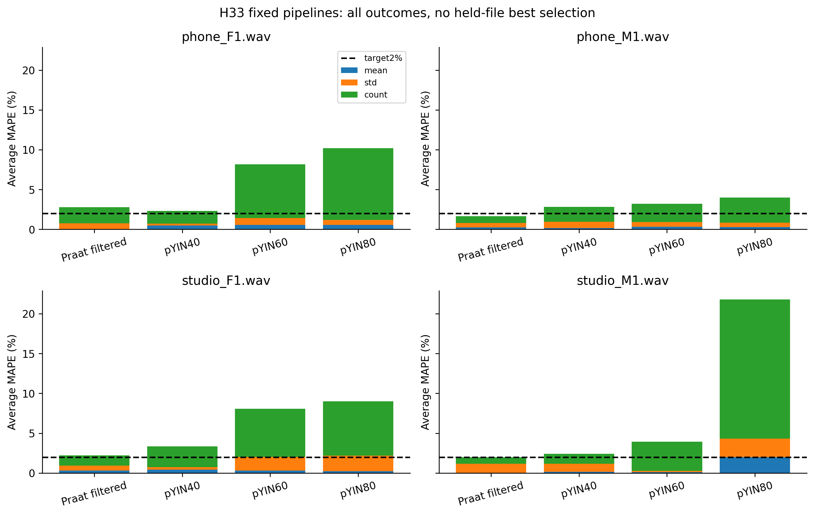
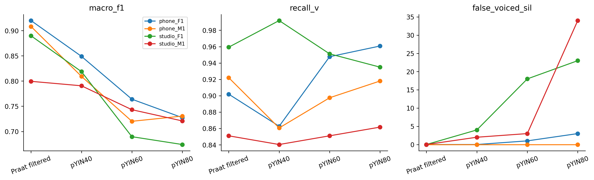

# H33 — pYIN thất bại ở đâu?

Phân tích mô tả kết quả đã hoàn tất, không search thêm hoặc đổi registry/gates. Native F0/voicing/probability được chiếu lại về canonical và tái lập fixed mean/std/count/TP/FN/FP/TN/SIL trước vẽ.

| option_id | mean_mape | worst_mape | mean_std_mape | mean_count_mape | macro_f1 | recall_v | false_voiced_uv | false_voiced_sil | worst_projection_coverage |
| --- | --- | --- | --- | --- | --- | --- | --- | --- | --- |
| praat7_filtered_v0.45 | 2.15699 | 2.76986 | 2.25546 | 3.76083 | 0.879377 | 0.908626 | 10 | 0 | 0.99262 |
| pyin_f40 | 2.7193 | 3.35583 | 1.76972 | 5.46643 | 0.816876 | 0.888924 | 33 | 6 | 0.99631 |
| pyin_f60 | 5.84381 | 8.16696 | 2.48744 | 14.0632 | 0.7292 | 0.911884 | 84 | 22 | 0.98893 |
| pyin_f80 | 11.2504 | 21.7893 | 4.10601 | 27.3553 | 0.713195 | 0.91887 | 93 | 60 | 0.98155 |

Cửa sổ40ms cho mean2.719295% và worst3.355827%, so controlmean2.156992%. F1 .816876 và recallV .888924 thấp hơn control .879377/.908626. SIL6 so0. Cửa sổ60/80ms mean5.843812/11.250381%; count MAPE tăng và SIL22/60. Final và cảbốnouter chọn control; nested2.156992% không đồng nghĩa pYIN đạt mức ấy.

Studio_M1 pYIN60 stdMAPE0.480383% nhưng countMAPE10.975610%, AverageMAPE3.915206%: chỉ giảmstd chưa đáp ứng mục tiêu. pYIN80 count125 so GT82, trong đó34SIL và10UV được nhận hữu thanh. Nhiều khung dư có nhãn UV/SIL; chưa có F0GTtừngkhung để phân loại toàn bộ lỗi cao độ. Không cắt count125 về82 theo GT.

Mất support biên cũng được báo: worstcoverage pYIN40/60/80 lầnlượt .996310/.988930/.981550. Nó không giải thích việc count tăng khi cửa sổ dài; voiced decisions thay đổi đồng thời. Không gán quan hệ nhân quả độc lập cho padding, Viterbi hoặc một tham số riêng vì đây là whole pipeline/window comparison.

Probability là output của pYIN trước/đi cùng decoding, không phải nhãn GT hoặc xác suất đã calibrated cho BT2. Bảng theo V/UV/SIL lưu mean probability với supported_frames và số flagV. Chưa dùng nó để áp threshold mới; giá trị sau Viterbi không được giả định bằng probability>0.5.

Dữ liệu: results/H33_fixed_lofo.csv, H33_raw_native_frames.csv, H33_nested_contours.csv. Bảng mới: H33_probability_by_label.csv và H33_error_summary.csv. Không đọc WAV/test, không PDF/Drive/deep learning/MCP retry.

Các pipeline SWIPE/REAPER vẫn chưa đo. Một cổng cho pYIN cần đăng ký và fit bằng training, không được lấy GT của heldfile làm ngưỡng hoặc coi ứng viên hiện tại là F0GT. Giữ cả thất bại và hạn chế lịch sử n4.
