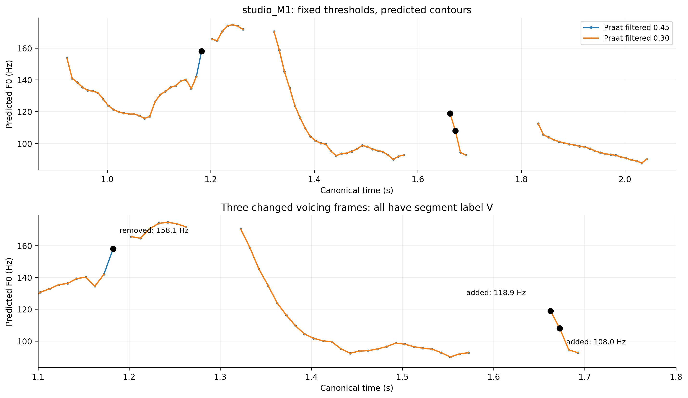

# Vì sao studio_M1 vẫn khó?

Đây là phân tích mô tả các phép đo đã lưu, không thử ngưỡng mới hoặc thay registry. Đã tái lập count/mean/std và V/UV/SIL của cả hai control từ contour trước khi so sánh.

## Đổi gate có thể đổi cả tập F0 được tính thống kê

| file | count_45 | count_30 | added_V_predictions | removed_V_predictions | changed_pitch_at_shared_V | added_in_label_V | added_in_label_UV | added_in_label_SIL | std_45_hz | std_30_hz | std_mape_45 | std_mape_30 |
| --- | --- | --- | --- | --- | --- | --- | --- | --- | --- | --- | --- | --- |
| phone_F1.wav | 139 | 147 | 8 | 0 | 0 | 6 | 2 | 0 | 21.0433 | 20.7755 | 2.1518 | 0.851866 |
| phone_M1.wav | 226 | 233 | 7 | 0 | 0 | 6 | 1 | 0 | 17.0616 | 17.0697 | 1.55734 | 1.60553 |
| studio_F1.wav | 122 | 123 | 1 | 0 | 0 | 1 | 0 | 0 | 36.111 | 36.3246 | 1.87223 | 1.29187 |
| studio_M1.wav | 84 | 85 | 2 | 1 | 0 | 2 | 0 | 0 | 25.4917 | 24.9595 | 3.44047 | 5.45659 |

Praat filtered0.30 có count85, so0.45 có84 ở studio_M1. Tuy ròng chỉ tăng một, mask đổi ba vị trí: một khung V158.1Hz bị bỏ, hai khung V118.9/108.0Hz được thêm. Các F0 ở khung V chung không đổi trong file này. Vì mean/std được tính trên tập F0 khác, giảm threshold không bảo đảm std gần GT hơn.

| file | time_s | label_30 | pred_voiced_45 | pred_voiced_30 | f0_hz_45 | f0_hz_30 | decision_change |
| --- | --- | --- | --- | --- | --- | --- | --- |
| studio_M1.wav | 1.18249 | v | True | False | 158.094 | nan | removed |
| studio_M1.wav | 1.66249 | v | False | True | nan | 118.882 | added |
| studio_M1.wav | 1.67249 | v | False | True | nan | 107.985 | added |

Cả ba vị trí có nhãn đoạn V. Điều đó không xác nhận tần số 158/119/108Hz đúng hoặc sai: LAB chưa có F0 chuẩn từng khung. Không gọi đây là ba false voiced SIL, octave errors hoặc ba pitch đã sửa đúng. Không xóa riêng các khung này hoặc route theo tên studio_M1 để đạt metric.

## H35 sửa nguồn F0 nhưng giữ nguyên tập khung

HybridSWIPE.3 dùng SWIPE tại76/85 khung nativeV và Praat fallback tại9/85 khung nativeV của studio_M1; không thiếu support thời gian tại khung gateV. FixedstdMAPE6.098275% so Praat.30 là5.456594%, countMAPE3.658537% giữ nguyên. AverageMAPE3.350733% so3.175722%. Do đó loại SIL dư của H34 chưa đủ để sửa vấn đề dispersion trong tập hữu thanh.

Trên ba file khác, hybrid.3 có AverageMAPE.700504/.616993/1.574769%; inner chọn nó khi outerstudio_M1 bị giữ lại. Heldstudio_M1 xấu thêm, nestedmean1.666210% socontrol1.622457%. Đây là counterexample cụ thể cho việc suy từ ba file tốt sang file còn lại; không chọn theo kết quả held để đổi quyết định.

Figures mọi threshold và components trong SWIPE_PRAAT_LOCAL.ipynb đã replay từ WAV. Các dòng CSV ở đây lấy từ output frozen, không đọc WAV/test, không chạy native mới. REAPER hoặc cổng thích nghi theo độ tin cậy/duration cần giả thuyết và registry riêng trước đo; chưa được chứng minh giúp BT2. Không dùng metadata giới tính làm selector từ bốn file.

Input/output SHA, tái lập thống kê, đếm thay đổi mask, labels và PNG/SVG lưu trong results/H35_gate_diagnostic_verification.json. Mục tiêu mỗi file≤2% chưa đạt; original/frozen giữ, không PDF/Drive/deep learning/MCP retry.
