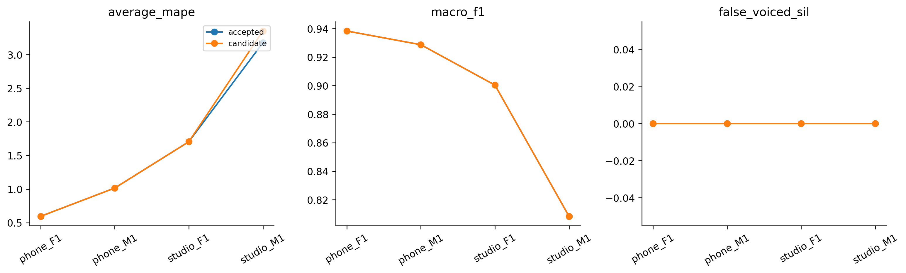

# H35 — SWIPE pitch with Praat voicing gate

| model | split | average_mape | F0mean_mape | F0std_mape | F0num_mape | F0mean_abs_error | F0std_abs_error | macro_f1 | balanced_accuracy | recall_v | recall_uv | TP | TN | FP | FN | false_voiced_sil | F0num |
| --- | --- | --- | --- | --- | --- | --- | --- | --- | --- | --- | --- | --- | --- | --- | --- | --- | --- |
| accepted | train | 1.62246 | 0.587195 | 2.30146 | 1.97871 | 0.95591 | 0.59029 | 0.893977 | 0.914335 | 0.92927 | 0.899399 | 575 | 167 | 13 | 39 | 0 | 588 |
| accepted | lofo | 1.62246 | 0.587195 | 2.30146 | 1.97871 | 0.95591 | 0.59029 | 0.893977 | 0.914335 | 0.92927 | 0.899399 | 575 | 167 | 13 | 39 | 0 | 588 |
| accepted | nested | 1.62246 | 0.587195 | 2.30146 | 1.97871 | 0.95591 | 0.59029 | 0.893977 | 0.914335 | 0.92927 | 0.899399 | 575 | 167 | 13 | 39 | 0 | 588 |
| candidate | train | 1.62246 | 0.587195 | 2.30146 | 1.97871 | 0.95591 | 0.59029 | 0.893977 | 0.914335 | 0.92927 | 0.899399 | 575 | 167 | 13 | 39 | 0 | 588 |
| candidate | lofo | 1.62246 | 0.587195 | 2.30146 | 1.97871 | 0.95591 | 0.59029 | 0.893977 | 0.914335 | 0.92927 | 0.899399 | 575 | 167 | 13 | 39 | 0 | 588 |
| candidate | nested | 1.66621 | 0.558033 | 2.46188 | 1.97871 | 0.921819 | 0.632641 | 0.893977 | 0.914335 | 0.92927 | 0.899399 | 575 | 167 | 13 | 39 | 0 | 588 |

Praat filtered .30 quyết định V/UV; SWIPE native strength .2/.3 chỉ thay F0 tại khung được Praat nhận hữu thanh và SWIPE có support/range hợp lệ. Nếu thiếu SWIPE, giữ F0 Praat (fallback), không thêm/bớt khung V. Control H31fixed.30. Cùng một gate cho toàn bộ file, không metadata/GTcount/held-stat routing.

SWIPE input restorePCM×32768 và output0-origin giữ H34. Hai lần nearest-time: SWIPE→nativePraatgrid, rồi hybrid→canonical; nửa hop+một mẫu, tiesearlier. Lưu raw hai nguồn, hybrid frequencies/source tags, commands/hashes. Không đổi V/UV, dùng probability/GT, trimcount, smooth hoặc chỉnh phân phối theo held-stat.

## Gate

~~~json
{
  "checks": {
    "train_mape_relative_10_percent": false,
    "lofo_mape_relative_5_percent": false,
    "lofo_f1_drop_at_most_01": true,
    "lofo_recall_v_drop_at_most_01": true,
    "lofo_sil_increase_at_most_1": true,
    "lofo_no_file_mape_worse_by_over_2pp": true,
    "lofo_phone_f1_std_not_worse": true,
    "selected_lofo_mape_relative_5_percent": false
  },
  "eligible": false,
  "nested_status": "Outer file excluded from every inner fit and selection; selected LOFO is separate.",
  "champion_promoted": false
}
~~~

## Selections

| outer_held | id | frame_ms | hop_ms | pitch_frame_ms | method | voicing_threshold | gate_voicing_threshold |
| --- | --- | --- | --- | --- | --- | --- | --- |
| final | praat7_filtered_v0.3 | 42.8571 | 10 | 42.8571 | control | 0.3 | nan |
| phone_F1.wav | praat7_filtered_v0.3 | 42.8571 | 10 | 42.8571 | control | 0.3 | nan |
| phone_M1.wav | praat7_filtered_v0.3 | 42.8571 | 10 | 42.8571 | control | 0.3 | nan |
| studio_F1.wav | praat7_filtered_v0.3 | 42.8571 | 10 | 42.8571 | control | 0.3 | nan |
| studio_M1.wav | praat_gate_swipe_t0.3 | 42.8571 | 10 | nan | hybrid | 0.3 | 0.3 |

## Mọi cấu hình fixed LOFO

| option_id | file | average_mape | F0mean_mape | F0std_mape | F0num_mape | macro_f1 | recall_v | false_voiced_sil | projection_coverage |
| --- | --- | --- | --- | --- | --- | --- | --- | --- | --- |
| praat7_filtered_v0.3 | phone_F1.wav | 0.595007 | 0.257478 | 0.851866 | 0.675676 | 0.938333 | 0.941176 | 0 | 0.993789 |
| praat7_filtered_v0.3 | phone_M1.wav | 1.01526 | 1.00921 | 1.60553 | 0.431034 | 0.928721 | 0.946721 | 0 | 0.995169 |
| praat7_filtered_v0.3 | studio_F1.wav | 1.70384 | 0.67006 | 1.29187 | 3.14961 | 0.900407 | 0.96748 | 0 | 0.996479 |
| praat7_filtered_v0.3 | studio_M1.wav | 3.17572 | 0.412037 | 5.45659 | 3.65854 | 0.808446 | 0.861702 | 0 | 0.99262 |
| praat_gate_swipe_t0.2 | phone_F1.wav | 0.6525 | 0.615572 | 0.666253 | 0.675676 | 0.938333 | 0.941176 | 0 | 0.993789 |
| praat_gate_swipe_t0.2 | phone_M1.wav | 0.716704 | 0.976851 | 0.742226 | 0.431034 | 0.928721 | 0.946721 | 0 | 0.995169 |
| praat_gate_swipe_t0.2 | studio_F1.wav | 1.7195 | 1.03535 | 0.973536 | 3.14961 | 0.900407 | 0.96748 | 0 | 0.996479 |
| praat_gate_swipe_t0.2 | studio_M1.wav | 4.0507 | 0.697273 | 7.7963 | 3.65854 | 0.808446 | 0.861702 | 0 | 0.99262 |
| praat_gate_swipe_t0.3 | phone_F1.wav | 0.700504 | 0.693302 | 0.732533 | 0.675676 | 0.938333 | 0.941176 | 0 | 0.993789 |
| praat_gate_swipe_t0.3 | phone_M1.wav | 0.616993 | 0.929964 | 0.489979 | 0.431034 | 0.928721 | 0.946721 | 0 | 0.995169 |
| praat_gate_swipe_t0.3 | studio_F1.wav | 1.57477 | 1.06479 | 0.509908 | 3.14961 | 0.900407 | 0.96748 | 0 | 0.996479 |
| praat_gate_swipe_t0.3 | studio_M1.wav | 3.35073 | 0.295388 | 6.09827 | 3.65854 | 0.808446 | 0.861702 | 0 | 0.99262 |

## Nested per file

| model | file | average_mape | F0std_mape | F0num_mape | recall_v | false_voiced_sil | projection_coverage |
| --- | --- | --- | --- | --- | --- | --- | --- |
| accepted | phone_F1.wav | 0.595007 | 0.851866 | 0.675676 | 0.941176 | 0 | 0.993789 |
| candidate | phone_F1.wav | 0.595007 | 0.851866 | 0.675676 | 0.941176 | 0 | 0.993789 |
| accepted | phone_M1.wav | 1.01526 | 1.60553 | 0.431034 | 0.946721 | 0 | 0.995169 |
| candidate | phone_M1.wav | 1.01526 | 1.60553 | 0.431034 | 0.946721 | 0 | 0.995169 |
| accepted | studio_F1.wav | 1.70384 | 1.29187 | 3.14961 | 0.96748 | 0 | 0.996479 |
| candidate | studio_F1.wav | 1.70384 | 1.29187 | 3.14961 | 0.96748 | 0 | 0.996479 |
| accepted | studio_M1.wav | 3.17572 | 5.45659 | 3.65854 | 0.861702 | 0 | 0.99262 |
| candidate | studio_M1.wav | 3.35073 | 6.09827 | 3.65854 | 0.861702 | 0 | 0.99262 |

Mục tiêu mỗi file≤2% riêng. No actualfit; inner minmax/mean/ID chỉ chọnthreshold. Outerheld khôngselection; lịch sửn4 làmnestedexploratory. LAB chỉfile-stat/nhãnđoạn, khôngF0từngkhung. Đây là wholepipeline comparison, không claim đãđọcfullpaper. Khôngpromote/test/Drive/deeplearning/PDF hoặcretryJev.

Lệnh: C:/Users/violet/miniconda3/python.exe research_workbench_2026_10_07/swipe_praat_hybrid.py H35
