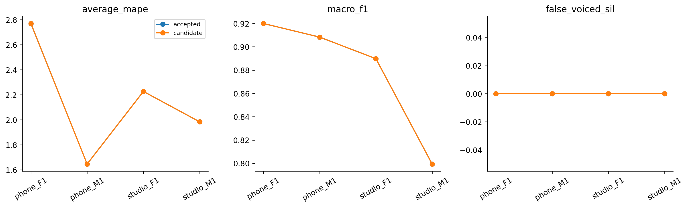

# H36 — reference pipeline REAPER

| model | split | average_mape | F0mean_mape | F0std_mape | F0num_mape | F0mean_abs_error | F0std_abs_error | macro_f1 | balanced_accuracy | recall_v | recall_uv | TP | TN | FP | FN | false_voiced_sil | F0num |
| --- | --- | --- | --- | --- | --- | --- | --- | --- | --- | --- | --- | --- | --- | --- | --- | --- | --- |
| accepted | train | 2.15699 | 0.454685 | 2.25546 | 3.76083 | 0.809525 | 0.575542 | 0.879377 | 0.909652 | 0.908626 | 0.910678 | 561 | 170 | 10 | 53 | 0 | 571 |
| accepted | lofo | 2.15699 | 0.454685 | 2.25546 | 3.76083 | 0.809525 | 0.575542 | 0.879377 | 0.909652 | 0.908626 | 0.910678 | 561 | 170 | 10 | 53 | 0 | 571 |
| accepted | nested | 2.15699 | 0.454685 | 2.25546 | 3.76083 | 0.809525 | 0.575542 | 0.879377 | 0.909652 | 0.908626 | 0.910678 | 561 | 170 | 10 | 53 | 0 | 571 |
| candidate | train | 2.15699 | 0.454685 | 2.25546 | 3.76083 | 0.809525 | 0.575542 | 0.879377 | 0.909652 | 0.908626 | 0.910678 | 561 | 170 | 10 | 53 | 0 | 571 |
| candidate | lofo | 2.15699 | 0.454685 | 2.25546 | 3.76083 | 0.809525 | 0.575542 | 0.879377 | 0.909652 | 0.908626 | 0.910678 | 561 | 170 | 10 | 53 | 0 | 571 |
| candidate | nested | 2.15699 | 0.454685 | 2.25546 | 3.76083 | 0.809525 | 0.575542 | 0.879377 | 0.909652 | 0.908626 | 0.910678 | 561 | 170 | 10 | 53 | 0 | 571 |

SPTK4.4 REAPER native, source commit0ebff5a. Registry unvoiced cost .6/.9/1.2/1.5; default.9, cost tăng khuyến khíchV. Hop10ms, range70–400Hz, fs gốc. LP residual/NCCF/lattice/dynamic programming/highpassFIR giữ theo source; không giả frame25ms. Control H30 Praat filtered fixed.45.

Input float64 little-endian PCM-scale×32768 rồi sourcecastint16; outputHz/UV0. Exactwholeinputzero được adapter trả0 mà không gọi native vì native noresidualpeaks; mọi input khác/nativeerror giữ vàdừng, không failure-to-zero. Native highpass=True/Hilbert=False; no agentfilter/noise/gate/resample/median. Time origin0 và sourceinternalresample/padding/truncation/repeatlast giữ nguyên. Projection nearestcenter canonical25/10, halfhop+1sample, tiesearlier; range70–400, lưu rawtrướcpolicy. Rawsyntheticfailedzero/subharmonic đượcgiữ, không claim tấtcảtoneaccuracyPASS.

## Gate

~~~json
{
  "checks": {
    "train_mape_relative_10_percent": false,
    "lofo_mape_relative_5_percent": false,
    "lofo_f1_drop_at_most_01": true,
    "lofo_recall_v_drop_at_most_01": true,
    "lofo_sil_increase_at_most_1": true,
    "lofo_no_file_mape_worse_by_over_2pp": true,
    "lofo_phone_f1_std_not_worse": true,
    "selected_lofo_mape_relative_5_percent": false
  },
  "eligible": false,
  "nested_status": "Outer file excluded from every inner fit and selection; selected LOFO is separate.",
  "champion_promoted": false
}
~~~

## Selections

| outer_held | id | frame_ms | hop_ms | pitch_frame_ms | method | voicing_threshold |
| --- | --- | --- | --- | --- | --- | --- |
| final | praat7_filtered_v0.45 | 42.8571 | 10 | 42.8571 | control | 0.45 |
| phone_F1.wav | praat7_filtered_v0.45 | 42.8571 | 10 | 42.8571 | control | 0.45 |
| phone_M1.wav | praat7_filtered_v0.45 | 42.8571 | 10 | 42.8571 | control | 0.45 |
| studio_F1.wav | praat7_filtered_v0.45 | 42.8571 | 10 | 42.8571 | control | 0.45 |
| studio_M1.wav | praat7_filtered_v0.45 | 42.8571 | 10 | 42.8571 | control | 0.45 |

## Mọi cấu hình fixed LOFO

| option_id | file | average_mape | F0mean_mape | F0std_mape | F0num_mape | macro_f1 | recall_v | false_voiced_sil | projection_coverage |
| --- | --- | --- | --- | --- | --- | --- | --- | --- | --- |
| praat7_filtered_v0.45 | phone_F1.wav | 2.76986 | 0.0766879 | 2.1518 | 6.08108 | 0.919971 | 0.901961 | 0 | 0.993789 |
| praat7_filtered_v0.45 | phone_M1.wav | 1.64701 | 0.797475 | 1.55734 | 2.58621 | 0.908301 | 0.922131 | 0 | 0.995169 |
| praat7_filtered_v0.45 | studio_F1.wav | 2.22688 | 0.871402 | 1.87223 | 3.93701 | 0.889796 | 0.95935 | 0 | 0.996479 |
| praat7_filtered_v0.45 | studio_M1.wav | 1.98422 | 0.0731761 | 3.44047 | 2.43902 | 0.799438 | 0.851064 | 0 | 0.99262 |
| reaper_c0.6 | phone_F1.wav | 22.8359 | 2.29883 | 56.0738 | 10.1351 | 0.901744 | 0.869281 | 0 | 1 |
| reaper_c0.6 | phone_M1.wav | 2.08045 | 1.56099 | 2.95621 | 1.72414 | 0.916646 | 0.930328 | 0 | 1 |
| reaper_c0.6 | studio_F1.wav | 3.89449 | 1.77942 | 8.32925 | 1.5748 | 0.903607 | 0.95935 | 8 | 1 |
| reaper_c0.6 | studio_M1.wav | 4.68742 | 0.463652 | 5.06202 | 8.53659 | 0.869945 | 0.914894 | 0 | 1 |
| reaper_c0.9 | phone_F1.wav | 45.9522 | 7.48051 | 129.025 | 1.35135 | 0.871987 | 0.895425 | 0 | 1 |
| reaper_c0.9 | phone_M1.wav | 2.04721 | 1.84026 | 3.87033 | 0.431034 | 0.929466 | 0.942623 | 0 | 1 |
| reaper_c0.9 | studio_F1.wav | 9.64407 | 2.69757 | 19.148 | 7.08661 | 0.908166 | 0.98374 | 10 | 1 |
| reaper_c0.9 | studio_M1.wav | 6.51554 | 1.73656 | 1.9564 | 15.8537 | 0.873404 | 0.946809 | 1 | 1 |
| reaper_c1.2 | phone_F1.wav | 52.4361 | 9.50232 | 143.076 | 4.72973 | 0.915202 | 0.954248 | 0 | 1 |
| reaper_c1.2 | phone_M1.wav | 2.17939 | 1.88706 | 4.22006 | 0.431034 | 0.929466 | 0.942623 | 0 | 1 |
| reaper_c1.2 | studio_F1.wav | 10.9296 | 2.48334 | 20.0692 | 10.2362 | 0.872457 | 0.99187 | 10 | 1 |
| reaper_c1.2 | studio_M1.wav | 35.1616 | 13.9726 | 7.36588 | 84.1463 | 0.819697 | 0.989362 | 47 | 1 |
| reaper_c1.5 | phone_F1.wav | 56.4755 | 10.5694 | 150.073 | 8.78378 | 0.89123 | 0.960784 | 0 | 1 |
| reaper_c1.5 | phone_M1.wav | 17.9633 | 5.7195 | 26.1875 | 21.9828 | 0.708015 | 0.983607 | 3 | 1 |
| reaper_c1.5 | studio_F1.wav | 76.422 | 27.755 | 102.298 | 99.2126 | 0.743992 | 1 | 115 | 1 |
| reaper_c1.5 | studio_M1.wav | 71.755 | 18.3602 | 0.563296 | 196.341 | 0.441315 | 1 | 124 | 1 |

## Nested per file

| model | file | average_mape | F0std_mape | F0num_mape | recall_v | false_voiced_sil | projection_coverage |
| --- | --- | --- | --- | --- | --- | --- | --- |
| accepted | phone_F1.wav | 2.76986 | 2.1518 | 6.08108 | 0.901961 | 0 | 0.993789 |
| candidate | phone_F1.wav | 2.76986 | 2.1518 | 6.08108 | 0.901961 | 0 | 0.993789 |
| accepted | phone_M1.wav | 1.64701 | 1.55734 | 2.58621 | 0.922131 | 0 | 0.995169 |
| candidate | phone_M1.wav | 1.64701 | 1.55734 | 2.58621 | 0.922131 | 0 | 0.995169 |
| accepted | studio_F1.wav | 2.22688 | 1.87223 | 3.93701 | 0.95935 | 0 | 0.996479 |
| candidate | studio_F1.wav | 2.22688 | 1.87223 | 3.93701 | 0.95935 | 0 | 0.996479 |
| accepted | studio_M1.wav | 1.98422 | 3.44047 | 2.43902 | 0.851064 | 0 | 0.99262 |
| candidate | studio_M1.wav | 1.98422 | 3.44047 | 2.43902 | 0.851064 | 0 | 0.99262 |

Mục tiêu mỗi file≤2% riêng. No actualfit; inner minmax/mean/ID chỉ chọnthreshold. Outerheld khôngselection; lịch sửn4 làmnestedexploratory. LAB chỉfile-stat/nhãnđoạn, khôngF0từngkhung. Đây là wholepipeline comparison, không claim đãđọcfullpaper. Khôngpromote/test/Drive/deeplearning/PDF hoặcretryJev.

Lệnh: C:/Users/violet/miniconda3/python.exe research_workbench_2026_10_07/reaper_reference.py H36
