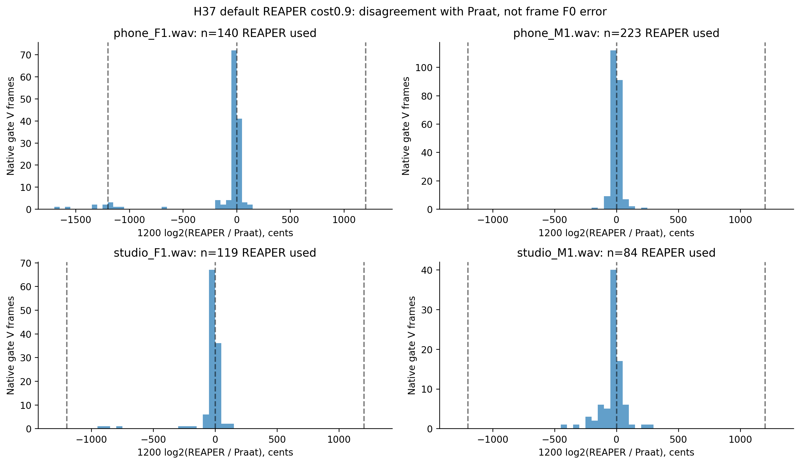

# H37 — hai nguồn F0 bất đồng ở đâu?

Phân tích mô tả raw output đã đo, không apply correction hoặc tính lại MAPE cho pipeline chưa đăng ký. Cents là đơn vị tỷ số cao độ: một octave=1200cents, một semitone=100cents. Bảng dùng band±100cents quanh tỷ số1,1/2,2 để mô tả gần nhau; đây là lựa chọn diagnostic, không threshold được chứng minh tối ưu.

| source_id | file | gate_voiced_frames | reaper_used | fallback | near_same_100c | near_half_100c | near_double_100c | other_ratio | median_delta_cents | min_delta_cents | max_delta_cents |
| --- | --- | --- | --- | --- | --- | --- | --- | --- | --- | --- | --- |
| reaper_c0.6 | phone_F1.wav | 147 | 135 | 12 | 120 | 4 | 0 | 11 | -9.29688 | -1325.37 | 131.724 |
| reaper_c0.6 | phone_M1.wav | 233 | 221 | 12 | 217 | 0 | 0 | 4 | -1.95823 | -192.19 | 239.469 |
| reaper_c0.6 | studio_F1.wav | 123 | 119 | 4 | 112 | 0 | 0 | 7 | -4.85499 | -927.075 | 140.457 |
| reaper_c0.6 | studio_M1.wav | 85 | 84 | 1 | 68 | 0 | 0 | 16 | -14.746 | -239.562 | 373.006 |
| reaper_c0.9 | phone_F1.wav | 147 | 140 | 7 | 120 | 6 | 0 | 14 | -9.70964 | -1666.03 | 131.724 |
| reaper_c0.9 | phone_M1.wav | 233 | 223 | 10 | 219 | 0 | 0 | 4 | -1.43266 | -192.19 | 239.469 |
| reaper_c0.9 | studio_F1.wav | 123 | 119 | 4 | 111 | 0 | 0 | 8 | -5.31477 | -927.075 | 140.457 |
| reaper_c0.9 | studio_M1.wav | 85 | 84 | 1 | 68 | 0 | 0 | 16 | -15.2034 | -402.526 | 292.011 |

Các số đếm trên nativePraatgrid, sau ghép REAPER bằng nearest time trong5ms+mộtmẫu và range70–400. Chỉ khung gateV và REAPERavailable có delta; fallback báo riêng. Usage/source tags/frequencies tái lập H37 trước tính tỷ số; không dùng file-stat GT để phân nhóm.

Praat không phải ground truth từng khung. Nearhalf chỉ nói REAPER gần nửa frequency của Praat; chưa đủ kết luận REAPER sai octave hoặc Praat đúng. Histogram không phải pitch-error distribution. Mọi tail được giữ trong CSV và bins phủ toàn bộ finite values, không cắt âm thầm.

H37 fixedcost.9 studio_M1stdMAPE1.120784% nhưng countMAPE3.658537%/meanMAPE1.637307%, AverageMAPE2.138876%; phoneF1stdMAPE83.444579%/Avg29.460886%. Cổng giữ count/VUV giúp loại SIL dư, nhưng chưa loại bất đồng pitch trong các khung V. Không chọn riêng algorithm cho studio_M1 hoặc cắt khung theo GT.

Một giả thuyết kế tiếp có thể chuẩn hóa octave của REAPER theo anchor Praat rồi so raw/guided/blended trên inner folds. Phải đăng ký rule/factors/band/fallback và selection/gates trước đo, giữ raw output; không coi anchor là F0 chuẩn và không tự suy rule sẽ đạt≤2%. Vòng đó chưa chạy trong phân tích này.

Không đọc WAV/test hoặc gọi native mới; inputs chỉ H37raw/source/usage và profilefs đã lưu. Receipt có hashes/replay/categories/histogram/PNGSVG. Original/frozen giữ, không PDF/Drive/deep learning/MCP retry.
