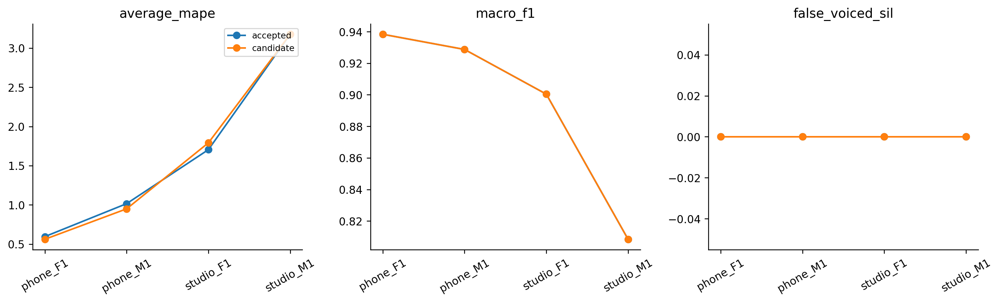
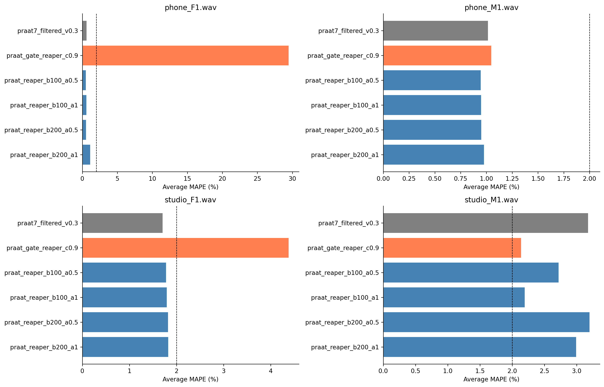
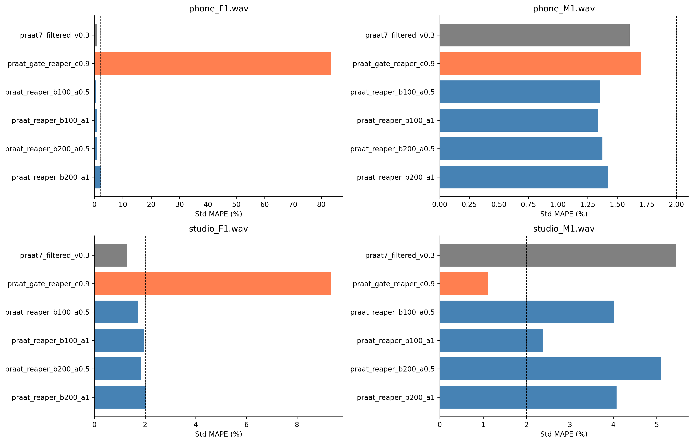

# H38 — Kết hợp cao độ trong vùng đồng thuận Praat–REAPER

| model | split | average_mape | F0mean_mape | F0std_mape | F0num_mape | F0mean_abs_error | F0std_abs_error | macro_f1 | balanced_accuracy | recall_v | recall_uv | TP | TN | FP | FN | false_voiced_sil | F0num |
| --- | --- | --- | --- | --- | --- | --- | --- | --- | --- | --- | --- | --- | --- | --- | --- | --- | --- |
| accepted | train | 1.62246 | 0.587195 | 2.30146 | 1.97871 | 0.95591 | 0.59029 | 0.893977 | 0.914335 | 0.92927 | 0.899399 | 575 | 167 | 13 | 39 | 0 | 588 |
| accepted | lofo | 1.62246 | 0.587195 | 2.30146 | 1.97871 | 0.95591 | 0.59029 | 0.893977 | 0.914335 | 0.92927 | 0.899399 | 575 | 167 | 13 | 39 | 0 | 588 |
| accepted | nested | 1.62246 | 0.587195 | 2.30146 | 1.97871 | 0.95591 | 0.59029 | 0.893977 | 0.914335 | 0.92927 | 0.899399 | 575 | 167 | 13 | 39 | 0 | 588 |
| candidate | train | 1.37334 | 0.492348 | 1.64895 | 1.97871 | 0.687627 | 0.441295 | 0.893977 | 0.914335 | 0.92927 | 0.899399 | 575 | 167 | 13 | 39 | 0 | 588 |
| candidate | lofo | 1.37334 | 0.492348 | 1.64895 | 1.97871 | 0.687627 | 0.441295 | 0.893977 | 0.914335 | 0.92927 | 0.899399 | 575 | 167 | 13 | 39 | 0 | 588 |
| candidate | nested | 1.61915 | 0.459226 | 2.41952 | 1.97871 | 0.648907 | 0.644724 | 0.893977 | 0.914335 | 0.92927 | 0.899399 | 575 | 167 | 13 | 39 | 0 | 588 |

Cents đo tỷ số cao độ: 1200 cents là một octave (tần số gấp đôi), 100 cents là một bán âm. Praat filtered .30 là nguồn neo ứng viên và giữ mask V/UV. REAPER .9 là nguồn thứ hai. Chỉ khi hai nguồn có support và nằm70–400Hz, chênh lệch≤100 hoặc200cents, thay bằng REAPER (weight1) hoặc trung bình hình học (weight.5). Nếu ngoài band hoặc thiếu REAPER, giữ Praat. Không nhân/chia tần số theo octave, không chỉnh theo file-stat ground truth.

Control H31fixed.30; raw gated REAPER .9 là ablation H37. Cùng một grid6options cho toàn bộ file, không chọn theo tên/giới/device/held-stat. Hai nearest-time projections giữ H37, V/UV/count/support bằng control. Eight native source calls, no model fit. Native PCM, hashes và source tags giữ đầy đủ.

## Gate

~~~json
{
  "checks": {
    "train_mape_relative_10_percent": true,
    "lofo_mape_relative_5_percent": false,
    "lofo_f1_drop_at_most_01": true,
    "lofo_recall_v_drop_at_most_01": true,
    "lofo_sil_increase_at_most_1": true,
    "lofo_no_file_mape_worse_by_over_2pp": true,
    "lofo_phone_f1_std_not_worse": false,
    "selected_lofo_mape_relative_5_percent": true
  },
  "eligible": false,
  "nested_status": "Outer file excluded from every inner fit and selection; selected LOFO is separate.",
  "champion_promoted": false
}
~~~

## Selections

| outer_held | id | frame_ms | hop_ms | pitch_frame_ms | unvoiced_cost | gate_voicing_threshold | method | agreement_cents | reaper_weight | voicing_threshold |
| --- | --- | --- | --- | --- | --- | --- | --- | --- | --- | --- |
| final | praat_reaper_b100_a1 | 42.8571 | 10 | nan | 0.9 | 0.3 | bounded | 100 | 1 | nan |
| phone_F1.wav | praat_reaper_b100_a1 | 42.8571 | 10 | nan | 0.9 | 0.3 | bounded | 100 | 1 | nan |
| phone_M1.wav | praat_reaper_b100_a1 | 42.8571 | 10 | nan | 0.9 | 0.3 | bounded | 100 | 1 | nan |
| studio_F1.wav | praat_reaper_b100_a1 | 42.8571 | 10 | nan | 0.9 | 0.3 | bounded | 100 | 1 | nan |
| studio_M1.wav | praat7_filtered_v0.3 | 42.8571 | 10 | 42.8571 | nan | nan | control | nan | nan | 0.3 |

## Mọi cấu hình fixed LOFO

| option_id | file | average_mape | F0mean_mape | F0std_mape | F0num_mape | macro_f1 | recall_v | false_voiced_sil | projection_coverage |
| --- | --- | --- | --- | --- | --- | --- | --- | --- | --- |
| praat7_filtered_v0.3 | phone_F1.wav | 0.595007 | 0.257478 | 0.851866 | 0.675676 | 0.938333 | 0.941176 | 0 | 0.993789 |
| praat7_filtered_v0.3 | phone_M1.wav | 1.01526 | 1.00921 | 1.60553 | 0.431034 | 0.928721 | 0.946721 | 0 | 0.995169 |
| praat7_filtered_v0.3 | studio_F1.wav | 1.70384 | 0.67006 | 1.29187 | 3.14961 | 0.900407 | 0.96748 | 0 | 0.996479 |
| praat7_filtered_v0.3 | studio_M1.wav | 3.17572 | 0.412037 | 5.45659 | 3.65854 | 0.808446 | 0.861702 | 0 | 0.99262 |
| praat_gate_reaper_c0.9 | phone_F1.wav | 29.4609 | 4.2624 | 83.4446 | 0.675676 | 0.938333 | 0.941176 | 0 | 0.993789 |
| praat_gate_reaper_c0.9 | phone_M1.wav | 1.04636 | 1.00828 | 1.69977 | 0.431034 | 0.928721 | 0.946721 | 0 | 0.995169 |
| praat_gate_reaper_c0.9 | studio_F1.wav | 4.37858 | 0.637014 | 9.34911 | 3.14961 | 0.900407 | 0.96748 | 0 | 0.996479 |
| praat_gate_reaper_c0.9 | studio_M1.wav | 2.13888 | 1.63731 | 1.12078 | 3.65854 | 0.808446 | 0.861702 | 0 | 0.99262 |
| praat_reaper_b100_a0.5 | phone_F1.wav | 0.483929 | 0.0800089 | 0.696102 | 0.675676 | 0.938333 | 0.941176 | 0 | 0.993789 |
| praat_reaper_b100_a0.5 | phone_M1.wav | 0.94507 | 1.04726 | 1.35692 | 0.431034 | 0.928721 | 0.946721 | 0 | 0.995169 |
| praat_reaper_b100_a0.5 | studio_F1.wav | 1.77557 | 0.458017 | 1.71908 | 3.14961 | 0.900407 | 0.96748 | 0 | 0.996479 |
| praat_reaper_b100_a0.5 | studio_M1.wav | 2.71797 | 0.482506 | 4.01286 | 3.65854 | 0.808446 | 0.861702 | 0 | 0.99262 |
| praat_reaper_b100_a1 | phone_F1.wav | 0.560923 | 0.0935734 | 0.913521 | 0.675676 | 0.938333 | 0.941176 | 0 | 0.993789 |
| praat_reaper_b100_a1 | phone_M1.wav | 0.949165 | 1.08068 | 1.33578 | 0.431034 | 0.928721 | 0.946721 | 0 | 0.995169 |
| praat_reaper_b100_a1 | studio_F1.wav | 1.7908 | 0.250614 | 1.97217 | 3.14961 | 0.900407 | 0.96748 | 0 | 0.996479 |
| praat_reaper_b100_a1 | studio_M1.wav | 2.19246 | 0.544525 | 2.37433 | 3.65854 | 0.808446 | 0.861702 | 0 | 0.99262 |
| praat_reaper_b200_a0.5 | phone_F1.wav | 0.522564 | 0.0677607 | 0.824254 | 0.675676 | 0.938333 | 0.941176 | 0 | 0.993789 |
| praat_reaper_b200_a0.5 | phone_M1.wav | 0.949912 | 1.04363 | 1.37507 | 0.431034 | 0.928721 | 0.946721 | 0 | 0.995169 |
| praat_reaper_b200_a0.5 | studio_F1.wav | 1.82042 | 0.479813 | 1.83184 | 3.14961 | 0.900407 | 0.96748 | 0 | 0.996479 |
| praat_reaper_b200_a0.5 | studio_M1.wav | 3.19887 | 0.83872 | 5.09934 | 3.65854 | 0.808446 | 0.861702 | 0 | 0.99262 |
| praat_reaper_b200_a1 | phone_F1.wav | 1.10939 | 0.377968 | 2.27452 | 0.675676 | 0.938333 | 0.941176 | 0 | 0.993789 |
| praat_reaper_b200_a1 | phone_M1.wav | 0.975921 | 1.07174 | 1.42498 | 0.431034 | 0.928721 | 0.946721 | 0 | 0.995169 |
| praat_reaper_b200_a1 | studio_F1.wav | 1.82314 | 0.298652 | 2.02115 | 3.14961 | 0.900407 | 0.96748 | 0 | 0.996479 |
| praat_reaper_b200_a1 | studio_M1.wav | 2.99104 | 1.23889 | 4.07568 | 3.65854 | 0.808446 | 0.861702 | 0 | 0.99262 |

## Nested per file

| model | file | average_mape | F0std_mape | F0num_mape | recall_v | false_voiced_sil | projection_coverage |
| --- | --- | --- | --- | --- | --- | --- | --- |
| accepted | phone_F1.wav | 0.595007 | 0.851866 | 0.675676 | 0.941176 | 0 | 0.993789 |
| candidate | phone_F1.wav | 0.560923 | 0.913521 | 0.675676 | 0.941176 | 0 | 0.993789 |
| accepted | phone_M1.wav | 1.01526 | 1.60553 | 0.431034 | 0.946721 | 0 | 0.995169 |
| candidate | phone_M1.wav | 0.949165 | 1.33578 | 0.431034 | 0.946721 | 0 | 0.995169 |
| accepted | studio_F1.wav | 1.70384 | 1.29187 | 3.14961 | 0.96748 | 0 | 0.996479 |
| candidate | studio_F1.wav | 1.7908 | 1.97217 | 3.14961 | 0.96748 | 0 | 0.996479 |
| accepted | studio_M1.wav | 3.17572 | 5.45659 | 3.65854 | 0.861702 | 0 | 0.99262 |
| candidate | studio_M1.wav | 3.17572 | 5.45659 | 3.65854 | 0.861702 | 0 | 0.99262 |

Mục tiêu mỗi file≤2% riêng; không nhầm với mean≤2%. No actualfit; inner minimax/mean/ID chỉ chọnband/weight. Outerheld khôngselection; lịch sửn4 làmnestedexploratory. LAB chỉfile-stat/nhãnđoạn, khôngF0chuẩntừngkhung. Đồng thuận hai ứng viên không chứng minh pitch đúng; fallback có thể giữ lỗi Praat. Khôngpromote/test/Drive/deeplearning/PDF/retryJev. Failedoptions giữ nguyên.

Lệnh: C:/Users/violet/miniconda3/python.exe research_workbench_2026_10_07/reaper_praat_bounded.py H38
