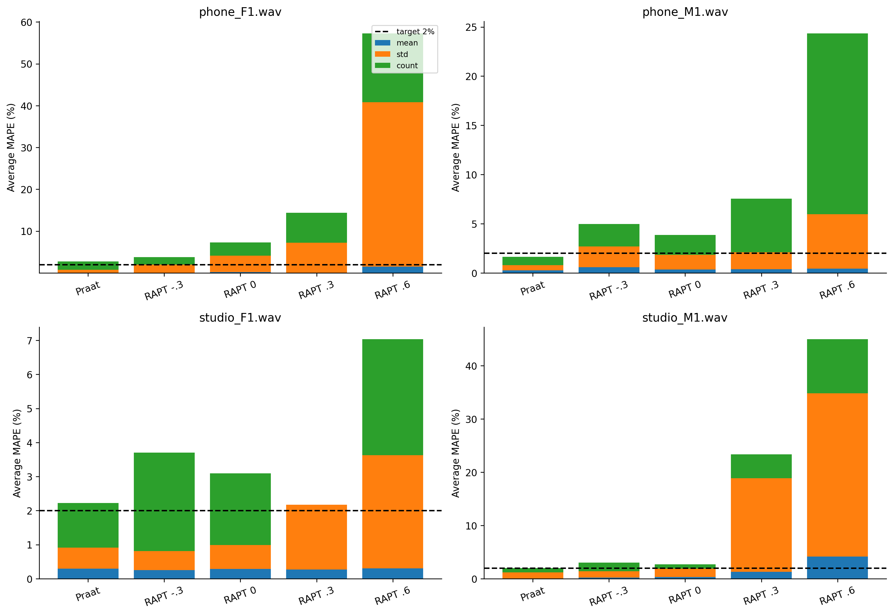
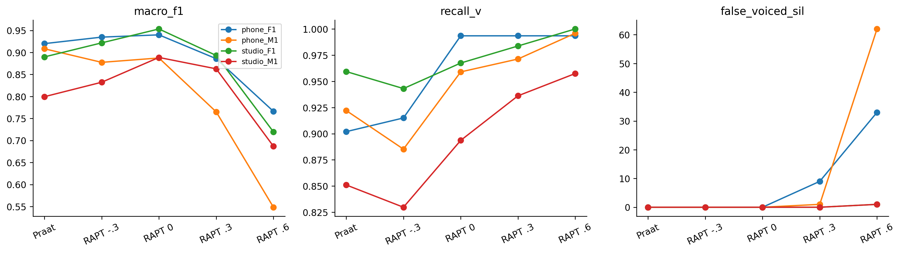

# H39 — RAPT fixed error analysis

Đọc số đo đã lưu; không native/WAV/test read, không đổi rule, GT, grid hoặc selection. Default RAPT tăng recall phone_F1 nhưng count162 so GT148 và stdMAPE11.877707%; meanMAPE.507664% thấp chưa đủ. Bias−.3 thiếu F0 trên cả4file (140/216/116/78 versus148/232/127/82). Bias.6 có97SILfalsevoiced tổngbốnfile. Những kết quả này không chứng minh cơ chế noise/NCCF riêng là nguyên nhân: đã so toànpipeline.

| option_id | average_mape | false_voiced_sil | macro_f1 | recall_v |
| --- | --- | --- | --- | --- |
| praat7_filtered_v0.45 | 2.15699 | 0 | 0.879377 | 0.908626 |
| rapt_b-0.3 | 3.87565 | 0 | 0.891556 | 0.893289 |
| rapt_b0 | 4.23107 | 0 | 0.917285 | 0.953394 |
| rapt_b0.3 | 11.8727 | 10 | 0.851664 | 0.971171 |
| rapt_b0.6 | 33.4134 | 97 | 0.680196 | 0.986703 |

| option_id | file | average_mape | F0mean_mape | F0std_mape | F0num_mape | F0num | macro_f1 | recall_v | false_voiced_sil |
| --- | --- | --- | --- | --- | --- | --- | --- | --- | --- |
| praat7_filtered_v0.45 | phone_F1.wav | 2.76986 | 0.0766879 | 2.1518 | 6.08108 | 139 | 0.919971 | 0.901961 | 0 |
| praat7_filtered_v0.45 | phone_M1.wav | 1.64701 | 0.797475 | 1.55734 | 2.58621 | 226 | 0.908301 | 0.922131 | 0 |
| praat7_filtered_v0.45 | studio_F1.wav | 2.22688 | 0.871402 | 1.87223 | 3.93701 | 122 | 0.889796 | 0.95935 | 0 |
| praat7_filtered_v0.45 | studio_M1.wav | 1.98422 | 0.0731761 | 3.44047 | 2.43902 | 84 | 0.799438 | 0.851064 | 0 |
| rapt_b-0.3 | phone_F1.wav | 3.79303 | 0.000526101 | 5.97317 | 5.40541 | 140 | 0.934769 | 0.915033 | 0 |
| rapt_b-0.3 | phone_M1.wav | 4.97563 | 1.74402 | 6.28631 | 6.89655 | 216 | 0.87746 | 0.885246 | 0 |
| rapt_b-0.3 | studio_F1.wav | 3.70081 | 0.749802 | 1.69121 | 8.66142 | 116 | 0.921719 | 0.943089 | 0 |
| rapt_b-0.3 | studio_M1.wav | 3.03313 | 0.647617 | 3.57371 | 4.87805 | 78 | 0.832276 | 0.829787 | 0 |
| rapt_b0 | phone_F1.wav | 7.28161 | 0.507664 | 11.8777 | 9.45946 | 162 | 0.939904 | 0.993464 | 0 |
| rapt_b0 | phone_M1.wav | 3.86224 | 1.04696 | 4.50527 | 6.03448 | 246 | 0.887387 | 0.959016 | 0 |
| rapt_b0 | studio_F1.wav | 3.09011 | 0.848135 | 2.12299 | 6.29921 | 119 | 0.953274 | 0.96748 | 0 |
| rapt_b0 | studio_M1.wav | 2.69033 | 0.931708 | 4.70027 | 2.43902 | 84 | 0.888577 | 0.893617 | 0 |
| rapt_b0.3 | phone_F1.wav | 14.4052 | 0.151908 | 21.4419 | 21.6216 | 180 | 0.885802 | 0.993464 | 9 |
| rapt_b0.3 | phone_M1.wav | 7.55912 | 1.10587 | 5.19217 | 16.3793 | 270 | 0.765019 | 0.971311 | 1 |
| rapt_b0.3 | studio_F1.wav | 2.17211 | 0.808316 | 5.70801 | 0 | 127 | 0.893091 | 0.98374 | 0 |
| rapt_b0.3 | studio_M1.wav | 23.3546 | 3.87028 | 52.7789 | 13.4146 | 93 | 0.862745 | 0.93617 | 0 |
| rapt_b0.6 | phone_F1.wav | 57.2788 | 4.53579 | 117.976 | 49.3243 | 221 | 0.766136 | 0.993464 | 33 |
| rapt_b0.6 | phone_M1.wav | 24.351 | 1.31567 | 16.5649 | 55.1724 | 360 | 0.548339 | 0.995902 | 62 |
| rapt_b0.6 | studio_F1.wav | 7.03688 | 0.917971 | 9.95644 | 10.2362 | 140 | 0.719466 | 1 | 1 |
| rapt_b0.6 | studio_M1.wav | 44.9867 | 12.4524 | 92.02 | 30.4878 | 107 | 0.686842 | 0.957447 | 1 |

LAB không có F0 chuẩn từngkhung; không gọi một candidate octaveerror chỉ vì lệch ứng viên khác. Mục tiêu mỗi file≤2% chưa đạt; final/allouter chọn Praatcontrol. Chỉ4file/nestedexploratory.

