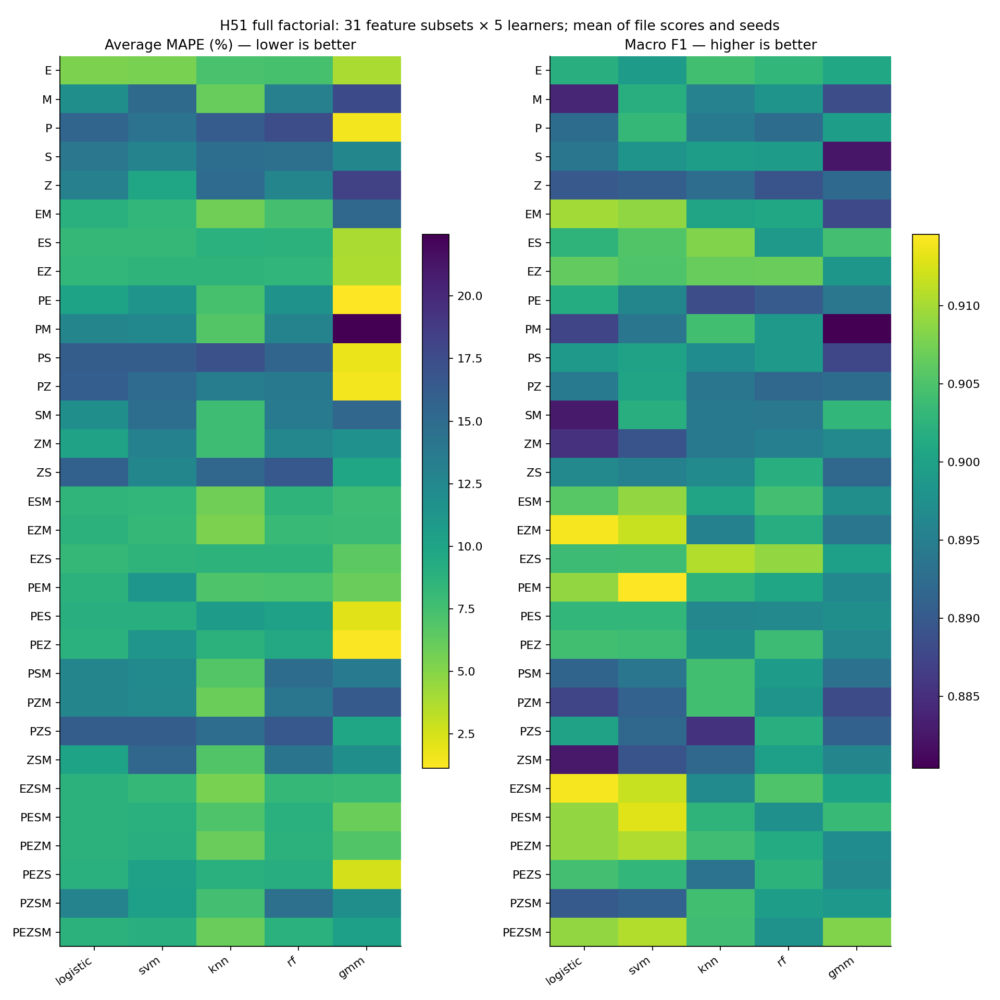
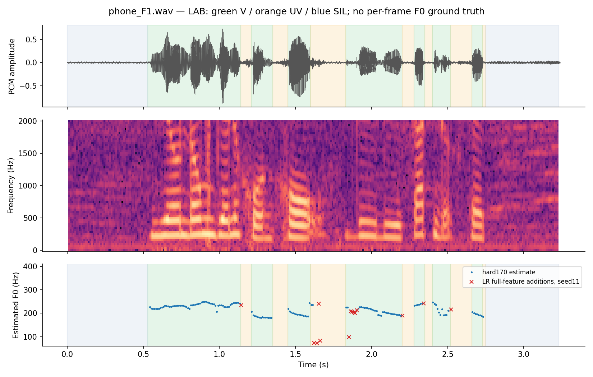
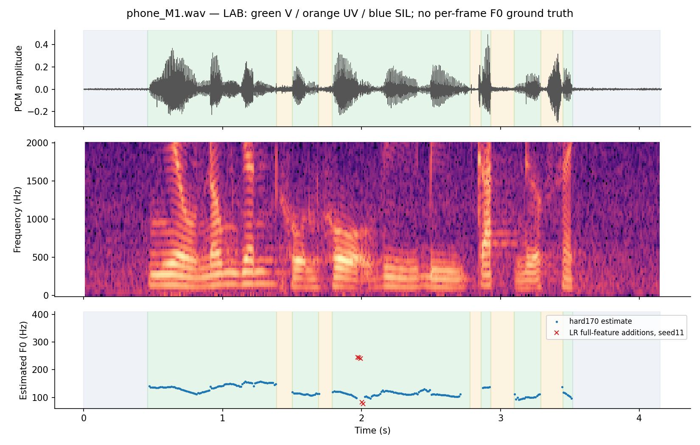
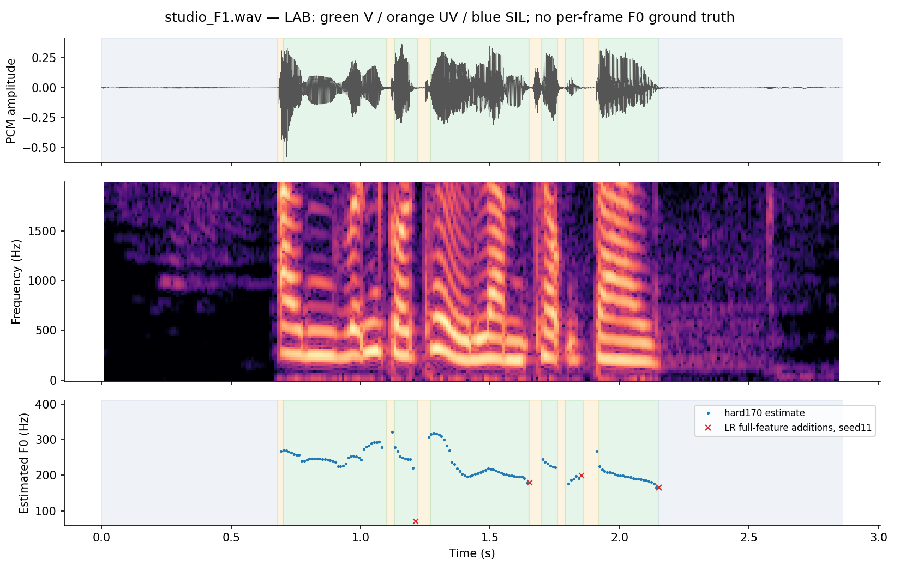
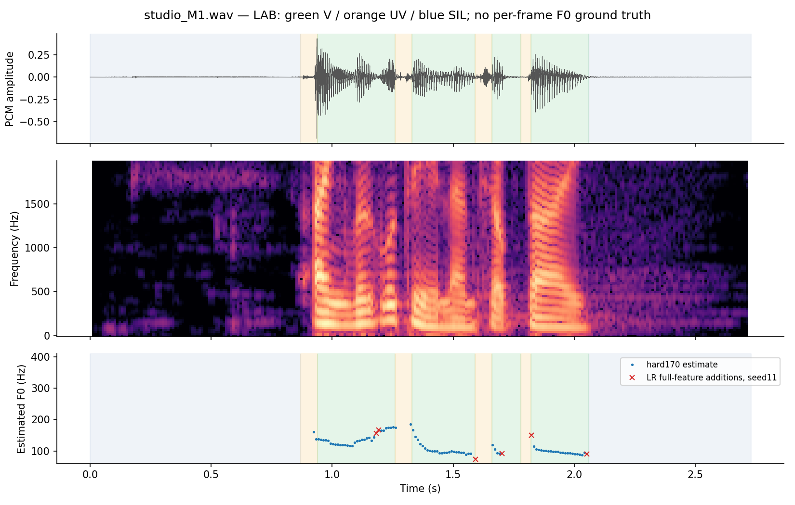

# H51 — ma trận thí nghiệm và phân tích lỗi

Cấu hình final chọn bằng clean train: **gmm_PE**. Tám gate đạt ở mọi seed: **False**; từng nested train file<2 ở mọi seed: **False**. Không promote hoặc sửa notebook đã nộp/frozen.

Ma trận gồm 155 cấu hình: 31 tổ hợp đặc trưng × 5 mô hình, mỗi cấu hình được đánh giá với seed 11, 29, 47, kèm control hard170. Seed là giá trị khởi tạo bộ sinh số ngẫu nhiên. Logistic, SVM và kNN cho kết quả xác định; RF và GMM được học riêng ở ba seed. Chỉ có bốn file train; ba seed không tạo thêm người nói.

Năm nhóm đặc trưng: P là độ tuần hoàn; E là năng lượng tương đối; Z là tốc độ đổi dấu ZCR; S là tỷ lệ năng lượng tần số cao; M là 13 hệ số MFCC mô tả phân bố phổ. Các cửa sổ dài 25 ms, dịch 10 ms. Điều kiện cho phép khôi phục và cách lấy F0 giữ chung. Việc bỏ một nhóm chỉ áp dụng vào đầu vào mô hình; GMM vẫn dùng độ tuần hoàn để gán nghĩa cho cụm.

Prereg commit `3bd5c0909d8f4dc970c214edebd3596c834b4c6e`; commit khóa external `9b3ddc947076446e054926b50d7d566e89d774c8`. Các commit đã được push/remoteverify trước từng phase. Runtime/fit/artifact hashes ở JSON; train actual fits=2793, native calls mới=0. Reuse H50/H46/H48/H49 hash-verified evidence; không rerun các experiment cũ.

## Kết quả chính và grouped cross-validation

Kiểm định chéo giữ từng file làm một nhóm: bốn lượt kiểm tra ngoài, mỗi lượt dùng ba file còn lại để chọn cấu hình qua ba lượt bên trong. Với bốn file, cách này tương đương GroupKFold bốn nhóm và leave-one-file-out. Cấu hình được chọn để giảm lỗi của file xấu nhất trên mọi seed; các giới hạn F1, recall và lỗi SIL phải đạt ở từng seed. Kết quả trên tập đã học, kiểm định chéo với cấu hình final và kiểm định chéo lồng nhau được lưu riêng. Vì train đã được xem qua nhiều vòng, đây vẫn là thăm dò. Chưa xác minh danh tính người nói nên không gọi là giữ người nói độc lập.

| seed | file | option_id | average_mape | macro_f1 | recall_v | false_voiced_sil |
| --- | --- | --- | --- | --- | --- | --- |
| 11 | phone_F1.wav | gmm_PE | 0.34008 | 0.938333 | 0.941176 | 0 |
| 29 | phone_F1.wav | gmm_PE | 0.34008 | 0.938333 | 0.941176 | 0 |
| 47 | phone_F1.wav | gmm_PE | 0.34008 | 0.938333 | 0.941176 | 0 |
| 11 | phone_M1.wav | gmm_PEZS | 4.00741 | 0.933117 | 0.95082 | 0 |
| 29 | phone_M1.wav | gmm_PEZS | 4.00741 | 0.933117 | 0.95082 | 0 |
| 47 | phone_M1.wav | gmm_PEZS | 4.00741 | 0.933117 | 0.95082 | 0 |
| 11 | studio_F1.wav | gmm_PES | 1.47358 | 0.900407 | 0.96748 | 0 |
| 29 | studio_F1.wav | gmm_PES | 1.47358 | 0.900407 | 0.96748 | 0 |
| 47 | studio_F1.wav | gmm_PES | 1.47358 | 0.900407 | 0.96748 | 0 |
| 11 | studio_M1.wav | gmm_PES | 2.39989 | 0.817625 | 0.87234 | 0 |
| 29 | studio_M1.wav | gmm_PES | 2.39989 | 0.817625 | 0.87234 | 0 |
| 47 | studio_M1.wav | gmm_PES | 2.39989 | 0.817625 | 0.87234 | 0 |

Mục tiêu cho một cấu hình trên tám file: bốn train đã tham gia học và bốn test được đánh giá mô tả. Không coi cả tám là dữ liệu chưa từng được dùng.

| seed | train_files_below2 | test_files_below2 | all8_below2 |
| --- | --- | --- | --- |
| 11 | 3 | 0 | False |
| 29 | 3 | 0 | False |
| 47 | 4 | 0 | False |

## Ma trận, ablation và multiple seeds

Bảng dùng toàn bộ đặc trưng và control dưới đây tính trung bình bốn file ở từng seed, rồi tính trung bình và độ lệch chuẩn giữa các seed. Worst là lỗi của file xấu nhất trong mọi seed. Độ lệch chuẩn giữa seed chỉ đo biến động thuật toán, không đo mức bất định của quần thể người nói. Toàn bộ ma trận nằm ở H51_seed_summary.csv; H51_fixed_lofo.csv chứa đủ 1.872 dòng file × cấu hình × seed, gồm control.

| recipe_id | method | blocks | mean_mape | std_seed_mape | min_seed_mape | max_seed_mape | worst_file_any_seed | mean_f1 | mean_recall_v |
| --- | --- | --- | --- | --- | --- | --- | --- | --- | --- |
| gmm_PEZSM | gmm | PEZSM | 10.4408 | 0 | 10.4408 | 10.4408 | 15.4687 | 0.908091 | 0.955651 |
| hard170 | control | nan | 1.12493 | 0 | 1.12493 | 1.12493 | 1.90992 | 0.893977 | 0.92927 |
| knn_PEZSM | knn | PEZSM | 6.0016 | 0 | 6.0016 | 6.0016 | 10.9611 | 0.904031 | 0.95852 |
| logistic_PEZSM | logistic | PEZSM | 8.73666 | 0 | 8.73666 | 8.73666 | 17.0977 | 0.909073 | 0.963194 |
| rf_PEZSM | rf | PEZSM | 8.79763 | 0.00997043 | 8.78663 | 8.80608 | 16.5659 | 0.897855 | 0.955568 |
| svm_PEZSM | svm | PEZSM | 9.01852 | 0 | 9.01852 | 9.01852 | 16.9432 | 0.910579 | 0.966879 |

Đơn từng block (giữ common recovery guards):

| recipe_id | method | blocks | mean_mape | std_seed_mape | min_seed_mape | max_seed_mape | worst_file_any_seed | mean_f1 | mean_recall_v |
| --- | --- | --- | --- | --- | --- | --- | --- | --- | --- |
| gmm_E | gmm | E | 3.81515 | 0 | 3.81515 | 3.81515 | 10.9611 | 0.90078 | 0.944006 |
| gmm_M | gmm | M | 17.6627 | 0.0122994 | 17.6556 | 17.6769 | 33.3231 | 0.888468 | 0.965803 |
| gmm_P | gmm | P | 1.50827 | 0 | 1.50827 | 1.50827 | 3.00694 | 0.899547 | 0.933335 |
| gmm_S | gmm | S | 12.6318 | 0 | 12.6318 | 12.6318 | 17.0562 | 0.882519 | 0.959299 |
| gmm_Z | gmm | Z | 18.3631 | 0 | 18.3631 | 18.3631 | 37.4394 | 0.892093 | 0.975864 |
| knn_E | knn | E | 7.29262 | 0 | 7.29262 | 7.29262 | 12.7146 | 0.904208 | 0.950959 |
| knn_M | knn | M | 6.10977 | 0 | 6.10977 | 6.10977 | 10.9611 | 0.895592 | 0.94564 |
| knn_P | knn | P | 16.2892 | 0 | 16.2892 | 16.2892 | 27.7881 | 0.894387 | 0.965855 |
| knn_S | knn | S | 14.7289 | 0 | 14.7289 | 14.7289 | 26.8488 | 0.899512 | 0.967277 |
| knn_Z | knn | Z | 15.0229 | 0 | 15.0229 | 15.0229 | 28.9901 | 0.892651 | 0.957875 |
| logistic_E | logistic | E | 5.32023 | 0 | 5.32023 | 5.32023 | 10.9611 | 0.901852 | 0.946665 |
| logistic_M | logistic | M | 11.8684 | 0 | 11.8684 | 11.8684 | 18.2207 | 0.884095 | 0.952346 |
| logistic_P | logistic | P | 15.5305 | 0 | 15.5305 | 15.5305 | 27.3137 | 0.892471 | 0.971158 |
| logistic_S | logistic | S | 13.9943 | 0 | 13.9943 | 13.9943 | 19.4322 | 0.893749 | 0.975256 |
| logistic_Z | logistic | Z | 13.1891 | 0 | 13.1891 | 13.1891 | 28.9901 | 0.889904 | 0.965226 |
| rf_E | rf | E | 7.35392 | 0.106171 | 7.29262 | 7.47652 | 12.7146 | 0.903002 | 0.950959 |
| rf_M | rf | M | 13.1481 | 0.468893 | 12.8339 | 13.6871 | 22.0496 | 0.898031 | 0.964832 |
| rf_P | rf | P | 17.4191 | 1.27376 | 16.0925 | 18.6324 | 28.096 | 0.892461 | 0.963602 |
| rf_S | rf | S | 14.5824 | 0.857121 | 13.6442 | 15.3245 | 26.642 | 0.899222 | 0.965643 |
| rf_Z | rf | Z | 12.7753 | 0 | 12.7753 | 12.7753 | 28.9901 | 0.889223 | 0.959907 |
| svm_E | svm | E | 5.45357 | 0 | 5.45357 | 5.45357 | 11.0635 | 0.899126 | 0.946665 |
| svm_M | svm | M | 15.1264 | 0 | 15.1264 | 15.1264 | 21.9536 | 0.901807 | 0.960951 |
| svm_P | svm | P | 14.3091 | 0 | 14.3091 | 14.3091 | 26.2385 | 0.9032 | 0.968498 |
| svm_S | svm | S | 12.9573 | 0 | 12.9573 | 12.9573 | 17.7706 | 0.898145 | 0.969937 |
| svm_Z | svm | Z | 9.92563 | 0 | 9.92563 | 9.92563 | 17.4944 | 0.890677 | 0.959907 |

Leave-one-block-out: delta=removed−full; MAPE dương/F1 âm là bỏ block làm xấu đi.

| method | removed_block | delta_mape | delta_f1 |
| --- | --- | --- | --- |
| gmm | E | 1.3705 | -0.00950367 |
| gmm | M | -7.97017 | -0.0115934 |
| gmm | P | -2.45937 | -0.007863 |
| gmm | S | -3.53293 | -0.0111288 |
| gmm | Z | -4.52819 | -0.00469151 |
| knn | E | 1.53368 | 0.0001197 |
| knn | M | 2.88159 | -0.0105874 |
| knn | P | -0.61444 | -0.00730644 |
| knn | S | 0 | 0 |
| knn | Z | 0.977451 | -0.00139772 |
| logistic | E | 4.14658 | -0.0189998 |
| logistic | M | 0.20694 | -0.00466923 |
| logistic | P | 0.0233734 | 0.00505634 |
| logistic | S | 0 | 0 |
| logistic | Z | 0 | 0 |
| rf | E | 5.80176 | 0.00173829 |
| rf | M | 0.407406 | 0.0045913 |
| rf | P | -0.564716 | 0.00725848 |
| rf | S | -0.0459592 | 0.00349816 |
| rf | Z | 0.150446 | -0.000244865 |
| svm | E | 1.41871 | -0.0194588 |
| svm | M | 1.25692 | -0.00760005 |
| svm | P | -0.769782 | 0.00116965 |
| svm | S | 0.038609 | -0.000144203 |
| svm | Z | -0.0801846 | 0.00234383 |

## Synergy/complementary và permutation

Độ tương tác được tính bằng f(A+B)−f(A)−f(B)+f(control). Với MAPE, giá trị âm là thuận lợi so với hiệu ứng cộng; với F1, giá trị dương là thuận lợi. Đây là phép đối chiếu trên nhánh khôi phục, không chứng minh quan hệ nhân quả. MFCC là nhóm 13 chiều, các nhóm còn lại một chiều; điều kiện khôi phục vẫn dùng chung.

| method | pair | interaction_mape | interaction_f1 |
| --- | --- | --- | --- |
| gmm | EM | -5.03694 | -0.00731054 |
| gmm | ES | -11.4636 | 0.0150498 |
| gmm | EZ | -17.293 | -0.000482625 |
| gmm | PE | -3.07356 | -0.0123732 |
| gmm | PM | 4.41997 | -0.013635 |
| gmm | PS | -11.2476 | -0.000396506 |
| gmm | PZ | -17.2572 | -0.00515074 |
| gmm | SM | -13.7328 | 0.0259882 |
| gmm | ZM | -23.2439 | 0.00994814 |
| gmm | ZS | -19.9944 | 0.0112971 |
| knn | EM | -6.51906 | -0.00546136 |
| knn | ES | -12.0518 | -0.00162265 |
| knn | EZ | -12.641 | 0.00374394 |
| knn | PE | -15.0975 | -0.0161843 |
| knn | PM | -14.4299 | 0.00814871 |
| knn | PS | -12.7602 | -0.00286634 |
| knn | PZ | -16.7179 | 0.000711247 |
| knn | SM | -11.9919 | -0.00690547 |
| knn | ZM | -12.2858 | -4.37945e-05 |
| knn | ZS | -13.1798 | -0.00162636 |
| logistic | EM | -7.12132 | 0.0178382 |
| logistic | ES | -9.93258 | 0.000935851 |
| logistic | EZ | -9.06279 | 0.00860078 |
| logistic | PE | -9.59904 | 0.00122106 |
| logistic | PM | -13.5417 | 0.00496613 |
| logistic | PS | -12.198 | 0.00647077 |
| logistic | PZ | -11.4853 | 0.00621741 |
| logistic | SM | -12.8941 | -0.00102106 |
| logistic | ZM | -13.7676 | 0.00526946 |
| logistic | ZS | -10.2089 | 0.00675641 |
| rf | EM | -11.966 | -0.00629672 |
| rf | ES | -12.0274 | -0.00947038 |
| rf | EZ | -10.6263 | 0.00850624 |
| rf | PE | -12.1376 | -0.0113387 |
| rf | PM | -16.5537 | 0.00217671 |
| rf | PS | -15.3995 | 0.0011113 |
| rf | PZ | -15.2546 | 0.00427351 |
| rf | SM | -13.0583 | -0.00922208 |
| rf | ZM | -12.2017 | 0.00192919 |
| rf | ZS | -9.60978 | 0.00751976 |
| svm | EM | -11.0875 | 0.00198256 |
| svm | ES | -9.03791 | 0.00192782 |
| svm | EZ | -5.6707 | 0.00938664 |
| svm | PE | -7.24985 | -0.0123326 |
| svm | PM | -15.7918 | -0.0172486 |
| svm | PS | -9.99798 | -0.00722832 |
| svm | PZ | -8.1372 | 0.000405392 |
| svm | SM | -12.2097 | -0.00416785 |
| svm | ZM | -10.8768 | -0.00927946 |
| svm | ZS | -9.11778 | 0.00062153 |

Permutation gồm 900 phép đảo: mỗi nhóm đặc trưng đầu vào mô hình được xáo trộn ba lần trên file giữ ngoài tập học. Điều kiện khôi phục và pitch vẫn dùng tín hiệu gốc. MAPE tăng hoặc F1 giảm sau khi đảo thường cho thấy mô hình đang dùng thông tin hữu ích của nhóm đó; tương quan giữa đặc trưng có thể làm dấu đổi chiều. Không diễn giải đây là mức quan trọng có tính nhân quả.

| recipe_id | block | delta_average_mape | delta_macro_f1 |
| --- | --- | --- | --- |
| gmm_PEZSM | E | 1.3828 | -0.0153388 |
| gmm_PEZSM | M | -0.638333 | -0.0139854 |
| gmm_PEZSM | P | -2.6342 | -0.00528932 |
| gmm_PEZSM | S | -1.94788 | -0.00785877 |
| gmm_PEZSM | Z | -1.84528 | -0.00395976 |
| knn_PEZSM | E | 2.82244 | -0.00829635 |
| knn_PEZSM | M | 3.98594 | -0.0141081 |
| knn_PEZSM | P | 0.749462 | -0.000593888 |
| knn_PEZSM | S | -0.204985 | -0.00105711 |
| knn_PEZSM | Z | 0.804556 | -0.00083277 |
| logistic_PEZSM | E | 2.65266 | -0.0207875 |
| logistic_PEZSM | M | 1.93572 | -0.0163416 |
| logistic_PEZSM | P | -1.24766 | -0.00780624 |
| logistic_PEZSM | S | -0.0130247 | -0.00166221 |
| logistic_PEZSM | Z | 0.0140382 | 0.000227253 |
| rf_PEZSM | E | 3.3029 | -0.00815081 |
| rf_PEZSM | M | -0.303413 | -0.000131189 |
| rf_PEZSM | P | -0.526374 | -0.0024121 |
| rf_PEZSM | S | -0.386317 | 0.00302617 |
| rf_PEZSM | Z | -0.0440959 | -0.000435931 |
| svm_PEZSM | E | 2.60381 | -0.0191557 |
| svm_PEZSM | M | 1.67906 | -0.0204654 |
| svm_PEZSM | P | -1.86297 | -0.00818159 |
| svm_PEZSM | S | -0.0993818 | -0.00116835 |
| svm_PEZSM | Z | -0.313682 | -0.00143094 |

## Robustness và cross-condition

Dùng 12 bản nhiễu H46 từ bốn file: nhiễu trắng 30/20 dB và nhiễu hồng 20 dB. Mô hình chỉ học từ âm thanh sạch, loại file gốc đang đánh giá khỏi tập học. Baseline được lấy từ hard170 đã chạy trên chính âm thanh nhiễu. Nhãn đoạn và ba thống kê kế thừa từ âm thanh sạch là mục tiêu tiềm ẩn; không có phép đo F0 chuẩn mới sau thêm nhiễu. Ba biến thể không phải người nói mới hay nhiều seed tạo nhiễu. Kiểm tra gain/DC của H50 chỉ xác minh tính bất biến số học, chưa chứng nhận mọi điều kiện thu.

| condition | recipe_id | average_mape | macro_f1 | recall_v | recall_uv | F0mean_mape | F0std_mape | F0num_mape |
| --- | --- | --- | --- | --- | --- | --- | --- | --- |
| pink_20dB | gmm_PE | 1.48868 | 0.897633 | 0.93193 | 0.903022 | 0.821896 | 0.825588 | 2.81855 |
| pink_20dB | gmm_PEZSM | 4.14491 | 0.905648 | 0.944007 | 0.892606 | 0.575578 | 8.25783 | 3.60133 |
| pink_20dB | hard170 | 1.48868 | 0.897633 | 0.93193 | 0.903022 | 0.821896 | 0.825588 | 2.81855 |
| pink_20dB | knn_PEZSM | 2.54732 | 0.903516 | 0.942567 | 0.892606 | 0.735138 | 3.79769 | 3.10913 |
| pink_20dB | logistic_PEZSM | 5.44153 | 0.906772 | 0.9483 | 0.885776 | 0.36521 | 11.7204 | 4.23902 |
| pink_20dB | rf_PEZSM | 5.24753 | 0.899022 | 0.944007 | 0.874152 | 0.395709 | 11.7222 | 3.62467 |
| pink_20dB | svm_PEZSM | 5.21105 | 0.902053 | 0.945641 | 0.878983 | 0.420822 | 11.644 | 3.56837 |
| white_20dB | gmm_PE | 1.36479 | 0.894086 | 0.927636 | 0.903022 | 0.508745 | 1.26908 | 2.31655 |
| white_20dB | gmm_PEZSM | 3.22222 | 0.899712 | 0.933369 | 0.903022 | 0.404037 | 6.31791 | 2.94471 |
| white_20dB | hard170 | 1.36479 | 0.894086 | 0.927636 | 0.903022 | 0.508745 | 1.26908 | 2.31655 |
| white_20dB | knn_PEZSM | 2.56928 | 0.898392 | 0.939298 | 0.885776 | 0.496226 | 3.96678 | 3.24482 |
| white_20dB | logistic_PEZSM | 3.36402 | 0.902195 | 0.940322 | 0.893022 | 0.396781 | 6.00486 | 3.69042 |
| white_20dB | rf_PEZSM | 3.30341 | 0.898157 | 0.940322 | 0.881398 | 0.357093 | 6.11588 | 3.43726 |
| white_20dB | svm_PEZSM | 3.32416 | 0.90086 | 0.940322 | 0.889399 | 0.416063 | 6.03492 | 3.5215 |
| white_30dB | gmm_PE | 1.23152 | 0.894086 | 0.927636 | 0.903022 | 0.53869 | 0.839306 | 2.31655 |
| white_30dB | gmm_PEZSM | 3.93328 | 0.900882 | 0.942372 | 0.882606 | 0.28093 | 7.80984 | 3.70909 |
| white_30dB | hard170 | 1.23152 | 0.894086 | 0.927636 | 0.903022 | 0.53869 | 0.839306 | 2.31655 |
| white_30dB | knn_PEZSM | 5.02761 | 0.902596 | 0.952159 | 0.865359 | 0.484376 | 10.3212 | 4.27727 |
| white_30dB | logistic_PEZSM | 7.43112 | 0.907549 | 0.954227 | 0.874906 | 0.571843 | 16.5581 | 5.16344 |
| white_30dB | rf_PEZSM | 7.47584 | 0.900992 | 0.950959 | 0.863282 | 0.454734 | 17.2221 | 4.75067 |
| white_30dB | svm_PEZSM | 7.55776 | 0.905221 | 0.955861 | 0.86449 | 0.538334 | 16.8026 | 5.33236 |

Phone → studio và studio → phone: học trên hai file thuộc một điều kiện, đánh giá hai file thuộc điều kiện còn lại trong train. Không chọn tham số theo điều kiện đích. Khác biệt người nói và kênh thu bị trộn với nhau nên chưa thể kết luận môi trường thu gây ra thay đổi nào.

| direction | recipe_id | average_mape | macro_f1 | recall_v | false_voiced_sil |
| --- | --- | --- | --- | --- | --- |
| phone_to_studio | gmm_PE | 1.69175 | 0.854426 | 0.914591 | 0 |
| phone_to_studio | gmm_PEZSM | 5.69298 | 0.857811 | 0.944517 | 1 |
| phone_to_studio | hard170 | 1.69175 | 0.854426 | 0.914591 | 0 |
| phone_to_studio | knn_PEZSM | 2.70312 | 0.867143 | 0.950571 | 0.5 |
| phone_to_studio | logistic_PEZSM | 3.596 | 0.880262 | 0.954636 | 0.5 |
| phone_to_studio | rf_PEZSM | 5.88416 | 0.850226 | 0.959119 | 0.833333 |
| phone_to_studio | svm_PEZSM | 3.91453 | 0.872724 | 0.954636 | 1.5 |
| studio_to_phone | gmm_PE | 0.558115 | 0.933527 | 0.943949 | 0 |
| studio_to_phone | gmm_PEZSM | 10.1768 | 0.939069 | 0.957463 | 0 |
| studio_to_phone | hard170 | 0.558115 | 0.933527 | 0.943949 | 0 |
| studio_to_phone | knn_PEZSM | 10.2633 | 0.949297 | 0.967267 | 0 |
| studio_to_phone | logistic_PEZSM | 14.0321 | 0.938021 | 0.973803 | 0 |
| studio_to_phone | rf_PEZSM | 13.69 | 0.939421 | 0.963999 | 0 |
| studio_to_phone | svm_PEZSM | 13.9846 | 0.938102 | 0.970535 | 0 |

## Generalization

BT2 test chỉ được chấm với cấu hình đã chọn bằng train, control và năm cấu hình dùng toàn bộ đặc trưng đã đăng ký trước, ở ba seed. Không chọn hoặc tinh chỉnh bằng test. Vì test đã được xem trong lịch sử, kết quả là đánh giá mô tả.

| recipe_id | seed | mean_mape | worst_file | F1 | recall_v | SIL |
| --- | --- | --- | --- | --- | --- | --- |
| gmm_PE | 11 | 4.93722 | 8.35168 | 0.90218 | 0.944471 | 0 |
| gmm_PE | 29 | 4.93722 | 8.35168 | 0.90218 | 0.944471 | 0 |
| gmm_PE | 47 | 4.55233 | 6.83375 | 0.895151 | 0.936828 | 0 |
| gmm_PEZSM | 11 | 5.7706 | 8.35168 | 0.917237 | 0.969286 | 0 |
| gmm_PEZSM | 29 | 5.7706 | 8.35168 | 0.917237 | 0.969286 | 0 |
| gmm_PEZSM | 47 | 5.7706 | 8.35168 | 0.917237 | 0.969286 | 0 |
| hard170 | 11 | 4.55233 | 6.83375 | 0.895151 | 0.936828 | 0 |
| hard170 | 29 | 4.55233 | 6.83375 | 0.895151 | 0.936828 | 0 |
| hard170 | 47 | 4.55233 | 6.83375 | 0.895151 | 0.936828 | 0 |
| knn_PEZSM | 11 | 6.4446 | 10.2281 | 0.913167 | 0.968222 | 1 |
| knn_PEZSM | 29 | 6.4446 | 10.2281 | 0.913167 | 0.968222 | 1 |
| knn_PEZSM | 47 | 6.4446 | 10.2281 | 0.913167 | 0.968222 | 1 |
| logistic_PEZSM | 11 | 5.90009 | 8.49904 | 0.915183 | 0.970047 | 0 |
| logistic_PEZSM | 29 | 5.90009 | 8.49904 | 0.915183 | 0.970047 | 0 |
| logistic_PEZSM | 47 | 5.90009 | 8.49904 | 0.915183 | 0.970047 | 0 |
| rf_PEZSM | 11 | 6.10115 | 8.35168 | 0.906058 | 0.967461 | 0 |
| rf_PEZSM | 29 | 6.19725 | 8.35168 | 0.906964 | 0.967461 | 0 |
| rf_PEZSM | 47 | 6.15471 | 8.35168 | 0.911133 | 0.968525 | 0 |
| svm_PEZSM | 11 | 6.07213 | 9.20444 | 0.91586 | 0.969286 | 1 |
| svm_PEZSM | 29 | 6.07213 | 9.20444 | 0.91586 | 0.969286 | 1 |
| svm_PEZSM | 47 | 6.07213 | 9.20444 | 0.91586 | 0.969286 | 1 |

KEELE gồm mười người nói, năm nam và năm nữ; các mô hình học trên BT2 train. Không học lại trên corpus, đổi reference hoặc dò độ dịch thời gian. Đây là kiểm tra chuyển dữ liệu để chẩn đoán: corpus đã được xem ở H49, cửa sổ reference khác pipeline, và độ trễ giữa tín hiệu thanh quản với microphone chỉ được sửa một phần. GPE bỏ qua khung V bị bỏ sót nên cần xem cùng VDE, FFE và RPA. Corpus không có nhãn SIL riêng. MAPE cả file dùng reference đã ghép thời gian của corpus, khác ba thống kê thầy cung cấp.

| recipe_id | seed | gpe20_pct | vde_pct | ffe20_pct | rpa50_pct | file_mean_average_mape | files_average_mape_lt2 |
| --- | --- | --- | --- | --- | --- | --- | --- |
| gmm_PE | 11 | 0.85332 | 5.68986 | 6.09584 | 79.0448 | 5.10723 | 0 |
| gmm_PE | 29 | 0.85332 | 5.68986 | 6.09584 | 79.0448 | 5.10723 | 0 |
| gmm_PE | 47 | 0.799948 | 5.84979 | 6.22809 | 78.75 | 5.84532 | 0 |
| gmm_PEZSM | 11 | 1.16294 | 4.75487 | 5.33001 | 81.1439 | 6.41328 | 2 |
| gmm_PEZSM | 29 | 1.16301 | 4.75795 | 5.33309 | 81.138 | 6.41176 | 2 |
| gmm_PEZSM | 47 | 1.16294 | 4.75487 | 5.33001 | 81.1439 | 6.41328 | 2 |
| hard170 | 11 | 0.800104 | 5.85594 | 6.23424 | 78.7382 | 5.91916 | 0 |
| hard170 | 29 | 0.800104 | 5.85594 | 6.23424 | 78.7382 | 5.91916 | 0 |
| hard170 | 47 | 0.800104 | 5.85594 | 6.23424 | 78.7382 | 5.91916 | 0 |
| knn_PEZSM | 11 | 1.15787 | 5.10549 | 5.67755 | 81.0731 | 8.25279 | 1 |
| knn_PEZSM | 29 | 1.15787 | 5.10549 | 5.67755 | 81.0731 | 8.25279 | 1 |
| knn_PEZSM | 47 | 1.15787 | 5.10549 | 5.67755 | 81.0731 | 8.25279 | 1 |
| logistic_PEZSM | 11 | 1.18113 | 4.89943 | 5.48687 | 81.362 | 7.87473 | 1 |
| logistic_PEZSM | 29 | 1.18113 | 4.89943 | 5.48687 | 81.362 | 7.87473 | 1 |
| logistic_PEZSM | 47 | 1.18113 | 4.89943 | 5.48687 | 81.362 | 7.87473 | 1 |
| rf_PEZSM | 11 | 1.18553 | 4.91173 | 5.49917 | 81.2441 | 7.26836 | 1 |
| rf_PEZSM | 29 | 1.16286 | 4.98554 | 5.56068 | 81.1262 | 7.54486 | 1 |
| rf_PEZSM | 47 | 1.16647 | 4.8902 | 5.46841 | 81.2441 | 7.04826 | 1 |
| svm_PEZSM | 11 | 1.14665 | 5.04091 | 5.60989 | 81.2972 | 8.61159 | 1 |
| svm_PEZSM | 29 | 1.14665 | 5.04091 | 5.60989 | 81.2972 | 8.61159 | 1 |
| svm_PEZSM | 47 | 1.14665 | 5.04091 | 5.60989 | 81.2972 | 8.61159 | 1 |

## Qualitative/error analysis và cơ chế

Cả bốn file train được minh họa với logistic dùng toàn bộ đặc trưng, seed 11, đã định trước. Waveform, phổ theo thời gian, vùng LAB và F0 ước lượng cho thấy nơi thêm khung. Không có F0 chuẩn từng khung để xác nhận cao độ thêm vào là đúng. H51_qualitative_cases.csv ghi tám khung khôi phục đầu tiên mỗi file; H51_error_by_boundary.csv ghi đầy đủ theo V/UV/SIL và biên nhãn. Chưa nghe hoặc xác minh nên không đoán âm vị, tác giả hay người nói từ đồ thị.

P cung cấp bằng chứng chu kỳ; E nhận biết năng lượng thấp; Z biểu thị tốc độ đổi dấu; S/M mô tả phân bố phổ. RF/SVM có thể học biên phi tuyến, kNN dựa trên láng giềng, logistic dùng biên tuyến tính, GMM phân cụm theo mật độ. Đây là lý do để thử, cần đối chiếu ablation và permutation để xem cơ chế có ích trong dữ liệu này không. GMM học và gán nghĩa cụm không dùng LAB, nhưng chọn pipeline qua validation vẫn dùng nhãn.

Khôi phục đúng khung có tâm V có thể làm count/std xa ba thống kê chuẩn hơn. Vì chưa biết quy trình tạo ba thống kê và LAB không có F0 chuẩn từng khung, tăng recall không đồng nghĩa giảm MAPE hoặc sửa đúng cao độ. Không đổi nhãn tâm thành nhãn theo phần lớn cửa sổ để giảm điểm; H50_label_overlap.csv chỉ dùng chẩn đoán.

Đã chạy mọi ô trong registry này; chưa thử mọi thuật toán, tham số hoặc corpus có thể có. Các nhánh cepstrum, HPS, LPC, HMM, biến đổi pitch/thời gian hoặc corpus chưa từng dùng cần giả thuyết và đăng ký riêng. Giữ đầy đủ kết quả thất bại. Bài BT1 bổ sung vẫn theo thứ tự sau cải thiện BT2.

NguồnprimaryAPI: [GMM](https://scikit-learn.org/stable/modules/generated/sklearn.mixture.GaussianMixture.html), [RF](https://scikit-learn.org/stable/modules/generated/sklearn.ensemble.RandomForestClassifier.html), [SVC](https://scikit-learn.org/stable/modules/generated/sklearn.svm.SVC.html), [kNN](https://scikit-learn.org/stable/modules/generated/sklearn.neighbors.KNeighborsClassifier.html); docsHTML đọc07/10/2026, parameterexplicit, runtime local ghiJSON. [KEELE](https://zenodo.org/records/3921794) vàREADMEcaveat ởBENCHMARK_KEELE_REPORT.md. KhôngPDF/proseskill/Jev/Drive/DL.

