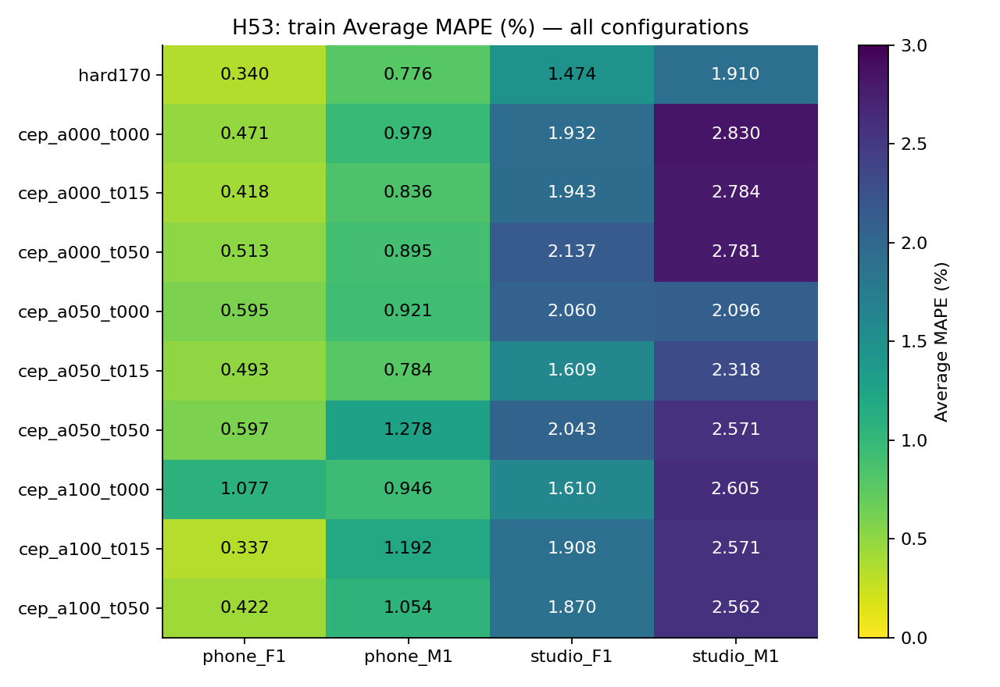

# H53 — kết quả chọn ứng viên cepstrum và đường đi cao độ

**Chưa tìm được cấu hình chung tốt hơn hard170.** Cả lựa chọn cuối trên bốn train và bốn outer folds đều giữ hard170. Không thay notebook đã nộp hoặc baseline. Mục tiêu mỗi một trong tám file Average MAPE <2% vẫn chưa đạt.

Vòng này đo cao độ thật từ tín hiệu: cepstrum tìm chu kỳ từ phổ; tương quan chuẩn hóa cung cấp ứng viên thời gian. Có chín cấu hình từ trọng số CEP 0/.5/1 và trọng số chuyển giữa các khung 0/.15/.5. Không fit mô hình, không có seed ngẫu nhiên. Mặt nạ hữu thanh giữ nguyên nên count, F1, recall V/UV và SIL giữ nguyên. Dự đoán fixed không thay đổi giữa các pool; các folds đánh giá lựa chọn tham số, không phải nhiều lượt học khác nhau.

## Ma trận train

| option_id | phone_F1.wav | phone_M1.wav | studio_F1.wav | studio_M1.wav |
| --- | --- | --- | --- | --- |
| hard170 | 0.34008 | 0.776151 | 1.47358 | 1.90992 |
| cep_a000_t000 | 0.471326 | 0.979235 | 1.93207 | 2.83049 |
| cep_a000_t015 | 0.417849 | 0.836103 | 1.94344 | 2.78376 |
| cep_a000_t050 | 0.513302 | 0.894811 | 2.13698 | 2.78147 |
| cep_a050_t000 | 0.594536 | 0.920582 | 2.06049 | 2.09557 |
| cep_a050_t015 | 0.492662 | 0.783563 | 1.60932 | 2.31831 |
| cep_a050_t050 | 0.596844 | 1.27828 | 2.04318 | 2.57144 |
| cep_a100_t000 | 1.07705 | 0.945597 | 1.61002 | 2.60536 |
| cep_a100_t015 | 0.336928 | 1.19188 | 1.90805 | 2.57138 |
| cep_a100_t050 | 0.422173 | 1.05405 | 1.87035 | 2.56163 |

Mọi biến thể mới đều có studio_M1 >2%; riêng một cấu hình CEP làm phone_F1 giảm rất nhỏ, 0.34008→0.33689%, nhưng xấu hơn ở những file khác. Không chọn tham số riêng cho file hoặc ghép các kết quả tốt nhất. Với hybrid alpha.5, temporal penalty.15 giảm mean file MAPE từ1.41780 (lambda0) xuống1.30096%; vẫn cao hơn control1.12493%. Đây là tác động mô tả giữa hai cấu hình đã đăng ký, chưa phải cải thiện toàn pipeline.

## Test đã chốt trước

| option_id | file | average_mape | F0mean_mape | F0std_mape | F0num_mape | macro_f1 | recall_v | false_voiced_sil |
| --- | --- | --- | --- | --- | --- | --- | --- | --- |
| hard170 | phone_F2.wav | 4.19731 | 1.51635 | 10.619 | 0.456621 | 0.870816 | 0.906383 | 0 |
| cep_a050_t015 | phone_F2.wav | 4.45481 | 1.62517 | 11.2826 | 0.456621 | 0.870816 | 0.906383 | 0 |
| hard170 | phone_M2.wav | 6.83375 | 0.884189 | 13.926 | 5.69106 | 0.977499 | 0.970149 | 0 |
| cep_a050_t015 | phone_M2.wav | 5.31123 | 0.591553 | 9.65109 | 5.69106 | 0.977499 | 0.970149 | 0 |
| hard170 | studio_F2.wav | 5.06346 | 0.0266886 | 10.8471 | 4.31655 | 0.881481 | 0.948905 | 0 |
| cep_a050_t015 | studio_F2.wav | 5.71076 | 0.366189 | 12.4496 | 4.31655 | 0.881481 | 0.948905 | 0 |
| hard170 | studio_M2.wav | 2.11479 | 0.32909 | 2.56701 | 3.44828 | 0.850806 | 0.921875 | 0 |
| cep_a050_t015 | studio_M2.wav | 1.96592 | 1.04188 | 1.40762 | 3.44828 | 0.850806 | 0.921875 | 0 |

Cấu hình được chọn từ train vẫn là hard170, có0/4test <2%. Hybrid cep_a050_t015 là cấu hình chẩn đoán đã đăng ký trước đo, không phải cấu hình được chọn: phone_M2 giảm6.83375→5.31124%, studio_M2 giảm2.11479→1.96592%, nhưng phone_F2 và studio_F2 xấu hơn. Không dùng hai kết quả tốt này để promote, chọn lại trên test hoặc tuyên bố đạt mục tiêu8file. Test đã được xem trong lịch sử nên cũng không phải tập xác nhận hoàn toàn mới.

## Kiểm tra và giới hạn

Verifier PASS trên588khung train và603khung test: cepstrum bằng full FFT/real IFFT độc lập, tương quan trực tiếp, peak/refinement, nội suy score, scalar dynamic programming, MAPE và mặt nạ bất biến. Có40nhóm metric train và8nhóm test,160inner records; registry/source/input/output hash đã kiểm. Không có lỗi verifier trong H53. Probe synthetic là8tín hiệu×9cấu hình, median error<5Hz và bất biến gain/DC, không thay validation trên tiếng nói.

Các ứng viên bị giới hạn±200cents quanh baseline; do đó vòng này chỉ sửa cao độ gần baseline, chưa thử sửa sai nguyên một octave. Alpha0/1 loại một nguồn khỏi local score nhưng vẫn giữ candidate bank chung có vị trí peak từ cả hai nguồn; không gọi đây là ablation loại toàn bộ CEP/NCCF. Lambda0 bỏ temporal penalty, vẫn giữ prior gần baseline. Không dùng HMM học trên PTDB, SRH hoặc PEFAC và không tuyên bố tái hiện pipeline MathWorks.

H53_largest_pitch_changes.csv lưu ba thay đổi lớn nhất mỗi file của hybrid cố định, chọn sau đo cho phân tích mô tả. Nhãn LAB chỉ cho biết V/UV/SIL và biên đoạn; hai giá trị F0 đều là ước lượng. Không có F0 chuẩn từng khung trên BT2 để kết luận giá trị nào đúng. MAPE theo thống kê cả file và đường mượt không đủ chứng minh contour đúng. Kết quả này cũng không chứng minh thất bại do dữ liệu ít.

Prereg b2e2bd5 và freeze1458206 đều push/remoteverify trước train/test. Lệnh: cepstral_path.py train/test; verify_cepstral_path.py train/test. Không rerun phép đo đã lưu. Nguồn HTML và thiết kế chính xác ở H53_REGISTRATION.md; giới hạn prior/filter/window/scoring giữ nguyên.
