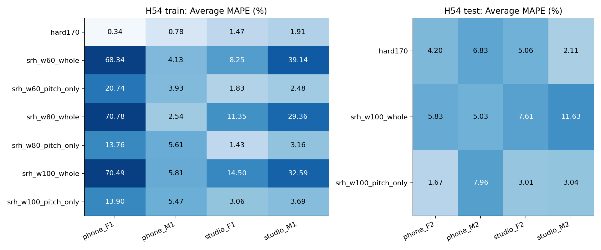
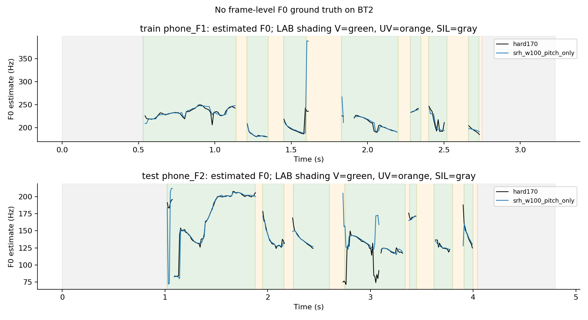

# H54 — SRH: kết quả và giới hạn

**Chưa có cấu hình chung tốt hơn baseline.** Sáu cấu hình mới và control đã đo trên bốn train; cả lựa chọn cuối và bốn outer pools giữ hard170. Mục tiêu mỗi một trong tám file Average MAPE <2% chưa đạt: baseline có4/4train và0/4test đạt. Không sửa notebook đã nộp hoặc pipeline được giữ lại.

SRH dùng residual sau dự đoán tuyến tính, cộng năng lượng họa âm và trừ giữa họa âm. Vòng này có ba cửa sổ60/80/100ms và hai nhánh: thay cả voicing/pitch, hoặc chỉ thay pitch dưới mặt nạ hữu thanh baseline. Nhánh pitch-only giữ count, V/UV/SIL; whole có thể đổi chúng. Không mô hình học hoặc seed ngẫu nhiên.

## Ma trận train

| option_id | phone_F1.wav | phone_M1.wav | studio_F1.wav | studio_M1.wav |
| --- | --- | --- | --- | --- |
| hard170 | 0.34008 | 0.776151 | 1.47358 | 1.90992 |
| srh_w60_whole | 68.3372 | 4.13077 | 8.24655 | 39.138 |
| srh_w60_pitch_only | 20.7403 | 3.93051 | 1.83113 | 2.48319 |
| srh_w80_whole | 70.7783 | 2.53758 | 11.3523 | 29.3576 |
| srh_w80_pitch_only | 13.7566 | 5.61385 | 1.43175 | 3.16307 |
| srh_w100_whole | 70.4869 | 5.81292 | 14.5046 | 32.5933 |
| srh_w100_pitch_only | 13.9038 | 5.47104 | 3.06391 | 3.68856 |

SRH toàn pipeline gây nhiều SIL false positives: tổng99/128/154khung lần lượt ở cửa sổ60/80/100ms, so baseline0. Đây là số khung có LAB SIL mà vẫn được dự đoán hữu thanh, không phải số cao độ đã được xác nhận sai. Pitch-only80 giảm studio_F1 rất nhỏ1.473576→1.431750%, nhưng ba train khác xấu hơn; không chọn cấu hình riêng cho file. Worst-file minimax và guard VUV đều dẫn về control. Trong tám gate, ba điều kiện yêu cầu giảm MAPE FAIL, năm guard khác PASS vì giữ baseline; eligibility FAIL, không promote.

## Test cấu hình đã chốt

| option_id | file | average_mape | F0mean_mape | F0std_mape | F0num_mape | macro_f1 | recall_v | recall_uv | balanced_accuracy | false_voiced_sil |
| --- | --- | --- | --- | --- | --- | --- | --- | --- | --- | --- |
| hard170 | phone_F2.wav | 4.19731 | 1.51635 | 10.619 | 0.456621 | 0.870816 | 0.906383 | 0.895522 | 0.900953 | 0 |
| srh_w100_whole | phone_F2.wav | 5.82944 | 0.662095 | 1.30112 | 15.5251 | 0.641887 | 0.868085 | 0.402985 | 0.635535 | 9 |
| srh_w100_pitch_only | phone_F2.wav | 1.66667 | 0.0968406 | 4.44653 | 0.456621 | 0.870816 | 0.906383 | 0.895522 | 0.900953 | 0 |
| hard170 | phone_M2.wav | 6.83375 | 0.884189 | 13.926 | 5.69106 | 0.977499 | 0.970149 | 1 | 0.985075 | 0 |
| srh_w100_whole | phone_M2.wav | 5.03475 | 0.537634 | 3.99752 | 10.5691 | 0.930903 | 0.962687 | 0.892308 | 0.927497 | 0 |
| srh_w100_pitch_only | phone_M2.wav | 7.9606 | 0.00590807 | 18.1848 | 5.69106 | 0.977499 | 0.970149 | 1 | 0.985075 | 0 |
| hard170 | studio_F2.wav | 5.06346 | 0.0266886 | 10.8471 | 4.31655 | 0.881481 | 0.948905 | 0.869565 | 0.909235 | 0 |
| srh_w100_whole | studio_F2.wav | 7.60997 | 2.6076 | 7.9921 | 12.2302 | 0.787328 | 0.868613 | 0.869565 | 0.869089 | 0 |
| srh_w100_pitch_only | studio_F2.wav | 3.01255 | 1.38261 | 3.3385 | 4.31655 | 0.881481 | 0.948905 | 0.869565 | 0.909235 | 0 |
| hard170 | studio_M2.wav | 2.11479 | 0.32909 | 2.56701 | 3.44828 | 0.850806 | 0.921875 | 0.9 | 0.910937 | 0 |
| srh_w100_whole | studio_M2.wav | 11.6277 | 5.18539 | 15.0426 | 14.6552 | 0.777247 | 0.914062 | 0.7 | 0.807031 | 10 |
| srh_w100_pitch_only | studio_M2.wav | 3.04207 | 1.25512 | 4.42281 | 3.44828 | 0.850806 | 0.921875 | 0.9 | 0.910937 | 0 |

Selected vẫn là baseline. Hai nhánh100ms là diagnostics đã đăng ký trước đo train và khóa trước test. Pitch-only giảm phone_F2 **4.197313→1.666665%**, studio_F2 **5.063462→3.012553%**; nhưng phone_M2 **6.833750→7.960597%**, studio_M2 **2.114791→3.042067%**. Không dùng test để route theo giới tính/file, ghép kết quả tốt nhất hoặc promote. Whole làm F0std phone_F2 gần thống kê chuẩn hơn nhưng count lệch15.525114% và F1 giảm, Average MAPE5.829442%. Điều này cho thấy cần báo cùng pitch/voicing/count thay vì chỉ chọn một thành phần đẹp.

## Phân tích thay đổi cao độ

| stage | file | voiced_frames | abs_change_over_600cents | median_abs_change_cents | largest_abs_change_cents | frame_f0_truth_available |
| --- | --- | --- | --- | --- | --- | --- |
| train | phone_F1.wav | 147 | 2 | 12.1926 | 869.55 | False |
| train | phone_M1.wav | 233 | 4 | 12.9548 | 1259.62 | False |
| train | studio_F1.wav | 123 | 0 | 12.2706 | 328.635 | False |
| train | studio_M1.wav | 85 | 0 | 17.4906 | 268.154 | False |
| test | phone_F2.wav | 220 | 14 | 13.1595 | 1742.67 | False |
| test | phone_M2.wav | 130 | 2 | 19.5691 | 1690.57 | False |
| test | studio_F2.wav | 133 | 3 | 14.8529 | 1467.11 | False |
| test | studio_M2.wav | 120 | 1 | 18.9865 | 1025.47 | False |

Cent là đơn vị logarit:1200cents tương ứng tỉ lệ tần số2. Ở train phone_F1, chỉ2khung lệch hơn600cents so baseline, ở1.6025/1.6125s SRH~389/388Hz so baseline~235Hz; các điểm này có thể làm std nhạy dù đa số thay đổi nhỏ. Ở phone_M1, có4khung hơn600cents, ba khung quanh2.02–2.04s chuyển~102Hz sang~199–210Hz. Đây là **bất đồng hai ước lượng**, không bằng chứng ground truth từng khung. File `H54_largest_pitch_changes.csv` giữ5thay đổi lớn nhất mỗi file, không dùng chọn lại cấu hình.

Test phone_F2 có14khung lệch hơn600cents, gồm cả hướng tăng và giảm. MAPE thống kê cải thiện không bảo đảm tất cả14khung SRH đúng. Một giới hạn quanh baseline có thể chặn thay đổi gây lệch std trên train nhưng cũng chặn sửa octave nếu baseline sai; đó chỉ là giả thuyết cho vòng mới, chưa được đo ởH54. Không kết luận dữ liệu ít hoặc GT sai là nguyên nhân duy nhất.

## Kiểm tra và tái lập

Prereg45f489e và freeze4527180 đều push/remoteverify trước train/test.12native analyses train/4test;28/12metric groups,112inner records,24summary rows. Verifier PASS7740/2607LPC frames và3813/1276spectral frames. Mọi LPC frame BT2 cócondition<=1e8 nên đã so dense coefficients; equation residual, convolution/energy/overlap-add/fullFFT/scalarSRH/projection/metrics/hash và lựa chọn train đã đối chiếu. Resampling dùng cùng SciPy, không reference MATLAB/Octave execution hoặc bit-parity claim.

Precheck tổng hợp15/18accuracyPASS,3FAIL100→300Hz/fs44100 giữ nguyên. Math qualificationPASS cho phép benchmark exploratory, không biến accuracyFAIL thànhPASS. Verifier đầu đã lỗi coefficient comparison ở synthetic condition~3.09e10; hồ sơ và sửa trước measurement lưu riêng. Không sửa thuật toán theo BT2. Source/license/phạm vi đọc abstract/code tạiSRH_SOURCE_NOTE.md, registry/H54_REGISTRATION.md. Test có historical exposure nên không đánh giá như corpus mới độc lập.

Lệnh đo `srh_experiment.py train/test`, kiểm tra `verify_srh.py train/test`, báo cáo `report_srh.py`; không chạy lại phép đo đã lưu. Dùng Python3.13.11/numpy2.4.3/scipy1.17.1, seedNone. LAB/teacher3GT không F0 chuẩn từng khung. Jev không tham gia. NoDrive/DL/PDF; bài phân đoạn mới vẫn sau ưu tiên cải thiệnBT2.
