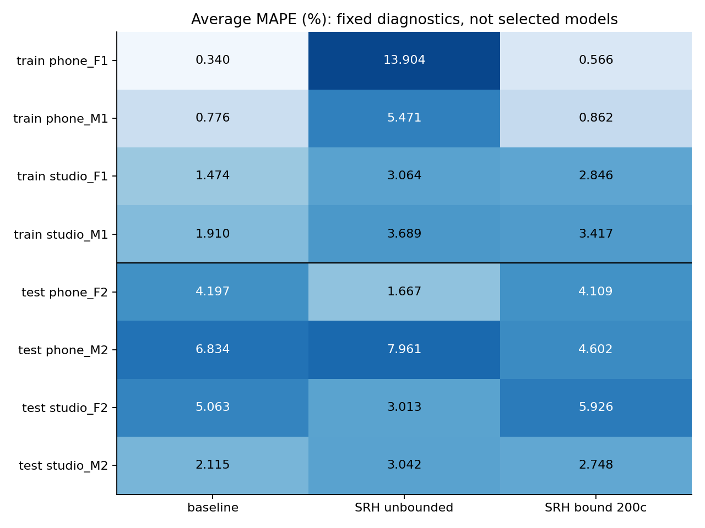

# H55 — giới hạn đỉnh SRH quanh baseline

**Chưa tìm được cấu hình chung vượt baseline.** Sau ba khoảng100/200/400cents, lựa chọn cuối và cả bốn outer pools đều giữ hard170. Bốn train của baseline vẫn <2%; cả bốn test còn >2%. Mục tiêu mỗi tám file <2% chưa đạt, pipeline và notebook đã nộp không đổi.

Vòng này kiểm tra đúng một thay đổi: thay chọn đỉnh SRH toàn range bằng chọn đỉnh trong vùng quanh F0 baseline.1200cents là tỉ lệ tần số2;200cents khoảng tỉ lệ1.122. Giữ source window100ms, reuse các proof H54 đã verified và hash-protected, không rerun estimator. Mask/count/VUV/SIL giữ nguyên; không mô hình fit hoặc seed. Tần số mới integer1Hz vì source SRH nên hầu hết khung thay nhẹ ngay cả khi chưa đổi peak đáng kể.

## Train và selection

| option_id | phone_F1.wav | phone_M1.wav | studio_F1.wav | studio_M1.wav |
| --- | --- | --- | --- | --- |
| hard170 | 0.34008 | 0.776151 | 1.47358 | 1.90992 |
| srh_bound_100 | 0.745909 | 0.649398 | 1.67053 | 2.83472 |
| srh_bound_200 | 0.565616 | 0.862475 | 2.84625 | 3.41709 |
| srh_bound_400 | 0.831947 | 0.862475 | 3.06391 | 3.68856 |

Bound200 giảm phone_F1 từ **13.903806%** ở SRH unbounded xuống **0.565616%**, nhưng baseline đã0.340080%. Bound100 giảm phone_M1 **0.776151→0.649398%**, song phone_F1/studio_F1/studio_M1 xấu hơn; studio_M1 của cả ba bound >2%. Không chọn width theo từng file. Minimax worst-file giữ baseline; ba gate yêu cầu giảm MAPE FAIL, năm guard khác PASS dưới selected control. Không promote.

## Test đã khóa trước

| option_id | file | average_mape | F0mean_mape | F0std_mape | F0num_mape | F0mean_abs_error | F0std_abs_error | macro_f1 | recall_v | recall_uv | balanced_accuracy | false_voiced_sil |
| --- | --- | --- | --- | --- | --- | --- | --- | --- | --- | --- | --- | --- |
| hard170 | phone_F2.wav | 4.19731 | 1.51635 | 10.619 | 0.456621 | 2.27755 | 3.26003 | 0.870816 | 0.906383 | 0.895522 | 0.900953 | 0 |
| srh_bound_200 | phone_F2.wav | 4.1089 | 1.26195 | 10.6081 | 0.456621 | 1.89545 | 3.2567 | 0.870816 | 0.906383 | 0.895522 | 0.900953 | 0 |
| hard170 | phone_M2.wav | 6.83375 | 0.884189 | 13.926 | 5.69106 | 1.15121 | 2.1446 | 0.977499 | 0.970149 | 1 | 0.985075 | 0 |
| srh_bound_200 | phone_M2.wav | 4.60243 | 0.277679 | 7.83855 | 5.69106 | 0.361538 | 1.20714 | 0.977499 | 0.970149 | 1 | 0.985075 | 0 |
| hard170 | studio_F2.wav | 5.06346 | 0.0266886 | 10.8471 | 4.31655 | 0.0530035 | 5.18494 | 0.881481 | 0.948905 | 0.869565 | 0.909235 | 0 |
| srh_bound_200 | studio_F2.wav | 5.92609 | 0.769295 | 12.6924 | 4.31655 | 1.52782 | 6.06698 | 0.881481 | 0.948905 | 0.869565 | 0.909235 | 0 |
| hard170 | studio_M2.wav | 2.11479 | 0.32909 | 2.56701 | 3.44828 | 0.509102 | 0.777803 | 0.850806 | 0.921875 | 0.9 | 0.910937 | 0 |
| srh_bound_200 | studio_M2.wav | 2.7476 | 1.73454 | 3.05998 | 3.44828 | 2.68333 | 0.927174 | 0.850806 | 0.921875 | 0.9 | 0.910937 | 0 |

Bound200 là diagnostic cố định trước train, không được train chọn. Nó giảm phone_M2 **6.833750→4.602428%** và phone_F2 **4.197313→4.108902%**, nhưng tăng studio_F2 **5.063462→5.926086%**, studio_M2 **2.114791→2.747599%**; cả bốn vẫn >2%. Test đã có historical exposure, không chọn tham số từ test và không mô tả như xác nhận độc lập mới.

## Cơ chế và đánh đổi

Giới hạn ứng viên chặn các thay đổi lớn trên train phone_F1 và phone_M1, nhưng đồng thời làm mất cải thiện thống kê của SRH unbounded trên phone_F2 (1.666665%→4.108902%). Baseline có thể sai ngoài khoảng bound; giữ gần baseline không đủ để sửa. Những bất đồng lớn vừa tăng vừa giảm trên phone_F2, nên không biết tất cả SRH unbounded đúng khi thiếu F0 chuẩn từng khung. Hai điểm train phone_F1 chuyển~235→389Hz nằm trong LAB **UV**; thay estimator giảm nhảy cao độ nhưng giữ nguyên mask chưa giải quyết việc dự đoán hữu thanh trên UV. Không dùng nhãn UV để loại chúng trong inference của vòng này.

Phân tích dựa trên whole-file MAPE và contour ước lượng, không claim xác định đúng/sai pitch từng khung. Count phone_M2 baseline lệch5.691057% đóng góp1.897019 điểm vào Average MAPE; pitch-only chỉ còn khoảng0.102981 điểm cho tổng mean/std contributions nếu muốn <2. Điều đó đặt yêu cầu rất chặt nhưng không chứng minh bất khả thi, nhãn sai hoặc dữ liệu ít là nguyên nhân duy nhất. Thay count phải là giả thuyết riêng, không tinh chỉnh theo test.

## Kiểm tra và tái lập

Prereg248d8be/freezeeeedd83 push/remoteverify trước train/test.16/8metric groups,64inner traces,24summary rows. Verifier scalar độc lập PASS1764bounded selections train và603test; displacement<=width, nearest mapping/fallback/tie/mask/metrics/selection/gates/hash. Reuse H54 cached verified LPC/FFT/SRH; H55 không đo native estimator mới.18synthetic near-truth biased-anchor casesPASS vàmask/fallback/tie checksPASS, không xóa ba failures của unboundedH54 và không chứng minh sửa octave anchor sai.

H55_REGISTRATION.md/H55_REGISTRY.json ghi grid, dữ liệu/code/version hashes, constraints và lựa chọn. Lệnh bounded_srh.py train/test;verify_bounded_srh.py train/test;report_bounded_srh.py. Không rerun measurement đã lưu. NoDrive/DL/PDF/Jev/prose skill. Original WAV/LAB/teacher3GT/frozen pipeline không thay; bài mới thầy giao vẫn sau ưu tiên cải thiệnBT2.
