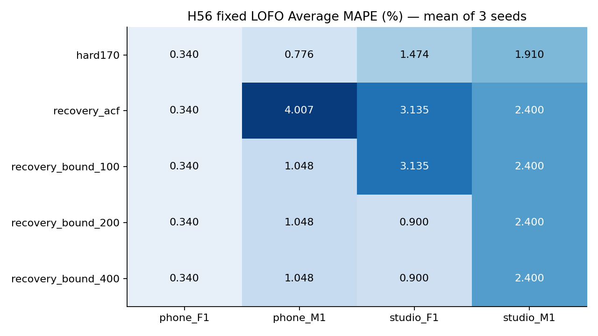
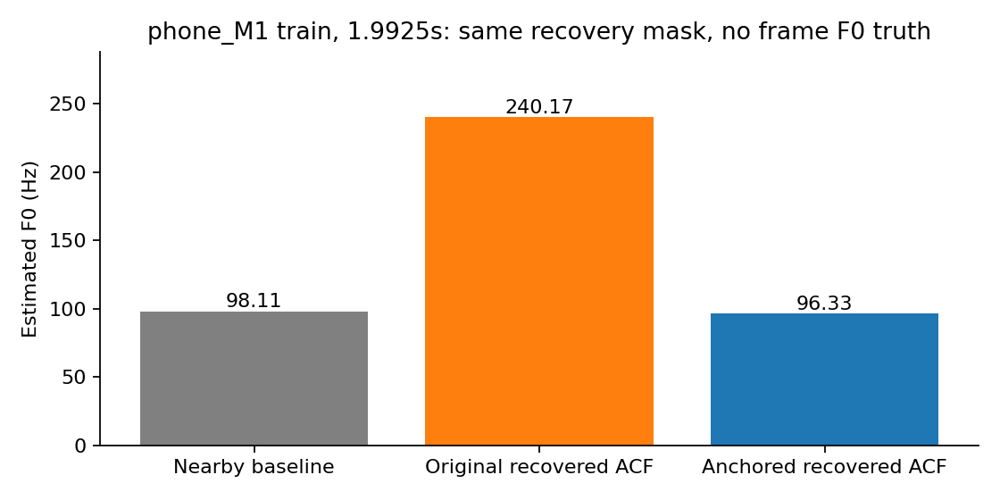

# H56 — nguyên nhân ở pitch recovery và phần đếm

**Đã cô lập được một nguồn làm sai F0std trên train, nhưng chưa có cải tiến chung đạt mục tiêu.** Thay cách lấy F0 của cùng các khung được khôi phục giảm mạnh sai số ở phone_M1 và studio_F1. Final chọn hard170; outer phone_M1 chọn original recovery_acf, ba outer khác hard170, cho thấy selection không ổn định. Gate và mục tiêu từng8file<2% vẫn FAIL. Không sửa pipeline giữ lại, notebook đã nộp, LAB hoặc3GT.

GMM gmm_PEZS giữ nguyên feature/learner/threshold nhưH51,fit theo đúng pool, ba seed11/29/47. Bốn recovery nhánh có **cùng mask/count/VUV/SIL**; chỉ pitch của khung mới khác. Peak tương quan tìm trong100/200/400cents quanh F0 baseline gần nhất<=50ms, không phù hợp thìfallback pitchACF cũ. BaselineVpitch giữ nguyên. Đây là can thiệp có kiểm soát vào output estimator; không chứng minh F0 từng khung đúng vì BT2 thiếu reference theo thời gian.

## Kiểm tra train và ba seed

| option_id | phone_F1.wav | phone_M1.wav | studio_F1.wav | studio_M1.wav |
| --- | --- | --- | --- | --- |
| hard170 | 0.34008 | 0.776151 | 1.47358 | 1.90992 |
| recovery_acf | 0.34008 | 4.00741 | 3.13505 | 2.39989 |
| recovery_bound_100 | 0.34008 | 1.04823 | 3.13505 | 2.39989 |
| recovery_bound_200 | 0.34008 | 1.04823 | 0.899591 | 2.39989 |
| recovery_bound_400 | 0.34008 | 1.04823 | 0.899591 | 2.39989 |

| option_id | seed | mean | max |
| --- | --- | --- | --- |
| hard170 | 11 | 1.12493 | 1.90992 |
| hard170 | 29 | 1.12493 | 1.90992 |
| hard170 | 47 | 1.12493 | 1.90992 |
| recovery_acf | 11 | 2.47061 | 4.00741 |
| recovery_acf | 29 | 2.47061 | 4.00741 |
| recovery_acf | 47 | 2.47061 | 4.00741 |
| recovery_bound_100 | 11 | 1.73081 | 3.13505 |
| recovery_bound_100 | 29 | 1.73081 | 3.13505 |
| recovery_bound_100 | 47 | 1.73081 | 3.13505 |
| recovery_bound_200 | 11 | 1.17195 | 2.39989 |
| recovery_bound_200 | 29 | 1.17195 | 2.39989 |
| recovery_bound_200 | 47 | 1.17195 | 2.39989 |
| recovery_bound_400 | 11 | 1.17195 | 2.39989 |
| recovery_bound_400 | 29 | 1.17195 | 2.39989 |
| recovery_bound_400 | 47 | 1.17195 | 2.39989 |

Các fixed LOFO kết quả giống nhau qua ba seed; không chọn seed đẹp. Với bound200, phone_M1 recovery4.007407→1.048232%, studio_F1 recovery3.135052→0.899591%, mask/count/F1 hoàn toàn giống nhánhACF. So baseline, studio_F1 tốt hơn1.473576→0.899591%, nhưng phone_M1 vẫn kém0.776151% và studio_M1 vẫn2.399893%>2. Width100 chưa sửa được điểm studio_F1; width200/400 cùng kết quảfixedLOFO, không đồng nghĩa mọi outputs ởmọipool giống nhau.

Khung phone_M1 1.9925s có LABV: F0 cũ240.172Hz, baseline gần nhất98.111Hz, bản anchored96.325Hz. Khung được giữ trong cả hai nhánh nên count không đổi. Sự giảm stdMAPE khi thay riêng estimator chứng minh lựa chọn pitch tác động đến lỗi thống kê, không chứng minh reference thật của khung là98Hz. Các trường hợp từng khung trongH56_recovery_cases.csv dùng seed11 vì cácfixedLOFO outputs đều bằng nhau qua ba seed.

## Phần đếm và nhãn đoạn

| stage | file | center_v_frames | reference_F0num | baseline_F0num | FP_uv | FP_sil | FN | center_minus_reference | pred_minus_reference | count_average_mape_contribution |
| --- | --- | --- | --- | --- | --- | --- | --- | --- | --- | --- |
| train | phone_F1.wav | 153 | 148 | 147 | 3 | 0 | 9 | 5 | -1 | 0.225225 |
| train | phone_M1.wav | 244 | 232 | 233 | 2 | 0 | 13 | 12 | 1 | 0.143678 |
| train | studio_F1.wav | 123 | 127 | 123 | 4 | 0 | 4 | -4 | -4 | 1.04987 |
| train | studio_M1.wav | 94 | 82 | 85 | 4 | 0 | 13 | 12 | 3 | 1.21951 |
| test | phone_F2.wav | 235 | 219 | 220 | 7 | 0 | 22 | 16 | 1 | 0.152207 |
| test | phone_M2.wav | 134 | 123 | 130 | 0 | 0 | 4 | 11 | 7 | 1.89702 |
| test | studio_F2.wav | 137 | 139 | 133 | 3 | 0 | 7 | -2 | -6 | 1.43885 |
| test | studio_M2.wav | 128 | 116 | 120 | 2 | 0 | 10 | 12 | 4 | 1.14943 |

Phân rã chính xác: `predicted_count − reference = (center_V_count − reference) + FP_UV + FP_SIL + FP_unknown − FN_V`. Đã kiểm từngfile. F0num chuẩn không phải số tâm khungLABV: studio_M1 94tâmV/82reference, phone_M2 134tâmV/123reference. Vì vậy chỉ tăng recallV chưa chắc giảm countMAPE. Baseline studio_M1 có85pitch, do94V +4UVFP −13VFN; sai số quyết định bù nhau vềcount. Không dùng sự bù này để gọi classification đúng.

Với exactLABVmask vàfinitepitchởmọikhungV, studio_M1 count đóng góp4.878049điểm vàoAverageMAPE dù mean/std bằngreference. Đây là **counterfactual có điều kiện**, không cận dưới mọi pipeline: khungV ngữ âm có thể không cóF0ước lượng hợp lệ theo engine của thầy. Chưa biết engine, frame/hop/timestamp, ngưỡngvalidF0, range vàddof tạo3GT nên không quy choGTsai. H56_boundary_audit.csv phân lỗi tại tâm gầnbiên<=12.5ms vàngoài biên; phân tích hậu nghiệm không đổi nhãn hoặc threshold.

## Test: paired diagnostics đã khóa

| file | option_id | average_mape | F0mean_mape | F0std_mape | F0num_mape | F0mean_abs_error | F0std_abs_error | macro_f1 | recall_v | recall_uv | balanced_accuracy | false_voiced_sil | recovered |
| --- | --- | --- | --- | --- | --- | --- | --- | --- | --- | --- | --- | --- | --- |
| phone_F2.wav | hard170 | 4.19731 | 1.51635 | 10.619 | 0.456621 | 2.27755 | 3.26003 | 0.870816 | 0.906383 | 0.895522 | 0.900953 | 0 | 0 |
| phone_F2.wav | recovery_acf | 5.01603 | 1.88146 | 11.7968 | 1.36986 | 2.82595 | 3.62161 | 0.878623 | 0.914894 | 0.895522 | 0.905208 | 0 | 2 |
| phone_F2.wav | recovery_bound_200 | 5.01603 | 1.88146 | 11.7968 | 1.36986 | 2.82595 | 3.62161 | 0.878623 | 0.914894 | 0.895522 | 0.905208 | 0 | 2 |
| phone_M2.wav | hard170 | 6.83375 | 0.884189 | 13.926 | 5.69106 | 1.15121 | 2.1446 | 0.977499 | 0.970149 | 1 | 0.985075 | 0 | 0 |
| phone_M2.wav | recovery_acf | 8.35168 | 1.08499 | 16.653 | 7.31707 | 1.41266 | 2.56456 | 0.97733 | 0.977612 | 0.984615 | 0.981114 | 0 | 2 |
| phone_M2.wav | recovery_bound_200 | 8.35168 | 1.08499 | 16.653 | 7.31707 | 1.41266 | 2.56456 | 0.97733 | 0.977612 | 0.984615 | 0.981114 | 0 | 2 |
| studio_F2.wav | hard170 | 5.06346 | 0.0266886 | 10.8471 | 4.31655 | 0.0530035 | 5.18494 | 0.881481 | 0.948905 | 0.869565 | 0.909235 | 0 | 0 |
| studio_F2.wav | recovery_acf | 4.17989 | 0.145072 | 10.2363 | 2.15827 | 0.288112 | 4.89296 | 0.912711 | 0.970803 | 0.869565 | 0.920184 | 0 | 3 |
| studio_F2.wav | recovery_bound_200 | 3.437 | 0.597808 | 7.55492 | 2.15827 | 1.18725 | 3.61125 | 0.912711 | 0.970803 | 0.869565 | 0.920184 | 0 | 3 |
| studio_M2.wav | hard170 | 2.11479 | 0.32909 | 2.56701 | 3.44828 | 0.509102 | 0.777803 | 0.850806 | 0.921875 | 0.9 | 0.910937 | 0 | 0 |
| studio_M2.wav | recovery_acf | 2.89971 | 0.323804 | 3.20292 | 5.17241 | 0.500925 | 0.970484 | 0.845565 | 0.929688 | 0.85 | 0.889844 | 0 | 2 |
| studio_M2.wav | recovery_bound_200 | 2.89971 | 0.323804 | 3.20292 | 5.17241 | 0.500925 | 0.970484 | 0.845565 | 0.929688 | 0.85 | 0.889844 | 0 | 2 |

Test cũng giống nhau qua ba seed. Bound200 cải thiện studio_F2 từ5.063462baseline xuống3.437002%; so cùng recoverymask,ACF4.179890→3.437002. Ba test khác bản recovery tệ hơn baseline, cảbốn vẫn>2. Bound200 không được train chọn. Không route theo file, chỉnh theo test hoặc báo fresh independent confirmation; test đã định hướng nghiên cứu trong lịch sử. Serialized fulltrain models dùngtest, khôngfit hay chuẩn hóa học lại trêntest.

## Kết luận nguyên nhân và việc tiếp theo

Có bằng chứng **một phần lỗi kỹ thuật nằm ở estimator khi recovery**, và **quyết định V theo LAB với điều kiện validF0 tạo3GT là hai mục tiêu khác nhau**. Chưa có bằng chứng đủ để kết luận test bị lỗi, dữ liệu ít là nguyên nhân duy nhất, hoặc mọiF0 gầnanchor đều đúng. Việc có thể tiếp tục: kiểm tra mô hình cho cả phép thêm và loại khung với estimator recovery đã cải thiện, chọn/kiểm tra theo filetrain; cần đăng ký vòng riêng, không tinh chỉnh trực tiếp theo test. Kiểm chứng khả năng tổng quát sau nhiều lần xem test cần corpus/người nói chưa dùng định hướng, cùng referenceprotocol. Không tự tái gán nhãn thầy để đạt2%.

Những thông tin còn thiếu để audit reference chính xác: frame length/hop vàtimestamp; engine+phiênbản/range/ngưỡnghữu thanh; quy tắc giữbỏF0ởkhungV/biên; stdpopulation hay sample; output F0 chuẩn từng khung hoặc cách tạo ba thống kê. Không gửi tin thầy hoặc suy đoán có công cụ/ghi nhầm thay bằng chứng.

## Kiểm tra và tái lập

Prereg0b64071/freeze530841f push/remoteverify trướctrain/test.33GMMfits,300train metricgroups/240innerrecords/72summaryrows; test36groups/0fits. Verifier PASS scalarGMMweights/scalertrain/componentmapping/peakselector/nearestfallback/masks/metrics/foldexclusion/selection/gates/hashes.12oldACFfixedLOFO groups exactparityH51. H50/H51 feature cache previouslyverified/hashprotected; verifier không rerunoptimizer33fits hayclaim mớiPCMverification.18synthetic precheckPASS, khôngframeGTBT2. Python3.13.11/numpy2.4.3/scipy1.17.1/sklearn1.8.0.

Lệnh recovery_pitch.py train/test;verify_recovery_pitch.py train/test;report_recovery_pitch.py. Khôngrerunmeasurements đã lưu. Registration/registry/model/prob/pred/pitchproofs cùngworkbench/results. NoDrive/DL/PDF/Jev/proseskill; BT2 vẫn trước bàiBT1bổsung.
