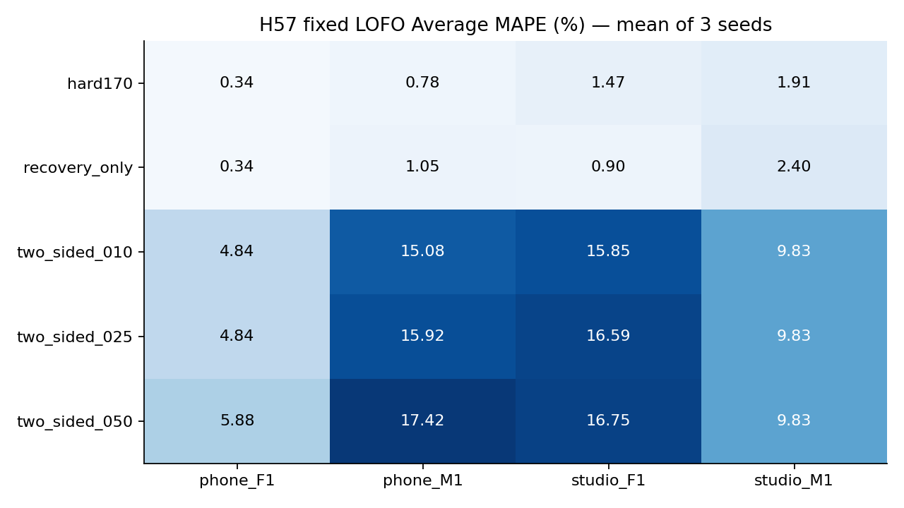

# H57 — loại khung bằng GMM: không cải thiện

**Cả ba ngưỡng loại khung đều làm train xấu hơn.** Final giữhard170; outerphone_M1 chọnrecovery_only đã sửa estimator, baouter kháccontrol. Nested mỗifiletrain<2 qua3seeds, nhưng ba điều kiện giảmMAPEFAIL, khôngpromote. Selectedbaseline vẫn4/4train,0/4test<2; mục tiêu8file chưađạt. H56/H57 cùng nhau đã tách được sai số estimator recovery và hạn chế quyết định loại khung bằng một cụmGMM.

Reuse33GMMmodels vàposterior/anchoredpitch H56, khôngfitmới. Ba ngưỡng.1/.25/.5 loại originalbaselineV khi posterior của cụm được chọn<threshold. Giữ mọi khung recovery vàpitch giữlại; đây là thay mask nên cùng lúc thay count/mean/std vàclassification, không có nghĩa chỉ sửa count.

## Ma trận train và seed

| option_id | phone_F1.wav | phone_M1.wav | studio_F1.wav | studio_M1.wav |
| --- | --- | --- | --- | --- |
| hard170 | 0.34008 | 0.776151 | 1.47358 | 1.90992 |
| recovery_only | 0.34008 | 1.04823 | 0.899591 | 2.39989 |
| two_sided_010 | 4.84494 | 15.0847 | 15.8507 | 9.83405 |
| two_sided_025 | 4.84494 | 15.9214 | 16.5851 | 9.83405 |
| two_sided_050 | 5.87906 | 17.4199 | 16.748 | 9.83405 |

| option_id | seed | mean_mape | worst_mape | removed | mean_recall_v |
| --- | --- | --- | --- | --- | --- |
| hard170 | 11 | 1.12493 | 1.90992 | 0 | 0.92927 |
| hard170 | 29 | 1.12493 | 1.90992 | 0 | 0.92927 |
| hard170 | 47 | 1.12493 | 1.90992 | 0 | 0.92927 |
| recovery_only | 11 | 1.17195 | 2.39989 | 0 | 0.934987 |
| recovery_only | 29 | 1.17195 | 2.39989 | 0 | 0.934987 |
| recovery_only | 47 | 1.17195 | 2.39989 | 0 | 0.934987 |
| two_sided_010 | 11 | 11.4036 | 15.8507 | 182 | 0.662183 |
| two_sided_010 | 29 | 11.4036 | 15.8507 | 182 | 0.662183 |
| two_sided_010 | 47 | 11.4036 | 15.8507 | 182 | 0.662183 |
| two_sided_025 | 11 | 11.7964 | 16.5851 | 192 | 0.648913 |
| two_sided_025 | 29 | 11.7964 | 16.5851 | 192 | 0.648913 |
| two_sided_025 | 47 | 11.7964 | 16.5851 | 192 | 0.648913 |
| two_sided_050 | 11 | 12.4702 | 17.4199 | 209 | 0.625424 |
| two_sided_050 | 29 | 12.4702 | 17.4199 | 209 | 0.625424 |
| two_sided_050 | 47 | 12.4702 | 17.4199 | 209 | 0.625424 |

Không chọnseed hoặcthreshold từtest. Rejection loại nhiềuLABV; recall giảm, không phải chỉ bỏ false positives. Tất cả variantsrejection vượt2% trênmọitrain fixedLOFO, không được chọn. Seedsummary lưu đủ3seeds; matrix làmean qua seeds, không giả mọi kết quảrejection giống nhau.

## Phân tích khung bị loại

| stage | file | seed | option_id | removed | removed_v | removed_uv | removed_sil |
| --- | --- | --- | --- | --- | --- | --- | --- |
| train | phone_F1.wav | 11 | two_sided_010 | 19 | 17 | 2 | 0 |
| train | phone_F1.wav | 11 | two_sided_025 | 19 | 17 | 2 | 0 |
| train | phone_F1.wav | 11 | two_sided_050 | 24 | 22 | 2 | 0 |
| train | phone_M1.wav | 11 | two_sided_010 | 85 | 83 | 2 | 0 |
| train | phone_M1.wav | 11 | two_sided_025 | 92 | 90 | 2 | 0 |
| train | phone_M1.wav | 11 | two_sided_050 | 101 | 99 | 2 | 0 |
| train | studio_F1.wav | 11 | two_sided_010 | 50 | 46 | 4 | 0 |
| train | studio_F1.wav | 11 | two_sided_025 | 53 | 49 | 4 | 0 |
| train | studio_F1.wav | 11 | two_sided_050 | 56 | 52 | 4 | 0 |
| train | studio_M1.wav | 11 | two_sided_010 | 28 | 25 | 3 | 0 |
| train | studio_M1.wav | 11 | two_sided_025 | 28 | 25 | 3 | 0 |
| train | studio_M1.wav | 11 | two_sided_050 | 28 | 25 | 3 | 0 |
| test | phone_F2.wav | 11 | two_sided_025 | 69 | 62 | 7 | 0 |
| test | phone_M2.wav | 11 | two_sided_025 | 26 | 26 | 0 | 0 |
| test | studio_F2.wav | 11 | two_sided_025 | 42 | 39 | 3 | 0 |
| test | studio_M2.wav | 11 | two_sided_025 | 19 | 17 | 2 | 0 |

## Vì sao posterior không đủ cho quyết định loại khung

| component | chosen_as_voiced | responsibility_mass | weighted_periodicity | weighted_fraction_lab_v |
| --- | --- | --- | --- | --- |
| 0 | True | 288.157 | 0.928246 | 0.989302 |
| 1 | False | 574.112 | 0.557862 | 0.355933 |
| 2 | False | 221.731 | 0.417254 | 0.0432069 |

Bảng trên là audittraining-only fulltrainmodel seed11: membership mềm của3cụm được đối chiếu vớiLAB sau đo, không dùng sửa mappingtrongH57. H51/H56 chọn **một cụm có meanperiodicity cao nhất** làm voiced. Posterior là xác suất thuộc cụm đó theoGMM, không được hiệu chỉnh/kiểm chứng như xác suất hữu thanh theoLAB. Có thể có nhiều cụm chứaV nhưng khác đặc trưng/độ mạnh; đối xử tất cả cụm còn lại làUV/SIL không được bảo đảm. Bảng fractionLABV cùng sốremovedV là bằng chứng định lượng cho giới hạn mapping này. Không coi nhãnV theoLAB tự động tương đươngvalidF0referencecount.

Để thử sửa mapping cần một vòng riêng: mapping đa cụm theo trainingperiodicity hoặc nhãntraining vớiheld-filevalidation, giữtestngoài lựachọn; không thay mapping H57 sau khi xem kết quả. Không dùng thresholdposterior tùy ý để cốkhớpcount thầy. Đây là vấnđề cơ chế đã quan sát, không kết luậnML/GMM vô dụng hoặc data/testlỗi.

## Test diagnostics khóa trước

| file | option_id | average_mape | F0mean_mape | F0std_mape | F0num_mape | F0mean_abs_error | F0std_abs_error | macro_f1 | recall_v | recall_uv | balanced_accuracy | false_voiced_sil | removed |
| --- | --- | --- | --- | --- | --- | --- | --- | --- | --- | --- | --- | --- | --- |
| phone_F2.wav | hard170 | 4.19731 | 1.51635 | 10.619 | 0.456621 | 2.27755 | 3.26003 | 0.870816 | 0.906383 | 0.895522 | 0.900953 | 0 | 0 |
| phone_F2.wav | recovery_only | 5.01603 | 1.88146 | 11.7968 | 1.36986 | 2.82595 | 3.62161 | 0.878623 | 0.914894 | 0.895522 | 0.905208 | 0 | 0 |
| phone_F2.wav | two_sided_025 | 14.7193 | 1.38519 | 12.6358 | 30.137 | 2.08056 | 3.8792 | 0.704515 | 0.651064 | 1 | 0.825532 | 0 | 69 |
| phone_M2.wav | hard170 | 6.83375 | 0.884189 | 13.926 | 5.69106 | 1.15121 | 2.1446 | 0.977499 | 0.970149 | 1 | 0.985075 | 0 | 0 |
| phone_M2.wav | recovery_only | 8.35168 | 1.08499 | 16.653 | 7.31707 | 1.41266 | 2.56456 | 0.97733 | 0.977612 | 0.984615 | 0.981114 | 0 | 0 |
| phone_M2.wav | two_sided_025 | 5.61377 | 0.220543 | 2.79964 | 13.8211 | 0.287147 | 0.431144 | 0.842563 | 0.783582 | 0.984615 | 0.884099 | 0 | 26 |
| studio_F2.wav | hard170 | 5.06346 | 0.0266886 | 10.8471 | 4.31655 | 0.0530035 | 5.18494 | 0.881481 | 0.948905 | 0.869565 | 0.909235 | 0 | 0 |
| studio_F2.wav | recovery_only | 3.437 | 0.597808 | 7.55492 | 2.15827 | 1.18725 | 3.61125 | 0.912711 | 0.970803 | 0.869565 | 0.920184 | 0 | 0 |
| studio_F2.wav | two_sided_025 | 14.0142 | 0.16648 | 9.50197 | 32.3741 | 0.33063 | 4.54194 | 0.665353 | 0.686131 | 1 | 0.843066 | 0 | 42 |
| studio_M2.wav | hard170 | 2.11479 | 0.32909 | 2.56701 | 3.44828 | 0.509102 | 0.777803 | 0.850806 | 0.921875 | 0.9 | 0.910937 | 0 | 0 |
| studio_M2.wav | recovery_only | 2.89971 | 0.323804 | 3.20292 | 5.17241 | 0.500925 | 0.970484 | 0.845565 | 0.929688 | 0.85 | 0.889844 | 0 | 0 |
| studio_M2.wav | two_sided_025 | 4.27735 | 0.641446 | 0.983693 | 11.2069 | 0.992318 | 0.298059 | 0.733866 | 0.796875 | 0.95 | 0.873437 | 0 | 19 |

Diagnostictwo_sided025 không được train chọn. Mặc dùphone_M2 cóMAPE5.613772 thấp hơnbaseline6.833750, recallV giảm0.970149→0.783582 vàcountMAPE tăng5.691057→13.821138%; mean/std phần khác bù vàoaverage. Không gọi đây là cải thiện được chấp nhận. Ba test khácxấuhơn,0/4<2. Historicalexposure giữ, không tune/route theofiletest. Không nhìnq010/050testvìkhôngselected.

## Kiểm tra và thời điểm prereg

Prereg9fdecdd đãcommit vàpushsuccess trướctrain, nhưng explicitls-remotereadback trảlỗi `Empty reply from server`; runner vẫn được gọi. SHAremote chỉ xácminh hoàn tất sautrain. **Không đạt đầy đủ thứtự remoteverify-before-train**, hồsơ H57_prereg_remote_verification_note.md giữ nguyên. Không đổi source/config/output sau đo, khôngrerun đểxóa lịch sử. Freeze3891d32 đãpush vàremote-SHAverified trướctest, bằngchứng lỗi timing khôngche. Tấtcảkếtquả vốn exploratory sauhistoryexposure.

VerifierPASS300train/36testgroups,240innerrecords/72summaryrows,scalarrejectstrictthreshold/retainedpitch/metrics/pools/seed/selection/gates/hash; sourceGMM/estimator cachedverified H56. Nooptimizer/nativecalls mới; syntheticfixtureties/mask/retainedpitchPASS. Originalnotebookfrozen/WAV/LAB/teacher3GTunchanged. Lệnh two_sided_recovery.py train/test;verify_two_sided_recovery.py train/test;report_two_sided_recovery.py. NoDrive/DL/PDF/Jev/proseskill; khôngrerun H56/H57/oldmatrix. BT1bổsung vẫn sauBT2.
