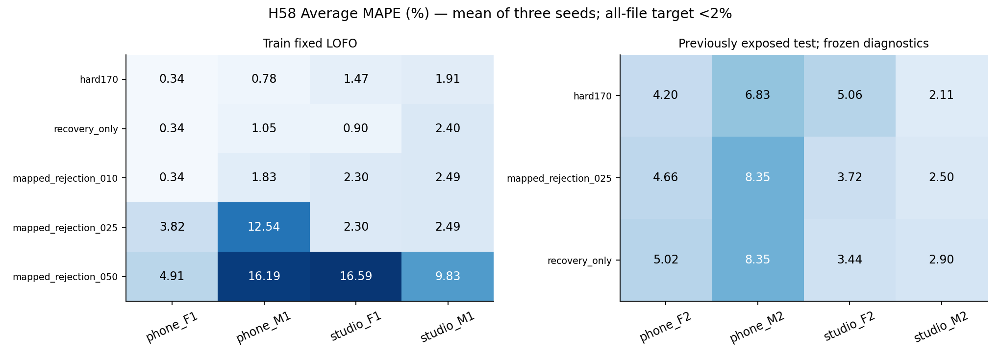

# H58 — mapping có giám sát giảm loại nhầm, chưa cải thiện cấu hình chung

**Chưa đạt mục tiêu mỗi file Average MAPE <2%.** Final vẫn chọn hard170. Baseline có 4/4 train và 0/4 test dưới 2%; không promote H58. Học ý nghĩa của cả ba cụm GMM đã giảm số khung hữu thanh bị loại so với H57, nhưng không đủ để cải thiện thống kê F0 trên mọi file.

## Thay đổi đã đo

GMM là mô hình hỗn hợp Gaussian, dùng ở đây để nhóm khung theo bốn đặc trưng tín hiệu. H57 lấy xác suất thuộc duy nhất cụm có tính chu kỳ cao nhất để loại khung. H58 học trọng số hữu thanh của cả ba cụm từ nhãn LAB trong từng fit pool, rồi cộng membership có trọng số. Clustering giữ nguyên; bước mapping **có giám sát**. Các file bị giữ ra để kiểm tra không cung cấp nhãn cho mapping.

Giữ nguyên recovery và F0 bound200 của H56; chỉ thay điểm rejection cho original baseline V. Vì vậy, so sánh H57/H58 cùng ngưỡng là ablation của mapping rejection. Ba ngưỡng cố định .1/.25/.5 được chọn trên train; không chọn từ test. Giữ đủ seed11/29/47 và 33 mapping ứng với đúng 33 GMM đã lưu, không fit lại optimizer.

## Train: ma trận và độ nhạy theo seed

| option_id | phone_F1.wav | phone_M1.wav | studio_F1.wav | studio_M1.wav |
| --- | --- | --- | --- | --- |
| hard170 | 0.34008 | 0.776151 | 1.47358 | 1.90992 |
| recovery_only | 0.34008 | 1.04823 | 0.899591 | 2.39989 |
| mapped_rejection_010 | 0.34008 | 1.82958 | 2.30425 | 2.49441 |
| mapped_rejection_025 | 3.82301 | 12.5374 | 2.30425 | 2.49441 |
| mapped_rejection_050 | 4.91023 | 16.1949 | 16.5851 | 9.83405 |

| option_id | seed | mean_mape | worst_mape | removed | recall_v |
| --- | --- | --- | --- | --- | --- |
| hard170 | 11 | 1.12493 | 1.90992 | 0 | 0.92927 |
| hard170 | 29 | 1.12493 | 1.90992 | 0 | 0.92927 |
| hard170 | 47 | 1.12493 | 1.90992 | 0 | 0.92927 |
| mapped_rejection_010 | 11 | 1.74208 | 2.49441 | 14 | 0.921717 |
| mapped_rejection_010 | 29 | 1.74208 | 2.49441 | 14 | 0.921717 |
| mapped_rejection_010 | 47 | 1.74208 | 2.49441 | 14 | 0.921717 |
| mapped_rejection_025 | 11 | 5.28976 | 12.5374 | 89 | 0.840634 |
| mapped_rejection_025 | 29 | 5.28976 | 12.5374 | 89 | 0.840634 |
| mapped_rejection_025 | 47 | 5.28976 | 12.5374 | 89 | 0.840634 |
| mapped_rejection_050 | 11 | 11.8811 | 16.5851 | 194 | 0.646254 |
| mapped_rejection_050 | 29 | 11.8811 | 16.5851 | 194 | 0.646254 |
| mapped_rejection_050 | 47 | 11.8811 | 16.5851 | 194 | 0.646254 |
| recovery_only | 11 | 1.17195 | 2.39989 | 0 | 0.934987 |
| recovery_only | 29 | 1.17195 | 2.39989 | 0 | 0.934987 |
| recovery_only | 47 | 1.17195 | 2.39989 | 0 | 0.934987 |

Với q=.1, phone_M1 còn dưới 2%, nhưng studio_F1/studio_M1 đều vượt 2%. Với q=.25, phone_M1 vẫn mất nhiều khung V; không đạt guard recall và không được chọn. Final hard170; outer phone_M1 chọn recovery_only, ba outer khác hard170. Nested bốn train dưới 2% qua cả ba seed, nhưng ba gate giảm MAPE không đạt. Đây không phải một cấu hình cuối cùng mới có kết quả tốt hơn baseline.

## Loại khung: so sánh trực tiếp H57/H58

| stage | file | seed | option_id | removed | removed_v | removed_uv | removed_sil |
| --- | --- | --- | --- | --- | --- | --- | --- |
| train | phone_F1.wav | 11 | mapped_rejection_025 | 14 | 12 | 2 | 0 |
| train | phone_F1.wav | 11 | H57_single_cluster_025 | 19 | 17 | 2 | 0 |
| train | phone_M1.wav | 11 | mapped_rejection_025 | 69 | 67 | 2 | 0 |
| train | phone_M1.wav | 11 | H57_single_cluster_025 | 92 | 90 | 2 | 0 |
| train | studio_F1.wav | 11 | mapped_rejection_025 | 5 | 3 | 2 | 0 |
| train | studio_F1.wav | 11 | H57_single_cluster_025 | 53 | 49 | 4 | 0 |
| train | studio_M1.wav | 11 | mapped_rejection_025 | 1 | 0 | 1 | 0 |
| train | studio_M1.wav | 11 | H57_single_cluster_025 | 28 | 25 | 3 | 0 |
| test | phone_F2.wav | 11 | mapped_rejection_025 | 5 | 2 | 3 | 0 |
| test | phone_F2.wav | 11 | H57_single_cluster_025 | 69 | 62 | 7 | 0 |
| test | phone_M2.wav | 11 | mapped_rejection_025 | 0 | 0 | 0 | 0 |
| test | phone_M2.wav | 11 | H57_single_cluster_025 | 26 | 26 | 0 | 0 |
| test | studio_F2.wav | 11 | mapped_rejection_025 | 1 | 0 | 1 | 0 |
| test | studio_F2.wav | 11 | H57_single_cluster_025 | 42 | 39 | 3 | 0 |
| test | studio_M2.wav | 11 | mapped_rejection_025 | 1 | 1 | 0 | 0 |
| test | studio_M2.wav | 11 | H57_single_cluster_025 | 19 | 17 | 2 | 0 |

Các con số trên cùng file, fit pool, seed11, mask recovery, pitch và ngưỡng .25. Có ít khung bị loại nhầm hơn nhưng vẫn có LAB V bị loại. Việc giảm sai số count không bảo đảm giảm Average MAPE: chọn subset khác cũng thay mean và std. Mỗi khung bị loại, score và khoảng cách tới biên LAB lưu trong H58_removed_cases.csv; F0 trong bảng là ước lượng trước loại, không phải reference từng khung.

## Điểm dự đoán trên file train được giữ ra

| file | frames | single_cluster_brier | mapped_brier | lab_v_mean_score | baseline_v_min_score |
| --- | --- | --- | --- | --- | --- |
| phone_F1.wav | 322 | 0.087658 | 0.076251 | 0.840852 | 0.226663 |
| phone_M1.wav | 414 | 0.249159 | 0.173435 | 0.637242 | 0.0211346 |
| studio_F1.wav | 284 | 0.182662 | 0.118323 | 0.678326 | 0.0605305 |
| studio_M1.wav | 271 | 0.141409 | 0.107035 | 0.725626 | 0.0715438 |

Brier score là trung bình bình phương chênh lệch giữa điểm dự đoán và nhãn V=1, UV/SIL=0; thấp hơn là tốt hơn cho phép đối chiếu này. Chỉ tính trên fixed LOFO train. Bảng mô tả chất lượng điểm, không chứng minh calibration hay đảm bảo ngưỡng có thể chuyển sang file mới. So sánh với membership một cụm cũng không biến membership đó thành xác suất V đã hiệu chỉnh. H58_component_mappings.csv giữ 99 trọng số của 33 mô hình; ID cụm thuộc từng mô hình, không mặc nhiên tương ứng giữa các seed/pool.

## Test chẩn đoán đã khóa

| file | option_id | average_mape | F0mean_mape | F0std_mape | F0num_mape | recall_v | removed |
| --- | --- | --- | --- | --- | --- | --- | --- |
| phone_F2.wav | hard170 | 4.19731 | 1.51635 | 10.619 | 0.456621 | 0.906383 | 0 |
| phone_F2.wav | recovery_only | 5.01603 | 1.88146 | 11.7968 | 1.36986 | 0.914894 | 0 |
| phone_F2.wav | mapped_rejection_025 | 4.65953 | 1.83467 | 11.2307 | 0.913242 | 0.906383 | 5 |
| phone_M2.wav | hard170 | 6.83375 | 0.884189 | 13.926 | 5.69106 | 0.970149 | 0 |
| phone_M2.wav | recovery_only | 8.35168 | 1.08499 | 16.653 | 7.31707 | 0.977612 | 0 |
| phone_M2.wav | mapped_rejection_025 | 8.35168 | 1.08499 | 16.653 | 7.31707 | 0.977612 | 0 |
| studio_F2.wav | hard170 | 5.06346 | 0.0266886 | 10.8471 | 4.31655 | 0.948905 | 0 |
| studio_F2.wav | recovery_only | 3.437 | 0.597808 | 7.55492 | 2.15827 | 0.970803 | 0 |
| studio_F2.wav | mapped_rejection_025 | 3.72402 | 0.359415 | 7.93495 | 2.8777 | 0.970803 | 1 |
| studio_M2.wav | hard170 | 2.11479 | 0.32909 | 2.56701 | 3.44828 | 0.921875 | 0 |
| studio_M2.wav | recovery_only | 2.89971 | 0.323804 | 3.20292 | 5.17241 | 0.929688 | 0 |
| studio_M2.wav | mapped_rejection_025 | 2.50216 | 0.221703 | 2.97445 | 4.31034 | 0.921875 | 1 |

Không nhánh nào đạt cả bốn test <2%. Recovery_only vẫn giảm studio_F2 xuống khoảng 3.44%, nhưng không được train chọn và chưa đạt 2%; mapping .25 làm file đó xấu hơn. Các nhánh chẩn đoán không phải kết quả promoted. Toàn bộ metric/seed lưu trong H58_test_fixed.csv, gồm mean/std MAE, F1, hai recall, balanced accuracy và SIL false positives. Test có lịch sử đã xem nhiều lần; freeze ngăn chọn tham số trong vòng H58, không biến test thành kiểm chứng độc lập mới.

## Kết luận và giới hạn

H57 cho thấy bỏ tất cả cụm ngoài cụm chu kỳ mạnh làm mất V. H58 kiểm tra được cách sửa lỗi mapping đó, nhưng ba cụm với một trọng số V cố định cho mỗi cụm vẫn không đủ cho quyết định F0 hợp lệ trên các file hiện có. Đây là giới hạn của cơ chế đã thử; chưa chứng minh mọi phương pháp ML thất bại, test/GT sai hay thiếu dữ liệu là nguyên nhân duy nhất. LAB V và số F0 hợp lệ trong 3GT mô tả hai mục tiêu khác nhau; không sửa nhãn để khớp điểm.

Ưu tiên tiếp theo là xác minh quy trình tạo F0mean/F0std/F0num (cửa sổ, bước khung, ngưỡng hữu thanh, bỏ biên và cách tính std) hoặc có reference từng khung đáng tin cậy trước khi thử thêm ngưỡng cùng cơ chế. Dữ liệu bổ sung có người nói khác và protocol cố định mới có thể cung cấp kiểm chứng độc lập; nhân bản cùng bản thu không tạo thêm người nói độc lập. Bài segmentation mới vẫn sau ưu tiên BT2.

## Kiểm tra và tái lập

Prereg `0bbd6a7ef9e49cddd19ddcdca55c8b8075a71f0d` và freeze `c699f701110d628b3290f1d1b48568676e1dffb1` đã push và xác minh SHA remote trước lần đo train/test tương ứng. Verifier PASS300 train/36 test groups,240 inner records,72 summary rows: scalar Gaussian/mapping, fold exclusion, selection/gates, mask/pitch, metrics và hashes. Synthetic precheck kiểm permutation cụm, poisoning nhãn held file, sensitivity nhãn fit, threshold ties và pitch giữ nguyên. Optimizer/PCM được reuse từ H56/H50 đã kiểm; không claim refit optimizer độc lập. Test không học mapping mới. Original notebook/WAV/LAB/teacher3GT/frozen config được giữ nguyên.

Lệnh: `mapped_rejection.py precheck/register/train/test`, `verify_mapped_rejection.py train/test`, `report_mapped_rejection.py`. No Drive, DL, PDF, Jev hoặc prose skill. Không chạy lại các vòng cũ; giữ toàn bộ thất bại và baseline.
