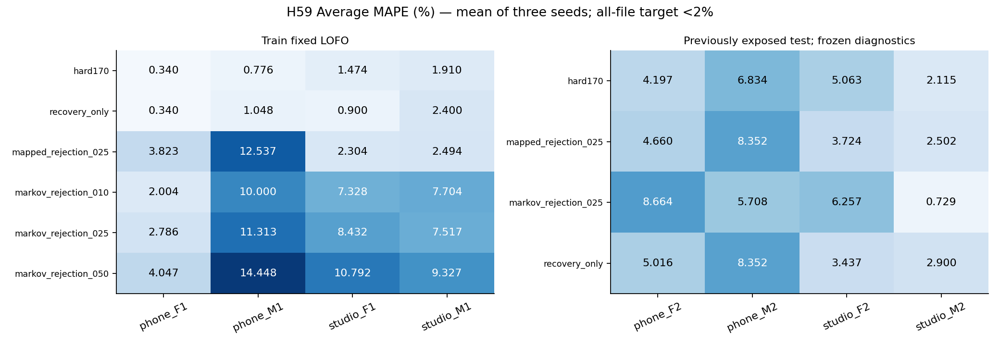
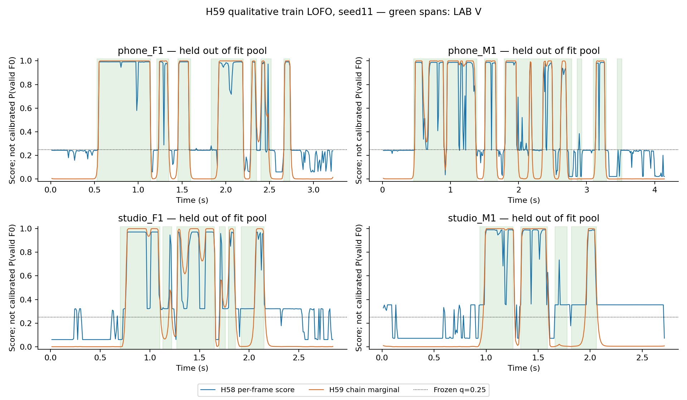

# H59 — thêm ngữ cảnh thời gian, chưa cải thiện cấu hình chung

**Mục tiêu cả tám file Average MAPE <2% vẫn chưa đạt.** Final giữ hard170: 4/4 train,0/4 test dưới 2%. Không promote H59. Nhánh Markov .25 chẩn đoán đạt studio_M2 dưới 2%, nhưng các file khác và recall V không đáp ứng yêu cầu; không dùng kết quả test này để chọn cấu hình.

## H59 kiểm tra điều gì?

H58 học trọng số hữu thanh của ba cụm GMM nhưng chấm từng khung riêng. H59 giữ các trọng số đó, thêm quy luật chuyển trạng thái giữa khung liền kề để thử giữ đoạn V yếu gần V mạnh. N là UV hoặc SIL; V là hữu thanh theo LAB. Counts chuyển trạng thái học từ đúng các file train của từng fit pool, không nối hai file, không dùng nhãn held/test. Điểm chuỗi tính bằng forward-backward.

Chỉ đổi điểm dùng để loại original baseline V. Recovery mask, F0 bound200, framing, GMM và mapping H58 giữ nguyên. Static .25 là control trực tiếp; ba ngưỡng Markov .1/.25/.5 đăng ký trước đo. H58 score được dùng như unary potential, chưa chứng minh là emission likelihood hay calibrated probability. Đây là chuỗi custom suy luận offline có dùng khung tương lai, không phải chứng nhận một HMM generative hoặc streaming implementation.

## Ma trận train và seed

| option_id | phone_F1.wav | phone_M1.wav | studio_F1.wav | studio_M1.wav |
| --- | --- | --- | --- | --- |
| hard170 | 0.34008 | 0.776151 | 1.47358 | 1.90992 |
| recovery_only | 0.34008 | 1.04823 | 0.899591 | 2.39989 |
| mapped_rejection_025 | 3.82301 | 12.5374 | 2.30425 | 2.49441 |
| markov_rejection_010 | 2.00385 | 10.0005 | 7.3276 | 7.70354 |
| markov_rejection_025 | 2.7859 | 11.3133 | 8.43208 | 7.51749 |
| markov_rejection_050 | 4.04692 | 14.4475 | 10.792 | 9.32679 |

| option_id | seed | mean_mape | worst_mape | removed | recall_v |
| --- | --- | --- | --- | --- | --- |
| hard170 | 11 | 1.12493 | 1.90992 | 0 | 0.92927 |
| hard170 | 29 | 1.12493 | 1.90992 | 0 | 0.92927 |
| hard170 | 47 | 1.12493 | 1.90992 | 0 | 0.92927 |
| mapped_rejection_025 | 11 | 5.28976 | 12.5374 | 89 | 0.840634 |
| mapped_rejection_025 | 29 | 5.28976 | 12.5374 | 89 | 0.840634 |
| mapped_rejection_025 | 47 | 5.28976 | 12.5374 | 89 | 0.840634 |
| markov_rejection_010 | 11 | 6.75887 | 10.0005 | 106 | 0.78521 |
| markov_rejection_010 | 29 | 6.75887 | 10.0005 | 106 | 0.78521 |
| markov_rejection_010 | 47 | 6.75887 | 10.0005 | 106 | 0.78521 |
| markov_rejection_025 | 11 | 7.51219 | 11.3133 | 126 | 0.756021 |
| markov_rejection_025 | 29 | 7.51219 | 11.3133 | 126 | 0.756021 |
| markov_rejection_025 | 47 | 7.51219 | 11.3133 | 126 | 0.756021 |
| markov_rejection_050 | 11 | 9.6533 | 14.4475 | 160 | 0.703534 |
| markov_rejection_050 | 29 | 9.6533 | 14.4475 | 160 | 0.703534 |
| markov_rejection_050 | 47 | 9.6533 | 14.4475 | 160 | 0.703534 |
| recovery_only | 11 | 1.17195 | 2.39989 | 0 | 0.934987 |
| recovery_only | 29 | 1.17195 | 2.39989 | 0 | 0.934987 |
| recovery_only | 47 | 1.17195 | 2.39989 | 0 | 0.934987 |

Mọi cấu hình Markov đều có ít nhất một file train vượt 2%; không nhánh nào được chọn. Riêng phone_F1 ở q=.1 đạt 2.00385%, vẫn vượt mục tiêu dù làm tròn hai chữ số có thể hiện 2.00. Final chọn hard170; outer giữ phone_M1 chọn recovery_only, ba outer khác chọn control. Nested bốn file train <2% qua ba seed nhưng ba gate giảm MAPE FAIL, không promote. Kết quả này không biến thành một pipeline mới tốt hơn baseline chỉ vì nested giữ fallback tốt.

## Khung bị loại và ngữ cảnh

| stage | file | seed | option_id | removed | removed_v | removed_uv | removed_sil | longest_consecutive_removed_v |
| --- | --- | --- | --- | --- | --- | --- | --- | --- |
| train | phone_F1.wav | 11 | mapped_rejection_025 | 14 | 12 | 2 | 0 | 3 |
| train | phone_F1.wav | 11 | markov_rejection_025 | 10 | 8 | 2 | 0 | 2 |
| train | phone_M1.wav | 11 | mapped_rejection_025 | 69 | 67 | 2 | 0 | 15 |
| train | phone_M1.wav | 11 | markov_rejection_025 | 65 | 63 | 2 | 0 | 15 |
| train | studio_F1.wav | 11 | mapped_rejection_025 | 5 | 3 | 2 | 0 | 3 |
| train | studio_F1.wav | 11 | markov_rejection_025 | 29 | 25 | 4 | 0 | 13 |
| train | studio_M1.wav | 11 | mapped_rejection_025 | 1 | 0 | 1 | 0 | 0 |
| train | studio_M1.wav | 11 | markov_rejection_025 | 22 | 19 | 3 | 0 | 12 |
| test | phone_F2.wav | 11 | mapped_rejection_025 | 5 | 2 | 3 | 0 | 1 |
| test | phone_F2.wav | 11 | markov_rejection_025 | 31 | 26 | 5 | 0 | 9 |
| test | phone_M2.wav | 11 | mapped_rejection_025 | 0 | 0 | 0 | 0 | 0 |
| test | phone_M2.wav | 11 | markov_rejection_025 | 7 | 7 | 0 | 0 | 5 |
| test | studio_F2.wav | 11 | mapped_rejection_025 | 1 | 0 | 1 | 0 | 0 |
| test | studio_F2.wav | 11 | markov_rejection_025 | 17 | 15 | 2 | 0 | 12 |
| test | studio_M2.wav | 11 | mapped_rejection_025 | 1 | 1 | 0 | 0 | 1 |
| test | studio_M2.wav | 11 | markov_rejection_025 | 8 | 7 | 1 | 0 | 6 |

`longest_consecutive_removed_v` là số khung LAB V bị loại liền nhau, không phải số đoạn độc lập hay số cao độ được xác minh sai. Các khung25ms/hop10ms chồng nhau. H59 giảm loại ở phone nhưng có thể kéo dài quyết định N ở các chuỗi V với điểm GMM yếu, làm hai studio train xấu hơn. Không diễn giải mọi frame bị loại là UV thật hoặc reference F0 không hợp lệ.

Hình fixedLOFO seed11 tô xanh LAB V; đường xanh là điểm H58, cam là marginal H59. H59_score_traces.csv giữ toàn bộ khung của tám file cho so sánh .25, H59_changed_cases.csv giữ mọi khung đổi quyết định, điểm trước/sau và khoảng cách tới biên. F0 ở case là baseline estimate, không phải ground truth từng khung. Audit giữ cả tác động tốt và xấu.

## Điểm dự đoán và transition

| file | mapped_brier | markov_brier | mapped_mean_lab_v | markov_mean_lab_v |
| --- | --- | --- | --- | --- |
| phone_F1.wav | 0.076251 | 0.0616707 | 0.840852 | 0.855976 |
| phone_M1.wav | 0.173435 | 0.189228 | 0.637242 | 0.640967 |
| studio_F1.wav | 0.118323 | 0.105257 | 0.678326 | 0.708823 |
| studio_M1.wav | 0.107035 | 0.111624 | 0.725626 | 0.670396 |

Brier là trung bình bình phương chênh lệch với nhãn LAB V=1,UV/SIL=0 trên held train; nhỏ hơn tốt hơn cho tiêu chí này. Đây là mô tả, không chứng nhận calibration hoặc valid-F0 count. Ngữ cảnh không sửa được sai lệch kéo dài của unary score; một score yếu liên tục có thể khiến chuỗi tự tin hơn vào N và làm mất V. Bảng/hình cho phép kiểm tra cơ chế này, không suy ra toàn bộ temporal models đều thất bại.

Ví dụ studio_F1: Brier giảm khoảng .1183→.1053 nhưng q=.25 loại LAB V tăng từ 3 lên 25 khung và Average MAPE tăng 2.30425→8.43208%. Điểm tổng hợp tốt hơn không bảo đảm subset F0 tốt hơn ở ngưỡng đã chọn. Trên studio_M1, số LAB V bị loại tăng 0→19; bảng case giữ cả những đoạn bị kéo về N dù thuộc LAB V. Các cửa sổ chồng nhau làm bằng chứng giữa khung có tương quan; việc nhân unary potentials trong chuỗi này chưa được kiểm chứng như các emission độc lập.

| fit_pool | initial_v | p_00 | p_01 | p_10 | p_11 |
| --- | --- | --- | --- | --- | --- |
| phone_F1.wav\|phone_M1.wav\|studio_F1.wav | 0.2 | 0.95992 | 0.0400802 | 0.0383142 | 0.961686 |
| phone_F1.wav\|phone_M1.wav\|studio_M1.wav | 0.2 | 0.965049 | 0.0349515 | 0.0365112 | 0.963489 |
| phone_F1.wav\|studio_F1.wav\|studio_M1.wav | 0.2 | 0.964427 | 0.0355731 | 0.0483871 | 0.951613 |
| phone_M1.wav\|studio_F1.wav\|studio_M1.wav | 0.2 | 0.966469 | 0.0335306 | 0.0367171 | 0.963283 |
| phone_F1.wav\|phone_M1.wav\|studio_F1.wav\|studio_M1.wav | 0.166667 | 0.964444 | 0.0355556 | 0.038961 | 0.961039 |

H59_transition_audit.csv có đủ33records tương ứng33model IDs nhưng chỉ11fit pools; transition deterministic không đổi theo seed. GMM/mapping có seed variation như H56/H58. Mọi counts và smoothing1 đều lưu để kiểm tra.

## Test đã khóa trước

| file | option_id | average_mape | F0mean_mape | F0std_mape | F0num_mape | recall_v | removed |
| --- | --- | --- | --- | --- | --- | --- | --- |
| phone_F2.wav | hard170 | 4.19731 | 1.51635 | 10.619 | 0.456621 | 0.906383 | 0 |
| phone_F2.wav | recovery_only | 5.01603 | 1.88146 | 11.7968 | 1.36986 | 0.914894 | 0 |
| phone_F2.wav | mapped_rejection_025 | 4.65953 | 1.83467 | 11.2307 | 0.913242 | 0.906383 | 5 |
| phone_F2.wav | markov_rejection_025 | 8.66428 | 1.93832 | 11.2691 | 12.7854 | 0.804255 | 31 |
| phone_M2.wav | hard170 | 6.83375 | 0.884189 | 13.926 | 5.69106 | 0.970149 | 0 |
| phone_M2.wav | recovery_only | 8.35168 | 1.08499 | 16.653 | 7.31707 | 0.977612 | 0 |
| phone_M2.wav | mapped_rejection_025 | 8.35168 | 1.08499 | 16.653 | 7.31707 | 0.977612 | 0 |
| phone_M2.wav | markov_rejection_025 | 5.70756 | 1.62988 | 13.8668 | 1.62602 | 0.925373 | 7 |
| studio_F2.wav | hard170 | 5.06346 | 0.0266886 | 10.8471 | 4.31655 | 0.948905 | 0 |
| studio_F2.wav | recovery_only | 3.437 | 0.597808 | 7.55492 | 2.15827 | 0.970803 | 0 |
| studio_F2.wav | mapped_rejection_025 | 3.72402 | 0.359415 | 7.93495 | 2.8777 | 0.970803 | 1 |
| studio_F2.wav | markov_rejection_025 | 6.25708 | 0.835699 | 3.54705 | 14.3885 | 0.861314 | 17 |
| studio_M2.wav | hard170 | 2.11479 | 0.32909 | 2.56701 | 3.44828 | 0.921875 | 0 |
| studio_M2.wav | recovery_only | 2.89971 | 0.323804 | 3.20292 | 5.17241 | 0.929688 | 0 |
| studio_M2.wav | mapped_rejection_025 | 2.50216 | 0.221703 | 2.97445 | 4.31034 | 0.921875 | 1 |
| studio_M2.wav | markov_rejection_025 | 0.728551 | 0.073676 | 0.387839 | 1.72414 | 0.875 | 8 |

Markov .25 giảm studio_M2 xuống khoảng0.73% và phone_M2 xuống khoảng5.71%, nhưng phone_F2/studio_F2 xấu hơn. Recall V studio_M2 từbaseline .921875 xuống .875, phone_M2 từ .970149 xuống .925373. Vì vậy không gọi đây là cải thiện được chấp nhận; .25 không được train chọn và không đạt cả bốn test. Không ghép nhánh tốt theo file hoặc chọn seed từ test. Thống kê count gần reference hơn cũng không chứng minh đã chọn đúng frame F0, vì BT2 chỉ có LAB theo đoạn và 3GT cả file.

Toàn bộ metric mean/std/count, mean/std MAE,F1/recallV/recallUV/balancedaccuracy/SIL và ba seed có trong H59_test_fixed.csv. Test có lịch sử exposure; freeze ngăn chọn tham số trong vòng H59 nhưng không tạo ra independent test mới.

## Kiểm tra và kết luận

Prereg `2aec9e9be49eecd829340b53962b4eb6887cda81` và freeze `cf10b6a3fe0db5b521500109e3dd252ad7a057f6` đã push và remote-SHA verified trước train/test tương ứng. Verifier PASS360 train/48test groups,288inner records/72summary rows; scalar Gaussian/mapping, transition poolcounts, scaled forward-backward, static parity H58, pitch/mask, metrics/folds/selection/gates/hashes. Synthetic enumeration2^N kiểm chuỗi1/2/5/6; uniform-transition parity, chuỗi2000frames finite, held-label poisoning và file-boundary counts PASS. Không refit optimizer/native pipeline và không fit gì trên test. Giữ notebook nộp,WAV/LAB,3GT và frozen baseline.

H59 bổ sung một hướng chưa có ở H58: temporal context riêng cho rejection. Đo cho thấy smoothing này có thể làm mất nhiều V khi unary score yếu kéo dài. Chưa đủ bằng chứng để đổ lỗi cho test, số lượng data hoặc nhãn thầy; cũng không nên tiếp tục tăng độ mượt trên cùng score mà coi đó là sửa được cơ chế. Muốn kiểm nghiệm hướng mới cần thay score/đặc trưng bằng giả thuyết riêng, hoặc xác minh quy trình/reference F0 hợp lệ để tách mục tiêu LAB V khỏi thống kê3GT. Reference từng khung hoặc corpus độc lập mới giúp xác nhận, không lấy estimated contour làm truth.

Lệnh markov_rejection.py precheck/register/train/test; verify_markov_rejection.py train/test; report_markov_rejection.py. Source/registry/rawresults/failures giữ nguyên; no Drive/DL/PDF/Jev/prose skill, không rerun các vòng cũ. BT2 vẫn trước bài segmentation mới.
