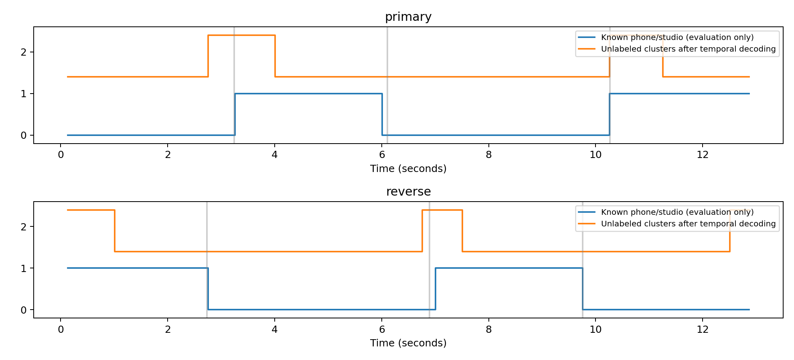

# Học chung, phân rã và nhận ra môi trường thu: kết quả H78–H80

Ba phép thử đã hoàn tất ngày 09/10/2026. Chúng chưa cải thiện cấu hình BT2 đang giữ. Mô hình có tìm được các khác biệt trong tín hiệu, nhưng các khác biệt đó chưa đủ ổn định để quyết định cách xử lý F0 cho bản thu mới. Đây là kết luận về những cách làm đã thử, không phải bằng chứng rằng dữ liệu không có một quy luật chung.

## Hướng học chung rồi chọn nhánh đã làm đến đâu?

H78 cho mô hình học chung các file và so sánh hai cách thích nghi. Cách thứ nhất bổ sung thông tin ngữ cảnh của cả bản thu vào đặc trưng từng khung. Cách thứ hai dùng hai nhánh chuyên biệt phone/studio và một bộ điều phối mềm: từ đặc trưng âm thanh, bộ điều phối quyết định mức đóng góp của mỗi nhánh. Lúc huấn luyện, cách thứ hai vẫn được hướng dẫn bằng nhãn môi trường. Vì vậy, nó chưa phải tự khám phá hoàn toàn xem cần những nhóm nào.

Bộ điều phối phân biệt đúng môi trường ở cả bốn file đã học. Khi lần lượt giữ lại một file để chỉ học trên ba file còn lại, nó nhận sai môi trường của hai file studio. Nhánh trộn đạt Average MAPE dưới 2% ở cả bốn train, nhưng kết quả chọn bằng các file train giữ lại vẫn giữ cấu hình energy07. Chưa có phép đo test cho nhánh trộn này. Không thể lấy kết quả trên các file đã học để khẳng định nó đã nhận ra được môi trường của bản thu mới. Chi tiết tại [H78_REPORT.md](H78_REPORT.md).

## Tách tiếng nói và nhiễu có tìm được gì không?

Theo lựa chọn tiếp theo của người dùng, H79 gom phổ của các file train rồi dùng NMF, tức phân rã ma trận không âm, để học bốn thành phần phổ. Một thành phần được chọn làm ứng viên nhiễu vì đóng góp tương đối nhiều ở những khung có năng lượng thấp. Việc học và chọn thành phần này không dùng nhãn V/UV/SIL hoặc tên môi trường. Nhãn chỉ được dùng sau đó để kiểm tra thành phần đã tìm được.

Có một dấu hiệu có ích: thành phần được chọn đóng góp nhiều hơn ở các đoạn SIL/UV so với đoạn hữu thanh. Tuy nhiên, nó vẫn chiếm khoảng 12–24% phổ trong các đoạn hữu thanh của bốn file. Những đoạn UV cũng chứa âm vô thanh thật, nên phần không tuần hoàn không mặc nhiên là nhiễu. Thành phần mô hình tìm được chưa tách riêng nền thu khỏi thông tin tiếng nói.

Sau khi tạo tín hiệu đã lọc và chạy lại pYIN với cửa sổ thật 25 ms, bước 10 ms, Average MAPE train theo thứ tự phone_F1, phone_M1, studio_F1, studio_M1 là **2,396199%; 2,800092%; 0,258293%; 8,185025%**. Chỉ một file dưới 2%; cấu hình đang giữ đạt cả bốn train. Phép thử mới làm studio_F1 tốt hơn nhưng làm ba file khác tệ hơn. Vì thế H79 không được đưa sang test hoặc thay cấu hình hiện tại. Chi tiết, âm thanh ứng viên và kiểm chứng tại [H79_REPORT.md](H79_REPORT.md).

Trong phép thử này không có bản tiếng nói sạch và nhiễu sạch để làm chuẩn. Hai tín hiệu ứng viên cộng lại đúng bản gốc chỉ chứng minh cách dựng lại nhất quán; nó chưa chứng minh mô hình đã tách đúng hai nguồn. NMF tối ưu khả năng tái dựng phổ, còn BT2 đánh giá mean, std và số khung F0 của từng file. Tối ưu tốt mục tiêu thứ nhất chưa bảo đảm tốt mục tiêu thứ hai. [Tài liệu NMF của scikit-learn 1.8.0](https://scikit-learn.org/1.8/modules/generated/sklearn.decomposition.NMF.html).

## Ghép nối file rồi nhận ra từng đoạn thì sao?

H80 đưa bản sao các file về cùng 16 kHz, ghép nối thành một dòng âm thanh xen kẽ phone/studio, rồi tạo thêm dòng đảo thứ tự. Việc đưa về cùng tần số lấy mẫu ngăn mô hình dùng sự khác nhau 16 kHz/44,1 kHz như dấu hiệu nhận ra chỗ ghép. File gốc không bị sửa. Mô hình không được biết mốc ghép hoặc nhãn phone/studio khi học.

Mô hình dùng các thành phần phổ đã học để tạo đặc trưng ngữ cảnh, tự chia thành hai nhóm, rồi nối các quyết định theo thời gian. Cách chia nhóm chỉ tương ứng với môi trường thu khoảng **67,31%** ở dòng đầu và **63,46%** ở dòng đảo thứ tự, sau khi chọn cách đặt tên hai nhóm thuận lợi nhất để mô tả kết quả. Đây vẫn là cùng bốn nguồn train; dòng đảo thứ tự không phải dữ liệu kiểm thử độc lập.

Sau bước nối quyết định theo thời gian, mỗi dòng có bốn chỗ đổi nhóm, nhưng chỉ một chỗ khớp với ba mốc ghép thật trong sai số 0,35 giây. Hai nhóm tìm được cũng không khớp rõ với giới tính. Chưa đủ bằng chứng để gọi chúng là nhóm phone/studio, nhóm nam/nữ, hoặc dùng chúng làm bộ điều phối F0. H80 không tính F0 mới, nên không có Average MAPE mới để so với BT2. Chi tiết tại [H80_REPORT.md](H80_REPORT.md).

Đường xanh biểu diễn môi trường theo mốc ghép thật, chỉ dùng để chấm. Đường cam biểu diễn nhóm mô hình tự tìm được; đường này đặt cao hơn để dễ nhìn và chưa mang tên phone/studio. Các đường dọc màu xám là mốc ghép. Ta thấy mô hình đổi nhóm ở một số chỗ có thay đổi âm thanh nhưng bỏ qua nhiều mốc đổi môi trường.

## Trạng thái BT2 sau các phép thử

Cấu hình đang giữ vẫn là pYIN thật 25 ms/bước 10 ms, prior (2,8), ngưỡng năng lượng 0,07 của H71/H72. Mean Average MAPE train là **1,305508%**, test là **2,196094%**, đạt **7/8 file**. Phone_M2 test còn **4,422661%**, nên mục tiêu mỗi file trong cả train và test dưới 2% chưa hoàn thành. Các số này đọc từ kết quả đã lưu, không chạy lại thí nghiệm cũ.

H78, H79 và H80 đều có kiểm chứng độc lập về phép tính, dữ liệu và hash. Kiểm chứng PASS xác nhận số liệu được tính nhất quán; nó không biến một giả thuyết không đạt thành thành công. Mọi kết quả không đạt được giữ lại. Không thay notebook gốc hoặc chọn tham số từ test. Nếu nghiên cứu tiếp, cần một giả thuyết mới về cách giữ thông tin cao độ và phân biệt phần nền thu, đăng ký trước khi đo, rồi kiểm tra trực tiếp tác động lên mean/std/count F0.

Quy trình có tham chiếu Kassis, T., Agarwal, V., He, Y., Patel, D., & Brueckner, A. M. (2026), [Scientific Agent Skills](https://arxiv.org/abs/2609.00065), DOI 10.48550/arXiv.2609.00065. Các số BT2 trong tài liệu này là kết quả local đã lưu và kiểm chứng, không phải số đo từ tài liệu tham chiếu.
