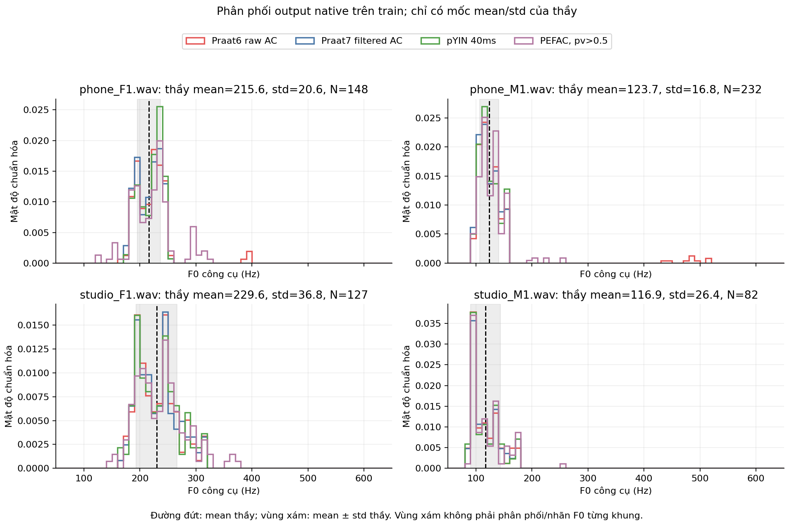
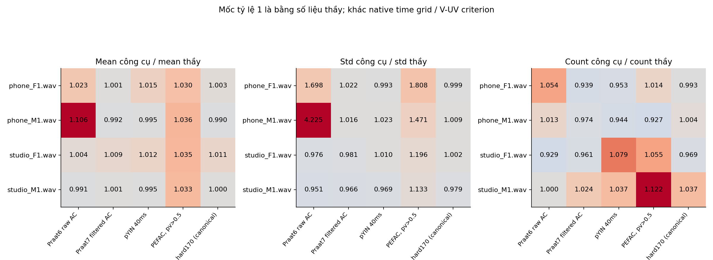

# R02 — đã thấy pattern, chưa xác định được công cụ của thầy

**Pattern rõ nhất là một phần nhỏ ở đuôi phân phối kéo std lên mạnh, trong khi vùng F0 chính khá gần các mốc thầy.** Đây là quan sát về output công cụ, không xác nhận F0 đúng/sai từng khung. Phân tích60nhóm cached trên4train, không inference hoặc test mới. 44nhóm native statistics khớp receipt trước;4bản Praat7 bị trùng được nhận diện, ACauto/10ms cũng trùng cả4file, không tính là thêm replication.

Thầy chỉ đưa mean/std/count, chưa đưa samples/contour. Vì vậy histogram/ECDF dưới đây là phân phối **công cụ**; đường đứt và vùng xám chỉ thể hiện mean và mean±std của thầy, không phải phân phối thật hoặc Gaussian đã được xác minh.

## 1. Đuôi phân phối khác rõ ở hai file phone

| File | Std thầy (Hz) | Praat6 raw AC std (Hz) | Tỷ lệ std | Phần tổng bình phương độ lệch thuộc5% khung lệch nhất |
|---|---:|---:|---:|---:|
|phone_F1|20.6|34.981571|1.698135|67.329503%|
|phone_M1|16.8|70.982954|4.225176|91.454739%|
|studio_F1|36.8|35.908181|0.975766|26.326126%|
|studio_M1|26.4|25.107563|0.951044|32.327853%|

phone_M1 có9/235giá trị>400Hz (3.83%); riêng9giá trị đóng góp90.981744% tổng bình phương độ lệch quanh mean của công cụ. Đó là lý do std có thể rất lớn dù hầu hết histogram tập trung gần100–155Hz. Max517.617590Hz; q95=155.519527Hz nhưng q99=492.046851Hz. Tại phone_F1, q95=247.955157Hz nhưng q99=393.851217Hz, max396.921585Hz; không cần vượt400Hz mới làm std phình mạnh.

Độ rộng vùng5–95% chia3.2897073 ở phone_M1 là16.690747Hz, gần std thầy16.8; phone_F1 là19.984407Hz, gần20.6. Hệ số này chỉ quy đổi một thước đo độ rộng, không chứng minh phân phối Gaussian hay thầy dùng trimmed std. IQR cho kết quả khác (phone_M120.376650Hz, phone_F128.309970Hz), nên chưa có một robust statistic duy nhất tái tạo chuẩn.

Không được suy đơn giản “xóa9khung là có chuẩn”:235−9=226, khác count thầy232; đồng thời có thể là khác quyết định V/UV, cửa sổ, sửa pitch hay biên thời gian. Không có frameGT để gọi9giá trị là9cao độ sai. Chỉ1khung rawAC phone_M1 trong223cặp hữu thanh chung gần4×hard170; phần còn lại không được xác nhận bằng baseline. Không lấy baseline làm truth để sửa.

Trên4file này, đuôi rawAC nặng hơn ở nhóm filename phone so studio. Chưa đủ speaker/session metadata hoặc dữ liệu để khẳng định nguyên nhân là microphone/nhiễu hay áp dụng cho mọi bản ghi phone.

## 2. Praat filtered và pYIN gần std chuẩn hơn, nhưng count không khớp

| File | Std thầy | Praat7 filtered v.45 std | pYIN40ms std | Count thầy / filtered / pYIN |
|---|---:|---:|---:|---|
|phone_F1|20.6|21.043271|20.450338|148 /139 /141|
|phone_M1|16.8|17.061634|17.189661|232 /226 /219|
|studio_F1|36.8|36.111020|37.156681|127 /122 /137|
|studio_M1|26.4|25.491715|25.591183|82 /84 /85|

Filtered giảm rõ đuôi rất cao ở phone, std gần chuẩn trên cả4file; pYIN cũng gần. Nhưng count có khi thiếu, có khi thừa; không có hệ số nhân count chung để khớp cả4file. Mỗi nhóm có mean/std/count gần không đồng nghĩa thầy dùng nhóm đó. Sample std thay population không thay mean/count và R01 vẫn không khớp3số sau làm tròn.

## 3. PEFAC có lệch mean/std cùng chiều trên4train

Native PEFAC vớipv>.5 có mean cao hơn thầy2.96–3.60% và std cao hơn13.28–80.77% ở cả4file. Đây là pattern có cùng dấu trong cấu hình đã đo; count thì có cả thiếu và thừa. phone_M1 PEFAC cũng có đuôi phải (q99=223.715952Hz), song không có giá trị>400 vì range70–400. Không gọi đây là bias chung của mọi PEFAC/dataset hoặc hiệu chuẩn bằng offset sau thấy chuẩn.

## 4. Count chịu ảnh hưởng lớn từ frame shift

Praat6 CCauto cóhop3.333333ms; CC10ms cóhop10ms. Tỷ lệ count hữu thanh auto/10ms trên4file là2.895062 /2.905138 /2.983051 /3.034884. Đây là pattern mật độ thời gian, khác biến động F0. Praat6 ACauto vàAC10ms trùng byte-array timestamps/F0 trên cả4file. [Praat AC docs](https://www.fon.hum.uva.nl/praat/manual/pitch_analysis_by_raw_autocorrelation.html) và [CC docs](https://www.fon.hum.uva.nl/praat/manual/pitch_analysis_by_raw_cross-correlation.html) giải thích stepauto .75/floor và.25/floor; outputs runtime6.1.38 đã kiểm cùng kết luận.

LAB V centers khác teacherF0num ở cả8file; bộ chuẩn mới đổi mean/std cả hai chiều so LAB cũ. Không một phép scale/offset hay sample/population std giải thích toàn bộ. Không mở test để tìm thuật toán/reference fingerprint; dòngtest chỉ đọc thống kê/nhãn đã có.

## 5. Ràng buộc25/10ms mới được người dùng làm rõ

Người dùng xác nhận thầy yêu cầu frame25ms/shift10ms, rồi cho phép tự do khảo sát tham số trong thí nghiệm. Do đó các native windows40/42.857/90.5ms có thể dùng nghiên cứu, nhưng không gọi là bản cuối đáp ứng25ms. Histogram trên là đối chiếu cơ chế/phân phối khác cấu hình; không chứng minh bộ chuẩn25ms của thầy do Praat filtered/pYIN40/PEFACdefault tạo.

hard170 có nhánh40ms và anchor/voicing Praat42.857ms, nên số tốt1.124932%train là **baseline nghiên cứu**, chưa phải baseline bài nộp tuân thủ25ms. H66/H67 vẫn dùng mask/anchor đó; dù objective residual25ms, cả pipeline chưa thuần25ms. Không sửa hoặc rerun các vòng cũ để đổi lịch sử. Xem `FRAME_25MS_AUDIT.md`; vòng tiếp theo dùng25/10thực sự và ghi compliance riêng.

## Phạm vi kiểm chứng

Scalar mean/std/count tính độc lập bằngmath.fsum và đối chiếuNumPy; quantile interpolation kiểm bằng sorted order statistics. Duplicate/time-density/variance shares tính từ cached arrays. Receipt `R02_receipt.json` PASS60groups/44priornativeparitychecks; source/protected/output hashes đúng. Plot đã kiểm trực quan. R02 lúc đầu bị sourcehashsetupFAIL do duplicate spelling dấu gạch ởregistry; dừngtrướcstats, giữ `R02_initial_hash_failure.json`, sửa registry ở93d5fac rồiremote-verified trướcanalysis. Không đổi ngưỡng từ số liệu hoặc rerun completed experiment.

Những pattern này gợi ý kiểm soát đuôi và V/UV khi dùng25ms, không gợi ý ép mean/std/count vàoGT. Không có p-value/correlation significance với4file hoặc khung overlap; chưa xác định công cụ/cấu hình thầy, không nói chuẩn sai. Source/workflow citation [Scientific Agent Skills](https://arxiv.org/abs/2609.00065), DOI10.48550/arXiv.2609.00065 ởR02_DISTRIBUTION_PLAN.md; narrative engineering audit, khôngsystematicreview/PDF/Jev/Drive.
